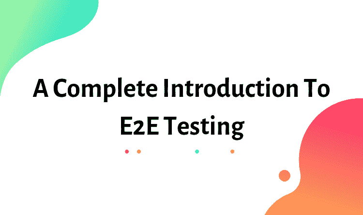

# E2E 测试的完整介绍

> 原文：<https://dev.to/katalon/a-complete-introduction-to-e2e-testing-9ge>

如今，软件系统是复杂的，并且与许多子系统相互连接。无论子系统与主系统相同还是不同，无论是在组织内部还是外部，子系统故障都会对整个系统造成不利影响。这是一个主要的风险，可以通过端到端测试来避免。
[T3】](https://res.cloudinary.com/practicaldev/image/fetch/s--0F8oXgw8--/c_limit%2Cf_auto%2Cfl_progressive%2Cq_auto%2Cw_880/https://thepracticaldev.s3.amazonaws.com/i/9krdty9n2pzd50jz19do.png)

## **e2e 考的是什么？**

端到端(E2E)测试是一种从头到尾测试整个软件产品的技术，以确保应用程序流按预期运行。换句话说，它有助于定义产品系统的依赖关系，并确保所有集成的部分按预期的那样一起工作。最后，这种测试类型的主要目的是通过模拟真实的用户场景，验证被测系统及其组件的集成和数据完整性，从最终用户的体验出发进行测试。

了解更多:[端到端(E2E)测试简介](https://www.katalon.com/resources-center/blog/end-to-end-e2e-testing/)

## **e2e 测试的好处**

由于以下优点，端到端测试变得更加可靠和广泛采用:

*   扩大测试覆盖面
*   确保申请的正确性
*   缩短上市时间
*   降低成本
*   检测 bug

## **E2E 测试生命周期**

端到端的测试生命周期由四个部分组成:测试计划、测试设计、测试执行和结果分析。

*   **测试计划:**指定关键任务、相关时间表和资源
*   **测试设计:**测试规格，测试用例生成，风险分析，使用分析，和调度测试
*   **测试执行:**执行测试用例并记录测试结果
*   **结果分析:**分析测试结果，评估测试，并在必要时执行附加测试

## **何时适用 E2E 测试**

E2E 测试定期在成品和系统上进行，使得每次审查都是对整个系统的测试。如果系统没有输出预期的结果或发现问题，将进行第二次测试。在这种情况下，团队必须记录和分析数据，以确定问题的根源；然后修复并重新测试它们。

为了帮助您更好地理解应用端到端测试的场景，这里有一个例子:

在测试之前，设计者和开发者创建一个需要执行的 UI、功能或特性的列表。应该跟踪系统之间的数据流，以发现依赖性、缺陷和不准确性。团队还必须在测试前准备好条件——可能改变任何界面选项的因素。

## **端到端测试方法**

### **水平 E2E 测试**

一种普遍使用的方法，在多个应用程序的上下文中横向出现，并且很容易在单个 ERP(企业资源规划)应用程序中出现。这里有一个例子。电子商务系统的基于网络的应用程序包括帐户、产品库存状态和运输细节。

### **垂直 E2E 测试**

这种方法指的是分层测试，也就是说测试是以连续的、层次化的顺序进行的。为了确保质量，系统或产品的每个组件都从头到尾经过测试。垂直测试通常用于测试通常不涉及用户或界面的复杂计算系统的关键组件。

## **端到端测试的指标**

用于 E2E 测试的许多指标包括:

*   **测试用例准备状态:**用于确定正在准备的测试用例相对于计划测试用例的具体位置。
*   测试进度跟踪:测试进度应该每周跟踪一次。这一步将提供测试完成百分比的常规细节，例如通过/失败，执行/未执行，有效/无效测试用例，等等。
*   **缺陷状态和细节:**它给出了每周打开和关闭缺陷的百分比。此外，每周的缺陷分布是基于严重性和优先级的。
*   **环境可用性:**实际运行小时数和每天计划的测试小时数。

## **结论**

在这个竞争激烈的市场中，最终用户可能非常挑剔，E2E 测试是确保最终用户应用程序性能的最有效方法之一。因此，请记住，有必要对应用程序进行 E2E 测试，以提供良好的用户体验。