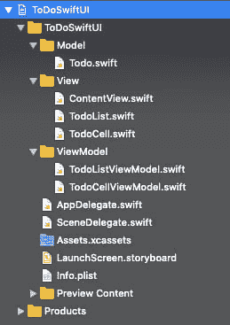
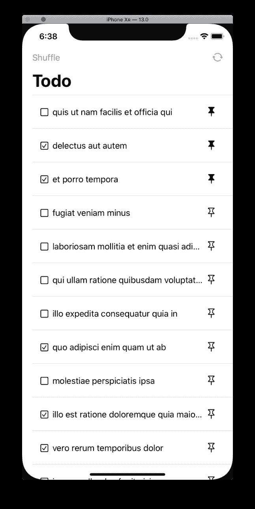

# 一个完整的 SwiftUI 应用！

> 原文：<https://dev.to/kevinmaarek/a-complete-swiftui-app-2eg7>

在本帖中，我们将采用在我的[swift ui 入门中制作的示例应用程序，并结合](https://dev.to/kevinmaarek/getting-started-with-swiftui-and-combine-dd8)文章，尝试改进它并实现现实生活中的功能。

这篇文章可以作为上一篇文章的第二部分，因为我们将继续探索苹果的 SwiftUI 并结合框架的可能性。

在匆忙进入 XCode 之前，我想对我想要添加的特性做一个快速的清单。这是我得到的:

*   ✅将待办事项标记/取消标记为完成
*   📌将项目固定在列表顶部的能力
*   👨‍🎨改进用户界面(使其获得苹果设计奖)

好了，现在下载并打开基础项目(这里有[和](https://github.com/Que20/ToDoSwiftUI))，我们可以开始了。

我们从简单的开始。我们需要将`pinned`属性添加到我们的模型中，这样我们就知道 Todo 项是否被固定。

```
public class Todo: Codable, Identifiable {    
    public let userID: Int
    public let id: Int
    public var title: String
    public var completed: Bool
    public var pinned: Bool?
} 
```

Enter fullscreen mode Exit fullscreen mode

然后，我们将创建一个单元格视图模型。由于我们将增加更多的功能和显示的东西，我喜欢保持东西干净。

```
public class TodoCellViewModel {

    private var todo: Todo

    public init(todo: Todo) {
        self.todo = todo
    }

    public func isPinned() -> Bool {
        return self.todo.pinned ?? false
    }

    public func isComleted() -> Bool {
        return self.todo.completed
    }

    public func getTitle() -> String {
        return self.todo.title
    }

    public func getId() -> Int {
        return self.todo.id
    }
} 
```

Enter fullscreen mode Exit fullscreen mode

它只会阻止单元处理实际的模型。现在没什么用，但是正如我说的:感觉更干净了。😇

现在，我们将修改单元格的 UI 来添加一个“大头针”按钮:
基本上就是在 HStack 中添加一个间隔符和一个大头针图像。
我们还将添加两个块:一个用于标记完成动作，另一个用于锁定动作。我们会在正确的目标上调用这些。

```
struct TodoCell : View {
    var todoCellViewModel: TodoCellViewModel
    var markDoneAction: ((_ id: Int) -> Void)
    var pinAction: ((_ id: Int) -> Void)

    var body: some View {
        HStack {
            // NOT USING BUTTONS BUT IMAGE + TAP ACTION
            // BUG W/ Buttons in List

            Image(systemName: (self.todoCellViewModel.isComleted() ? "checkmark.square" : "square")).tapAction {
                self.markDoneAction(self.todoCellViewModel.getId())
            }

            Text(self.todoCellViewModel.getTitle())
            Spacer()

            Image(systemName: (self.todoCellViewModel.isPinned() ? "pin.fill" : "pin")).tapAction {
                self.pinAction(self.todoCellViewModel.getId())
            }
        }
        .padding()
    }
} 
```

Enter fullscreen mode Exit fullscreen mode

⚠️:我用的不是`Buttons`，而是带有点击动作的图片。列表单元格中的多个按钮当前存在问题。

让我们也清理内容视图，隔离列表，创建一个独立的列表视图，它看起来也更干净，在其中我们将调用我们的新单元。您需要创建与单元格中相同的回调。这些将调用我们随后将创建的 viewModel 方法。

```
struct TodoList : View {
    var todos: Todos
    var markDoneAction: ((_ id: Int) -> Void)
    var pinAction: ((_ id: Int) -> Void)

    var body: some View {
        List(self.todos) { todo in
            TodoCell(todoCellViewModel: TodoCellViewModel(todo: todo), markDoneAction: { (id) in
                self.markDoneAction(id)
            }) { (id) in
                self.pinAction(id)
            }
        }
    }
} 
```

Enter fullscreen mode Exit fullscreen mode

很好，现在我们只需向我们的视图模型添加新的方法来固定和标记完成。我是这样做的:

```
 func markDone(id: Int) {
        self.todos.first(where: { $0.id == id })?.completed.toggle()
        self.didChange.send(self)
    }

    func pin(id: Int) {
        self.todos.first(where: { $0.id == id })?.pinned?.toggle()
        self.sort()
    }

    func sort() {
        self.todos = self.todos.sorted(by: { ($0.pinned ?? false) && (!($1.pinned ?? false)) })
    } 
```

Enter fullscreen mode Exit fullscreen mode

最后，调用 ContentView 中的 TodoList:

```
TodoList(todos: self.viewModel.todos, markDoneAction: {(id) in
    self.viewModel.markDone(id: id)
}, pinAction: {(id) in
    self.viewModel.pin(id: id)
}) 
```

Enter fullscreen mode Exit fullscreen mode

我们完事了。我想清理一下文件的层次结构。

[](https://res.cloudinary.com/practicaldev/image/fetch/s--9mol7qiL--/c_limit%2Cf_auto%2Cfl_progressive%2Cq_auto%2Cw_880/https://thepracticaldev.s3.amazonaws.com/i/mrp2jwyjpxj4frfm38ra.png)

为了进一步推进这个项目，在另一篇文章中，我想尝试在 todo 文本上呈现一个模态，它将显示项目的细节并选择一个颜色标签，你知道，就像在 macOS Finder 中一样。在
列表中，添加过滤器，如`Show Pin Only`或`Done Only`。

现在，[这里的](https://github.com/Que20/ToDoSwiftUIV2)是你可以下载并使用的项目文件。

[](https://res.cloudinary.com/practicaldev/image/fetch/s--98EO7kYg--/c_limit%2Cf_auto%2Cfl_progressive%2Cq_auto%2Cw_880/https://thepracticaldev.s3.amazonaws.com/i/mc20qpkicuqog17yv199.png)

希望你喜欢它，你可以在这里下载完整的项目文件。

编码快乐！