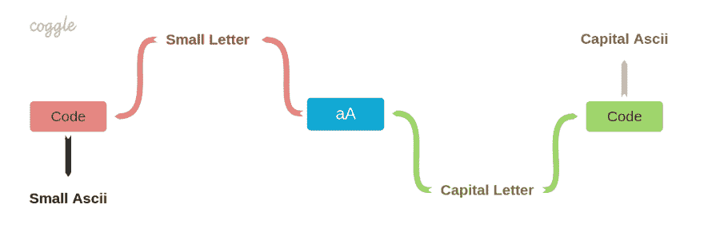

# 字符大小写和 Ascii 码的转换器

> 原文：<https://dev.to/vorakl/a-converter-of-a-character-s-case-and-ascii-codes-46p9>

约束编程范例被有效地应用于解决一组问题，这些问题可以被转化为变量和约束或者被表示为数学方程，因此与 [CSP](https://dev.to/vorakl/constraint-satisfaction-problem-csp-1b6d) 相关。使用声明式编程风格，它描述了一个具有某些属性的通用模型。与命令式风格相反，它不告诉*如何*实现某事，而是告诉*要实现什么*。约束编程声明了约束中变量之间的关系，而不是定义一组只有一种计算值的显而易见的方法的指令。最终模型使得计算变量的值成为可能，而不管方向或变化。因此，一个变量的值的任何变化都会影响整个系统(所有其他变量),并且为了满足定义的约束，会导致重新计算其他值。

我们举个例子，毕达哥拉斯定理: **a + b = c** 。*约束*用这个等式来表示，它有三个*变量* (a、b、c)，每个都有一个*域*(非负)。使用命令式编程风格，要计算这些有另外两个变量的变量，我们需要创建三个不同的函数(因为每个变量由不同的方程计算):

*   c =∞+)
*   a =√b(c-b)
*   b =--

这些函数满足主约束，为了检查域，每个函数都应该验证输入。此外，至少还需要一个函数来根据所提供的变量选择合适的函数。这是可能的解决方案之一:

```
def pythagoras(*, a=None, b=None, c=None):
    ''' Computes a side of a right triangle '''

    # Validate
    if len([i for i in (a, b, c) if i is None or i <= 0]) != 1:
        raise SystemExit("ERROR: you need to define any of two non-negative variables")

    # Compute
    if a is None:
        return (c**2 - b**2)**0.5
    elif b is None:
        return (c**2 - a**2)**0.5
    else:
        return (a**2 + b**2)**0.5 
```

为了了解约束编程方法的区别，我将展示一个“问题”的例子，这个问题有四个变量和一个约束，不能用一个简单的数学方程来表示。这是一个转换器，可以改变字符的大小写(从大写到小写)并返回两者的 Ascii 码。因此，在任何时候，转换器都知道所有四个值，并对任何变化立即做出反应。制作这个例子的想法完全是受约翰·德内罗的华氏-摄氏转换器的启发。

让我们看一下约束系统的示意图:

[](https://vorakl.com/files/char-converter/char-converter.png)

所表示的“问题”被转化为由节点(约束)和连接器(变量)组成的约束系统。连接器提供了获取和设置值的接口。他们还检查变量的域。当某个值发生变化时，该特定的连接器会将这一变化通知给它所连接的所有节点。反过来，节点满足约束，计算新值，并通过“要求”它们设置新值，将它们传播到系统中的其他连接器。传播是使用消息传递技术完成的，这意味着连接器和节点(同步地)获得消息并相应地做出反应。例如，如果系统在“大写字母”连接器上得到“A”字母，则所有其他三个连接器根据节点上定义的约束提供适当的结果:97、“A”和 65。当然，不允许在该连接器上设置任何小写字母，例如“b”，因为每个连接器都有自己的域。

当所有连接器都链接到节点时，节点由约束定义，系统完全设置好，并准备好获取四个连接器中任何一个的值。一旦设置完毕，系统会自动计算并设置 rest 连接器上的值。不需要检查设置了什么变量以及应该调用哪些函数，因为在命令式方法中需要检查，命令式方法使用几个变量相对容易实现，但在有几十个或更多变量的情况下会变得有趣。

完整的源代码可以在我的 [Github repo](https://github.com/vorakl/composingprograms.com/tree/master/char_converter) 中找到。现在让我们稍微深入一下细节，看看这个系统是如何构建的。首先，我们通过给连接器命名并根据一个参数设置域来定义我们的连接器:

```
import constraint_programming as cp

small_ascii = cp.connector('Small Ascii', lambda x: x >= 97 and x <= 122)
small_letter = cp.connector('Small Letter', lambda x: x >= 'a' and x <= 'z')
capital_ascii = cp.connector('Capital Ascii', lambda x: x >= 65 and x <= 90)
capital_letter = cp.connector('Capital Letter', lambda x: x >= 'A' and x <= 'Z') 
```

其次，我们将这些连接器链接到节点。有两种: *code* (将字母翻译成 Ascii 码并反过来)和 *aA* (将小写字母翻译成大写并反过来):

```
code(small_letter, small_ascii)
code(capital_letter, capital_ascii)
aA(small_letter, capital_letter) 
```

这两个节点的不同之处在于应调用的函数，它们源自一个通用约束函数:

```
def code(conn1, conn2):
    return cp.constraint(conn1, conn2, ord, chr)

def aA(conn1, conn2):
    return cp.constraint(conn1, conn2, str.upper, str.lower) 
```

每个节点只有两个连接器。如果在第一个连接器上发生了更新，则调用第一个函数来计算另一个连接器(变量)的值。如果第二个连接器更改其值，也会发生同样的情况。例如，如果*代码*节点在*连接器上获得‘A ’,那么函数 *ord* 将用于获得其 Ascii 代码。反过来，如果 *aA* 节点在 *conn2* 连接器上获得‘A ’,那么它需要使用 *str.lower* 函数在 *conn1* 上获得一个适当的小写字母。每个节点负责计算新值，并向另一个连接器“发送”消息，告知有新值要设置。该消息通过请求设置新值的节点的名称来传递，实际上是一个新值。* 

```
def set_value(src_constr, value):
    if (not domain is None) and (not domain(value)):
        raise ValueOutOfDomain(link, value)
    link['value'] = value
    for constraint in constraints:
        if constraint is not src_constr:
            constraint['update'](link) 
```

当连接器接收到“set”消息时，它运行“set_value”函数来检查域，设置新值，并将“update”消息发送到另一个节点。这只是一个通知，说明连接器上值已经更改。

```
def update(src_conn):
    if src_conn is conn1:
        conn2['set'](node, constr1(conn1['value']))
    else:
        conn1['set'](node, constr2(conn2['value'])) 
```

然后，被通知的节点请求连接器上的新值，为另一个连接器计算新值，依此类推，直到整个系统发生变化。这就是传播的实际工作方式。

但是，信息传递是如何发生的呢？这被实现为字典的访问键。两个函数(连接器和约束)都返回一个*调度字典*。这样的字典包含作为键的*消息*和作为值的闭包。通过访问一个键，比如说“set”，字典返回函数“set_value”(闭包)，它可以访问“connector”函数的所有本地名称。

```
# A dispatch dictionary
link = { 'name': name,
         'value': None,
         'connect': connect,
         'set': set_value,
         'constraints': get_constraints }

return link 
```

将字典作为返回值使得创建多个闭包(函数)成为可能，这些闭包可以访问同一个本地状态来进行操作。然后，这些闭包可以通过使用键作为一种消息来调用。