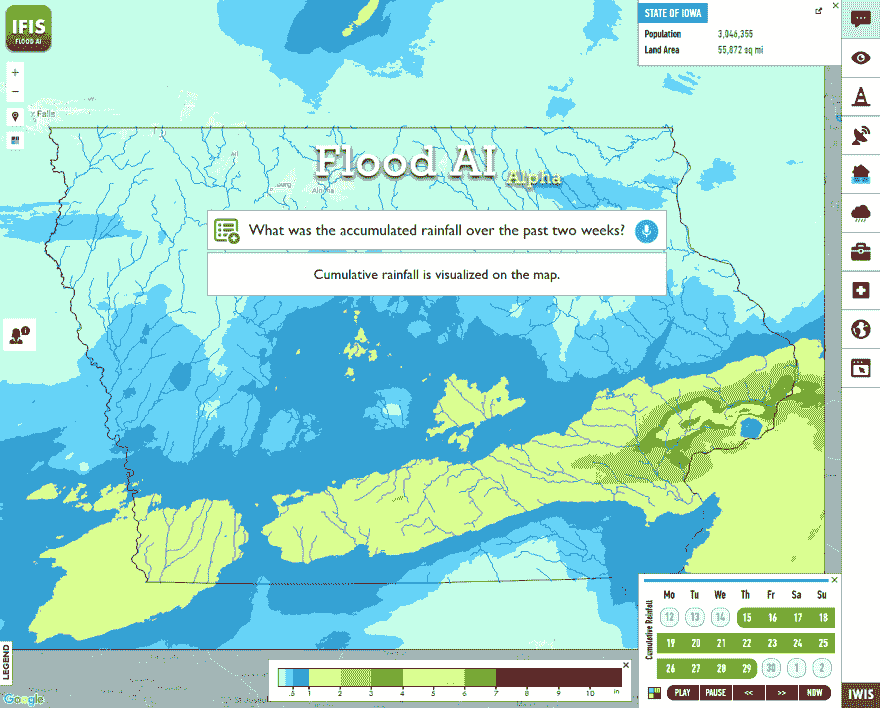
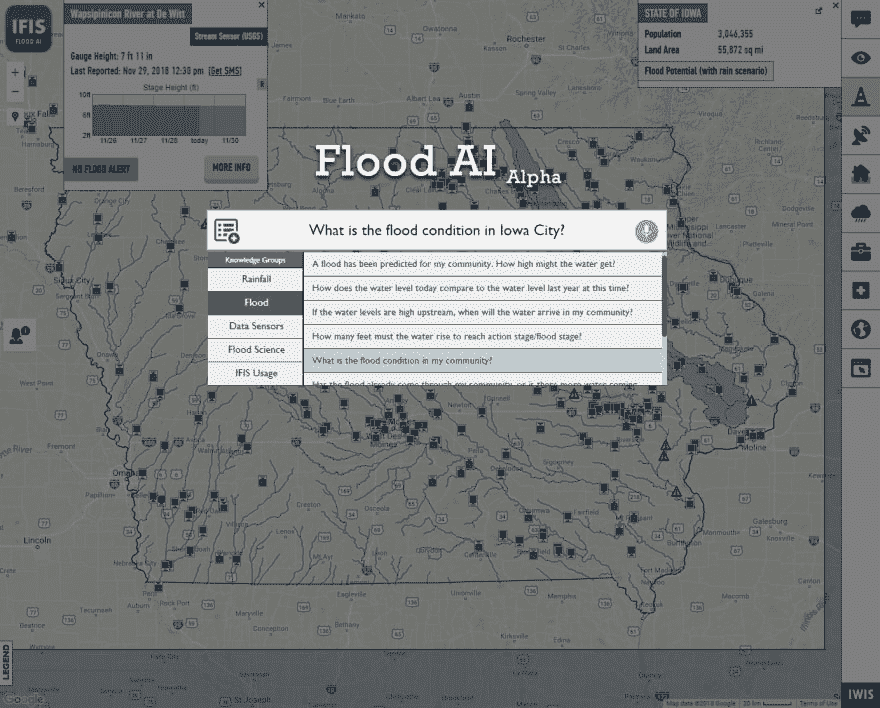

# 独立于领域的智能助手的通用 Web 组件

> 原文：<https://dev.to/boyoz/a-generalized-web-component-for-domain-independent-smart-assistants-27ei>


[](https://res.cloudinary.com/practicaldev/image/fetch/s--84hOXlGR--/c_limit%2Cf_auto%2Cfl_progressive%2Cq_auto%2Cw_880/https://thepracticaldev.s3.amazonaws.com/i/wz5n3r4wzjv9kxumislo.png)

T6】

## 目录

*   [简介](#introduction)
*   [如何使用](#how-to-use)
*   [用例](#use-cases)
    *   [微软认知服务-项目答案搜索](#microsoft-cognitive-services---project-answer-search)
    *   [洪水专家](#the-flood-expert)
*   [支持的浏览器](#supported-browsers)
*   [反馈](#feedback)
*   [执照](#license)
*   [致谢](#acknowledgements)
*   [参考文献](#references)

## 简介

这个项目引入了即时专家；一个轻量级的 web 组件，它允许将自然语言问答系统稳定有效地集成到任何领域的基于 web 的信息系统中。该组件由用户输入(即文本、语音、多选)、问题处理和用户界面模块组成。开发并提供了两个用例来演示组件的特性、优点和用法。该项目的目标是通过减轻为任何领域的员工开发支持语音和领域智能助理的挑战，为下一代信息系统铺平道路。

欲了解论文全文，请访问[https://arxiv.org/abs/1909.02507](https://arxiv.org/abs/1909.02507)

在[https://github.com/uihilab/instant-expert](https://github.com/uihilab/instant-expert)查看 GitHub 回购。

## 如何使用

InstantExpert 不需要任何框架，可以集成到任何使用纯 HTML 的网站中。要使用它，请遵循以下步骤。

*   确保 Jquery 已导入:

```
<script src="https://ajax.googleapis.com/ajax/libs/jquery/3.3.1/jquery.min.js"></script> 
```

*   将 InstantExpert 作为脚本导入:

```
<script src="https://cdn.jsdelivr.net/gh/uihilab/expert-web-component@master/lib/instant-expert.js" type="text/javascript"></script> 
```

*   在 html 中包含 web 组件，并将“引擎”设置为 webhook:

```
<instant-expert id="bing-expert" engine="https://expert-component-example-bing.herokuapp.com/"></instant-expert> 
```

就是这样！你现在可以使用你的虚拟专家。

### 可选配置

要添加示例问题列表以允许用户浏览您的专家能够回答的问题，请设置问题及其类别，如下面的 JavaScript 所示。

```
var expert = document.getElementById("bing-expert");
var questionList = [
                      ["What is machine learning?",               "Definition"],
                      ["What's a troodontidae?",                  "Definition"],
                      ["Is there such a thing as Satire comedy?", "Definition"],
                      ["What RNA stands for?",                    "Definition"],
                      ["What's the meaning of hydrograph?",       "Definition"],

                      ["Which algorithms have been used for predictive modeling?",    "Reference"],
                      ["How many medals did the US win in the 2012 summer Olympics?", "Reference"],
                      ["When did Berlin host the Olympics?",                          "Reference"],
                      ["Who played Morpheus in The Matrix",                           "Reference"],
                      ["How tall is Barack Obama?",                                   "Reference"],

                      ["How to find happiness?",                  "Conversational/Fun"],
                      ["What's the first rule of Fight Club?",    "Conversational/Fun"],
                      ["What does the fox say",                   "Conversational/Fun"],
                      ["Can you pass the Turing test?",           "Conversational/Fun"],
                      ["How much wood could a woodchuck chuck, if a woodchuck could chuck wood?", "Conversational/Fun"]
                   ];
expert.setQuestions(questionList); 
```

下表总结了用于自定义 InstantExpert web 组件的许多属性。

| 属性名 | 预期值 | 描述 |
| --- | --- | --- |
| 发动机 | 线 | webhook 链接将用于发出 POST 请求以获取用户问题的答案。问题文本将通过名为“searchValue”的参数传递。作为响应，它需要一个带有“resultText”字段的 JSON 文件 |
| engineDataKey | 线 | 将问题文本传递给引擎的键名。该问题将作为 POST 请求的参数传递给引擎，格式为:{engineDataKey: questionText}。默认为“问题”。 |
| engineResponseKey | 线 | 用于访问由引擎返回的 JSON 对象中的答案文本的键名。默认值为“resultText”。 |
| 徽标-src | 线 | 徽标来源的链接。 |
| 徽标-隐藏 | 布尔型 | 切换徽标的可见性。真=可见，假=隐藏 |
| textbox-placeholder | 线 | 将显示在输入文本框上的占位符文本。 |
| 无问题列表 | 布尔型 | 禁用问题列表。如果为真，将不显示问题列表。 |
| 没有声音 | 布尔型 | 禁用语音输入。如果为真，将禁用语音输入。 |
| 专家按钮 src | 线 | 用于切换专家组件的始终可见按钮的源代码的链接。 |

#### 备注

*   如果需要语音输入,“引擎”webhook 的链接应该使用“https”。否则，可以使用常规的“http”连接。
*   如果对 webhook 的 HTTP 请求需要修改，我们鼓励您修改 Instant Expert Web 组件的源代码，并随意使用它。

## 用例

### 微软认知服务-项目答案搜索

我们开发了一个开源示例用例，使用专家 Web 组件提出自然语言问题，并使用微软认知服务实验室的项目答案搜索[获得真实的回答。](https://labs.cognitive.microsoft.com/en-us/project-answer-search)

*   要自己测试这个例子，只需下载[examples/bing-bot/use-case](https://dev.toexamples/bing-bot/use-case)并在 Google Chrome 上运行*index.html*。

    *   它使用了一个免费托管在 Heroku 上的引擎，并且受到一些限制。
    *   第一次提问时，系统可能需要几秒钟来唤醒 Heroku。之后，响应应该是即时的。
    *   它仅用于演示目的，不建议也不允许用于生产。
*   要自己修改/托管这个示例，请遵循[examples/bing-bot/bot-source](https://dev.toexamples/bing-bot/bot-source)上的说明

[](https://res.cloudinary.com/practicaldev/image/fetch/s--aINUg3Px--/c_limit%2Cf_auto%2Cfl_progressive%2Cq_auto%2Cw_880/https://thepracticaldev.s3.amazonaws.com/i/1jrpsx60pv7gcof03eg5.png)

### 洪水专家

作为爱荷华州洪水信息系统(IFIS)的一部分，该框架已在洪水领域实施，并被命名为“洪水专家”(塞尔梅特和德米尔，2018 年)。IFIS 是一个基于网络的一站式平台，用于实时和历史洪水相关数据管理、分析和可视化，包括洪水淹没地图、洪水条件和预报(德米尔和克拉杰斯基，2013 年)。该框架使用 IFIS 为其数据资源和能力提供动力，以生成与洪水相关的知识。下图显示该框架与 IFIS 的整合开创了一个先例。

这个用例不是开源的，但是有利于展示专家 Web 组件在环境科学中的实际应用。

| 使用洪水专家通过自然语言问题控制 IFIS 功能。 | 列表界面允许浏览按大类分组的支持问题。 |
| --- | --- |
|  |  |

## 支持的浏览器

默认情况下，在中支持显示的 web 组件；

*   谷歌浏览器
*   Mozilla Firefox
*   歌剧
*   旅行队

截至 2019 年 2 月，这些浏览器的总市场份额为 85.6%。

截至 2019 年 6 月，只有谷歌 Chrome、Opera 和微软 Edge Dev 支持语音识别，这些用户约占所有用户的 57.8%。

来源: [Mozilla](https://developer.mozilla.org/en-US/docs/Web/Web_Components) ， [W3Counter](https://www.w3counter.com/globalstats.php) ，[我能用语音识别吗](https://caniuse.com/#search=speech)

## 反馈

请随时通过在 GitHub 回购上提交问题向我们发送反馈:[https://github.com/uihilab/instant-expert](https://github.com/uihilab/instant-expert)

## 执照

这个项目是在麻省理工学院的许可下进行的。

## 鸣谢

这个项目是由 https://hydroinformatics.uiowa.edu/爱荷华大学水信息实验室(UIHI 实验室)开发的。

## 参考文献

*   德米尔和克拉杰斯基，2013 年。走向综合洪水信息系统:集中数据访问、分析和可视化。环境建模与软件，50，77-84
*   纽约州塞尔梅特和伊利诺伊州德米尔(2018 年)。洪水知识生成与交流智能系统。环境建模与软件，108，51-60。