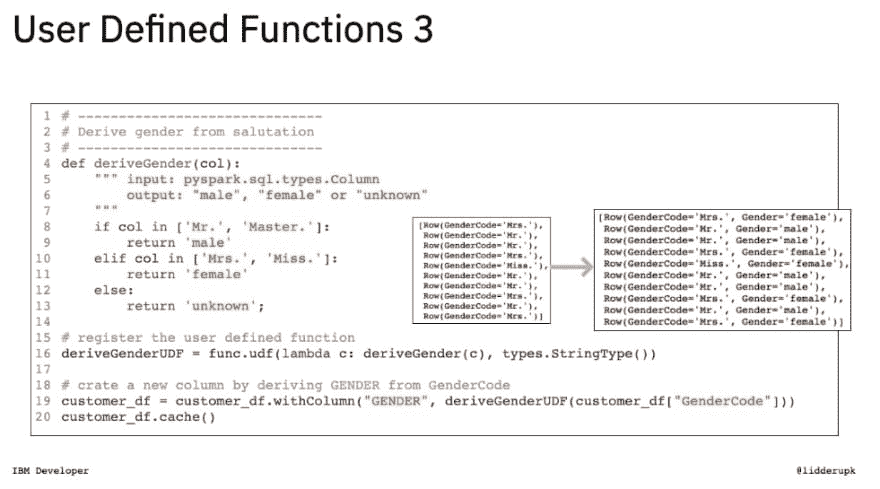
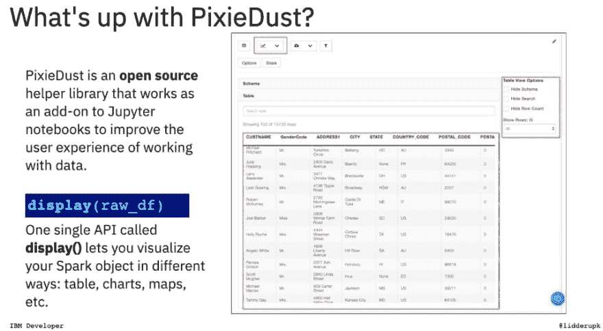

# 面向开发人员的 Apache Spark 简介

> 原文：<https://dev.to/upkarlidder/a-gentle-intro-to-apache-spark-for-developers-em5>

我最近在 Apache Spark 上主持了一个[与](https://www.crowdcast.io/e/8u3d6q3c) [IBM 开发人员](https://medium.com/u/262975298e3a)的在线会议。Spark 已经存在几年了，但是对 ***的兴趣仍然在增长，令我惊讶的是*** 。Apache Spark 是由加州大学伯克利分校的 AMPLab 开发的。Spark 代码库是开源的，并于 2010 年捐赠给了 Apache 软件基金会。

<figure>[](https://res.cloudinary.com/practicaldev/image/fetch/s--7Gsm0jER--/c_limit%2Cf_auto%2Cfl_progressive%2Cq_auto%2Cw_880/https://cdn-images-1.medium.com/max/1024/1%2AtP-dw4Oj_42BYbkdtYbjMA.png) 

<figcaption>阿帕奇星火</figcaption>

</figure>

与会者的背景相当多样化

*   **开发商(25%)**
*   **建筑师(12.5%)**
*   **数据科学家(41.7%)**
*   **其他(12.8%)**

我们查看了 spark 的 **WHAT** 和 **WHY** ，然后深入研究了使用 Spark 时可能会遇到的三种数据结构…

[](https://res.cloudinary.com/practicaldev/image/fetch/s--2Cx_dLf7--/c_limit%2Cf_auto%2Cfl_progressive%2Cq_auto%2Cw_880/https://cdn-images-1.medium.com/max/970/1%2AKQYeTwCltFJBca0UZtD9-A.png)

我们还看了一些转换、动作、内置函数和 UDF(用户定义的函数)。例如，下面的函数基于列 **GenderCode 的内容创建了一个名为 **GENDER** 的新列。**

```
# ------------------------------
# Derive gender from salutation
# ------------------------------
def deriveGender(col):
    """ input: pyspark.sql.types.Column
        output: "male", "female" or "unknown"
    """    
    if col in ['Mr.', 'Master.']:
        return 'male'
    elif col in ['Mrs.', 'Miss.']:
        return 'female'
    else:
        return 'unknown';

deriveGenderUDF = func.udf(lambda c: deriveGender(c), types.StringType())
customer_df = customer_df.withColumn("GENDER", deriveGenderUDF(customer_df["GenderCode"]))
customer_df.cache() 
```

Enter fullscreen mode Exit fullscreen mode

**withColumn** 用来自 **deriveGenderUDF** (我们的用户定义函数)的值在 customer_df 数据帧中创建一个新列。deriveGenderUDF 本质上是 **deriveGender** 函数。如果这没有意义，请观看网上研讨会，我们会深入了解更多细节。

[](https://res.cloudinary.com/practicaldev/image/fetch/s--EvuBXP4u--/c_limit%2Cf_auto%2Cfl_progressive%2Cq_auto%2Cw_880/https://cdn-images-1.medium.com/max/981/1%2AFTBmSEX9V89ZrG2ya77uYA.png)

最后，我们在 IBM Cloud 上创建了一个 spark 集群环境，并使用一个 Jupyter 笔记本来浏览包含以下栏目的客户数据…

```
"CUST_ID", 
"CUSTNAME", 
"ADDRESS1", 
"ADDRESS2", 
"CITY", 
"POSTAL_CODE", 
"POSTAL_CODE_PLUS4", 
"STATE", 
"COUNTRY_CODE", 
"EMAIL_ADDRESS", 
"PHONE_NUMBER",
"AGE",
"GenderCode",
"GENERATION",
"NATIONALITY", 
"NATIONAL_ID", 
"DRIVER_LICENSE" 
```

Enter fullscreen mode Exit fullscreen mode

在使用内置和用户定义的方法清理数据之后，我们使用 PixieDust 来可视化数据。pixieDust 最酷的一点是你不需要设置或配置它。你只要给它一个火花数据帧或一个熊猫数据帧，你就可以开始了！你可以在这里找到完整的笔记本。

[](https://res.cloudinary.com/practicaldev/image/fetch/s--k_kKSNu1--/c_limit%2Cf_auto%2Cfl_progressive%2Cq_auto%2Cw_880/https://cdn-images-1.medium.com/max/960/1%2AVbfDDknhZAA_mqzSzTb0zw.png)

感谢 IBM 开发人员和[麦克斯·卡茨](https://medium.com/u/bf01a11701fe)给我这次演讲的机会，特别感谢 Lisa Jung 耐心的共同演讲！