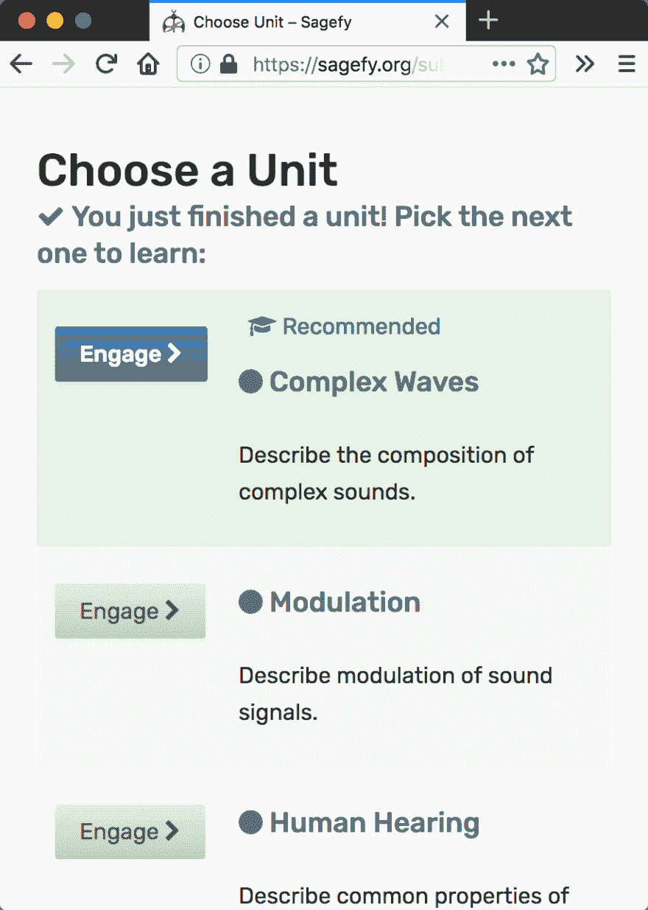
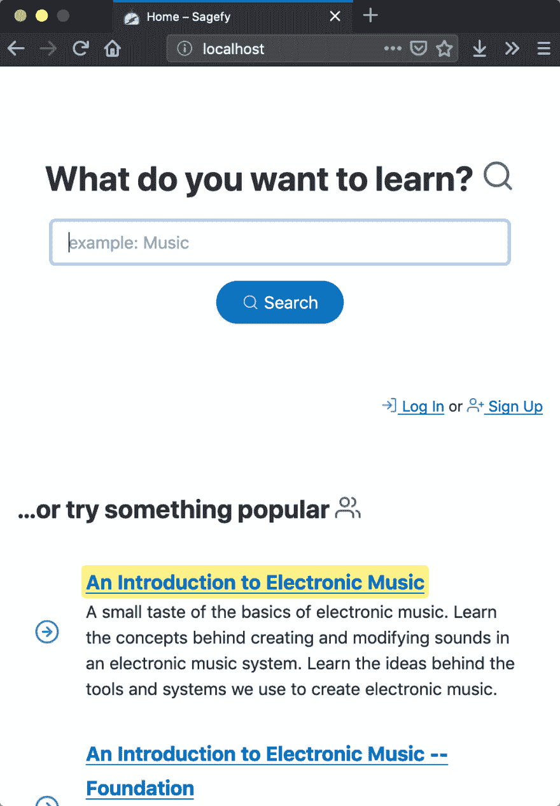
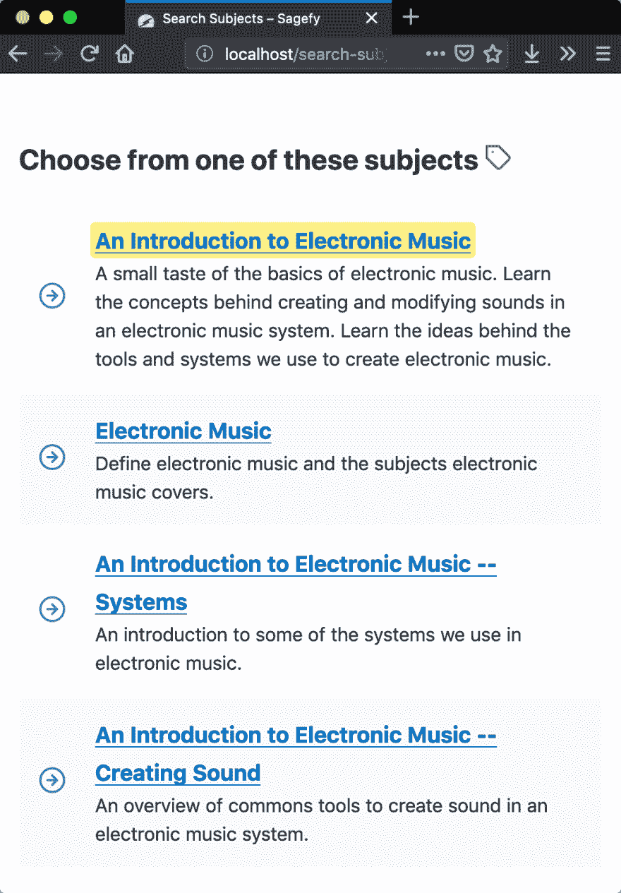
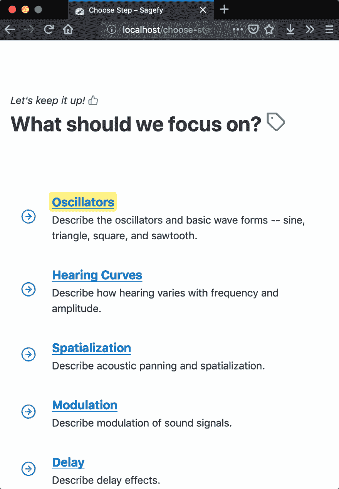

# 新的 Sagefy

> 原文：<https://dev.to/heiskr/a-new-sagefy-3na4>

在这篇文章中，我将谈论什么是 Sagefy。去年 10 月萨吉菲在哪里。以及从那以后我为什么以及如何改变萨吉菲。我想分享这个巨大的变化是如何发生的。记录下我未来的变化。

## 什么是 Sagefy

[**Sagefy**](https://sagefy.org) 是一个 *[开放内容](https://en.wikipedia.org/wiki/Open_content) [自适应学习](https://en.wikipedia.org/wiki/Adaptive_learning)* 平台。任何人都可以学习任何东西，Sagefy 会根据学习者的知识和目标调整内容。Sagefy 是开放内容的，这意味着任何人都可以查看、创建、编辑和共享学习内容。Sagefy 是自适应的，这意味着随着你的学习，Sagefy 会改变它选择的学习活动来满足你的需求。Sagefy 是开源的，可以免费获得。

## 2018 年 10 月萨吉菲在哪里

从 2013 年 4 月开始，我就一直在研究 Sagefy [。](https://dev.to/stories/why-i-m-building-sagefy)

| 主页的 2017 年图像。 | “选择单位”页面的 2018 年图像。 |
| --- | --- |
|  |  |

2018 年 10 月的 Sagefy 有很多特色。它相当能干。尽管已经运营了几年，但是每天都很少有人去那里。每天大约有一个账户注册。在这个版本中，由于用户需要网站的大部分账户，注册是一个不错的使用指标。也就是说，一点用都没有。

我是可用性测试和用户访谈的粉丝。萨吉菲每种都有很多。我得到的反馈是:

*   我不想做一个帐户来试用它。
*   它没有我想要的学习内容。
*   我不明白什么是单位和科目。(当时有三种类型的东西:卡片、单位和主题。)
*   我不懂怎么做内容。(这是在网站的内容创建部分反复几次之后。)

此外，推荐流量非常低。一些技术选择使得搜索引擎的优化变得困难。

在技术方面，我有一个同构的渲染——客户端和服务器端的 JavaScript 和一个小的虚拟 dom 库。我有一个运行 REST 端点的 Python 服务器，其中有大量原始 SQL 和自制代码。和更新的端点逻辑。很多端点逻辑。我有三个数据库， [PostgresQL](https://www.postgresql.org/) ， [Redis](https://redis.io/) ，和 [Elasticsearch](https://www.elastic.co/) 。都位于一个 [Nginx](https://www.nginx.com/) 实例之后。测试构建很慢，但是很彻底。在后来的迭代中，我使用了 [Docker 和 Docker Compose](https://www.docker.com/get-started) 。这都是肉汁，不要误会我。它起作用了，而且表现相当好。但是改变并不总是容易的。

## 我为什么要换 Sagefy

2018 年 10 月，我决定是时候做出更大的改变了。我是第一个主张积极重构而不是重写整个应用程序的人。但由于萨吉菲是一个侧项目，与低流量。重写的风险更低。在前几个月，我还花了相当多的时间尝试迭代架构，以支持匿名(未登录)用户学习和制作内容。这是一项繁重的工作，看不到结束的迹象。

所以“去他妈的，我要重写萨吉菲”在我在的地方，这里是我的目标:

*   让 Sagefy 在有或没有帐户的情况下都能正常工作。
*   让制作新内容变得更容易。
*   找到快速获取大量内容的方法。
*   专注于引导人们到有内容的网站，这样可以获得链接和搜索引擎流量。
*   减少概念和功能的数量。
*   弄清楚如何编写更少的代码来更快地做出改变，这样我就可以更快地适应用户的反馈。

## sage fy 是如何变化的

### 模仿

我的第一个动作是为 Sagefy 创建一些模拟。我想知道我要去哪里。我想快速迭代。

我用世界上最基本的 CSS 表，用普通的 HTML 做了这些。在这一点上，我比任何设计工具都更了解 HTML。我没有使用 CSS 类，只使用了简单的内嵌样式的标准标签。我将它们发布在 GitHub 页面上进行托管。我想在任何真正的技术投资之前尽早得到反馈。

我从主页和主题页面开始，因为这两个页面将开始用户体验。我关注的是流量而不是特性。确保用户总是有一个明确的下一步行动。我还想确定当人们最终处于“无效状态”时，他们有事情可做。例如，今天当你在 Sagefy 中搜索一个主题时，你什么也找不到:它会提示你继续并创建一个新的主题。同时保持上述目标和心态。还有剪辑。大量的编辑功能和能力。我关注的主要目标是:让任何人都可以学习他们想学的任何东西，并且是免费的。

我从我的电子邮件列表中请求审查和反馈，我让 3 个用户花时间调查、审查和提供反馈。(谢谢！)每一点都是正确的，有助于进一步关注模拟。我也让一些以前的同事和朋友审查了这些模拟。由于模拟是基本的 HTML 和 CSS，我可以快速迭代每一轮反馈。

### 数据库和 GraphQL 服务

一想到要把一切都重建成 V1 的样子，我就难以招架。这么多代码！我想到:我只想定义一个描述整个应用程序的模式。然后从图式中获得生命。这是你能编写的最少的代码，也是最有用的。

我看了 GitHub 上的一些工具，它们正试图做到这一点……但成品并不令人惊叹。其中许多工具使用高级 PostgresQL 特性来定义它们的模式。然后我开始看到从 PostgresQL 模式制作整个 API 的工具: [Hasura](https://hasura.io/) ， [PostgREST](http://postgrest.org/en/v5.2/) ，以及我现在所在的地方，也就是[PostgresQL](https://www.graphile.org/postgraphile/)。当我在 Postgraphile 的网站上阅读[模式设计文档](https://www.graphile.org/postgraphile/postgresql-schema-design/)时，我立刻感觉到这是可行的。业务逻辑完全编码在 Postgres 中——包括认证和访问控制。实际上，PostgresQL 是唯一一个能够完成此类任务的主要数据库。Postgraphile 自动由此生成一个 GraphQL 端点。我觉得这很吸引人。我喜欢 REST 和 GraphQL。但是 GraphQL 意味着以后的迭代通常意味着*没有*模式变化，并且*没有*新特性的新服务代码。太理想了。

另一个优势是将三个数据库减少到一个。Postgres 和 jwt 将处理 Redis 为管理认证和缓存所做的一切。Postgres 还可以以接近 Elasticsearch 的速度进行全文搜索。

我愚蠢地决定尝试预先编写整个数据库模式。这是在模拟也在迭代的时候进行的。我的第一关是选秀。我试图思考商业逻辑。我试图弄清楚它在 PostgresQL 和 Postgraphile 中是如何工作的。我的第二步只是试图使它成为有效的 SQL 代码，使数据库在加载时不会出错。我熬过来了。

然后我第一次尝试在数据库中加载 Postgraphile。它真的起作用了。但是它生成的模式在很多方面对我来说没有意义。我对 Postgraphile 的工作方式做了一些假设，结果并不正确。Postgraphile 实际上做的比我想象的多得多。它还预测了许多小事情，比如在 PGSQL 中希望名字在下划线中，而在 GraphQL 中希望名字在驼峰中。

### 2019 年 2 月

我意识到完成整个网站，然后启动它永远不会发生。这将是太多的工作。我应该知道得更清楚，但是我太急切了。如此少的使用，我决定硬拔掉 V1 的插头，重新开始。我重新部署了只有一个主页的网站。一些关于什么是 Sagefy 的静态文本，一些链接和一个电子邮件简讯注册。

### 上菜 HTML

我专注前端代码很久了。我讨厌和浏览器打架。我喜欢浏览器。我想顺着浏览器想做的事情去做，而不是试图强迫去做某件事。这意味着更少的代码和更快的迭代。

对于第一次 V2 部署，我只运行了客户端。我决定在 HTML 服务器上再次使用 JavaScript。Postgraphile 本身是用 JavaScript 编写的，这是我最熟悉的语言。当然，这是一种奇怪、混乱的语言。但它是最流行的编程语言。所以很多人都知道。并且可用的包是惊人的。就性能而言，它几乎在 Go 或 Java 的范围内。而不必处理低级别的问题，如指针或冗长的静态类型。

对于我的模板语言，我选择了 [React](https://reactjs.org) 。我想开始的时候，我会做一个简单的，服务器发送所有的 HTML 类型的网站。根本没有前端，面向 JavaScript 的浏览器。我知道反应超级好，还有很多人也知道。它的工具很棒，它的 [ESLint 插件](https://www.npmjs.com/package/eslint-plugin-react)也很棒。注射或有额外近距离标签的风险很低。就性能而言，React 在服务器上的速度和其他 JavaScript HTML 模板库一样快。我想最终如果我想再做一次同构，转换起来会很容易。然而这并没有发生。我已经能够用普通的 HTML 构建一切，而不用在浏览器中运行 JavaScript。

我做模拟的想法是，我会在它们的基础上做一个更具设计感的网站。但是，我保留了我拥有的最少的 CSS 表。我把它转换成自己的存储库，这样我就可以在 Sagefy 的文档和我的个人网站上重用它。我还拿出了我的内联样式，并把它们做成一些小工具，比如文本居中或内联列表。这种方法使得改变变得非常容易。我使用基本的 HTML 标签。我不用记一堆课就能让网站看起来像样。许多流行的样式库避免改变基本的 HTML 标签以保持中立。通过拥有一个观点，我可以极大地减少需要管理的 CSS 数量。不用我做太多努力，这个网站看起来就很一致。我可以很容易地改变事情，因为这个网站是如此的基础。而且表演当然很惊艳。也没有自定义字体加载。

### 逐个功能

在初始页面建立之后，我一个功能一个功能地重建了网站。整个技术体系都在运转。

我做的第一个功能是恢复帐户，这样人们就可以注册、登录和注销。这是第一个特性，因为后面的一切都依赖于身份验证模型。

每个特征都有一个模式。

*   首先，我编写数据库迁移。我使用一个简单的 [Go 工具](https://github.com/amacneil/dbmate)来管理数据库迁移。该工具直接在原始 SQL 上运行，不需要使用其他语言。首先在 PostgresQL 命令行 REPL 中进行数据库迁移是最容易的。一旦我让它们工作起来，我就把它们形式化为一个迁移。
*   之后，我会使用 Postgraphile 附带的 [GraphiQL](https://github.com/graphql/graphiql) 实例来编写 GraphiQL 查询。这是为了确保数据库做我认为它会做的事情。
*   一旦查询开始工作，它就在客户机上了。我从 [Express](https://expressjs.com/) 端点开始，对 GraphQL 服务器进行适当的调用并处理结果。
*   然后我用 React 用基本的 HTML 编写页面。

在撰写本文时，我已经避免了客户机代码太快干涸。所以仍然有大量的复制粘贴代码。这些年来，我学会了等一会儿变干。如果你抽象得太早，那么所需要的抽象就不会那么明显。

这种模式适用于后来的每个特性。和它所拥有的能力相比，它的代码很少。大部分工作代码要么是在 PostgresQL 中 SQL 可以用很少的代码完成惊人的工作量……要么是在 Express endpoints 中，我想进一步减少这种情况，转而依赖 PostgresQL。

然后特征顺序是…

*   在基本的账户流存在后，我优先考虑在网站上获取主题。几年前我花钱请人在机械土耳其人上制作了一些样品。
*   搜索主题。
*   能够将这些主题添加到您的帐户中。
*   创建一个新主题…不管你有没有帐户。
*   上传我以前版本的卡片。
*   再次创造学习体验。我使用了一个简化的贝叶斯模型和静态设置的参数来得到一些东西。
*   为主题创建卡片，并在主题没有卡片或卡片不足时提示用户制作卡片。
*   为搜索引擎索引和链接优化页面。
*   为卡片和主题创建谈话页。

([如果你想了解更多…](https://docs.sagefy.org/updates-list) )

### 内容

此时，我已经实现了许多目标:

*   不管有没有账户，Sagefy 都能工作。
*   制作新内容很容易，Sagefy 会在适当的时候提示用户制作内容。
*   减少了概念和功能的数量:单元以及许多支持 V1 功能的数据库表都消失了。单元现在是没有子主题的主题，所以现在系统中只有两种类型的东西。
*   更高的搜索引擎优化和社会媒体链接能力。
*   用更少的代码来更快地做出改变，使得新的特性可以很快地完成和迭代。

我还没有的一个大问题是:

*   用户找不到自己想要的内容。

于是我来了点“创意”。我使用国会图书馆系统创建了一个主题列表和他们的亲子关系。我使用国会图书馆是因为它的彻底性。国会图书馆系统比杜威·德西梅尔或其他系统更系统。维基百科不是很有结构，所以在同一时间有不是很多而是太多的主题。然后根据这个列表，我使用了[亚马逊土耳其机器人](https://en.wikipedia.org/wiki/Amazon_Mechanical_Turk)。再次，也许不是我最喜欢的系统，但几乎没有预算，你做出妥协。我让工作人员收集每个主题的一些基本信息:定义、几个副主题、该领域的几位学者，以及你为什么想了解这个主题。结果相当不错。我把这些上传到网站上，这意味着 Sagefy 有 1500 多个新主题。

但是主题都是空的。我不想再依赖机械土耳其人了。无论如何，走这条路去打牌都太贵了。所以学了一些自然语言处理。我做了一个小的 Python 脚本来搜索维基百科，找到该主题的匹配页面，总结它，做选择题。然后还调用其他 API 来获取 YouTube 和 Vimeo 视频。质量很不稳定，但总比没有好。

### 剩余功能

现在已经有一些内容可以被索引并吸引更多的人访问网站了，我回到模拟中总结剩下的功能:

*   编辑主题和卡片
*   主题和卡片的历史页面
*   网站范围搜索
*   在仪表板上查看投稿

## 2019 年 7 月萨吉菲在哪里

| 1.搜索主题 | 2.找到你的主题 | 3.选择下一步 | 4.学习！ |
| --- | --- | --- | --- |
|  |  |  |  |

Sagefy 拥有模拟版中的所有功能。它内容丰富，几乎涵盖了所有重要的学术课题。每个科目也有一些卡片。内容的质量变化很大。所有用户都可以使用 Sagefy，无论是否有帐户。并且可以被搜索引擎搜索和链接。交通每天都在增长。

我对变化很满意。我很高兴我做了一次重写，尽管这通常是一个糟糕的策略。我很高兴我关注的是用户反馈，而不是梦想。我很高兴我从非常基本的模拟开始。尽管这是一种妥协，但专注于搜索引擎和社交媒体链接确实会产生效果。花了一些时间才弄清楚如何用最少的代码完成这项工作，但这是值得的。

如果我再做一次，我会做更多的可用性测试和反馈。我不会尝试预先编写整个数据库模式。相反，我会从第一天开始，一个功能接一个功能，一个流程接一个流程。如果你犯了错，很容易改变，尤其是在交通拥挤的时候。最后，我会更早地创建内容，以便在我创建功能时获得更多的流量。而不是相反。毕竟，是内容让人们来到你的网站。

## 萨吉菲将何去何从

我不知道:)现在似乎是一个很好的时间，在这个项目上后退一点。观察几周它在野外的表现。之后，我将回到可用性测试和面试。查看交通数据。这将帮助我找到下一个最大的机会在哪里。萨吉菲当然远非完美。内容可以更好，代码可以使用一些重构和自动化测试。但我知道当新的机会到来时，改变会变得更容易、更快。希望我在很长一段时间内都不需要重写:)

强制性文章结尾行动号召:

*   [拜访萨格菲](https://sagefy.org)。欢迎反馈！
*   要了解更多信息，请[观看这段 3 分钟的 YouTube 视频](https://youtu.be/Gi99QbiSuWs)或[阅读文档](https://docs.sagefy.org)。
*   想帮忙吗？[查看我们的“想帮忙吗？”医生。](https://docs.sagefy.org/want-to-help)
*   注册[更新](https://sgfy.xyz/updates)。
*   在推特上联系萨格菲。