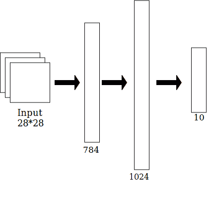

# 对 Keras 的一般性介绍

> 原文：<https://dev.to/abhisarshukla/a-very-general-introduction-to-keras-1g33>

在这个深度学习的时代，它被应用到每一个地方，使人类的生活比以前更容易。它们被用在我们的手机摄像头、搜索引擎、癌症治疗、核研究、量子物理研究以及其他许多我们没有注意到的地方。所有使用深度学习的应用程序都使用经过训练的模型来对以前看不到的例子进行预测。进行预测的模型首先在一个巨大的训练数据集上被创建和训练，并在一个比训练集小的测试数据集上被评估。评估数据集也用于调整模型的超参数。

* * *

可以使用许多免费和开源的框架来创建和训练深度学习模型，例如:

*   [Tensorflow](https://www.tensorflow.org)
*   [指针](https://pytorch.org)
*   [咖啡 2](https://caffe2.ai)
*   [CNT](https://docs.microsoft.com/en-us/cognitive-toolkit)

以上每个框架都有一个 python 的 API，这太棒了！但是，直接在这些框架中编程有点不适合初学者，因为它需要你对深度学习方法有深刻的理解，例如:

*   参数初始化。
*   重量张量的大小。
*   计算张量乘法。
*   许多 API 文档

诸如此类。现在这些事情并不容易弄清楚，它很容易让你打消自己写程序的念头。这就是 Keras 出现的原因。

* * *

## [Keras](https://keras.io)

<figure>[](https://res.cloudinary.com/practicaldev/image/fetch/s--V9kO3IHA--/c_limit%2Cf_auto%2Cfl_progressive%2Cq_auto%2Cw_880/https://s3.amazonaws.com/keras.io/img/keras-logo-2018-large-1200.png) 

<figcaption>Keras Logo</figcaption>

</figure>

Keras 是一个编程框架，可以在其他深度学习框架上运行，比如上面提到的那些。用他们自己的话说:

> Keras 是一种高级神经网络 API，用 Python 编写，能够在 TensorFlow、CNTK 或 Theano 之上运行。它的开发重点是支持快速实验。能够以尽可能少的延迟从想法到结果是做好研究的关键。

现在让我们开始吧！

## 安装

对于安装，我建议先设置一个虚拟环境，如果你使用 anaconda，可以使用 virtualenv 或 conda。

#### 使用 virtualenv

```
virtualenv --system-site-packages -p python3 ~/path/to/folder
source ~/path/to/folder/bin/activate
pip install keras jupyter numpy matplotlib 
```

#### 使用康达

```
conda create -n keras python=3.6.7 #use any python3 version
conda activate keras
conda install keras jupyter numpy matplotlib 
```

现在，如果你还没有安装任何后端，keras 将使用 tensorflow 后端。Numpy 和 Matplotlib 是分别帮助我们更快地进行矩阵/张量运算和绘图的库。
现在，为了展示 keras 的基础知识(非常基础的知识),我们将使用全连接神经网络架构来举例说明 fashion-mnist 分类问题。现在，如果你不能理解这些术语的意思，你应该要么参加一个基本的深度学习课程，要么留下来找乐子！

### 先决条件

这些是你需要遵循的事情:

*   基本 python
*   基础深度学习(用于理解术语)

现在假设您搜索了 keras 并到达了这里，您可能知道这两件事，所以让我们继续。

### 编程

现在假设您在安装了 keras 和 jupyter 的同一个虚拟环境中，键入以下内容:

```
jupyter notebook 
```

这将打开一个运行 jupyter 服务器的新标签。Jupyter 将成为所有机器学习和深度学习材料的最好朋友，因为它的功能允许简单快速的实验，这在深度学习领域是非常必要的。接下来点击新图标并选择 python3。这将在新标签页中打开一个新的 jupyter 笔记本。

#### 描述

现在，我们将在这里实现的网络将是:
[](https://res.cloudinary.com/practicaldev/image/fetch/s--YkYEo1x4--/c_limit%2Cf_auto%2Cfl_progressive%2Cq_auto%2Cw_880/https://thepracticaldev.s3.amazonaws.com/i/1o5gcuhpckov58vocx2s.png) 
输入- >展平- >密集(1024)- >密集(10)
展平层在这里将 2D 图像挤压成一个 1D 矢量，该矢量用于将输入特征(在这种情况下是像素值)完全连接到下一层。密集层意味着这一层中的每个节点都连接到上一层(您的简单神经网络层)的每个节点。最后，这里的输出层预测的是十种可能中的一种，因此它是 softmax 层。所有隐藏层都是 relu 层。

#### 程序

导入我们将需要的所有必要的模块。

```
import numpy as np
%matplotlib inline
from matplotlib import pyplot as plt
from keras.models import Sequential
from keras.layers import Flatten, Dense
from keras.datasets import fashion_mnist
from keras.utils import to_categorical 
```

现在按 Shift+Enter 执行单元格并在当前单元格下创建一个新单元格。现在是加载数据集的时候了。

```
(train_x, train_y), (test_x, test_y) = fashion_mnist.load_data() 
```

这将在 train_x、train_y、test_x 和 test_y 中加载训练和测试数据。train_x 和 test_x 包含示例(图像),而 train_y 和 test_y 包含相应的层。在下一个单元格中，让我们知道这些变量的形状。

```
print(train_x.shape, train_y.shape)
print(test_x.shape, test_y.shape) 
```

从输出中我们看到，训练集包含 60000 个示例，而测试集包含 10000 个示例，回想一下，测试集总是小于训练集。我们还看到每个图像的大小为 28*28，即每个图像是大小为 28*28 的 2D 张量，其中每个单元包含一个灰度值。
现在以图像形式查看任何培训示例，您都可以这样做。

```
plt.imshow(train_x[10], cmap='gray') 
```

在这里我们看第 10 个训练例子，你可以在索引中或者在 test_x 变量中查找不同的数字。现在我们处于数据预处理阶段，我们以这样一种方式转换数据，使得神经网络更容易根据这些例子进行训练。
首先，我们通过将每个示例除以 255 来标准化训练和测试示例，因为任何像素的最大值都可以是 255。这将使值保持在 0 和 1 之间。

```
train_x = train_x / 255.0
test_x = test_x / 255.0 
```

现在我们编写两行代码来对训练和测试标签进行热编码。几乎到处都使用一种热编码来提高神经网络在分类任务中的性能。假设有一个标签

### 

<center>y = 0</center>

那么在一次热编码之后，它将是

### 

<center>y =【0，0，0，1，0，0，0，0，0，0，0】</center>

这允许我们使用 softmax 激活，这是当输出来自概率分布时的最佳选择。

```
train_y = to_categorical(train_y)
test_y = to_categorical(test_y) 
```

接下来，是时候创建本节开始时讨论的模型了。

```
model = Sequential()
model.add(Flatten())
model.add(Dense(1024, activation = 'relu'))
model.add(Dense(10, activation = 'softmax')) 
```

这创建了一个顺序模型，意味着每一层都在它之前的层之后。这创建了与我们上面讨论的完全相同的模型。创建模型后，我们必须编译模型，以便能够训练它。

```
model.compile(optimizer='Adam',
              loss = 'categorical_crossentropy',
              metrics = ['accuracy']) 
```

这一步定义了模型要使用的优化算法，在这种情况下，我们将使用 Adam optimizer，它在深度学习应用程序中使用得最多。其他优化列表如 SGD、RMSprop 等可以在上面链接的 keras 网站上找到。
分类交叉熵是一个损失函数，如果你正在做一个分类任务，并且你的神经网络输出不止一个。
通过度量“精度”来查看训练和测试后每个历元的精度。一个历元是通过神经网络的一次传递，该神经网络由网络中的前向传递和后向传递组成。
编译好网络后，我们准备训练它。啊终于！

```
model.fit(train_x, train_y, epochs = 10) 
```

我们训练它 10 个纪元。可以尝试不同的数字进行实验。经过训练后，该网络的准确率约为 91%,对于这样一个简单的小型网络来说，这已经相当不错了。
但是，我们应该在对训练精度过于满意之前，始终在测试集上评估我们的网络。

```
model.evaluate(test_x, test_y) 
```

在测试集上的评估给出了大约 89%的准确度。同样，对于这样一个简单的网络来说，这个测试精度相当不错。
现在有很多方法可以提高网络的性能，例如

*   使用正则化
*   拒绝传统社会的人
*   构建更深层次的网络
*   训练的时间更长，次数更多。但是对于一个初学者来说，包含这些方法会很难。

## 在此之后

之后，你可以查看 coursera 上的一些在线深度学习课程或任何其他能让你更好理解的在线课程。我建议你定期练习你的技能，网上有大量免费的数据集，你可以下载并尝试在此基础上训练一个神经网络。

#### 最后，感谢阅读！