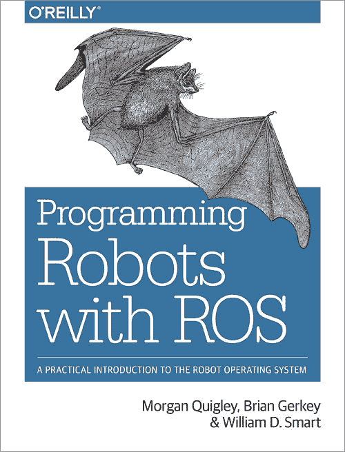

# 机器人的意外冒险:ROS 和 Gazebo - 2

> 原文：<https://dev.to/aws/accidental-adventures-in-robotics-ros-and-gazebo-36ak>

在我们开始更多的机器人冒险之前，我想给你们配备一些基本的工具，你们需要这些工具来完成这个崇高的任务。⚔️🏰⚔️

你首先需要熟悉的技术是 **[ROS](http://www.ros.org)** 🐢还有 **[凉亭](http://gazebosim.org)** 。这两个都是*开源*技术，由[开放机器人](https://www.openrobotics.org/)的了不起的人维护。在这篇文章中，我会对这两个方面进行介绍，稍后会有更深入的探讨。

在**帖子#3** 中，我将解释 **ROS1⃣** 到 **ROS2⃣** 的迁移工作，以及 ROS2 带来的新增强。我还将讨论 ROS1 的*长期支持* (LTS)版本，以及为什么我对 ROS 组织的人估计大多数用户将能够在 2020 年前过渡到 ROS2 感到兴奋。

**在第四篇**中，我将分享 ROS 社区可以从 **[AWS RoboMaker](https://aws.amazon.com/robomaker/)** 中得到什么。

别担心，接下来会有不止 4 篇博文！但是我想给你一个快速的方向指引。

那么我们还在等什么呢？让我们开始吧..

### (1)这是什么🐢你说的？

**[ROS](http://www.ros.org)** 代表*机器人操作系统*，但根本不是 OS！

这不是很有趣吗？

有人说 ROS 更像中间件。也确实 ROS 基本上就是一个 SDK *(软件开发包)*。它为您提供了开发、调试、测试和部署机器人应用程序所需的软件、库和工具。

如果你是 ROS 新手，想了解更多，这里有两个很棒的资源供你开始使用:

*   [用 ROS 编程机器人](http://shop.oreilly.com/product/0636920024736.do) *(奥莱利书)*
*   [新手 ROS:基础、运动、OpenCV](https://www.udemy.com/ros-essentials/) *(Udemy 课程)*

### (2)什么是 Gazebo，我可以用它做什么？

**[Gazebo](http://gazebosim.org)** 是一款基于物理的 3D 机器人应用模拟器，能够在复杂的室内和室外环境中模拟机器人群体。

Aaaand...当我们谈到模拟这个话题时，最好提前阅读并了解一下 **rviz** 和 **rqt** 。

*   **[rqt](http://wiki.ros.org/rqt)** 是 ROS 的一个软件框架，以插件的形式实现各种 GUI *(图形用户界面)*工具。它也非常方便为你的机器人建立一个快速和肮脏的控制面板(状态窗口)。
*   **[rviz](http://wiki.ros.org/rviz)** *(ROS 可视化)*是一个 3D 可视化器，用于显示来自 ROS 的传感器数据和状态信息。

🌈你知道吗？如果你想知道为什么我有一个可爱的🐢大多数 ROS 都会提到表情符号，因为这是他们的吉祥物。所以就像 PHP 有他们的🐘，罗斯有一个🐢。

为你的时间！
&