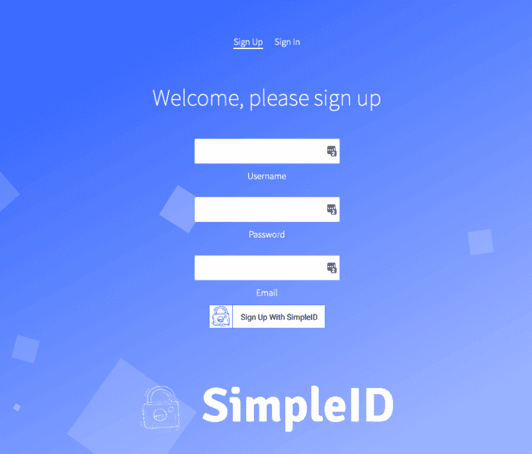
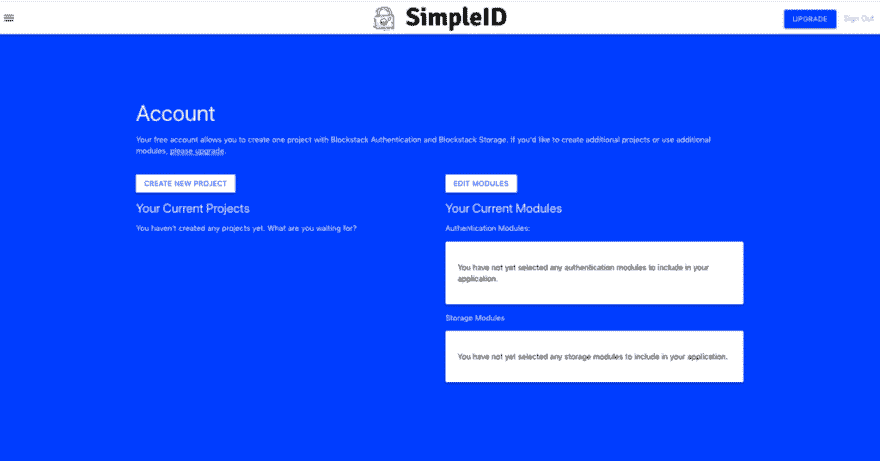
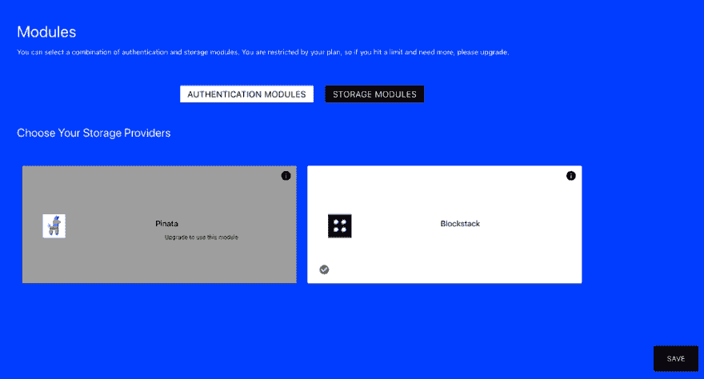
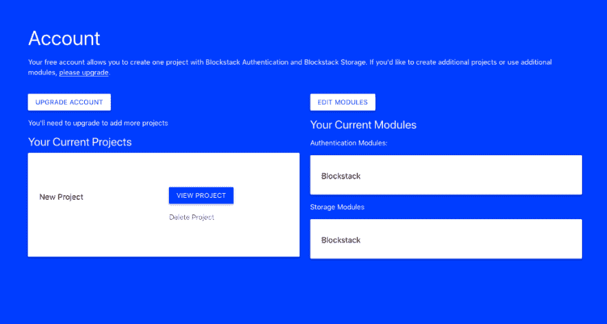
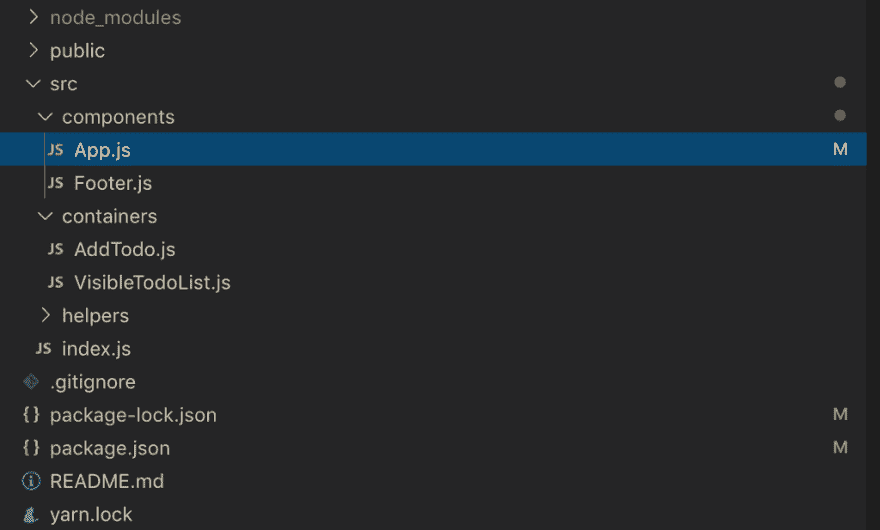
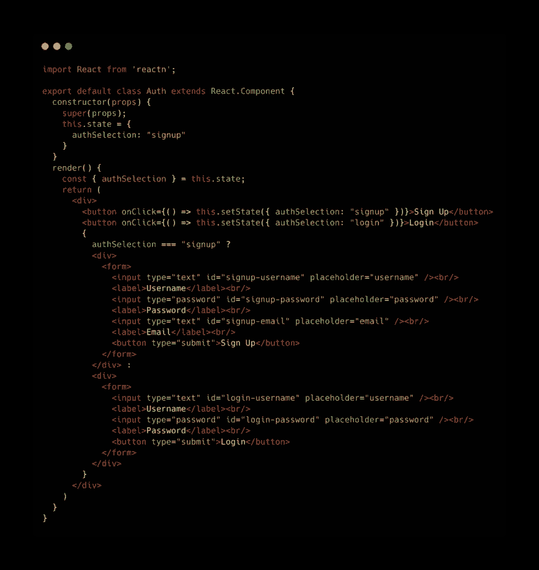
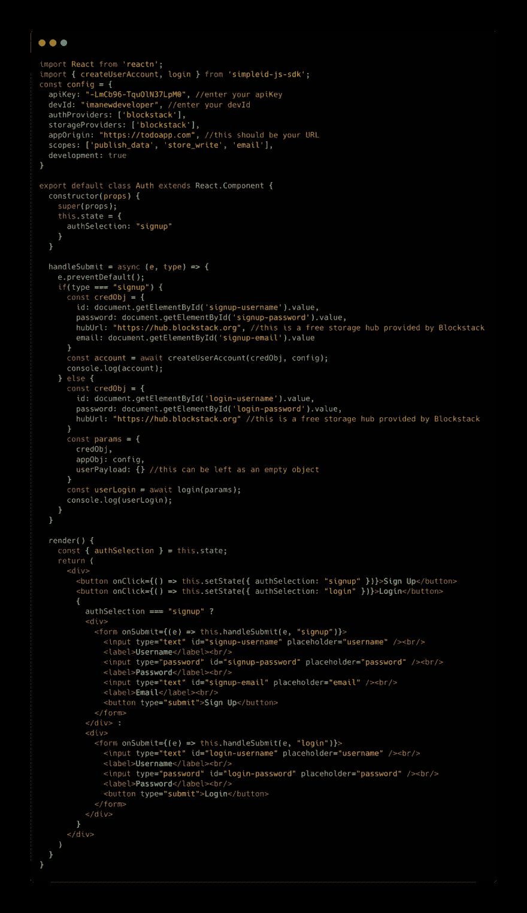
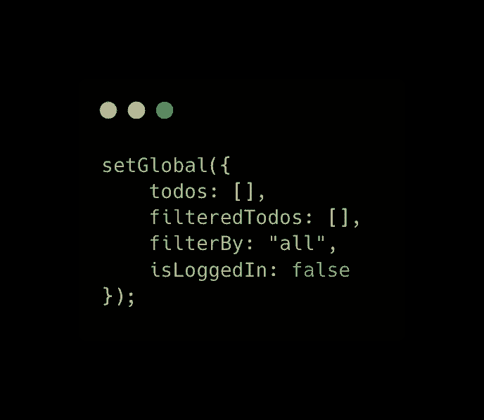
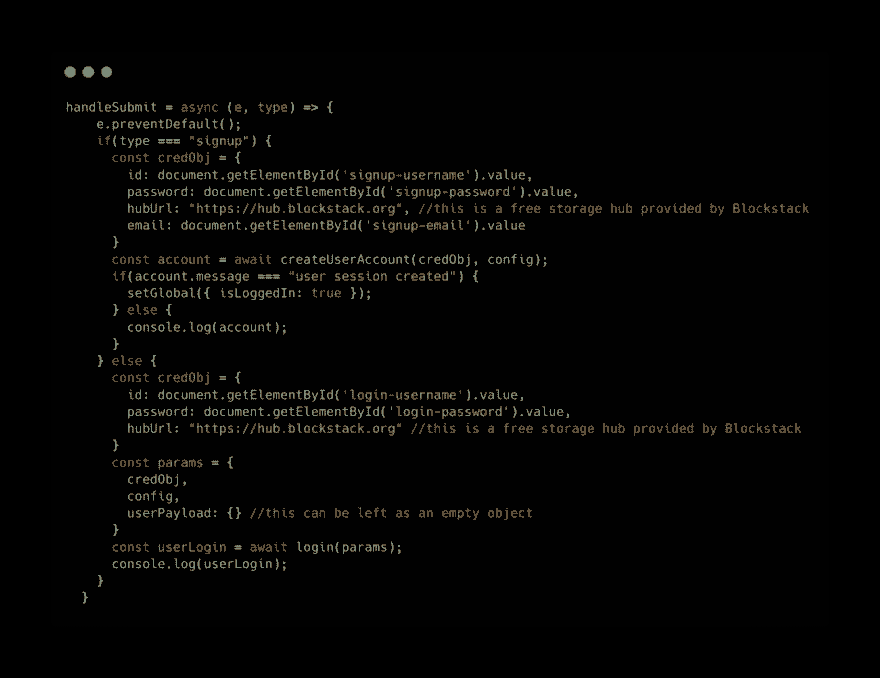
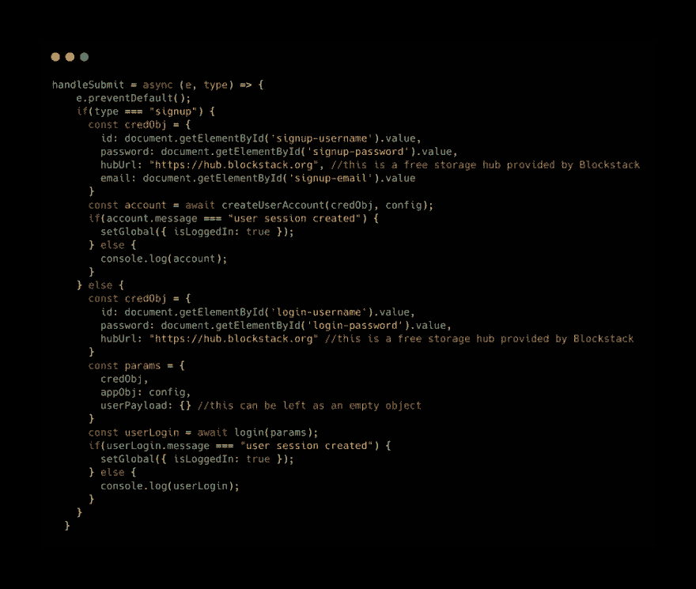

# 以最简单的方式向您的应用添加身份验证

> 原文：<https://dev.to/polluterofminds/adding-authentication-to-your-app-the-easy-way-8ag>

我与人合伙创办了一家开发工具包公司，明确的目标是让分散式应用程序更易于使用。然而，这些工具不仅仅适用于分散的应用程序。传统应用程序开发人员可以利用 [SimpleID](https://www.simpleid.xyz/?t=dt_tut_star) 快速且零开销地为他们的应用程序添加身份验证和存储。让我告诉你这有多简单。

让我们从一个示例项目开始，因为在大多数情况下，开发人员会将身份验证添加到现有项目中。为此，我们可以使用我构建的一个简单的待办应用程序来比较[反应](https://github.com/CharlesStover/reactn)和[还原](https://redux.js.org/)。

先决条件:

*   对 React 有些熟悉，因为示例项目在 React 中

*   安装在计算机上的节点和 NPM

*   文本编辑器

我们开始吧！

第一步:克隆 todo 应用程序库:

https://github.com/Graphite-Docs/reactn-todo-example.git

第二步:切换到新克隆的目录:

CD react n-todo-示例

第三步:安装依赖项

npm 安装

第四步:安装 SimpleID

npm i simpleid-js-sdk

好了，现在我们已经安装好了所有的东西并准备好了，让我们来谈谈我们到底在这里做什么。项目本身是一个带有基本状态管理的基本 todo 应用程序。这个东西没有造型，请你的眼睛提前原谅我。在我们编辑任何东西之前，让你先看到应用程序工作可能会很好，所以继续运行 npm start 来启动它。

如您所见，没有身份验证，也没有数据持久性。刷新后，您的更新将会丢失。我们将在几分钟内解决这个问题。我将解释如何:

[SimpleID](https://www.simpleid.xyz/?t=dt_tut_sec) 是服务提供者的身份。它源于分散式应用程序需要更好的身份验证体验。SimpleID 可以免费开始使用，并随着您的成长灵活扩展。开箱即用，您可以访问以下分散式协议:

*   以太坊

*   IPFS 吗

*   块堆栈

但你可能不在乎这些。您可能只关心添加身份验证和轻松存储数据。为此，我们将使用 SimpleID 中的块堆栈模块。那么，我们开始吧。

去 [https://app.simpleid.xyz](https://app.simpleid.xyz/?t=dt_tut) 注册一个免费的开发者账号。这里有一个有趣的提示:我们为自己的内部应用程序使用 SimpleID，所以当你注册时，你实际上是在用加密密钥对创建一个分散的身份。

注册后，您应该会看到一个验证屏幕。去检查你的电子邮件，并寻找一个来自 SimpleID 的开发者验证邮件。这封邮件只是为了确保你是你所说的那个人。一旦你点击链接，你的帐户应该得到验证，你将在。您将看到这样的屏幕:

开始之前，你需要做几件事。首先，单击编辑模块按钮。这将把你带到一个屏幕，在这里你可以选择你想在你的应用程序中使用的协议。正如我提到的，我们将在本教程中使用 Blockstack。在身份验证模块屏幕上，选择块堆栈。然后切换到存储模块，并在那里选择 Blockstack。点击右下角的保存按钮，你就可以选择模块了。

现在，点击左上角的菜单图标，选择账户，返回账户页面。在这里，您只需要创建一个项目。为您的项目提供一个名称和一个 URL(这应该是您的用户最终访问应用程序的基本 URL)。

完成后，单击“创建项目”,您的帐户页面应该如下所示:

我们需要做的最后一件事是获取项目的 devID 和 apiKey。为此，单击查看项目，您将可以访问这两个项目。将它们记录在某个地方，因为你将在待办事项应用中使用它们。

现在，让我们开始编码。在使用 SimpleID 时，您需要参考 SimpleID 文档。这里可以找到那个[。在你最喜欢的文本编辑器中打开你的待办事项应用程序。项目结构如下所示:](https://docs.simpleid.xyz)

我们将通过添加一个新的身份验证组件来使事情变得非常简单。因此，让我们创建一个名为 Auth.js 的新组件，并将其嵌套在 components 文件夹下。在您的 Auth.js 文件中，欢迎您创建类组件或函数组件。为了简单起见(以及不涉及 React 挂钩的快速状态改变)，我将创建一个类组件。但是我们希望这个组件做什么呢？我们希望它能处理注册和登录请求，对吗？

这意味着我们的组件需要能够根据用户想要做的事情有条件地呈现注册页面或登录页面。让我们建造它。

还没有发生很多事情，但我们现在已经建立了框架。我们到底在看什么？首先，请注意我们是从“reactn”导入 React 的。这是这个 todo 应用程序中使用的全局状态管理框架，所以要利用全局状态(我们马上就会用到)，我们需要从那个模块导入 React。

接下来，我们在类组件的构造函数中创建了本地状态。这是因为我们需要 authSelection 状态来告诉应用程序是显示注册页面还是登录页面。您可以在 return 语句的开始和结束 div 之间看到这种逻辑。

现在，我们需要做两件事:

1.  允许用户能够在注册和登录之间切换。

2.  提供输入字段供用户填写。

让我们现在就开始吧:

我们在这里没有做任何太花哨的事情。我们在条件呈现语句上方添加了两个按钮，一个用于注册，一个用于登录。在这些按钮上，有一个点击处理程序，它将更新本地状态以显示适当的屏幕。如果用户单击注册按钮，将显示注册表单。如果用户单击登录按钮，将显示登录表单。

我们还在条件语句下的相应位置添加了两个表单。一个注册表格，需要用户名，密码和电子邮件。另一个表单用于登录，只需要用户名和密码。

现在，我们需要一个表单提交处理程序来处理这些表单，这就是 SimpleID 的用处！我们将从文档开始工作，所以让我们开始吧。

我们在这里做了什么？好了，我们从 simpleid-js-sdk 导入了 createUserAccount 和 login，这个 sdk 是我们之前安装到这个 todo 应用程序中的。我们添加了一个 config 对象来存放我们的项目信息(包括您希望在生产项目中保护的 apiKey 和 devId)。我们在 handleSubmit 函数中构建了一个表单提交处理程序。我们在 handleSubmit 函数中使用了 simpleid-js-sdk 中的 createUserAccount 和 login 函数。最后，我们连接表单以在表单提交时调用 handleSubmit 函数。

假设一切顺利，您现在可以实际尝试一下，并观察控制台输出。还是可以？

我们仍然需要将 Auth.js 组件添加到 App.js 主文件中。现在让我们这样做，但是让我们只在用户没有登录的情况下有条件地呈现它。所以，首先找到 src 文件夹下的 index.js 文件。您将看到一个带有嵌套对象的 setGlobal 函数。更新该对象，使其看起来像这样:

isLoggedIn 状态是我们将在 App.js 文件中使用的状态。让我们转到该文件，并将其重构为一个类组件来处理我们的条件逻辑。你最终会得到这样的结果:

我们将它重构为一个类组件，以确保在全局状态改变时，条件逻辑得到执行。同样，我们可以使用钩子来实现这一点，但是我们试图减少对 React 功能的关注，更多地关注身份验证解决方案。

我们做的另一件事是添加了全局状态变量 isLoggedIn，并检查它是否为真。如果是真的，显示应用程序。如果没有，显示认证页面。

现在，您可以尝试您的注册功能。用户名将需要全部小写，没有空格，但继续尝试，并确保观看控制台。您应该会看到类似这样的内容:

您可能看不到的一件事是 409 错误消息。你的用户创建的用户名实际上被添加到一批其他名称中，这些名称被广播到比特币区块链并在那里注册。这使您的用户能够真正控制他们的身份。然而，由于我用于开发的注册器的 ip 地址限制，我已经达到了可以注册的最大用户数量。

但是我跑题了。这里最重要是控制台中的最终消息。它是一个带有消息的对象，该消息表示“用户会话已创建”。

现在，您对该用户会话做什么完全由您决定，但是返回的数据是您可以用来确保用户实际登录的数据。所以一个快速简单的检查方法是这样做:

首先，将 setGlobal 添加到文件顶部 React 的 import 语句中:import React，{ setGlobal } from ' reactn

这允许你在应用程序的任何地方设置全局状态。然后，在 handleSubmit 函数中，在注册逻辑中，您可以这样做:

当然，您可能希望对 account.body 中返回的用户会话数据做些什么，但是您可以用多种方式来处理这些数据，我将让您来决定。

我们要检查的最后一件事是登录是否有效。因此，假设您记得您输入的凭证，您可以使用这些凭证。如果没有，重新报名，记住他们；)

刷新您的页面，让我们登录(请记住，您将希望保存您获得的用户会话数据，这样刷新就不会清除用户会话，但这只是一个简单的教程)。打开控制台，这样你就可以看到发生了什么。您应该看到这个:

现在，您可以在您的登录功能中添加一个检查来正确地更新全局状态，就像注册一样。它可能看起来像这样:

同样，您需要持久化用户会话，以便在页面刷新时用户不会被注销，但这超出了本教程的范围。

现在，您已经在没有任何数据库配置或管理的情况下向您的应用程序添加了身份验证。您让您的用户可以轻松注册和登录。您已经给了他们一个分散的身份(如果您研究返回的用户会话对象，您可以为您的用户提供许多有用的信息)。你用很少的代码做了很多。

SimpleID 的整个目标是使认证变得容易。去中心化 app，传统 app，物联网项目，服务器端项目等。我们想让任何语言的任何开发者在任何地方都能轻松使用。

如果您有兴趣了解更多信息，请立即查看 SimpleID】。

* * *