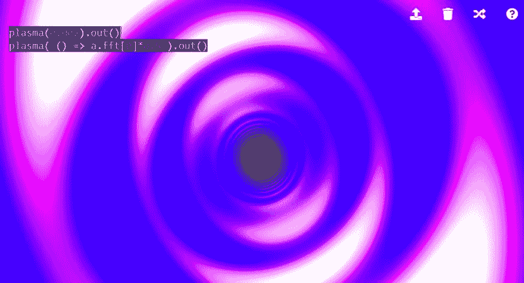

# 将自定义着色器添加到 hydra synth

> 原文：<https://dev.to/brucelane/adding-custom-shaders-to-hydra-synth-efi>

[](https://res.cloudinary.com/practicaldev/image/fetch/s--6z-91HG6--/c_limit%2Cf_auto%2Cfl_progressive%2Cq_auto%2Cw_880/https://thepracticaldev.s3.amazonaws.com/i/fjnj8jpz9i8pk70oz2ee.JPG) 
我喜欢奥利维亚·杰克在活动中现场编码九头蛇的视觉效果。

你可以在网上试试这里:[https://hydra-editor.glitch.me/](https://hydra-editor.glitch.me/)

这款开源软件允许减少代码，以便使用内置函数转换成 glsl，即您的 gpu 可以理解的着色语言。

观众在键入长行 glsl 时可能会感到厌烦，例如对于形状函数:

```
vec2 st = _st * 2. - 1.;
float a = atan(st.x,st.y)+3.1416;
float r = (2.*3.1416)/sides;
float d = cos(floor(.5+a/r)*r-a)*length(st);
return vec4(vec3(1.0-smoothstep(radius,radius + smoothing,d)), 1.0); 
```

Hydra 只允许键入:

```
shape(3.0, 0.3, 0.01) 
```

Hydra 已经有了很多可以链接的函数，比如

```
osc(322).color(0.5,0,0).add(shape(2).color(2,2,2).scale(0.006).rotate(0.000001)).
modulate(noise(()=> a.fft[1]*10 +0.01).scale(5,0.1)).scale(1.2,1,3).out() 
```

但是如果你想添加你的自定义着色器或者使用 shadertoy.com 的着色器呢？

要修改源代码，您必须从[https://github.com/ojack/hydra](https://github.com/ojack/hydra)克隆它，并在本地运行它:

*   setup nodejs
*   在克隆的文件夹中，运行 npm i
*   然后运行 npm start
*   在你的浏览器中打开 https://localhost:8000 在大得惊人的 node_modules 文件夹中有一个模块是 hydra-synth，它包含了你需要修改的文件。

提示:如果您想保留您对代码的修改，我建议您:

*   删除 hydra-synth 文件夹
*   做一个[https://github.com/ojack/hydra-synth](https://github.com/ojack/hydra-synth)回购的叉
*   git 在 node_modules 中克隆您的 fork 现在您可以将 glsl 函数添加到块{}内的 src/composable-glsl-functions . js 中，用逗号分隔。

我使用两种类型的积木:

*   对于可在 hydra 编辑器中使用的函数，请键入“src”
*   对于是您的“src”函数的实用函数的函数，请键入“util”

示例:添加等离子体功能:

```
plas: {
type: 'util',
glsl: `vec4 plas( in vec2 v, float fft ) {
float c = sin( v.x * 1000.0 * fft) + cos(sin(time+v.y)*20.);
return vec4(sin(c*0.2+cos(time)),c*0.15,cos(c*0.1+time/.4),1.0);
}
`
},
plasma: {
type: 'src',
inputs: [
{
name: 'fft',
type: 'float',
default: 0.0
}
],
glsl: `vec4 plasma(vec2 _st, float fft) {
vec2 uv = -1.0 + 2.0 *_st;
uv.x *= resolution.x/resolution.y;
vec2 m;
m.x = atan(uv.x/uv.y)/3.14;
m.y = 1./length(uv)*.2;
float d = m.y;
float f = fft;
m.x += sin(time)*0.1;
m.y += time*0.25;
vec4 t = plas(m*3.14, fft)/d;
return vec4(f+t);
}
`
}, 
```

保存文件，刷新浏览器页面，然后键入

```
plasma(0.002).out() 
```

[](https://res.cloudinary.com/practicaldev/image/fetch/s--3OmOCWq2--/c_limit%2Cf_auto%2Cfl_progressive%2Cq_auto%2Cw_880/https://thepracticaldev.s3.amazonaws.com/i/l9ljtt72prtz3ivv4how.jpg)