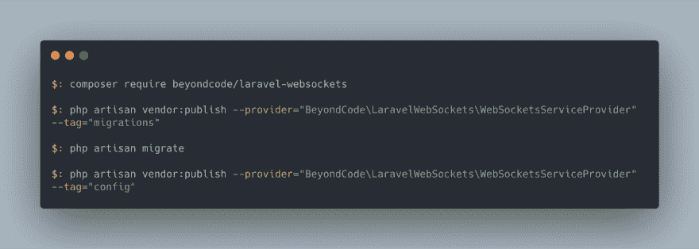
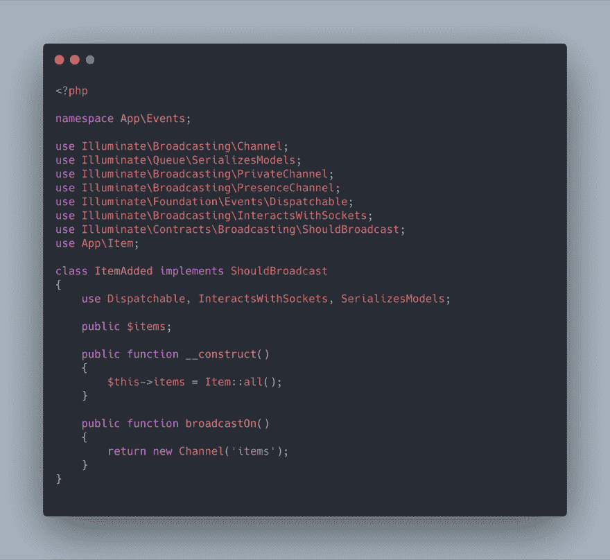
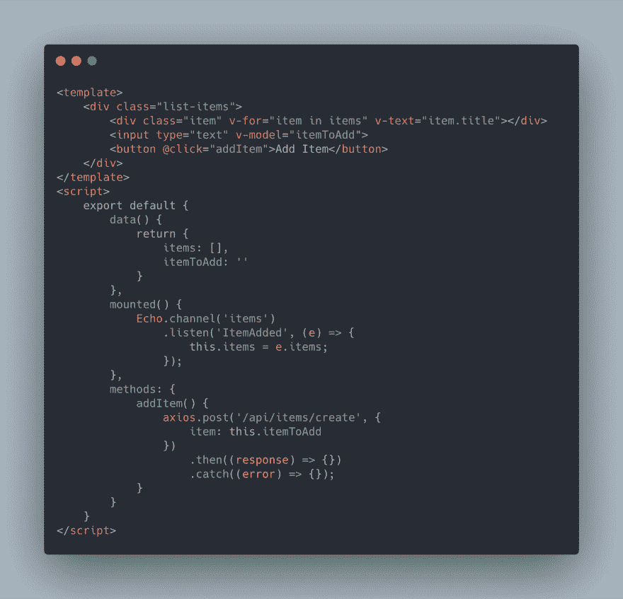

# 使用 laravel-websockets 为您的 Laravel 和 Vue 应用程序添加实时更新

> 原文：<https://dev.to/aschmelyun/adding-real-time-updates-to-your-laravel-and-vue-apps-with-laravel-websockets-3ac2>

本月早些时候，我发布了[listpal.co](https://listpal.co)，这是一个包含 websockets 功能的待办事项应用程序，这样每个打开列表的用户都可以看到其他人的更新。这绝对是一次学习经历，也是我第一次真正投入到 Vue + websockets 结合的世界中。在 [laravel-websockets](https://github.com/beyondcode/laravel-websockets) 包的帮助下，在一个新的(或现有的)laravel 应用程序中启动 websockets 服务器非常容易。

更喜欢翻阅代码而不是阅读文章？如果你想深入了解内部运作，整个 listpal.co 都是开源的，托管在我的 GitHub 上。否则，让我们开始吧:

## 起飞前

下面我将介绍在现有的 Laravel + Vue 应用程序中配置和实现 laravel-websockets 包的步骤。以下假设您有一个基本的待办事项应用程序，其结构如下所示:

[](https://res.cloudinary.com/practicaldev/image/fetch/s--PNgADBkX--/c_limit%2Cf_auto%2Cfl_progressive%2Cq_auto%2Cw_880/https://miro.medium.com/max/1400/1%2AMbvnTf_96rwxrO12DT1MmQ.png)

目前，我们有一个单一的模型(Item.php)，一个控制器，一个刀片模板，用于在我们的 Vue 应用程序中列出所有项目，以及 Item.php 的一些基本路线。假设在加载时，Vue 应用程序调用`/api/items`来填充 list 应用程序，其中包含一个通过`axios.post()`在列表中添加新项目的方法。

## 设置事件

事件是 Laravel 解耦代码的一种方式，每当你的应用程序发生特定的事情时就会触发。

> Laravel 的事件提供了一个简单的 observer 实现，允许您订阅和监听应用程序中发生的各种事件。事件类通常存储在`app/Events`目录中，而它们的侦听器存储在`app/Listeners`中。

例如，如果你正在运行一个电子商务网站，你可能会有一个名为 **ProductOrdered** 的事件，每当有顾客从你的商店购买商品时，该事件都会发送一封确认电子邮件。不要让代码纠结在产品控制器中，它可以包含在这个特定的事件类中，并自动或通过全局`event()`方法触发。

我们将为列表中添加的项目创建一个事件，因此在您的控制台中，在应用程序的根目录下运行:

`php artisan make:event ItemAdded`

这将在 app/Events 下创建文件**ItemAdded.php**，现在保持原样。对于这个演示，我们将手动触发事件，所以在 ItemController 的`store()`方法中添加下面一行。我建议把这个放在你的回报声明之前:

`event(new App\Events\ItemAdded());`

关于这个事件，我们稍后会深入探讨，但是现在是时候设置我们的 websocket 服务器了。

## 添加和配置 laravel-websockets

Marcel Pociot 和 Freek Van der Herten 设计的 laravel-websockets 包简直令人难以置信。过去运行 laravel-echo-server 或 socket.io 的独立节点服务器现在可以完全用 PHP 完成(在本例中，在同一个 laravel 应用程序代码库中🤯).

除此之外，使用它的最大好处是它可以直接取代 Pusher 和与 Laravel 开箱即用的完全集成的**。只需要很少的配置就可以让服务器启动并运行，你的应用就会很高兴地开始发送广播。**

从应用的根目录运行以下命令将安装软件包，设置必要的迁移，并发布配置文件:

[](https://res.cloudinary.com/practicaldev/image/fetch/s--DniCCkg9--/c_limit%2Cf_auto%2Cfl_progressive%2Cq_auto%2Cw_880/https://miro.medium.com/max/1400/1%2AH7_ARO70qiTKNUlq24c1Yg.png)

如果你想看的话，可以随意打开`config/websockets.php`看看，但是*真的没有什么是我们真的需要在这里做的。我们唯一要做的事情是设置一个 ID、密钥和密码供包使用。幸运的是，它从我们的 PUSHER_ values。环境文件。您可以将它们设置为您喜欢的任何值，但是我会让它们与项目稍微相关一些:* 

```
PUSHER_APP_ID=todoappid
PUSHER_APP_KEY=todoapp
PUSHER_APP_SECRET=todoappsecret 
```

保存文件，在终端中导航到项目根目录，运行
`php artisan websockets:serve` ✨.我们的 websockets 服务器现已上线，正在等待指示！

## 回到我们的事件

既然我们已经启动并运行了 websockets 端口，我们需要给它数据来广播出去。拉勒维尔又一次让这个*变得异常简单。如果你在`app/Events/ItemAdded.php`打开我们的文件，你会看到默认的类包含了`Illuminate\Contracts\Broadcasting\ShouldBroadcast`。这个接口可以被实现到我们的类中，从而支持 Pusher(以及 laravel-websockets)的使用。*

当该事件触发时，在该类中设置的任何公共变量都会被广播出去。由于每次添加一个条目时，我们都希望应用程序用数据库中的所有条目更新它的列表，我们将设置一个名为`$items`的公共变量，并在构造函数中填充它。

最后，`broadcastOn()`方法将返回一个我们选择的频道名称，该数据将被广播到该频道。所有联系在一起的东西看起来应该是这样的:

[](https://res.cloudinary.com/practicaldev/image/fetch/s--Tta5JUzO--/c_limit%2Cf_auto%2Cfl_progressive%2Cq_auto%2Cw_880/https://miro.medium.com/max/1400/1%2Ahs5n0FujLU6er--06IeCkQ.png)

这就是对我们的应用程序后端所需的修改的结束！现在，让我们来看看 JavaScript。

## 修改 Vue 前端

如果你正在使用 Laravel 的 Vue 设置，很可能在你的`bootstrap.js`文件的底部有一个注释掉的部分，看起来像这样:

[](https://res.cloudinary.com/practicaldev/image/fetch/s--w7Ni0Ct_--/c_limit%2Cf_auto%2Cfl_progressive%2Cq_auto%2Cw_880/https://miro.medium.com/max/1400/1%2AuTaHz8vsEjjiETB46Br2bg.png)

取消整个块注释。这将我们的应用程序打开到 Laravel Echo 包，它将在我们的应用程序开始时初始化。使用我们在`.env`文件中输入的密钥，它将初始化我们开始监听 websocket 服务器所需的信息。

下一步可能有点棘手，这取决于您如何获取数据，以及您是否使用了像 Vuex 这样的状态管理库。**假设您不是**，而是在主 Vue 组件上使用数据对象中的一个数组来存储项目，并在添加项目时使用 axios 调用一个方法将数据发送到您的 API。在成功处理期间，您只需用服务器返回的数据替换组件中的数据。

然而现在，我们将在一个生命周期方法中实现 Echo，并让它监听我们之前指定的通道。当回调被触发时，我们用通过事件广播的公共属性替换组件中的数据。如何设置的示例如下所示:

[](https://res.cloudinary.com/practicaldev/image/fetch/s--xgy8mli4--/c_limit%2Cf_auto%2Cfl_progressive%2Cq_auto%2Cw_880/https://miro.medium.com/max/1400/1%2AgSfbqiLqoWMyQIgZKp4gEQ.png)

🎉 🎉 🎉

这消除了让我们的 axios 调用接触我们的数据的需要，只要我们的新项目被添加到服务器，就会触发一个事件，并由 Echo 处理它。

## 把一切联系在一起

再次重申，我们已经:

*   使用默认配置安装了 laravel-websockets 包

*   使用`php artisan websockets:serve`启动 websocket 服务器

*   添加了一个名为**item 的事件添加了实现 ShouldBroadcast 的**

*   将 Echo 添加到我们的 Laravel 应用程序的 bootstrap.js 文件中

*   用回显监听器替换了在我们的 Vue 组件中更新数据的方法，并删除了 axios 成功回调

就我个人而言，这真的为我的项目打开了一个充满机会的世界。我一直认为任何类型的 websockets 功能都是一项相当大的任务，需要额外的框架或单独的服务器实例，但是这种方法确实证明了我是错误的。

以此为基准，您可以在此基础上进行扩展，为每个模型或操作(保存、删除、更新)添加不同的事件，或者结合使用 Echo 和 Vuex 来对您的商店数据执行提交。当你能够用 PHP 或者在你现有的 Laravel 应用程序中完成这项工作时，可能性是相当大的。

如果你想连接，有任何问题，或者对来自 PHP/Laravel/Vue/general web-dev 世界的更多小提示感兴趣，请随时关注我的 [Twitter](https://twitter.com/aschmelyun) ！