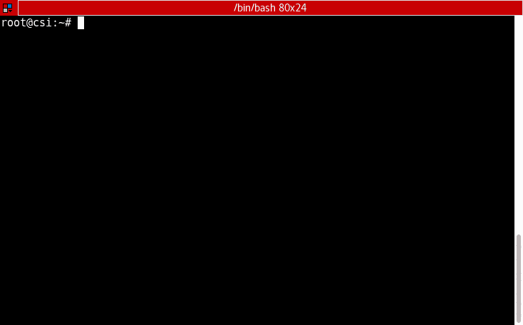
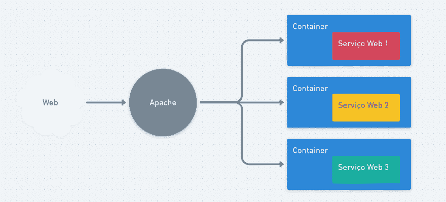

# 管理系统

> 原文：<https://dev.to/opendevufcg/administrando-sistemas-com-docker-4pgm>

开源项目中容器在“[虚拟化](https://www.ibm.com/developerworks/community/blogs/tlcbr/entry/mp234?lang=en)和应用程序隔离]中的使用越来越多，dock 被公认为市场上的主要技术，最近被评为堆栈溢出中最受欢迎的平台(也是第二受欢迎的平台，仅适用于 Linux)。接下来，我们将从系统管理的角度讨论此技术的基本概念。

## 管理员系统

系统管理员负责执行的某些功能包括安装、支持和维护服务器，以及如其名称所建议的一般系统。这意味着，在开发团队中，开发人员所使用的平台必须由开发人员提供，例如版本控制、代码修订、流程控制以及为开发环境专门构建的各种其他系统。

视开发团队的需求而定，技术选择可能会造成冲突，例如在不同版本中使用相同程式语言的系统，或是使用不再支援之技术的旧式系统。当所有这些问题都在单个物理机上运行时，这些问题会呈指数级增长。

将计算资源(内存、磁盘空间和处理)分开并完全隔离每个系统是系统管理员的理想选择，因此 docker 及其容器成为该领域的最新合作伙伴。

## 你好 Docker 世界！

[](https://res.cloudinary.com/practicaldev/image/fetch/s--2GmvT66B--/c_limit%2Cf_auto%2Cfl_progressive%2Cq_auto%2Cw_880/https://raw.githubusercontent.com/victorhundo/docker-guide/master/assets/docker-banner.jpg)

现在，我们了解坞站在系统安装和维护方面的重要性，让我们来谈谈该技术的一些基本概念，并建议您在计算机上安装坞站，以便继续使用该文本。如果您尚未安装，我们建议您阅读“”如何执行此操作的文档。

要验证环境配置是否正确，只需运行以下命令。如果出现 from 消息，一切顺利:

```
sudo docker run hello-world 
```

[](https://res.cloudinary.com/practicaldev/image/fetch/s--lwDQiqTg--/c_limit%2Cf_auto%2Cfl_progressive%2Cq_66%2Cw_880/https://raw.githubusercontent.com/victorhundo/docker-guide/master/assets/git-hello.gif)

运行此命令时，我们调用 dock 二进制文件，从“`run`”选项创建一个容器，并说将要创建的容器来自图像“`hello-world:latest`”。Docker 图像是一个预配置的容器，用于参考**创建容器**。图像是从坞站中心下载的；就我们而言，我们使用图片[【hello-world】](https://hub.docker.com/_/hello-world)

## 上设有坞站的系统

现在我们已经安装了 dock，并对如何创建容器有了一个简单的想法，我们将为开发环境创建一个更有用的东西:GitLab 容器！

为此，执行:

```
sudo docker run \
  -p 8080:80 \
  -p 222:22 \
  --name gitlab \
  -v /srv/gitlab/config:/etc/gitlab \
  -v /srv/gitlab/logs:/var/log/gitlab \
  -v /srv/gitlab/data:/var/opt/gitlab \
  gitlab/gitlab-ce:latest 
```

我们使用参数 **name** ，以便在通过命令`docker ps`列出容器时，更容易识别容器。此命令的输出将类似:

```
CONTAINER ID        IMAGE                       COMMAND                 CREATED             NAMES                       NAMES                                            

80e2ce68a5bf        gitlab/gitlab-ce:latest   "/assets/wrapper"     5 weeks ago         0.0.0.0:222->22/tcp, 0.0.0.0:8080->80/tcp, 443/tcp   gitlab 
```

除了容器的名称以及将从中创建容器的映像外，我们还指定了“卷”([参数-v)和“**端口”[参数-p])的参数，这些参数对于管理任何系统都至关重要，我们将在下面进一步解释。**

### 卷

卷是 dock 通过将容器内的虚拟化连接到实际的计算机目录来管理文件系统的方法。容器设计为高效:如果有需要保存或读取/写入的数据，请务必使用卷。否则，数据将随着容器的销毁而丢失。

有两种类型的卷:“绑定”和“未绑定”。当您想要指定机器上要与容器共用的路径时，就会使用连结磁碟区；而在未连结磁碟区上，则是由 dock 来指定位址。

可以在创建容器时使用参数`-v` :
创建卷

```
# Exemplo de criação de volume com bind
-v /home/user/container_data:/opt/app 
```

```
# Exemplo de criação de volume sem bind
-v /opt/app (volume sem bind) 
```

通常，绑定卷在以下情况下使用:**需要频繁修改**数据(更改绑定到的实际计算机文件夹中的数据时，容器中的数据也会更改)。**配置文件或开发代码就是此类卷的良好使用实例。**

当我们只想保存信息而只想读取此数据时，通常会使用未绑定的卷。**数据库**是可以使用这种卷的例子。

在本例中，我们使用 volume 参数三次映射和分离配置文件、日志文件和 GitLab 数据:

```
-v /srv/gitlab/config:/etc/gitlab \
-v /srv/gitlab/logs:/var/log/gitlab \
-v /srv/gitlab/data:/var/opt/gitlab \ 
```

例如，左边的目录`/src/gitlab/config`是指实际机器的目录，而右边的目录是容器的目录。在此实际机器目录中变更的档案也会在容器内变更(反之亦然)。

除了便于配置和自定义系统之外，使用卷还可以更轻松地创建备份或提高可用性，因为使用其他计算机上映射目录中的数据向上移动容器将导致系统冗馀。

### 门

坞站最强大的功能之一是它的网络管理。例如，[可以透过闸道](https://github.com/jessfraz/onion)路由容器的所有网路流量，但我们将仅限于讨论使用**参数**进行的连接埠路由。

网路服务可透过连接埠存取，例如 http 页面(80)、电子邮件伺服器(25)及远端登入(22)，而且除了 IP 位址之外，还必须指定通讯连接埠。GitLab 在端口 80 上使用 web 界面，也可以通过端口 22 上的 ssh 远程访问，但其他应用程序很可能已经将这些端口用于实际计算机上的其他应用程序。因此制作了下列地图:

```
-p 8080:80 \
-p 222:22 \ 
```

也就是说，在访问实际计算机上的 8080 端口时，dock 将重定向到运行 gitlab web 服务的容器内的端口 80。同样，端口 222 映射到 22。

访问 [http://localhost:8080](http://localhost:8080) ，您将可以访问您的 GitLab。

例如，通过将此 dock 参数与“[Apache 代理](https://httpd.apache.org/docs/2.4/howto/reverse_proxy.html)”配合使用，您可以为通过容器完全隔离的应用程序提供多种重定向服务。

[](https://res.cloudinary.com/practicaldev/image/fetch/s--9ntUqcCv--/c_limit%2Cf_auto%2Cfl_progressive%2Cq_auto%2Cw_880/https://i.imgur.com/1qb8icC.png)

## 最后考虑事项

解决冲突、复制系统以进行测试、减少升级/维护时间，甚至改进配置文件的组织，都可以为系统管理员带来好处。

通过简单的解释，您可以升级一个强大的应用程序，如 GitLab。我们鼓励你深入这个集装箱世界，为此，我们建议:

1.  [documentao Docker](https://docs.docker.com/)；
2.  [documentao da Imagem Docker do git lab](https://docs.gitlab.com/omnibus/docker/)；
3.  杰西·弗雷泽勒(referência no mundo Docker)；
4.  [Canal do YouTube Linux tips](https://www.youtube.com/watch?v=0cDj7citEjE)；
5.  官方文件编号。

非常感谢你的阅读！注意:很快，我们将在 **dev.to** 收到来自 opendevufcg 投稿人的新文章。陪同 openevufcg no[Twitter](https://twitter.com/OpenDevUFCG)、no [Instagram](https://instagram.com/OpenDevUFCG) 当然还有 [GitHub](https://github.com/OpenDevUFCG) 。