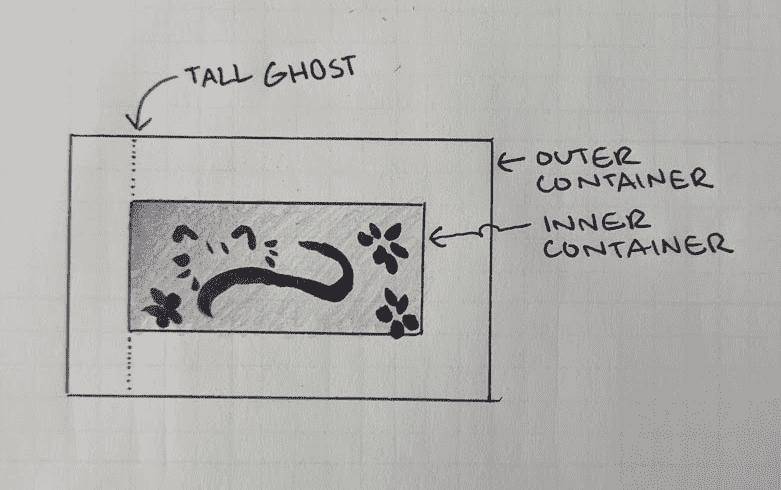

# CSS 中的对齐方式:文本和垂直对齐

> 原文：<https://dev.to/tchaflich/alignment-in-css-text-and-vertical-alignment-56hl>

亚历克斯·王拍摄的封面照片。

### 这是一个漫长旅程的开始，学习如何让事情最终在我们的网页上正确排列。

今天的教程讲的是两个性质:`text-align`和`vertical-align`。文本对齐是一个非常简单的属性，通常是初学者最先学习的。垂直对齐似乎是其简单的对位，但由于其复杂的规则可能具有欺骗性，并且是许多人的早期绊脚石。

# 📌文本对齐

`text-align`的作用是水平对齐文本*。摆弄它:*

 *[https://codepen.io/tchaflich/embed/OKxrVx?height=600&default-tab=result&embed-version=2](https://codepen.io/tchaflich/embed/OKxrVx?height=600&default-tab=result&embed-version=2)

如果您以前使用过任何类型的文本编辑器，这些选项会非常熟悉。

更多的选项即将推出——例如，`start`和`end`，它们依赖于文本方向，通过特定的字符(比如小数)对齐，还有`justify-all`，它强制文本的最后一行对齐。截至创作日期(2019 年 8 月)，这些产品在支持方面有很大差异，因为就规范而言，它们目前仍是编辑的草稿——所以在使用任何新奇的产品之前，请确保检查兼容性表。

文本对齐的参考和进一步阅读:

*   [MDN: text-align](https://developer.mozilla.org/en-US/docs/Web/CSS/text-align)

# 📌垂直对齐

正如你可能已经猜到的名字一样，`vertical-align`的目的是垂直对齐文本*。在下面的例子中，我强调了一些与植物相关的关键短语；这些按钮切换这些突出显示的垂直对齐属性。*

 *[https://codepen.io/tchaflich/embed/gVGZgG?height=600&default-tab=result&embed-version=2](https://codepen.io/tchaflich/embed/gVGZgG?height=600&default-tab=result&embed-version=2)

如果您将垂直对齐应用到`display: inline`或`display: inline-block`元素，那么您将能够使它们彼此对齐。只要设置了有效的 display 属性，就可以水平对齐任何内容。文本、图像、图标、按钮、输入...

### 在内联或内联块元素上使用`vertical-align`时，对齐相对于水平行中的同级元素，而不是父元素。

垂直对齐也适用于表格(以及显示设置为表格单元格的元素)。这里有一个样本表可供使用:

[https://codepen.io/tchaflich/embed/wVrVKp?height=600&default-tab=result&embed-version=2](https://codepen.io/tchaflich/embed/wVrVKp?height=600&default-tab=result&embed-version=2)

重要提示:

### ⚠️垂直对齐不对齐块元素。⚠️

所以如果你在想...“等等，竖排对我没用！你为什么要说谎？”，查看元素的`display`属性。**垂直对齐并不是一种通用的对齐方式。**由于块级元素在同一行上不能有流入兄弟元素，所以它们不会对齐。然而，块元素*可以*让子元素继承它们的垂直对齐属性；不是严格意义上的无效，只是对定位没用。

如果你还记得表格式布局的日子(方式， *waaaay* 回...但愿如此)，你可能还记得表格单元格上的 [`valign`](https://developer.mozilla.org/en-US/docs/Web/HTML/Element/td#attr-valign) *属性*。据推测，`vertical-align`属性是专门为了模拟这个属性的行为而创建的。

#### TL；博士；医生

使用此选项可以垂直对齐文本、图像、图标或其他显示为水平“对齐”的内容。除非您在表格中使用它，否则垂直对齐会改变项目相对于彼此的行为，而不是相对于它们的父元素。

垂直对齐的参考和进一步阅读:

*   [MDN:垂直对齐](https://developer.mozilla.org/en-US/docs/Web/CSS/vertical-align)
*   [垂直对齐:你需要知道的一切(CSS)](https://christopheraue.net/design/vertical-align)
*   [了解垂直对齐，或“如何(不)垂直居中内容”](http://phrogz.net/css/vertical-align/index.html)

## 加成垂直对齐:一个高大的幽灵👻

这里有一个使用垂直对齐的巧妙技巧。由于 flexbox 得到了很好的支持，我不再在生产中使用它，但它仍然是对 vertical align 工作方式的一个很好的探索。

这个技巧是一个事实的延伸，即垂直对齐使内嵌块元素*彼此*居中。

我们有:

*   外部容器，比内部容器大
*   我们希望垂直居中的内部容器
*   一个不可见的“高鬼”容器，只协助对齐

[https://codepen.io/tchaflich/embed/RzRLoG?height=600&default-tab=result&embed-version=2](https://codepen.io/tchaflich/embed/RzRLoG?height=600&default-tab=result&embed-version=2)

重要的是:

*   高鬼和内胆都是**`display: inline-block`和`vertical-align: middle`**
***   高个鬼是 100%身高(所以才高！)*   高鬼是零宽度，以确保它不会失去对齐(它是不可见的)**

 **不可见的对齐元素是*用`height: 100%`将*设置为其父元素的高度，所以任何与“高鬼”垂直对齐的都将*发生*以与其父块元素对齐。容器内的两个元素都是内嵌块，因此它们可以彼此垂直对齐。它们都被设置为`vertical-align: middle`。所以，我们要对齐的内部容器(猫)位于中间。

现在，代码有点乱，所以我们可以通过使用[伪元素](https://developer.mozilla.org/en-US/docs/Web/CSS/::before)来清理它:

[https://codepen.io/tchaflich/embed/mZEBOO?height=600&default-tab=result&embed-version=2](https://codepen.io/tchaflich/embed/mZEBOO?height=600&default-tab=result&embed-version=2)

还有几个小注意事项:

*   包含空格的`content`属性只是为了确保元素可以在所有浏览器中呈现。
*   虽然在这个例子中宽度和高度是显式设置的，但是它们并不需要被设置；只要内部内容不溢出父内容，这个技巧就能起作用，因为它是基于百分比的。
*   猫和`text-align: center`横向居中是因为我觉得好看。这是可选的。

关于这些房产你还想知道什么？对这个系列的下一个条目有什么要求吗？我有一个 *lot* 计划...原来 CSS 有很多方法来对齐东西。(怎么没有一个能用的？🤔)****