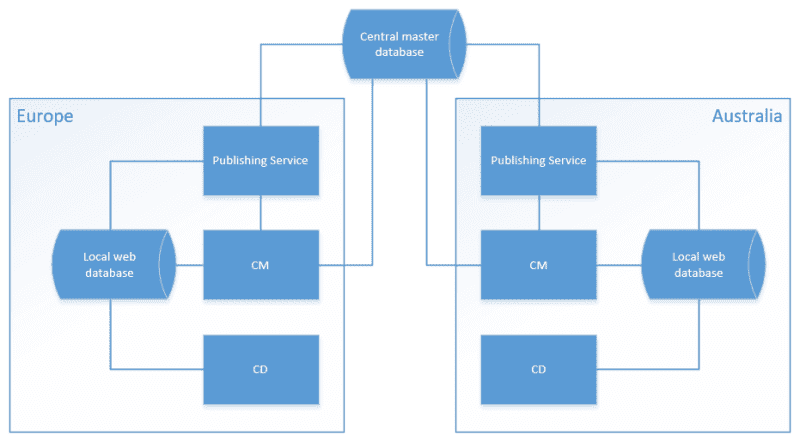

# 发布服务远程事件的一个边缘案例

> 原文：<https://dev.to/jermdavis/an-edge-case-of-remote-events-with-publishing-service-5g0n>

我最近一直致力于 Sitecore 的国际部署，解决了一些关于发布如何引发远程事件的问题，这表明我对发布过程中的一些事情并不完全了解…我怀疑这是否是一个常见的场景，但似乎仍然值得写下我所学到的东西——因此，这是我未来的另一个目标:

## 场景:

我不会深入解释其中的原因，但是这个部署将 Sitecore 分成了三个部分:

1.  位于中央位置的共享主数据库
2.  欧洲的一个 Sitecore 集群，它具有除主数据库之外的所有角色
3.  澳大利亚的 Sitecore 集群，它具有除主数据库之外的所有角色

因此，作者登录到地理上离他们最近的 Sitecore 实例，并在那里进行编辑。当他们完成后，他们点击“发布”,这些更改被发送到欧盟和非盟网络数据库的发布目标。

由于中央主数据库和本地 Web 数据库之间有 WAN 链接，这看起来像是发布服务的一个用例，因为它的处理速度更快，应该更好地处理该场景中涉及的网络延迟。

大多数情况下，这是可行的…

但是值得注意的是，当一个作者在欧洲发表文章时，它更新得很好，但是在澳大利亚缓存和索引没有更新。这是有意义的，因为检查澳大利亚数据库中的事件表并没有得到任何“发布已经发生”的消息…

所以很明显我弄错了——在我自己无法修复它之后，我花了一些时间与 Sitecore 支持讨论这个场景。

## 我糟糕的假设…

最初，我查看了站点的角色图，认为发布服务实例需要了解 EU 和 AU 数据库，但它们是系统中唯一需要了解的部分。

因此，发布服务可以配置为查看 EU 和 AU 中的“web”发布目标数据库，以及中央主数据库。但是 CM 和 CD 实例只关心它们的本地 web 数据库和主数据库。所以他们根本不需要知道远程网络数据库。

这似乎是合乎逻辑的——而且发布操作很大程度上是可行的。但是“事件不会在遥远的地方发生”的说法表明这是不对的。

## 我从支持中学到了什么……

因此，事实证明“发布已经发生”事件实际上并不是由发布服务生成的。它负责在数据库之间移动项目，但不负责触发所有事件。这项工作仍然发生在 CM 实例内部。

这意味着该场景要求您必须将所有远程数据库配置为 CM 角色和发布服务的发布目标。

为了解决我的问题，我必须更改配置，以便:

*   所有的 web 数据库都以唯一的名称出现在 CM 服务器连接字符串文件中。例如将它们命名为“欧洲网络”和“澳大利亚网络”
*   所有的 web 数据库都需要使用这些惟一的名称被配置为两个 CM 实例中的发布目标。这需要一个配置补丁来配置事件队列等，并确保在 Master 中的“/系统/发布目标”下有正确的项目来定义这些发布目标，使用唯一的数据库名称。
*   CM 框上的定义需要更新它们的“数据库”属性，以使用唯一的数据库名称。
*   发布服务中目标数据库的[配置必须使用相同的唯一名称，并且必须为每个目标指定唯一的数据库名称。(因此发布服务在其连接字符串文件中也需要这些数据库)](https://grantkillian.wordpress.com/2018/12/17/how-i-add-custom-sitecore-publishing-service-targets/)

一旦发布服务和所有的 CM 盒都知道了所有的数据库，事件就开始在发布后出现在远程数据库中，并且在每次发布后神奇地清除缓存并更新索引。

您似乎不需要更改 CD 服务器配置来匹配 CM 更改。

再一次，Sitecore 的支持拯救了我—[谢谢](https://media.giphy.com/media/4EF5xIO5yiivWh4gGn/giphy.gif)！