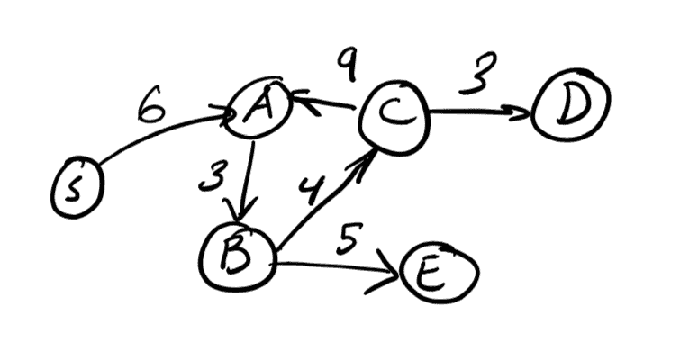
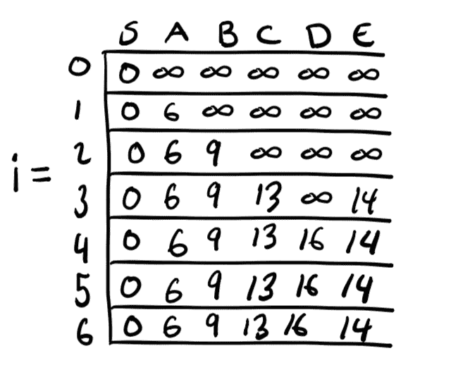
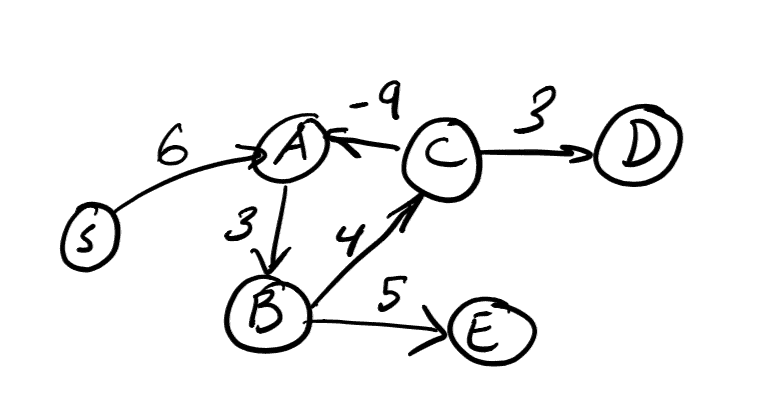
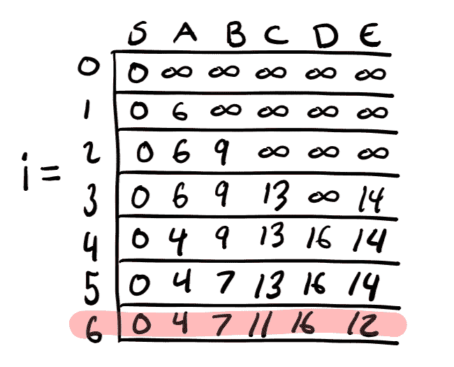

# 贝尔曼-福特最短路径图算法初探

> 原文：<https://dev.to/downey/an-exploration-of-the-bellman-ford-shortest-paths-graph-algorithm-592h>

*封面照片由[托尔·阿尔维斯](https://unsplash.com/@terminath0r?utm_source=unsplash&utm_medium=referral&utm_content=creditCopyText)在[Unsplash](https://unsplash.co)T5 拍摄*

你可能熟悉 [Dijkstra 的算法](https://en.wikipedia.org/wiki/Dijkstra%27s_algorithm),用于快速找到加权有向图中的最短路径。这通常很好，但是如果你的图有负的边权重，Dijkstra 的算法[会让你失望](https://stackoverflow.com/questions/13159337/why-doesnt-dijkstras-algorithm-work-for-negative-weight-edges)。幸运的是，我们有(更慢的)替代方法，如[贝尔曼-福特](https://en.wikipedia.org/wiki/Bellman%E2%80%93Ford_algorithm)和[弗洛伊德-沃肖尔](https://en.wikipedia.org/wiki/Floyd%E2%80%93Warshall_algorithm)算法，当我们有负权重时*做*工作。在这篇文章中，我将讨论贝尔曼-福特算法如何找到最短路径，以及我们如何使用它来找到负权重循环(图中的循环，其中权重随着循环次数的增加而减少)。

## 两点间的最短路径

考虑下图:

[](https://res.cloudinary.com/practicaldev/image/fetch/s--ZUTsBHc7--/c_limit%2Cf_auto%2Cfl_progressive%2Cq_auto%2Cw_880/https://thepracticaldev.s3.amazonaws.com/i/qsigvggw5adik70t5a4b.png)

它有六个顶点“S”、“A”、“B”、“C”、“D”和“E”，以及这些顶点之间的六条加权边。我们将使用 Bellman-Ford 算法来找到从我们的起始顶点“S”到该图中所有其他可达顶点的最短路径(在该图中，它们都可以从“S”到达)。这就是所谓的“单源最短路径问题”

为了解释贝尔曼-福特是如何使用动态编程工作的，我将着手解决这个问题，类似于我的[背包问题解释](https://dev.to/downey/solving-the-knapsack-problem-with-dynamic-programming-4hce)，并执行以下操作:

1.  陈述子问题
2.  定义重复
3.  描述记忆表结构
4.  展示一个 Python 例子
5.  对算法进行快速大 O 分析

### 子问题

贝尔曼-福特的要点是，我们将考虑从起始顶点 *s* 到图上其他某个顶点 *z* 的路径。在这个图上没有负权重循环，所以我们只需要访问每个顶点最多一次。这意味着我们的路径可以被认为是遍历到了 *n* 条边，其中 *n* 是图中边的数量。

在动态编程中，我们希望找到更小的子问题，以便以后解决和利用。对于这个问题，我们可以构建出包含长度为 *i* 的边的**条更小的路径**，其中 **0 ≤ *i* ≤ *n* - 1** 。

让我们把我们的子问题定义为:

**D( *i* ， *z* ) =从 *s* 到 *z* 使用最多 *i* 边**的最短路径长度

### 重复出现

我们将首先考虑没有边的路径。这基本上意味着我们停留在起始顶点“S”(*z*=*S*)上，其他所有顶点都无法到达。

*   **基本情况:** **D(0， *s* ) = 0**

现在，对于我们的主递归，我们基本上只是要查看到直接导致 *z* 的顶点的距离，我们将这些称为 *y* ，并选择最小的一个来构建。因为到达更早的顶点 *y* 所需的边数肯定比我们现在所处的位置要少，我们知道我们已经解决了这个距离，作为更早的子问题的一部分。如果这些新的可达路径小于我们在前面的子问题中找到的到达 *z* 的路径，我们就更新我们的最短路径。这种循环看起来像:

*   **递归:** **D( *i* ，*s*)=*min*(D(*I*-1， *z* )， *min* (D( *i* - 1， *y* ) + *权重* ( *y* ， *z***

### 记忆化表格结构

对于这个例子，我们将使用一个二维记忆表来跟踪 *i* 和 *z* 。随着 *i* 的增加，我们能够访问图上更多的顶点，我们将跟踪 T[ *i* ][ *z* ]处的当前最短路径距离。尚未到达的顶点的最短路径距离为*无穷大*。

[](https://res.cloudinary.com/practicaldev/image/fetch/s--kfuN2Xf0--/c_limit%2Cf_auto%2Cfl_progressive%2Cq_auto%2Cw_880/https://thepracticaldev.s3.amazonaws.com/i/iju57p7zzwwt9bnbsqn2.png)

上表显示了在我们的示例图中完成 Bellman-Ford 后，记忆化表将包含的内容。

### Python 实现

下面是一些演示核心算法的 Python 代码。它省略了一些数据结构设置和助手，但是您可以在 Repl 上找到并运行完整的代码。It 。

```
graph = {
          'S': ['A'],
          'A': ['B'],
          'B': ['C', 'E'],
          'C': ['A', 'D'],
          'D': [],
          'E': []
        }

weights = {
          'S': {'A': 6},
          'A': {'B': 3},
          'B': {'C': 4, 'E': 5},
          'C': {'A': -3, 'D': 3},
          'D': {},
          'E': {}
        }

d[0][vertex_to_idx['S']] = 0

for i in range(1, num_edges):
  for z in graph.keys():
    z_idx = vertex_to_idx[z]

    d = [[math.inf for x in range(num_vertices)] for y in range(num_edges + 1)]

    # Initialize the shortest path to z to the
    # path found in the previous subproblem.
    # Only update if new paths are shorter
    d[i][z_idx] = d[i-1][z_idx]

    # The reversed graph lets us find which vertexes
    # immediately lead to z
    for y in reversed_graph[z]:
      y_idx = vertex_to_idx[y]
      if d[i][z_idx] > (d[i-1][y_idx] + weights[y][z]):
        d[i][z_idx] = d[i-1][y_idx] + weights[y][z] 
```

Enter fullscreen mode Exit fullscreen mode

### 可运行代码

您可以在下面看到运行中的代码:

[https://repl.it/@tcdowney/bellman-ford-dp?lite=true](https://repl.it/@tcdowney/bellman-ford-dp?lite=true)

### 大求分析

参考上面的代码，有一些设置需要线性时间(如反转图形)，但算法的大部分复杂性来自三个嵌套循环。为了分析这一点，让 *n* 继续作为边的数量，让我们引入 *m* 作为顶点的数量。最外层的循环是在 *n* 边上迭代，然后对于每个循环，我们在 *m* 顶点上循环。在这个循环中，我们循环遍历通向 *z* 的边的子集。所以实际上我们在这里做的是*O*(*n***m*)工作。

这使得贝尔曼-福特算法 *O* ( *nm* )其中 *n* 是图中边的数量， *m* 是顶点的数量。

## 使用贝尔曼-福特查找负权重周期

所以我们上面的图没有负权重循环(或者一般的负权重循环)。如果我们做了会怎么样？让我们考虑下图:

[](https://res.cloudinary.com/practicaldev/image/fetch/s--yq-4DN7F--/c_limit%2Cf_auto%2Cfl_progressive%2Cq_auto%2Cw_880/https://thepracticaldev.s3.amazonaws.com/i/mi1wf51guaj6zbjpdray.png)

注意在“A”、“B”和“C”之间有一个负的重量循环。我们每绕一圈，总的路径权重就减负二。贝尔曼-福特算法无法处理这个问题，因为这意味着对于图中的某些顶点没有最短路径——我们在循环中循环的次数越多，路径就越短。这可以无限地继续下去！

但是我们可以**检测负重量周期**！

### 检测周期

让我们来看看这个图表的贝尔曼-福特记忆表。

[](https://res.cloudinary.com/practicaldev/image/fetch/s--qI_BNTUg--/c_limit%2Cf_auto%2Cfl_progressive%2Cq_auto%2Cw_880/https://thepracticaldev.s3.amazonaws.com/i/6hj9q2j4m7c4v50i8ewy.png)

如果这个图有一个明确定义的解，我们期望它在求解长度为 *n* - 1 条边( *i* = 5)的路径后收敛到最短路径上。正如我们所看到的，当我们检查长度为 *n* ( *i* = 6)的路径时，路径实际上继续减少。这可能会永远继续下去，所以我们现在可以停止算法。使用 Bellman-Ford 寻找负权重循环就像检查 *n* 边路径解是否与 *n* - 1 边解相同一样简单。如果它更小，那么就有一个负的重量循环！

然而，需要注意的重要一点是，这将只找到从起始顶点 *s* 可达的顶点的圈。如果循环不可达，贝尔曼-福特公司就找不到它。在这种情况下，我们需要求助于 [Floyd-Warshall](https://en.wikipedia.org/wiki/Floyd%E2%80%93Warshall_algorithm) 算法来寻找所有配对之间的最短路径。

不过，这是以后的事了。🏄‍♂️