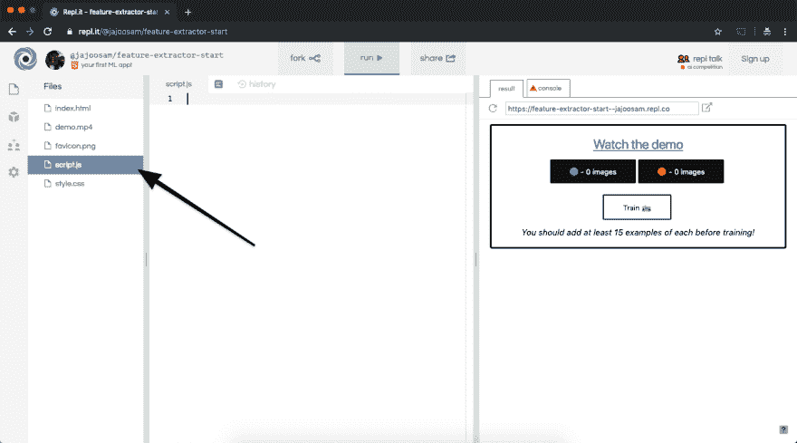
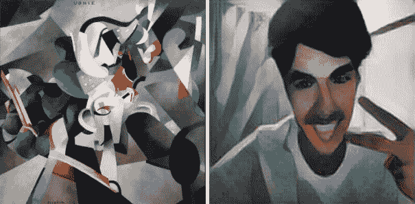

# 你可以用 JS 构建一个 ML 应用程序，不需要数学🙈

> 原文：<https://dev.to/jajoosam/an-ml-app-you-can-build-with-js-and-without-the-math-3dbk>

[](https://res.cloudinary.com/practicaldev/image/fetch/s--LLOC1cR---/c_limit%2Cf_auto%2Cfl_progressive%2Cq_66%2Cw_880/https://ecstatic-rosalind-da34e4.netlify.com/main.gif)

[演示](https://feature-extractor--jajoosam.repl.co)⏯️ [代码](https://repl.it/@jajoosam/feature-extractor)👨‍💻[视频演练](https://ecstatic-rosalind-da34e4.netlify.com/feature-extractor-demo-compressed-3e7aac1a-1c37-4448-92ab-140b5dd84056.mp4)🎦

机器学习是构建人工智能应用程序的一种超级酷的方式——但我不会撒谎，这是一个很大的数学问题。幸运的是，感谢[ml5 . js](https://ml5js.org)——我们不需要花几个月的时间去理解 ml，我们可以在几个小时内应用它并在我们的应用中开发一些很酷的用途😄

这是一个构建特征提取器的指南-它可以从你的网络摄像头获取视频流，并预测它看到的内容，一旦它用一点点数据进行训练-就像上面的视频一样！

## 🍴分叉前端

我不想在我为这个应用使用的前端上浪费你太多的时间——我想如果我直接跳到 JavaScript 和逻辑会好得多。

你应该分叉这个 repl-[https://repl.it/@jajoosam/feature-extractor-start](https://repl.it/@jajoosam/feature-extractor-start)-这样你就已经有 HTML 了！它本质上只是几个用于保存视频和其他文本的`div`按钮，以及一些控制我们应用程序的按钮！

我已经注释了所有的东西(除了 CSS😛)-所以你应该能在几分钟内通过前端，了解 app 的基本布局。完成后，前往`script.js`

[](https://res.cloudinary.com/practicaldev/image/fetch/s--SAZZmHlW--/c_limit%2Cf_auto%2Cfl_progressive%2Cq_auto%2Cw_880/https://ecstatic-rosalind-da34e4.netlify.com/Untitled-8e918105-6ae0-4591-8362-7ed6e7068460.png)

## ✏️宣告了变数

我们将有相当多的变量要声明，所以我们要做的第一件事就是创建它们。

我们的应用程序将会有很多函数，重要的是所有的函数都可以访问变量——这就是为什么我们要在代码的开头声明

```
var featureExtractor, classifier, video, loss, redCount, blueCount;

redCount = blueCount = 0; 
```

我将向您概述这些功能的用途，但是随着我们继续构建我们的应用程序，您将会更好地理解它们。

`featureExtractor`和`classifier`是我们将要存储和初始化机器学习模型的变量。

`video`是我们存储网络摄像头流的地方，而`loss`让我们知道我们的 on 特征提取器已经被训练了多远。

最后，`blueCount`和`redCount`是每个类别中有多少图像的计数器——在下一行，我们用值`0`初始化它们。

## 和`setup()`

是一个函数，一旦我们的代码准备好运行，它就会启动。由于使用了 [p5.js](https://p5js.org) ，我们的代码在这里非常易读易懂。

```
function setup() {
    // Tells p5 to not automatically create a canvas element.
  noCanvas();

    // Starts capturing a video feed from the webcam
  video = createCapture(VIDEO);

    // Puts the video stream into the div in our html, with ID `video`
  video.parent('video'); 

    // Initializes a feature extractor, yet to be trained - from ml5.js
  featureExtractor = ml5.featureExtractor('MobileNet');
  classifier = featureExtractor.classification(video);

    // What we're doing next - setting up buttons!
  setupButtons();
} 
```

这段代码在你声明变量之后就进入你的`script.js`文件——本质上，它获得一个视频流并显示在我们的页面上，在一个 ID 为`video`的`div`中。我们还在这里使用 ml5.js 库创建了一些函数，并将捕获的视频作为参数传递——您很快就会看到我们用这些函数做了什么，但是还有一些设置工作要做！

如你所见，在`setup()`的末尾，我们调用`setupButtons()`——我们接下来要做的函数。这里，我们将事件监听器添加到 HTML 中的按钮——这样我们就可以在它们被点击时运行函数。

这里是我们为`setupButtons()`函数编写的所有代码👇

```
// A function to create the buttons
function setupButtons() {

  buttonA = select('#red');
    buttonB = select('#blue');

​    
​      buttonA.mousePressed(function() {
​         redCount++;
​        classifier.addImage('red');
​        select('#redCount').html(redCount);
​      });

​     
​      buttonB.mousePressed(function() {
​         blueCount++;
​        classifier.addImage('blue');
​        select('#blueCount').html(blueCount);
​      });
​    
  train = select('#train');
  train.mousePressed(function() {
    classifier.train(function(lossValue) {

    // This is where we're actually training our model

      if (lossValue) {
        loss = lossValue;
        select('#info').html('Loss: ' + loss);
      } else {
        select('#info').html('Done Training! Final Loss: ' + loss);
                select('#train').style("display", "none");
                select('#predict').style("display", "inline");
      }
    });
  });

  // Predict Button
  buttonPredict = select('#predict');
  buttonPredict.mousePressed(classify);
} 
```

这是我们的应用程序的最大艺术，我将把它分成几个部分，以便于解释！

## 🧙‍♂️bUt 这些按钮是做什么用的？！？！？！

不要惊慌。

让我们从这一块开始:

```
buttonA = select('#red');
buttonB = select('#blue');    

buttonA.mousePressed(function() {
    redCount++;
    classifier.addImage('red');
    select('#redCount').html(redCount);
});

buttonB.mousePressed(function() {
    blueCount++;
    classifier.addImage('blue');
    select('#blueCount').html(blueCount);
}); 
```

`buttonA`和`buttonB`不过是我们应用程序中的两个不同按钮！

[](https://res.cloudinary.com/practicaldev/image/fetch/s--LWTV4M3r--/c_limit%2Cf_auto%2Cfl_progressive%2Cq_auto%2Cw_880/https://ecstatic-rosalind-da34e4.netlify.com/Untitled-c85ebc09-ab40-4060-a9ce-98966a9fe021.png)

通过`.mousePressed()`,我们定义了当这些按钮中的任何一个被按下时会发生什么——也就是:

*   使用`++`操作符将计数增加 1
*   用`classifier.addImage()`从网络摄像机 videom 中捕捉当前帧并将其添加到分类器中
*   通过使用`.html()`改变按钮的文本来更新我们应用程序上的计数

接下来，我们有了这一整块——我们在这里训练分类器本身:

```
train = select('#train');
  train.mousePressed(function() {
    classifier.train(function(lossValue) {

            // This is where we're actually training our model

      if (lossValue) {
        loss = lossValue;
        select('#info').html('Loss: ' + loss);
      } else {
        select('#info').html('Done Training! Final Loss: ' + loss);
                select('#train').style("display", "none");
                select('#predict').style("display", "inline");
      }
    });
  }); 
```

当我们应用程序上的`Train 🚋`按钮被按下时，我们调用`classifier.train()`——随着每次迭代，我们在那里提供的函数被调用——这就是为什么我们看到 *[损失](https://ml-cheatsheet.readthedocs.io/en/latest/loss_functions.html)* 值不断变化。

[](https://res.cloudinary.com/practicaldev/image/fetch/s--RlzymA2q--/c_limit%2Cf_auto%2Cfl_progressive%2Cq_66%2Cw_880/https://ecstatic-rosalind-da34e4.netlify.com/CleanShot-2019-01-26-at-18-6a9809c8-75a3-4b88-b1ee-3931aa15d08c.04.57.gif)

当*损失*值为`0`时，那么我们隐藏`Train 🚋`按钮，并显示之前隐藏的`Predict 🔮`按钮！

`setupButtons()`函数的最后两行是关于预测按钮:

```
buttonPredict = select('#predict');
buttonPredict.mousePressed(classify); 
```

似乎我们正在调用这个`classify`函数——这就是我们接下来要构建的！

继续，我们快完成了💯

## 🔮预测，并显示结果

我们的`classifier()`函数非常简单——这就是我们所做的一切:

```
function classify() {
  classifier.classify(gotResults);
} 
```

我们只是告诉 ml5 `classifier`将当前帧分类到任何一个类别(🔴或者🔵)，并将结果发送到`gotResults`函数——这将我们带到应用程序的最后一部分！

只要分类器没有向我们发送错误，我们就将整个页面的背景颜色改为`red`或`blue`——然后再次调用`classify()`，这将使我们的代码永远运行，预测也将不断出现！

```
function gotResults(err, result) {
  if (err) {
    console.log(err);
  }
    select("body").style("background", result);
  classify();
} 
```

这就是我们构建示例特征提取器所要编写的全部代码。我强烈建议浏览一下最终的代码，这样你就可以看到所有的东西是如何很好地组合在一起的——我知道有相当多的函数需要跟踪，但是我已经对所有的东西进行了注释，以使它更容易😅

[https://repl.it/@jajoosam/feature-extractor?lite=true](https://repl.it/@jajoosam/feature-extractor?lite=true)

现在开始吧，试试看！下面是我做的一些事情，看看特征提取器是否能工作(它能！)👇

*   保持我的头在左边🔴，就在🔵
*   在…制作✌️🔴，和一个✋🔵
*   穿不同颜色的👕在吗🔴和🔵

让我知道其他很酷的东西👀

## ✨好吧，但是我用这个**做**什么呢？

你可以做的事情太多了！一个特征提取器让你能够添加这整个其他的，神秘的控制方式，并在你的应用程序中获得输入！

这里有一些想法💡

*   一个手势控制的游戏，就在浏览器里🎮
*   情绪追踪器——让标签整天开着，用不同的面部表情训练它🤔
*   打造自己的 **[热狗或者不](https://www.youtube.com/watch?v=pqTntG1RXSY)** app🌭
*   开发一个只能让你用手势给别人发信息的应用程序💬

## 👨‍🏫还有什么？

ml5.js 可以做疯狂的事情！你可以像我一样将图像分类集成到你自己的应用程序中，找到适合文本的相似单词，获得人体的精确骨架，甚至转移图像中的风格——看看我的图片是什么样子的，当用一幅很酷的油画🖌️的风格构图时

[](https://res.cloudinary.com/practicaldev/image/fetch/s--MMh-kFkm--/c_limit%2Cf_auto%2Cfl_progressive%2Cq_auto%2Cw_880/https://ecstatic-rosalind-da34e4.netlify.com/mepaint.png)

你应该看看 ml5.js 网站上的许多[例子——或者看看](https://ml5js.org/docs/quick-start)[丹·希夫曼在 ml5.js](https://www.youtube.com/playlist?list=PLRqwX-V7Uu6YPSwT06y_AEYTqIwbeam3y) 上的视频，他涵盖了你可以用它做的许多事情——并且用大量的精力解释了一切。我强烈推荐在[编码列车](https://www.youtube.com/user/shiffman) YouTube 上观看他的视频！

如果您有任何问题，请随时在 [twitter](https://twitter.com/jajoosam) 上联系我，或者在评论中留言:)