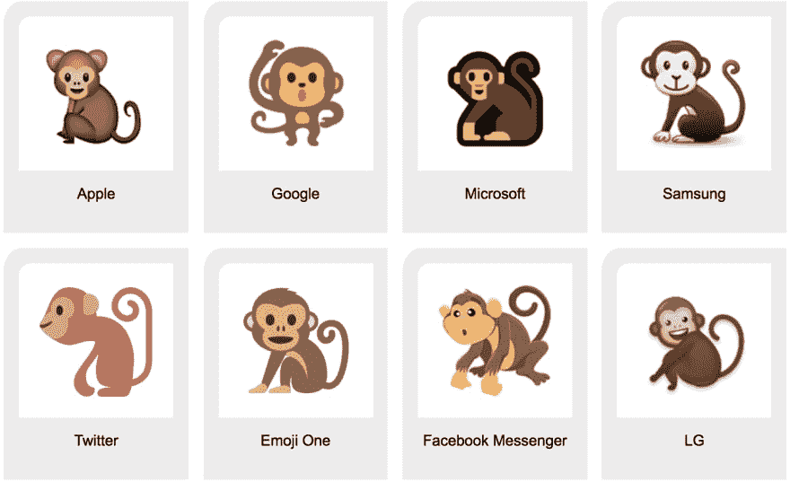

# 表情符号剖析

> 原文：<https://dev.to/andcomputers_io/anatomy-of-the-emoji-21d>

[这个帖子最初出现在&电脑](https://andcomputers.io/anatomy-of-an-emoji/)

```
Plus Kimoji just shut down the app store, ah!
And we made a million a minute, we made a million a minute
(We did)
Yeah, we made a million a minute, we made a million a minute, ah!
- Kanye West: Facts (Charlie Heat Version) 
```

“表情符号”实际上不是官方认可的表情符号。它们实际上只是没有普遍接受的文本表示的图片。

[](https://res.cloudinary.com/practicaldev/image/fetch/s--VxikexfS--/c_limit%2Cf_auto%2Cfl_progressive%2Cq_auto%2Cw_880/https://thepracticaldev.s3.amazonaws.com/i/elc1c4dw1t13cl63ng2q.png) 
*这&！%$表情符号甚至不是真正的 Unicode！！！*

##### 然而表情符号到底是什么

每个表情符号都由一个特定的字母数字代码代表。例如代码 U+1F412

[](https://res.cloudinary.com/practicaldev/image/fetch/s--cUP2GRcS--/c_limit%2Cf_auto%2Cfl_progressive%2Cq_auto%2Cw_880/https://thepracticaldev.s3.amazonaws.com/i/e50ezs6bxvs8cl9ofuyi.png) 
*`U+1F412`:在世界某些地方也指猴子。*

这些表示是由一个非常官方的非盈利组织决定的，这个组织叫做 [Unicode Consortium](https://en.wikipedia.org/wiki/Unicode_Consortium) ，它包括苹果、谷歌、IBM、Adobe Systems 和其他一些对文本处理感兴趣的公司。

联盟中的一个特别委员会决定哪些表情符号将作为官方 unicode 标准的一部分。Unicode Consortium 负责许多其他真正重要的事情，例如计算出计算机应该如何表示来自具有完全不同字符集的语言的文本。 <sup>1</sup>

对于开发人员来说，这样的考虑可能是一件大事，尤其是当试图创建服务于多语言用户群的全球应用程序时。它是美丽的，令人不安的，以及激发人们对这些事情的思考的同等部分。一般来说，统一码的要点是创建一个统一的、通用的字符表示，以供跨计算使用。对每个人来说幸运的是，这包括表情符号，它为世界各地的文本对话提供了非常丰富的内容。

##### 把所有的东西放在一起

下面的等式显示了不同的表情符号是如何被组合起来，让位于许多不同的表达方式，这几乎就像是它自己的小语言。事实上，我认为正是如此。

[](https://res.cloudinary.com/practicaldev/image/fetch/s--5PHESVBQ--/c_limit%2Cf_auto%2Cfl_progressive%2Cq_auto%2Cw_880/https://thepracticaldev.s3.amazonaws.com/i/65mtmtcfbxpes5rrgcso.png)

一些有趣的笔记:

1.  U+1F3FF 是用来代表肤色的六种表情符号之一。表情符号肤色基于菲茨帕特里克标度，该标度根据皮肤对紫外线的反应而不是种族来分类。

2.  您可能会注意到两个额外的代码点:U+200D 和 U+FE0F。这些特殊字符有助于管理不同字符或字符组合的显示/形式。

##### 奖金部分

如果您碰巧是一名开发人员或者只是对闲逛感兴趣，这里有两个您可能会感兴趣的代码片段。如果你正在考虑用表情符号和文本处理做任何类型的项目，我会推荐他们。另外，看看这篇文章中我如何在一个有趣的项目中使用这些的有趣例子。