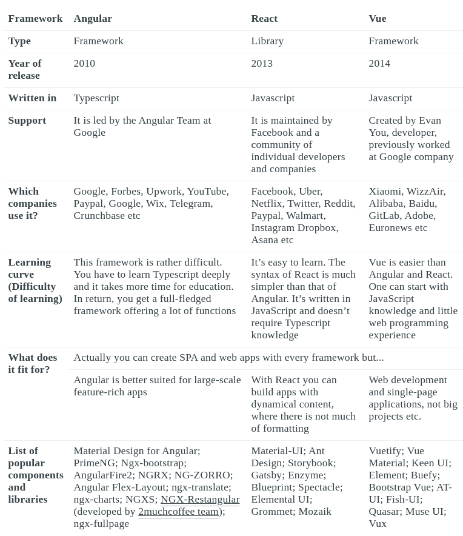
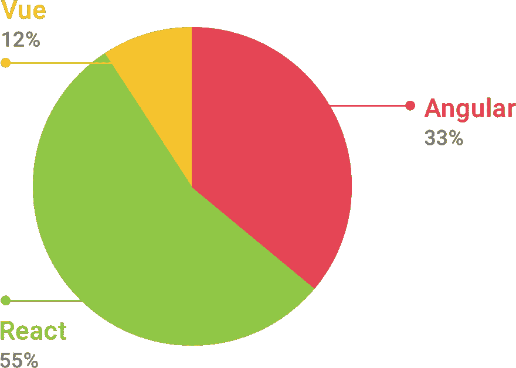

# Angular 2+ vs ReactJS vs Vue.js

> 原文：<https://dev.to/2muchcoffeecom/angular-2-vs-reactjs-vs-vue-js-3on>

## [T1】简介](#intro)

有时候，对 Javascript 框架做出选择并不容易。流行的框架 Angular 和 React 遇到了像 VueJS 这样的竞争对手。当然，还有其他的框架，但是，本文将集中讨论这 3 个最为人熟知的框架。很多开发人员在职业生涯开始时会问自己:我应该选择什么框架:React 还是 Angular 还是 Vue？哪个更好？

作为 web 和移动应用程序开发公司的开发人员，我有很多使用框架的经验，并将与您分享一些有用的信息。本文将着重于客观的比较分析，它将结合使用上述框架编码的开发人员的意见。他们分享了为什么选择一个精确的框架，以及他们喜欢或不喜欢它的地方。

下表显示了 Vue 与 Reactjs 和 Angular 的一些一般信息。

**作为一个来源，我们采用了 work，这是一个饼图，显示了 Angular、Vue 和 React 开发人员在 2018 年 10 月的空缺职位:**

让我们更具体地考虑每个框架/库的所有优点和缺点。

## Angular 在手机 app 编程中的优缺点

**棱角分明的优点:**

1.  它可以扩展到大型团队。

2.  由于它的结构，你的错误几乎不会导致灾难性的失败。

3.  有一组丰富的“开箱即用”功能。

4.  MVVM(模型-视图-视图模型)允许许多开发人员在同一个应用程序部分工作，并使用相同的数据集。

5.  对你的团队有帮助的详细文档(但是开发人员需要一些时间来审查)。

6.  伟大的社区提供支持，核心团队创造 Angular 的新特性和新版本。

**棱角分明的缺点:**

1.  你需要学习打字稿，这可能相当困难。

2.  它不像其他框架或库那样灵活。

3.  你必须学习许多新概念，例如模块、指令、组件、引导、服务、依赖注入等等。

4.  Angular 直接在 DOM 上执行操作，而 React 或 Vue 通过虚拟 DOM 来执行。

**我们角度开发者的评论:**

*来自 2muchcoffee 的 Vadim】由于我是从 Angular 开始的，前端框架的选择并不大。首先，我不喜欢 Angular 的困难。但是现在我很高兴在这个框架上编码。我呢，Vue 和 React 都是库。Angular 是一个真正的框架，具有许多功能，对于成熟的应用程序开发来说已经足够了。如果一个人真正熟悉它，开发过程会很快。还有一个优点:选择 Angular 你肯定能找到工作，因为需求很大。*

## ReactJS 的优缺点

**ReactJS 的优点:**

1.  它的语法很简单，所以人们可以很快学会。

2.  React 比 Angular 灵活得多:它将许多有用的概念捆绑在一起。

3.  它简化了 DOM 的工作(使用虚拟 DOM ),因为它允许在更新和呈现 DOM 之前优化最终的更改数量。它可以快速搜索、删除和修改 DOM 树中的元素。

4.  React 是一个开源库，从许多开发人员那里获得了许多更新。

5.  开发人员可以很容易地从旧版本转移到最新版本。

**React 的缺点:**

1.  有时 React 提供了太多的选择。

2.  为了保存数据，你需要使用 Redux 或其他库，因为你很难在 React 本身中保存数据。

3.  你不会发现“开箱即用”的功能，必须自己捆绑附加功能。

**我们(2muchcoffee) React 开发者的评论:**

2muchcoffee 的 Alex 年前用 React 开发，你知道，我很快就学会了。在此之前，我曾试图学习 Angular，但这个框架是相当困难的。我喜欢 React，因为它灵活而快速。渲染过程要快得多。我唯一不喜欢的是，我总是不得不寻找额外的组件。

## Vue 的优缺点

**Vue 的优点:**

1.  VueJS 易学易用。

2.  它的文档很容易理解。

3.  开发人员几乎不使用一些额外的库，因为这个框架已经有很好的内置功能。

4.  如果创建 SPA(单页应用)Vue 是一个好的解决方案。此外，较小的交互部分可以简单地集成到现有的基础设施中。

5.  Vue 重量不大，但工作迅速，保持足够的灵活性。

6.  和 React 一样，它也基于 DOM。然而，在执行对树的每个节点的引用的问题上，它提供了更精细的工作。

**Vue 的缺点:**

1.  这个社区不是很大，尽管它正在迅速发展。Vue 的社区最大部分来自中国。这就是为什么你必须自己解决出现的问题。

2.  对我来说，工作机会很重要。你会发现一小部分 Vue 工作机会。

**一个自由职业者在 Vue 上写代码的评论:**

我喜欢 Vue，因为它吸收了 Angular 和 React 的所有优点。文件非常清楚，我花了大约一天时间来处理 Vue。我找到了一份自由 Vue.js 开发者的工作，这对我来说就足够了。是的，我听说了缺少工作机会等问题…但是如果你擅长编程，你还是会找到工作的。

## 结论

现在你可以从优势和劣势两方面比较这些框架。然而，Angular 在复杂的大数据项目问题上是最方便的，React 是最适合讨厌限制的人的，因为它没有任何框架，而 Vue 就像是前两个框架之间的黄金中间路线。对于我们来说，它们都足够好，根据您的需求、目标和资源来决定使用哪一个取决于您。

记住，没有“坏的”或“好的”框架，只有最适合某个项目的框架。

如果你打算自己开发一个创业点子，首先你要搞清楚哪个框架适合你的项目。你必须为正确的工作找到正确的工具。作为一名初级开发人员，你可以根据它的功能、难度和工作量来选择框架。尝试使用每个框架，并决定哪一个适合你。

喜欢吗？我们已经尽力了！去我们的 <u>[博客](https://2muchcoffee.com/blog/)</u> 找更多有用的文章。