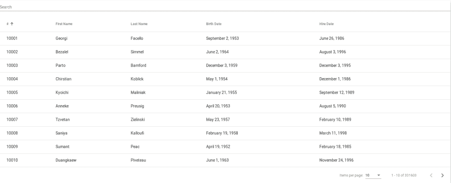

# jQuery 数据表开发人员的角度数据表:让它变得更有趣

> 原文：<https://dev.to/bbutlerfrog/angular-data-tables-for-jquery-datatables-developers-let-s-make-it-more-interesting-106j>

## 让我们把它变得更有趣

我们刚刚创建了一个[非常简单的](https://dev.to/bbutlerfrog/angular-data-tables-for-jquery-datatables-developers-a-simple-start-26bm)表格，但是我如何用[棱角分明的材料](https://material.angular.io)制作一个表格，它实际上具有我们在 [jQuery 数据表](https://datatables.net)中依赖的特性？没有一个“正确”的答案，这实际上是非常好的(Angular 的很大一部分力量在于它的灵活性)。也就是说，让我们从模仿 jQuery 数据表的“默认”功能开始，在表的顶部使用简单的“search all ”,在底部使用分页。(有更多样的一组数据)。我们将主要使用[这个示例](https://stackblitz.com/angular/ynlopoomalv?file=app%2Ftable-overview-example.ts)和[这个教程](https://blog.angular-university.io/angular-material-data-table)的组合，但是我们将使用我们的 API 数据(与第一个示例不同)，我们将修改教程示例以使用不同的方法在搜索时获取我们的数据(主要是为了展示我们可以)，最后我们将使用 Angular 7(本教程使用 Angular 6，最大的变化是映射我们的数据返回，并在我们订阅的可观察对象中使用 switchMap，如上例所示)。

首先，让我们主要按照[教程的示例](https://blog.angular-university.io/angular-material-data-table)添加我们的搜索元素，因为 Angular Material 文档中的示例“工作”没有问题，但是由于它在 HTML:
中嵌入了 keyup()函数，因此缺乏很大的灵活性

```
<mat-form-field>
  <input matInput (keyup)="applyFilter($event.target.value)" placeholder="Filter">
</mat-form-field> 
```

教程中使用的方法要灵活得多，并且(如前所述)允许我们防止在每个用户 keyup/keydown 事件上出现大量请求，使我们(或其他人)的 API 不堪重负。它(以及这个例子)首先以一个本地输入元素开始:

```
<mat-form-field>

    <input matInput placeholder="Search" #input>

  </mat-form-field> 
```

然后(从过滤器中的空白内容开始，显示在完整的组件[中，这里](https://github.com/bbutlerfrog/angular-tables/blob/master/src/app/employee-table/employee-table.component.ts)我们可以通过包括 [RxJS 去抖时间](https://rxjs-dev.firebaseapp.com/api/operators/debounceTime)(当然可以根据用户体验和 API 速率进行调整)和 [RxJS distinctUntilChange](https://rxjs-dev.firebaseapp.com/api/operators/distinctUntilChanged) (当过滤器标准没有变化时，防止点击 API)来确定用户是否“真的想要”进行搜索):

```
fromEvent(this.input.nativeElement, 'keyup')
  .pipe(
    debounceTime(200),
    distinctUntilChanged(), 
```

现在，每当“搜索”字段的内容改变时，它将作为参数传递给[雇员服务的](https://github.com/bbutlerfrog/angular-tables/blob/master/src/app/employee.service.ts) getEmployees 函数，并依次传递给 API:

```
getEmployees(sortDirection: string, sortParameter: string, filter: string, start: number, end: number): Observable<EmployeeApi> {
  sortDirection = sortDirection.trim();
  sortParameter = sortParameter.trim();
  filter = filter.trim();

  //toString is necessary here because httpClient does not support anything but strings 
 let httpParams = new HttpParams({
   fromObject: {
     sortDirection: sortDirection, sortParameter: sortParameter, filter: filter,
     start: start.toString(), end: end.toString()
     }
 }); 
```

您可能已经注意到，功能和服务总体上与 [Departments 服务](https://github.com/bbutlerfrog/angular-tables/blob/master/src/app/departments.service.ts)及其 getdepartments 功能没有太大区别。事实上，我们刚刚添加了一些参数。我们这些从 [jQuery DataTables 服务器端处理](https://datatables.net/manual/server-side)迁移过来的人可能已经发现了一个优势:我在 API 中使用了一个[标准和传统的控制器，它根本不是为这个表定制的。事实上，即使我没有能力定制这个 API，期望传入一个过滤器并得到结果也是合理的。服务器端 jQuery DataTables 对服务器端脚本有相当严格的要求，因此如果您缺少对 API 的访问，或者想要为另一个应用程序重用一个端点，就很难实现。](https://github.com/bbutlerfrog/benfrogapi/blob/master/app/Http/Controllers/EmployeeController.php)

教程中的[也有一个非常可靠的分页实现(每页有灵活的行数)，将它添加到我们的表中并使它像我们熟悉的 DataTables 组件一样工作一点也不困难。它依赖于 resultsLength，这很容易从“API”接口中的“count”获得。首先，我们将在表格底部添加一个“mat-paginator”元素:](https://blog.angular-university.io/angular-material-data-table) 

```
<mat-paginator [length]="resultsLength" [pageSize]="10" [pageSizeOptions]="[10, 20, 50]"></mat-paginator> 
```

然后，返回到[雇员表组件](https://github.com/bbutlerfrog/angular-tables/blob/master/src/app/employee-table/employee-table.component.ts)，我们将利用 [RxJS Merge](https://rxjs-dev.firebaseapp.com/api/index/function/merge) 函数来发出排序参数和(现在)分页元素(注意，当排序更改时，我们也将分页重置为第 0 页)中的更改值:

```
this.sort.sortChange.subscribe(() => this.paginator.pageIndex = 0);
this.sort.direction = 'asc';
this.sort.active = 'emp_no';
this.paginator.pageIndex = 0;
this.paginator.pageSize = 10;
this.input.nativeElement.value = '';    
this.sort.sortChange.subscribe();
this.employeeService = new EmployeeService(this.http);
merge(this.sort.sortChange, this.paginator.page)
  .pipe(
    startWith({}),
    switchMap(() => {
      this.isLoadingResults = true;
      return this.employeeService!.getEmployees(
        this.sort.direction,
          this.sort.active,
          this.input.nativeElement.value,
          this.paginator.pageIndex,
          this.paginator.pageSize)
        }),
        map(data => {
          // Flip flag to show that loading has finished.
          this.isLoadingResults = false;
          this.resultsLength = data.total_count;
          return data.items;
        }),
      ).subscribe(data => this.data = data);
  } 
```

现在，每当用户更改分页、过滤或(像第一个非常简单的表)排序参数时，我们就向 API 发出另一个数据请求。您会注意到，现在它的外观、感觉和功能都非常像 jQuery 数据表:
[](https://res.cloudinary.com/practicaldev/image/fetch/s--gM8QfgNk--/c_limit%2Cf_auto%2Cfl_progressive%2Cq_auto%2Cw_880/https://thepracticaldev.s3.amazonaws.com/i/87511x3oxo92gjg84qou.png) 
( [单击此处](https://angulardatatables.benfrog.net/interesting)查看完整的实时示例)。

如果您看一下表组件的[完整 HTML，您会注意到我添加了一些其他的小“调整”，比如禁用对两个日期字段的排序(仅仅是因为在我非常小的数据库服务器上按日期排序非常慢)。这些改变非常容易，即使是相当大的视觉和功能修改也不难，你会从 Angular Material 文档页面(经常展开)上的全套](https://github.com/bbutlerfrog/angular-tables/blob/master/src/app/employee-table/employee-table.component.html)[示例](https://material.angular.io/components/table/examples)中注意到，现在你已经有了一个功能表。