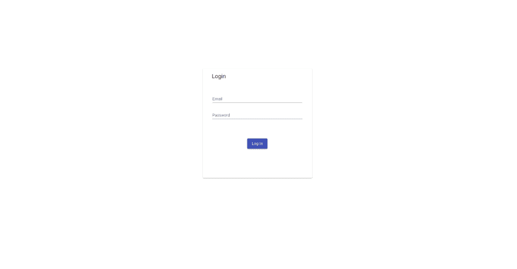
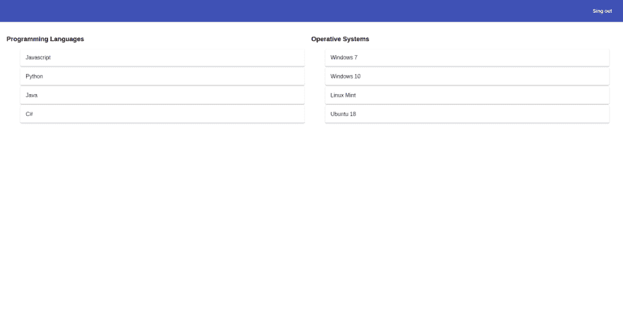
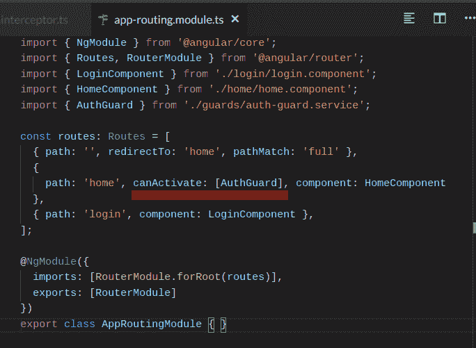
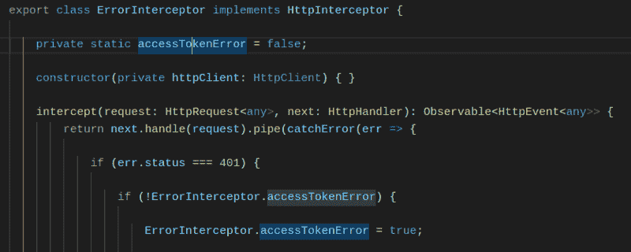
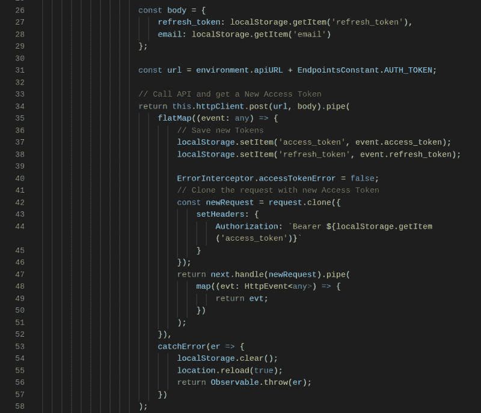

# Angular 智能拦截器——请求队列

> 原文：<https://dev.to/davidrnr/angular-smart-interceptor-queue-of-requests-13de>

### 大家好！我叫大卫·马丁，来自阿根廷。

### 让我们用 JWT 认证创建一个智能拦截器，并列出一些编程语言和操作系统，使用访问令牌、刷新令牌和请求队列。

我用下一个端点创建了一个 back end-NodeJS+MongoDB:
/API/auth/sign in

/API/auth/令牌

/api/app/programmingLang(需要访问令牌)

/api/app/os(需要访问令牌)

我构建了一个简单的 Angular 应用程序，有一个登录页面和一个主页。顺便说一下，我用的是有棱角的材料。

这里是 Stackblitz 的现场演示。

我不会谈论建立应用程序，只有拦截器。但是一个关于登录的快速视图是，当用户登录时，应用程序在浏览器的本地存储中保存一个 access_token 和一个 refresh_token。然后，应用程序可以使用 canActivate 和服务 AuthGuard 处理路由器中的身份验证。

PLs(编程语言)和 OSs(操作系统)需要认证。所以这些请求需要访问令牌。让我们创建一个拦截器，并为每个请求添加访问令牌。

我用这两个文件创建了一个新的文件夹/助手。

“主拦截器”会将访问令牌添加到每个请求中。

将拦截器添加到 AppModule，app.module.ts

[T6】](https://res.cloudinary.com/practicaldev/image/fetch/s--zNl029CP--/c_limit%2Cf_auto%2Cfl_progressive%2Cq_auto%2Cw_880/https://cdn-images-1.medium.com/max/800/1%2A7I0xcd6v_tSGUqwzR3L1Jg.png)

### 当访问令牌过期时会发生什么？

访问令牌已经过期。然后，下一个请求会失败(401 错误)。

通过刷新令牌，应用程序可以获得一个新的访问令牌来调用端点/api/auth/token。

主页加载 PLs 和 OSs，两个请求。现在，如果 PLs 失败(401 错误)，我们可以获得一个新的访问令牌。但是…

如何处理对方的请求？

错误拦截器需要一个队列。例如，假设一个应用程序在一个页面中有 6 个请求。第一个请求失败(401 错误)，错误拦截器试图获取新的访问令牌，但同时，其他 5 个请求也失败了。因此，这 5 个请求需要等待新令牌，然后重试。

Angular 中的服务是单例的(一个实例)。当拦截器试图获取新的访问令牌时，变量“static accessTokenError”处理状态。

使用刷新令牌构建主体，并尝试获取新令牌。

当*" error interceptor . accesstokenerror 为真"*调用一个方法保持等待请求，直到获得新的访问令牌。

我把 Observables 和 vanilla JS 混合在一起，因为对我来说，不订阅任何函数更好。

你可以用，[test@test.com](mailto:test@test.com)1234 test 来测试这个演示

**登录后，打开 DevTools，进入应用程序，更改 access_token，刷新页面。检查网络选项卡。**

这里是 Stackblitz 的现场演示。

谢了。