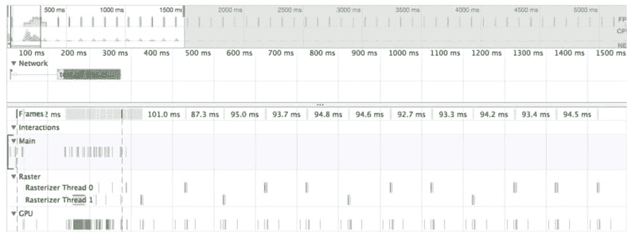
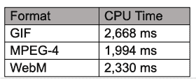

# 动画 GIF 和视频对比:你更喜欢哪个，为什么？

> 原文：<https://dev.to/chenshemtov/animated-gif-and-video-compared-which-should-you-prefer-and-why-j51>

视频和动画内容都是视觉媒体的强大形式，其对观众的影响与日俱增。根据最近的一份报告，人们平均每天花 1.5 个小时观看视频内容。81%的企业将视频作为一种有影响力的营销工具。再加上 HTML5 视频和 HTML 视频播放器的技术进步，视频内容现在比以往任何时候都更容易制作。

随着视觉内容的兴起，动画 gif 也越来越受欢迎。动画 gif 本质上是将多个图像或“帧”组合成一个文件。这些不显眼的图像以快速连续的方式显示，类似于一本翻书，以传达运动。每张图片都可以通过拆开 GIF 文件来查看。动画 gif 非常直观，与视频内容相比，它是一种更便宜的选择。

## 文件大小重要吗？

动画 GIF 的一个大问题是文件的大小。因为 GIF 是独立图像的动画书，所以压缩只能发生在图像级别。如果你好奇，试着从浏览器打开一个 GIF 文件。这是你可能会看到的。

按照现代网络标准，13.7MB 已经很大了。这是大多数网站内容大小的 10 倍。

然而，对于视频文件，电影编解码器不仅允许每帧 x/y 压缩，还允许在第三维时间上压缩。这里的优势是跨时间测试允许更高的压缩率。这是因为文件中只记录跨帧的更改。

让我们看看这个动画文件的例子。上面这张 GIF 的高清版大小是 6.6MB。如果你的网站上有多张 gif 图片，会大大降低你的页面速度，你可能会失去你的客户。另一方面，HD MP4 版本的 GIF 具有 311KB 的大小。

研究得出结论，动画 gif 比最佳编码的 MP4 视频大 5-10 倍，这正是我们在上图中看到的。这种大小上的差异意味着 gif 不仅浪费了大量的带宽，而且加载缓慢，导致糟糕的用户体验。

将动画 gif 转换成视频是一种很好的优化技术，因为视频文件可以减小文件大小。脸书、推特和 Imgur 等流行的社交媒体网站会悄悄地将用户上传的任何动画 gif 文件转换成 MP4 视频文件，然后显示出来。

## 对页面性能的影响

尽管小文件更好，但这不是唯一重要的事情。我们还需要了解媒体资源在下载后的表现。这很重要，因为媒体文件需要在回放前解码。

动画 gif 在这里不是最好的选择，因为图像中的每一帧都需要图像解码。这可以有助于 jank。

这是它在 Chrome 开发者工具的性能面板中的外观，其中页面的唯一内容是一个指向动画 GIF 的  元素:

Chrome 开发工具中的性能面板显示浏览器活动，播放动画 GIF。

当 GIF 的每个新帧被解码时，图像解码发生在光栅化器线程上。现在，这是 GIF 与 MPEG-4 和 WebM 视频的总 CPU 时间的比较表:

与这两个视频相比，GIF 占用的 CPU 时间最多，尤其是 MPEG-4。这表明视频通常比动画 GIF 使用更少的 CPU 时间，这是一个受欢迎的性能改进，不仅仅是减少文件大小。

也就是说，一些 CPU 和 GPU 提供视频文件的硬件加速编码/解码(例如，英特尔 CPU 上的快速同步视频)。许多处理器可以对 MPEG-4 进行编码和解码；然而，像 VP8 和 VP9 这样的 WebM 编解码器才刚刚开始受益于新 CPU 上的硬件加速编码/解码。你可以在[谷歌开发者页面](https://developers.google.com/web/fundamentals/performance/optimizing-content-efficiency/replace-animated-gifs-with-video/)阅读更多关于他们的表现。

另一个至关重要的因素是你存放媒体元素的地方，以及你是否在渲染之前对它们进行了优化。例如，有许多流行的云策略用于动态托管和优化视频文件。优化 gif 更加困难，尽管您可以使用图像 cdn 来托管它们。对于视频文件，可以使用 Cloudinary、Wistia 等云服务。托管您的视频，然后使用 Cloudinary 将它们链接回来。然后你可以使用一个 [HTML5 视频播放器](https://cloudinary.com/blog/html5_video_player)来呈现你的帖子上的视频。
何时使用动画 gif
使用动画 gif 有很多好处，尤其是在试图推销你的产品或服务时。下面是一些动画 gif 可以派上用场的常见场景。

活动或产品推广
动画 gif 是在线营销组织产品的理想选择，可以展示吸引潜在客户的详细程度。此外，它让观众更近距离地了解你的产品，因为他们很好地将产品的特点和优势置于聚光灯下。

最近的一项研究表明，访问者倾向于阅读网站上不到 30%的内容，并且倾向于浏览大部分内容。此外，如果没有视觉效果，访问者往往只能记住 20%的内容。因此，营销人员倾向于使用更多的视觉内容，如 gif，来传达他们的品牌信息。

解释一个过程
事实证明，用图像来解释一个过程比用文字来解释更容易。分步指南和操作指南，以及流程，使用 gif 比文本效果更好。

制作一个小型演示文稿
制作一个小型演示文稿、一幅简单的漫画或分享一段小型屏幕录像，都有助于让你明白自己的观点。尤其是在 Twitter 这样有文字限制的社交媒体平台上。

为了使数据生动，gif 可以用来通过动画图形或图表向你的观众提供一段数据或统计数据的背景。一些使用案例可以显示，森林砍伐的进展，或者洪水，或者一段时间内气候条件的变化，等等。
何时使用视频格式
这里有一些视频格式比动画 gif 效果更好的地方。

推动客户转化
最近的一项研究显示，64%的消费者在看过你的产品或服务的视频后，更有可能购买它。如果你的产品或服务能够吸引访问者的情绪，那么一个视频可以很好地激发他们的情绪，鼓励他们继续进行 CTA。

对于解释者视频
你可以计划在你的视频中详细解释你的产品或服务，并保持网页的其余部分简短。如上所述，视频比文本更能吸引访问者。这几乎适用于所有产品或服务，也可用于促销

展示人际关系
如果你有一项服务或一种产品能与人际关系产生共鸣，那么一段视频几乎能立刻赢得你的访问者。除了能够拨动心弦之外，视频中的动作和声音有助于在你需要的时候抓住并保持访问者的注意力。

对于电子邮件营销来说，在电子邮件营销活动中使用移动图像往往会产生更好的回应率，这一点已经得到了证实。在 Playable 在 2017 年进行的一项研究中，大约 27%的嵌入视频的电子邮件引起了收件人的回应。整合高质量、相关的视频会带来更好的用户体验、更高的参与度以及更多的转化率
媒体格式会影响 SEO 吗？
当我们在制定 SEO 计划时想到内容，我们倾向于默认为文本。然而，其他形式的内容，如视频、图像和 gif，在你的网站遇到更多、更频繁的查询时也起着重要的作用。

在社交平台上的帖子中包含视频和 gif 等富媒体可以增加参与的可能性。这同样适用于有机搜索渠道。如果你在搜索引擎结果页面上有不止一个列表，比如一个网页和一个视频，你的品牌的知名度就会增加。

你的网站和 YouTube 等平台上的视频改善了用户体验，并提供了更多与你的企业互动的方式。2014 年 6 月，谷歌发布了一项研究结果，显示 YouTube 是一个在不同消费者类别(包括汽车、智能手机和美容产品)转化过程中具有影响力的媒体。

如果你不把富媒体作为内容策略的一部分，你就忽略了从有机搜索结果中为你的品牌带来更多流量的机会。从研究阶段到转化，图像、gif 和视频代表了在购买过程中与目标受众联系的更多方式。如果你想了解更多关于媒体文件是如何影响 SEO 的，你可以考虑阅读[这篇由《搜索引擎杂志》发表的文章](https://www.searchenginejournal.com/gifs-google-good-content-bad-seo-practice/162753/)。

## 结论

动画 gif 是一种有趣的方式，通过引人入胜和信息丰富的内容来联系不同的受众。但是，它们的大文件可能会成为障碍，增加页面加载时间并消耗数据带宽。

当您决定在登录页面上使用视频或动画 GIF 时，请记住以下几个方面:

1.  制作精良且专业的视频非常棒。制作拙劣的视频对你的转化率可能弊大于利。
2.  有时，动画 gif 会分散你想要表达的主要思想的注意力。
3.  如果你的视频是一个产品的演示，考虑使用动画 GIF。
4.  使用视频来显示情绪或如果您需要声音效果。动画 gif 不适合这种情况。

如果你确实想在你的网站或应用程序中包含动画 gif，考虑将它们转换成视频文件。这将节省您的客户的数据成本，也不会阻碍您的网站或应用程序的速度。