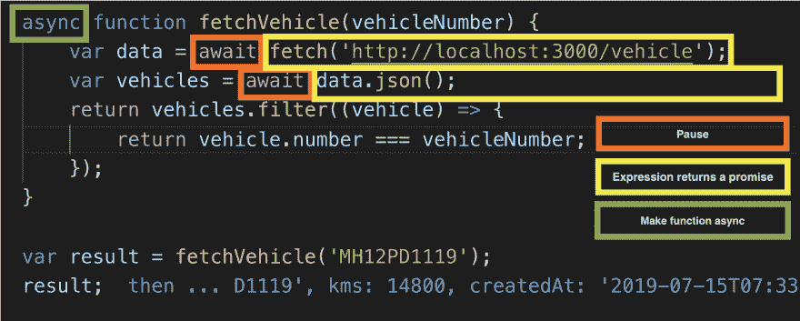

# JavaScript 中的 Async Await 关键字——使异步代码看起来同步

> 原文：<https://dev.to/ankittanna/async-await-keywords-in-javascript-make-asynchronous-code-look-synchronous-4k9d>

**什么是 Anync Await 关键字？**
在 JavaScript 中，我们使用了**承诺**，承诺的代码看起来像异步代码。

通过使用 async await 关键字，我们可以使异步代码看起来像同步代码。

**定义:**
在标记为 async 的函数中，允许将 await 关键字放在返回承诺的表达式前面。当放置 await 关键字时，异步函数的执行被暂停，直到承诺被解决/拒绝。

看看这篇教程，它展示了如何将一个异步的**获取 api 调用**转换成一个*同步的* **(然而是异步的)**代码。

它还将向您展示 Promises 和 Async/Await 之间的区别以及哪一个更好。

[https://www.youtube.com/embed/-PNOBmgcPoI](https://www.youtube.com/embed/-PNOBmgcPoI)