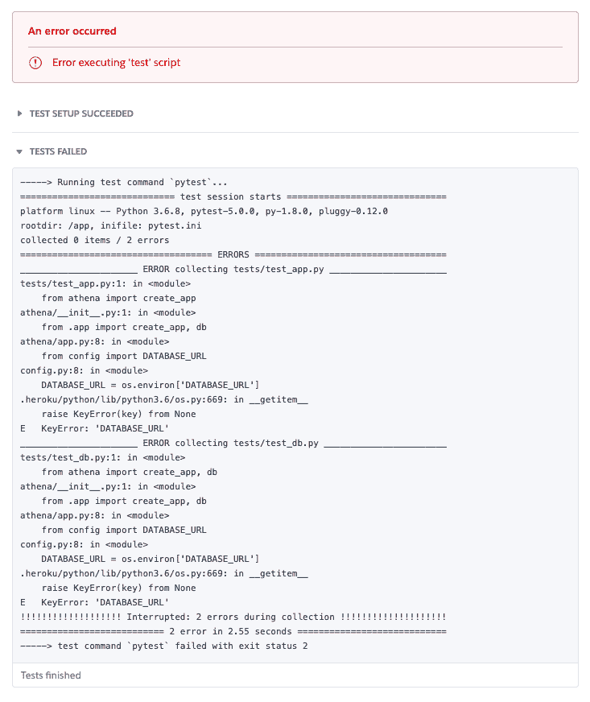
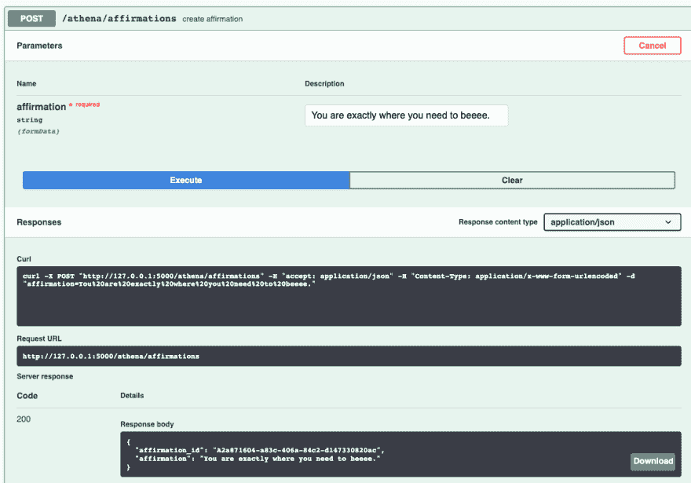
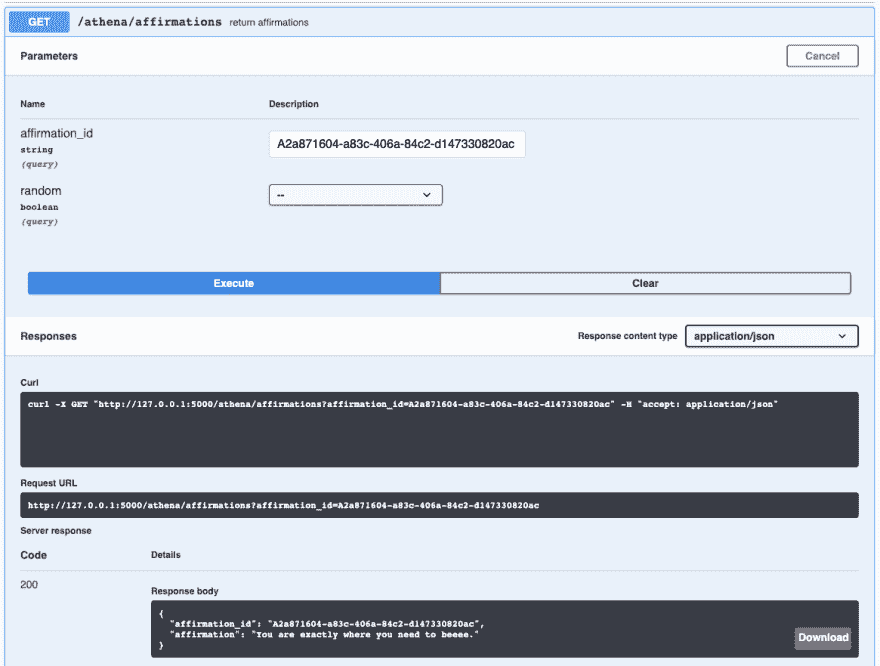
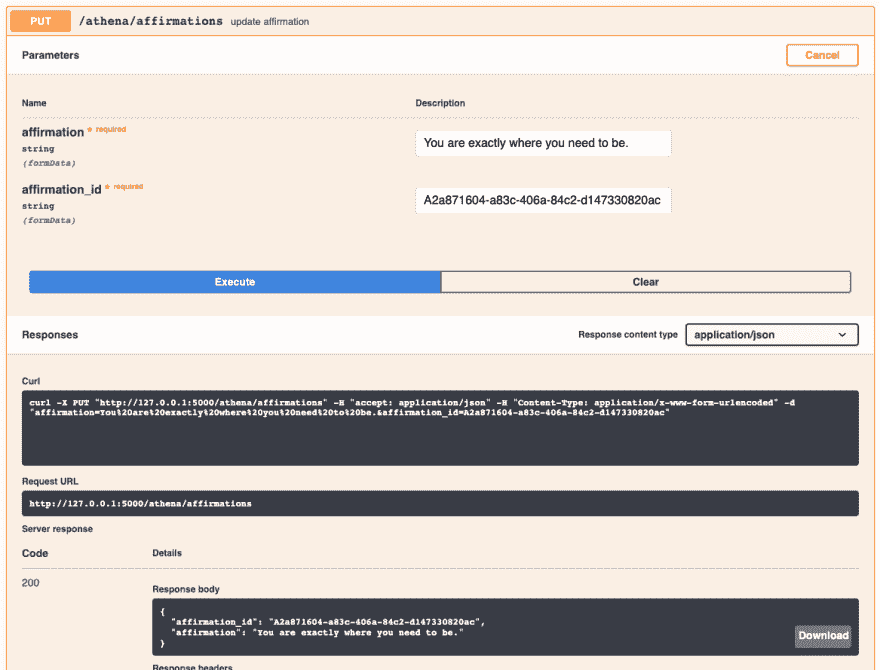
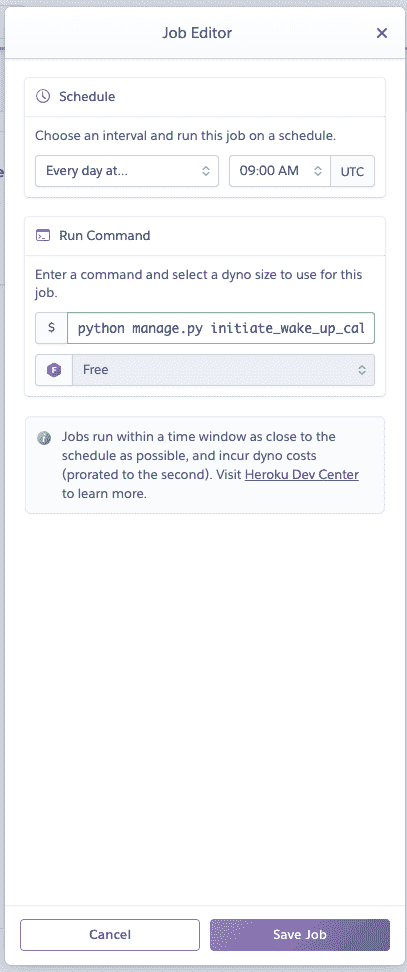

# 雅典娜，能打电话叫醒我吗？

> 原文：<https://dev.to/itstayfay/athena-can-i-get-a-wake-up-call-e1p>

既然我的机器人的[基础](https://dev.to/itstayfay/setting-up-the-backend-for-athena-my-personal-assistant-4mb2)已经建立，我可以添加我的第一个(可能也是我最喜欢的)功能——每日叫醒电话。早上通常需要很长时间才能把我叫醒，因为众所周知我至少按了 10 次贪睡键。我也许可以通过让雅典娜每天早上给我打电话来解决这个问题，为了关掉闹钟，我必须重复那天的肯定。这似乎是开始我一天的积极有效的方式！

## 目录

*   [当前技术栈](#stack)
*   [关于在 Python 应用中使用环境变量的快速说明](#env)
*   [连接到数据库](#database)
*   [确认](#affirmations)
*   [呼唤时间！](#call)
*   我醒了吗？

### 当前技术堆栈

*   [Github 回购](https://github.com/TaylorFacen/Athena)
*   Heroku
*   Python(烧瓶)
*   Postgres 数据库
*   Twilio

我将添加到 Athena 的两个组件是 Postgres 数据库和 Twilio 集成。我希望这是我解释为什么选择 SQL 而不是 NoSQL 的深入思考过程的部分。老实说，我决定走 Postgres 路线有三个主要原因:

*   我非常熟悉 SQL
*   Flask 生态系统与 Postgres 配合得很好
*   我认识到项目会随着时间的推移而发展。如果将来有什么事情需要更彻底的调查，我会去做的。有时候，做出一个决定并坚持下去，直到有必要做出改变，比花几天时间为一个可能并不那么关键的选择而努力要好。

与 Twilio 整合是显而易见的。他们的 API 很容易使用，他们的文档也非常容易理解，即使对于没有太多编码经验的人来说也是如此。我也很欣赏各种编程语言中有大量的例子。我能够使用 Python 示例中的片段来创建几乎所有用于唤醒呼叫功能的代码。

好了，推销到此为止。让我们开始吧。

如果您和我一样，不喜欢在 bash_profile 中编辑本地环境变量。我不仅每次都必须查找这个过程，我还有一些变量冲突的项目(例如，一个项目的数据库与另一个项目的数据库不同)。我通过使用一个`.env`文件来减轻这种头痛，该文件包含我的项目需要的所有键和值(当然，这不会上传到我的 repo 中)。
`.env`T5】

```
DATABASE_URL=INSERT_DATABASE_URL_HERE 
```

然后我使用`python-dotenv`包从。环境文件。在这之后，我可以通过 os.environ 从这个文件中访问任何环境变量！
T1

```
import os
from dotenv import load_dotenv

load_dotenv()

DATABASE_URL = os.environ['DATABASE_URL'] 
```

### 连接到数据库

[代码检查点](https://github.com/TaylorFacen/Athena/tree/b53b899296960b7250bfad6cbcf7575ab12b3a4d)

我决定为我的项目使用两个独立的数据库——一个用于开发和测试，另一个用于生产。这是因为无论代码位于哪个分支或环境中，我都希望它尽可能多地模仿现实生活中的产品代码。这种方法的一个替代方案是，一个数据库模式用于开发，一个用于测试。虽然这可能适用于小项目，但我计划将许多表分组到模式中(例如，任务、预算、健康等)。).

添加数据库很容易。我所要做的就是打开我的应用程序上的“资源”标签，搜索“Postgres”，然后点击“provision”。就是这样！。现在我的应用程序有了一个名为“DATABASE_URL”的配置变量，可以用来访问数据库。

接下来，我安装了 Flask-SQLAlchemy，添加了数据库的 URL 作为本地环境变量，并更新了我的`create_app`函数。

`app.py`

```
from flask import Flask
from flask_restplus import Api
from flask_sqlalchemy import SQLAlchemy

db = SQLAlchemy()

from .general import general_api
from config import DATABASE_URL

def create_app():
    app = Flask(__name__)

    app.config['SQLALCHEMY_TRACK_MODIFICATIONS'] = False
    app.config['SQLALCHEMY_DATABASE_URI'] = DATABASE_URL

    api = Api(
        title = "Athena",
        version = "0.1",
        description = "Athena the personal assistant"
    )

    # Add namespace
    api.add_namespace(general_api, path = '/athena')

    # Initialize app
    api.init_app(app)
    db.init_app(app)

    return app 
```

让我们继续添加一个测试来检查应用程序是否连接到数据库。

`test_db.py`

```
from athena import create_app, db

import pytest

@pytest.fixture
def app():
    app = create_app()
    return app

def test_db_connection(app):
    with app.app_context():
        result = db.session.execute('SELECT 1').fetchone()

    assert result[0] == 1 
```

好了，让我们把这个推上去...糟糕，出错了。
[T3】](https://res.cloudinary.com/practicaldev/image/fetch/s--I02nXjja--/c_limit%2Cf_auto%2Cfl_progressive%2Cq_auto%2Cw_880/https://thepracticaldev.s3.amazonaws.com/i/xutoxk3vxggbck2k3h99.png)

使用 Heroku 管道需要记住的一点是，您必须确保您在本地使用的环境变量也可以在以下位置找到

*   应用程序设置中的配置变量部分
*   管道设置中的配置变量部分
*   app.json 文件

做了这些改变后，一切都顺利了

### 肯定

[代码检查点](https://github.com/TaylorFacen/Athena/tree/d186940d35ea269bcabc332d22789251bea9ba8f)
接下来，让我们从数据库中获取一些确认，以便 Athena 从中提取。我将添加一个带有一些 CRU ~~D~~ (创建、读取、更新、无删除)操作的“确认”端点。

我的肯定表的模型很简单；只有两列:确认 id，确认

```
from athena import db

class Affirmation(db.Model):
    """Model for affirmations"""
    __tablename__ = 'affirmations'

    affirmation_id = db.Column(db.String, primary_key = True)
    affirmation = db.Column(db.String, nullable = False)

    def __repr__(self):
        return '<Affirmation {}>'.format(self.affirmation)

    def to_dict(self):
        """Converts object to dictionary"""
        return {k: v for k, v in self.__dict__.items() if k[0] != '_'} 
```

在 my app.py 中添加以下内容，告诉应用程序创建确认表(如果它还不存在)。

```
with app.app_context():
    from .models import Affirmation
    db.create_all() 
```

你可以说我多疑，但我总是担心我可能会不小心删除一个表。因此，让我们添加一个测试来验证 affirmations 表是否存在。

`test_affirmations.py`

```
from athena import create_app, db

import pytest

@pytest.fixture
def app():
    app = create_app()
    return app

def test_table_exists(app):
    with app.app_context():
        query = '''
        SELECT 
            TABLE_NAME 
        FROM 
            INFORMATION_SCHEMA.TABLES 
        WHERE
            TABLE_SCHEMA = 'public'
        '''
        tables_result = db.session.execute(query).fetchall()
        tables = map(lambda row: row[0], tables_result)

    assert 'affirmations' in tables 
```

好了，现在已经完成了，我可以将处理任何 CRU ~~D~~ 操作的代码添加到确认表中。创建 affirmations 端点并添加响应模型后，flask-restplus 会自动更新 api 的文档。

[](https://res.cloudinary.com/practicaldev/image/fetch/s--2x4wEqYl--/c_limit%2Cf_auto%2Cfl_progressive%2Cq_auto%2Cw_880/https://thepracticaldev.s3.amazonaws.com/i/5jgzb6yey65x7080qlvb.png)

[](https://res.cloudinary.com/practicaldev/image/fetch/s--ZuGtKJZA--/c_limit%2Cf_auto%2Cfl_progressive%2Cq_auto%2Cw_880/https://thepracticaldev.s3.amazonaws.com/i/wduuz9fi347d727jswbg.png)

[](https://res.cloudinary.com/practicaldev/image/fetch/s--vns5JBmq--/c_limit%2Cf_auto%2Cfl_progressive%2Cq_auto%2Cw_880/https://thepracticaldev.s3.amazonaws.com/i/5woscowl8qywajbzctig.png)

[](https://res.cloudinary.com/practicaldev/image/fetch/s--_e3nJTXq--/c_limit%2Cf_auto%2Cfl_progressive%2Cq_auto%2Cw_880/https://thepracticaldev.s3.amazonaws.com/i/z3qnqlqemjfrnlv81e95.png)

我继续为每个操作添加测试。在添加了一些确认之后，我们可以继续与 Twilio 集成。

```
affirmations = [
    'You are exactly where you need to be.',
    'I’m living in blessings and abundance in every area of my life.',
    'I am gifted and resourceful. I have all the wisdom and power I need to realize my dream.',
    'I appreciate every challenge and difficulty in my life. They are the best times for my growth.',
    'I am born to be happy. Happiness is my life purpose and compass.',
    'All the best opportunities are coming to me for my dream’s realization.',
    'I give myself permission to do what is right for me.',
    'I allow myself to be who I am without judgment.',
    'I give myself the care and attention that I deserve.',
    'My drive and ambition allow me to achieve my goals.',
    'I am always headed in the right direction.',
    'I trust myself to make the right decision.',
    'I put my energy into things that matter to me.',
    'I am learning valuable lessons from myself every day.',
    'I am becoming closer to my true self every day.',
    'I make a difference in the world by simply existing in it.',
    'I am at peace with who I am as a person.',
    "I am the beautiful combination of God's creativity and imagination."
] 
```

### 呼叫时间！

[代码检查点](https://github.com/TaylorFacen/Athena/tree/97ce6696567ff9b823f1aeced7ab0ec36a811107)

好了，这是我们期待已久的时刻-雅典娜有声音了！叫醒服务的工作流程是:

1.  每天在特定的时间，Heroku Scheduler 会告诉我的应用程序运行一个调用我手机的命令
2.  这个呼叫向我的应用程序发送请求，指示将我的呼叫路由到哪里(在这种情况下，是一个“唤醒呼叫”任务)。
3.  “唤醒呼叫”任务以一条早上好消息开始，然后向我的应用程序发送请求，以获得关于说什么断言以及如何验证它的指令
4.  Athena 等着我重复这句肯定的话，然后检查它是否与原来的短语最匹配(wooh NLP！)

**自动驾驶设置**
将用于该功能的两种 Twilio 服务是可编程语音和自动驾驶。语音处理正常的呼叫功能，自动驾驶是 Twilio 的机器学习引擎，用于方便用户< - >机器人交互。大多数设置都可以在控制台中完成。但是，我将通过编程实现一些设置过程，以便它是可重复的，并且可以通过版本控制进行跟踪。

为了连接 Twilio，我安装了 Twilio 包，并在我的。环境文件

```
ACCOUNT_SID=INSERT_TWILIO_ACCOUNT_SID
AUTH_TOKEN=INSERT_TWILIO_AUTH_TOKEN
TWILIO_NUMBER=INSERT_TWILIO_NUMBER
PHONE_NUMBER=INSERT_PERSONAL_NUMBER
ASSISTANT_SID=INSERT_ASSISTANT_SID 
```

现在我的配置文件看起来像这样。

```
import os

from dotenv import load_dotenv

load_dotenv()

# Database DATABASE_URL = os.environ['DATABASE_URL']

# Twilio Credentials ACCOUNT_SID = os.environ['ACCOUNT_SID']
AUTH_TOKEN = os.environ['AUTH_TOKEN']
TWILIO_NUMBER = os.environ['TWILIO_NUMBER']
PHONE_NUMBER = os.environ['PHONE_NUMBER']
ASSISTANT_SID = os.environ['ASSISTANT_SID'] 
```

ACCOUNT_SID 和 AUTH_TOKEN 来自我的账户控制台，我购买了一个具有通话和消息功能的 TWILIO_NUMBER，PHONE_NUMBER 是我的个人号码，我通过控制台创建了一个 TWILIO 自动驾驶助手，并记下了它的 ASSISTANT_SID。为了不忘记，我将继续添加两个应用程序的所有配置变量、测试设置和我的 app.json 文件。

我添加了一个`athena_setup`文件夹，其中包含用于设置她的样式表(例如，声音风格、失败消息等)的代码，以及另一个用于设置唤醒呼叫任务的代码。我还添加了一个`model_build.py`文件，为助手生成一个新的模型构建。我在这个过程中学到的一件事(希望可以帮你解决一些头疼的问题)是，在创建一个任务或者对一个任务进行重大修改之后，你必须运行一个模型构建。否则，助手可能无法解析您对机器人说的或发的任何消息。

在添加了唤醒呼叫工作流的端点之后，我可以将这些更改推送到 Twilio。

**唤醒呼叫工作流程**

整个设置非常简单。首先，我添加了一个启动调用的命令(需要 Flask_Script 包)。
T2`manage.py`

```
from flask_script import Manager
from twilio.rest import Client

from athena import create_app
from config import ACCOUNT_SID, AUTH_TOKEN, TWILIO_NUMBER, PHONE_NUMBER, API_BASE

app = create_app()
manager = Manager(app)

@manager.command
def initiate_wake_up_call():
    client = Client(ACCOUNT_SID, AUTH_TOKEN)

    call = client.calls.create(
        url = '{}/assistant/route?target_task=wake_up_call'.format(API_BASE),
        to = PHONE_NUMBER,
        from_ = TWILIO_NUMBER
    )

    return call.sid

if __name__ == "__main__":
    manager.run() 
```

然后，我添加了三个 API 调用来处理唤醒调用的不同方面。

`/route`用于将呼叫路由到正确的助理任务

```
@api.route('/route')
class Router(Resource):
    @api.expect(route_parser, validate = True)
    def post(self):
        args = route_parser.parse_args()
        target_task = args.get('target_task', None)

        response = VoiceResponse()
        connect = Connect()
        connect.autopilot(ASSISTANT_SID, TargetTask = target_task)
        response.append(connect)

        response = make_response(str(response))
        response.headers['Content-type'] = 'text/html; charset=utf-8'

        return response 
```

`wake_up_call/dialog`用于创建带有随机选择确认的右侧对话框

```
@api.route('/wake_up_call/dialog')
class WakeUpCallDialog(Resource):
    def post(self):
        client = current_app.test_client()
        resp = client.get('/athena/affirmations?random=True').json

        affirmation = resp['affirmation']
        affirmation_id = resp['affirmation_id']

        return create_wake_up_call_actions(affirmation, affirmation_id)

def create_wake_up_call_actions(affirmation, affirmation_id):
    webhook_url = "{}/assistant/wake_up_call/validate?affirmation_id={}".format(API_BASE, affirmation_id)
    actions = {
        "actions": [
            {
                "collect": {
                    "name": "affirmation_dialog",
                    "questions": [
                        {
                            "question": affirmation,
                            "name": "affirmation_respoinse",
                            "validate": {
                                "webhook": {
                                    "url": webhook_url,
                                    "method": "POST"
                                },
                                "on_success": {
                                    "say": "Wooh! Let's get the day started."
                                }
                            }
                        }
                    ],
                    "on_complete": {
                        "redirect": "task://hello_world"
                    }
                }
            }
        ]
    }

    return actions 
```

`/wake_up_call/validate`根据原始确认书检查我的回答，以验证我说的是否正确

```
@api.route('/wake_up_call/validate')
class WakeUpCallValidate(Resource):
    @api.expect(wake_up_call_validate_parser, validate = True)
    def post(self):
        args = wake_up_call_validate_parser.parse_args()

        affirmation_id = args.get('affirmation_id')
        affirmation_response = args.get('ValidateFieldAnswer')

        # Get affirmation text
        client = current_app.test_client()
        resp = client.get('/athena/affirmations?affirmation_id=' + affirmation_id).json
        affirmation = resp['affirmation']

        return validate_wake_up_call_response(affirmation, affirmation_response)

def validate_wake_up_call_response(affirmation, affirmation_response):
    def transform(text):
        # Lower text
        text_lower = text.lower()
        # Strip out punctuation
        text_alpha_num = text_lower.translate(str.maketrans('', '', string.punctuation))

        return text_alpha_num

    affirmation_response = transform(affirmation_response)
    affirmation = transform(affirmation)

    jaro_distance = jellyfish.jaro_distance(affirmation, affirmation_response)

    if jaro_distance >= 0.75:
        is_valid = True
    else:
        is_valid = False

    return {"valid": is_valid, 'jaro_distance': jaro_distance} 
```

为了对照原来的短语检查我的回答，需要进行一些初始的文本转换。首先，两个文本都转换成小写，然后删除所有标点符号。然后，我使用`jellyfish`包来计算两根弦之间的 [Jaro 距离](https://rosettacode.org/wiki/Jaro_distance)。如果距离大于或等于 0.75(我的个人阈值)，那么我会将它视为匹配。

### 我醒了吗？

[代码检查点](https://github.com/TaylorFacen/Athena/tree/cd76d524510bcf43ea1ea06b13bbebed9410c46c)

尽管我早上醒来的初衷是好的，但有时“困倦”的自己会违背这些初衷。因此，为了确保我不会拿起电话就挂断，我将做一些调整，以便雅典娜每 15 分钟呼叫一次，如果前一次呼叫不成功的话。做这件事相当棘手。虽然很容易获得以前的呼叫列表，但不可能检查以前的对话来查看它们是否成功。我的解决方法是，当我的“/validate”API 说我的响应有效时，它会给那个调用一个反馈星计数 5。然后，在我的命令中，我将调用代码放在 while 循环中，该循环只有在前一个调用的反馈星计数为 5 时才会中断。

`manage.py`

```
@manager.command
def initiate_wake_up_call():
    client = create_twilio_client()
    call_complete = False

    while not call_complete:
        call = client.calls.create(
            url = '{}/assistant/route?target_task=wake_up_call'.format(API_BASE),
            to = PHONE_NUMBER,
            from_ = TWILIO_NUMBER
        )

        call_sid = call.sid

        call_status = 'in-progress'
        while call_status != 'completed':
            time.sleep(30)
            last_call = client.calls(call_sid).fetch()
            call_status = last_call.status

        try:
            feedback_score = last_call.feedback().fetch().quality_score
        except:
            feedback_score = 1

        if feedback_score == 5:
            call_complete = True
        else:
            # Snooze time
            time.sleep(15 * 60)

    return {'status': 'complete'} 
```

`wake_up_call.py`

```
def validate_wake_up_call_response(affirmation, affirmation_response):
    client = create_twilio_client()

    def transform(text):
        # Lower text
        text_lower = text.lower()
        # Strip out punctuation
        text_alpha_num = text_lower.translate(str.maketrans('', '', string.punctuation))

        return text_alpha_num

    affirmation_response = transform(affirmation_response)
    affirmation = transform(affirmation)

    jaro_distance = jellyfish.jaro_distance(affirmation, affirmation_response)

    # Get the last call (should be current call)
    last_call = client.calls.list(limit = 1)[0]

    if jaro_distance >= 0.75:
        is_valid = True
        feedback = client.calls(last_call.sid).feedback().create(quality_score = 5)
    else:
        is_valid = False
        feedback = client.calls(last_call.sid).feedback().create(quality_score = 1)

    return {"valid": is_valid, 'jaro_distance': jaro_distance} 
```

### 每天运行任务

我需要做的最后一件事是告诉 Heroku 在每天的特定时间运行我的任务。我将雄心勃勃地选择美国东部时间上午 5:00(世界协调时上午 9:00)作为我的运行时间。Heroku 让这个过程变得非常简单。我所要做的就是将 Heroku Scheduler 资源添加到我的应用程序中，并键入以下内容。

`python manage.py initiate_wake_up_call`

[](https://res.cloudinary.com/practicaldev/image/fetch/s--P2rs59Ej--/c_limit%2Cf_auto%2Cfl_progressive%2Cq_auto%2Cw_880/https://thepracticaldev.s3.amazonaws.com/i/8tm63on2zve8ofp6swiw.png)

瞧啊。就是这样。在更新了 Athena 的 intro 和版本号，并用我的生产 API_BASE 重新部署了我的任务之后，我就完成了！

感谢您的阅读！请继续关注更多的演练。

[雅典娜 v0.2](https://github.com/TaylorFacen/Athena/releases/tag/v0.2)