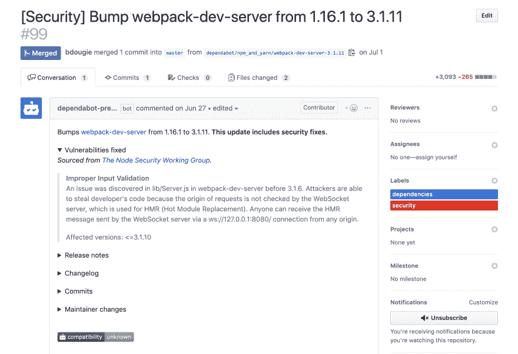
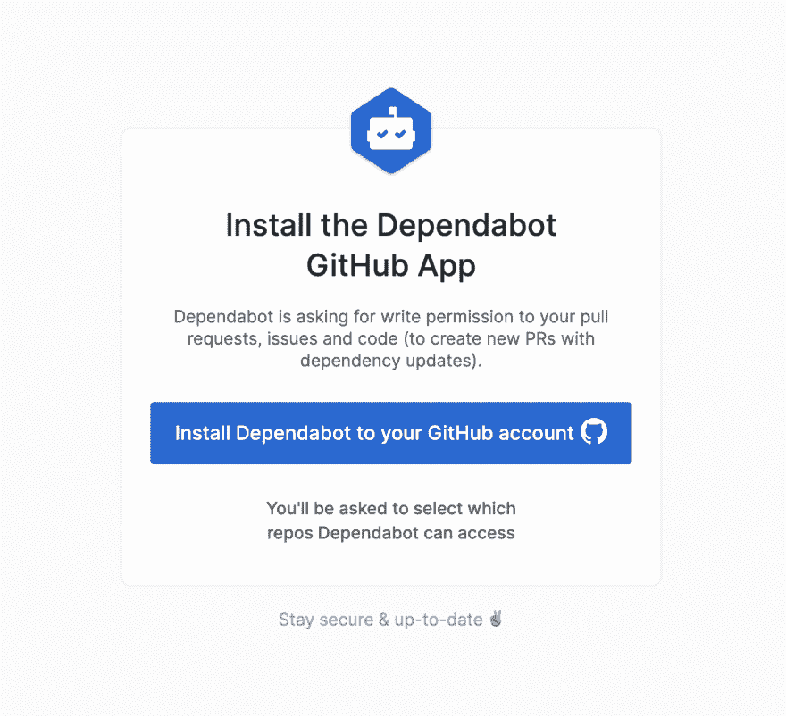

# 自动化我的依赖性管理工作流

> 原文：<https://dev.to/bdougieyo/automation-my-dependency-management-workflow-n73>

当创新和项目增长的愿望成为障碍时，维护版本管理可能是具有挑战性的。去年，GitHub 宣布他们从 [Rails 3.2 迁移到 5](https://github.blog/2018-09-28-upgrading-github-from-rails-3-2-to-5-2/) 。正如那篇文章中提到的，这不是一个小任务，需要专门的资源来管理。这次 Rails 升级花了一年半的时间，Rails 核心团队围绕让更新更平易近人做了很多改进。

我最近的迁移故事是从在我的一个存储库上启用[dependent bot 预览版](https://github.com/marketplace/dependabot-preview)开始的。尽管我尽了最大努力利用最新和最棒的开源工具，但通过来自我发现的功能的通知，我未能及时更新 Webpack 版本。当我开始我的项目时，Webpack 有一个从 1 到 2 的主要版本升级，类似于从 3.2 到 Rails 的迁移，升级的道路是具有挑战性的。我对此有第一手的了解，因为我在这个项目启动的同时迁移了我的工作存储库。

今天的 Webpack 正在蓬勃发展，目前已经升级到第 4 版，通过 CLI 实现了[自动迁移路径](https://webpack.js.org/migrate/4/)。多亏了 Dependabot 通过计算机化的拉式请求和我现有的持续集成发现了这一疏忽，我才得以开始。在每个 Dependabot Pull Request 发布说明和变更日志中，帮助维护人员进行 QA 审查过程。

对于那些不知道 Webpack 的人来说，它是一个用于现代 JavaScript 应用程序的静态模块捆绑器。bundler Webpack 捆绑包在开发或生产构建过程中使用。我提醒的漏洞指出了一个[问题](https://github.com/nodejs/security-wg/blob/master/vuln/npm/485.json#L4)，攻击者可以窃取开发人员的代码，因为 WebSocket 服务器不检查请求的来源。

多亏了这个警告和 Webpack migration-CLI 工具,我得以在一个周六晚上从 Webpack 版本 1 升级到 4。我很高兴在通知我有机会保持我的项目是最新的并且没有漏洞之后，收到这个警报和后续的警报。

我已经成功升级了这个项目中的其他几个依赖项，并计划继续利用 Dependabot 的最新版本。如果你有一个你或其他人关心的项目，考虑今天就在你的项目上启用 Dependabot，这样当你的项目需要维护时你就可以得到通知。

