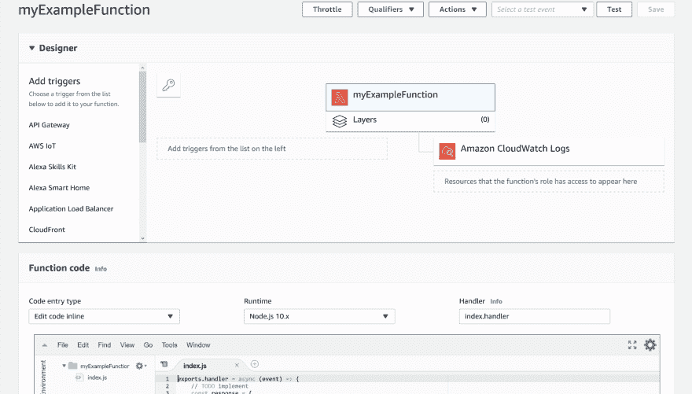
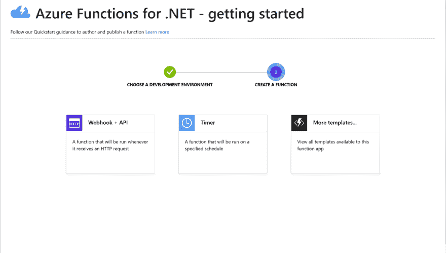
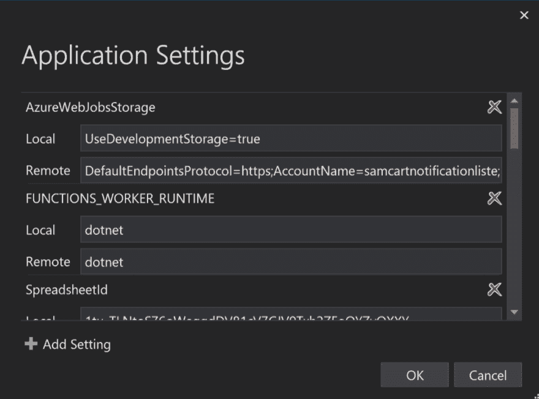

# Azure 函数与 AWS Lambdas:一个. NET 开发者的视角

> 原文：<https://dev.to/makingloops/azure-functions-vs-aws-lambdas-a-net-developer-s-perspective-4ilc>

你有没有尝试过这种“无服务器”的东西？

最近，我不得不自己动手，组装了几个小工具，一个带有 AWS Lambda T1，另一个带有 T2 Azure 函数 T3。

你有没有想过一个比另一个更好？

这些经历…相似，但也*非常*不同，因此我分享一个. NET 开发者对每一个的看法。

在我开始之前，请记住，在构建这两个实用程序时，我的想法是“让我们尽可能快地将它投入使用”，而不是“让我们使用每个平台推荐的工具和工作流，对实现它的最有效方式进行精确研究”。

如今，我倾向于先尝试让某个东西工作*，然后在之后将其重构为更优雅的*。**

 *考虑到这一点，这篇文章反映了我作为一个刚刚入门的第一次用户的观点，我有一种被淹没在。NET world *和*有相当多以前的 Azure 经验(我已经从头开始构建了一个完整的 Azure 云基础设施。)

相比之下，这是第一次接触 AWS，而不是把个人文件从 Dropbox 转移到 S3 的一个桶里(每月节省 10 美元的简单方法！)

### 构建一个 AWS Lambda

当我顽固地拒绝将任何 javascript 放到这个博客上时，我产生了使用 AWS Lambda 的想法。不是因为我不喜欢 javascript，只是因为博客开始时是纯静态的 html 和 css，而我这个极简主义者希望保持这种状态。

我需要一种优雅的方式，让我邮件列表中的人能够注册我网站上的其他小发明*，即使他们已经注册了其他东西*。

我的电子邮件提供商 Mailchimp 会要求你勾选他们想要的邮件，这是一次糟糕的经历。

我本可以通过一些 javascript 调用他们的 API，但是为了不破坏我神圣的静态站点纯粹主义，我决定让我的电子邮件注册表单简单地发布它自己并在服务器上处理工作。因为我最近解除了我的个人服务器 droplet，我想嘿，一个无服务器的功能将是完美的！

这是我第一次尝试无服务器，我发现这种体验非常自由。

一旦你创建了一个 AWS 开发者账户，并在看似数百个奇怪命名的 AWS 资源网格中导航，这些资源以亚马逊经典的丑陋字体显示在暗淡的灰色背景下，这就相当无缝地建立了一个基本的 Lambda。

Lambda 创建工作流指导您选择语言和平台，为您设置浏览器内的文本编辑器，并提供一个类似于中学编程语言的界面，您可以在其中将不同的组件链接在一起进行输入和输出。

它很难看，而且随着你增加额外的复杂性，它会变得更加混乱，但是它是有效的。

对于这个项目，我选择 NodeJS 作为框架，因为我最近很喜欢它的扩展包生态系统与 javascript 的松散类型相结合，这让我能够以闪电般的速度摸索出无罪恶感的实用程序。

现在，我敢打赌有比我使用的更好的部署体验，但是将 NodeJS 与浏览器内编辑器结合起来并不理想。

如果您以前没有使用过 NodeJS，当您想要像在。在. NET 世界中，你必须首先声明它的用途，然后 *npm* (包管理器)将你的项目中所有库的原始代码拉入到一个名为`node_modules`的文件夹中。

如果您已经为它设置了本地开发环境，这个过程基本上是自动的，但是它在 AWS Lambda 浏览器内编辑器中不起作用。在构建它的时候，唯一的解决方案是使用 VS 代码在本地构建这个工具的大部分，然后将它*和*文件夹上传回 AWS。

就像我说的，可能有更好的方法，但这是我尝试以相对较快的速度构建的经验。

一旦我让这个实用程序做了我需要的事情，本质上就是调用几个 Mailchimp API 端点，我只需要配置这个函数，这样它就可以通过 HTTP POST 执行了。

如果你好奇，你可以在这里看到代码。它并不完美，但它完成了任务！

这是对 AWS 的又一次打击。虽然我会说，这仍然是一次很好的经历，但当我们谈到蓝色的一面时，你就会明白我为什么这么说了。

为了设置端点，您必须提供另一种称为 API 网关的 AWS 资源。

API 网关允许您设置 URL 格式、身份验证方案和可用的 HTTP 方法，您可以将它们放在任何其他 AWS 资源前面，作为从公共互联网到云资源的第一道交互。

在软件开发和部署的大计划中仍然很容易，但同样，亚马逊肯定可以在用户体验设计上努力。

我确实在创建授权方案时遇到了一些困难，这样只有我的网站可以调用它。与 Azure 函数相比，设置一个可以使用的令牌是相当令人困惑的。最终我想通了，但值得注意的是，这并不是天衣无缝的。

一旦 API 网关启动并运行，我就万事俱备了。

在写这篇文章的时候，这个 Lambda 已经为这个站点服务了几个月，没有任何错误，对我来说是免费的。

尽管上传 javascript 文件和普通的亚马逊设计有些奇怪，但我发现这非常令人满意。

AWS 和 Azure 都提供这些服务，每月有 100 万次免费执行，所以如果你正在创建一个流量比这少的东西，能够以几乎没有成本的方式插入计算能力是非常惊人的。

#### 优点

**与其他 AWS 产品集成良好。**

如果你已经是一个 AWS 用户，你最好呆在这个范围内。Lambdas 的构建期望您将它们连接到您的其他 AWS 资源，从我的经验来看，AWS 和 Azure 都非常相似，因此没有令人信服的理由退出您现有的云。

如果你喜欢命令行工具，或者是 linux/java 开发人员，你可能会更喜欢 AWS Lamdas。

我相信亚马逊在他们的 UI 上吝啬，因为他们提供了健壮的命令行工具。在我的经历中，我只用过一点点，但是听别人说它很棒。我鼓励你自己去探索，并向我汇报。

#### 弊

**用户体验欠缺。**

我发现亚马逊几乎所有的产品都缺乏设计。也许只有我这样想，但我发现自己在想，如果一个人还不是一个敏锐的技术专家，他怎么能浏览他们的网站。但是，嘿，钱袋贝佐斯显然没有受到伤害。

设置 API 网关很麻烦。

这类似于上面的用户体验问题。设置授权方案有点令人困惑。

手动上传源文件并不愉快。

AWS 可能有更好的部署方法，但这是使用浏览器内编辑器的直接解决方案。

据我所知，可能有 Visual Studio 工具可以使它变得更容易，但同样，这并不明显，您将在下面看到作为. NET 开发人员在微软工作时这种体验是多么的不同。

### Azure 函数

我对 Azure Functions 的介绍是最近才开始的，大约是在写这篇文章的一周前，所以它让我记忆犹新。

我的一个朋友使用了一个购物车工具，它没有向用户提供公共 API，而是提供了一个推送通知事件选项。所以你不能让他们问“这个产品我卖了多少？”，但是您可以监听销售事件，将这些数据收集到您自己的数据库中，然后您就可以自己回答这个问题了。

处理来自外部服务的通知是一个无服务器实用程序的完美用例，所以这是我的地狱是的时刻。是时候尝试新玩具了！

我在这方面有两大优势，一是我已经使用了 Lambdas，二是我基本上从头开始构建了 Azure 云基础架构，所以这都是熟悉的领域。首先，我按照*入门*文档来熟悉基于*门户的部署*，它类似于 AWS 浏览器内的文本编辑器。

与 AWS 相比，我马上注意到的是，我在 AWS 遇到的两个主要问题在 Azure 中已经被默认解决了。只需从初始向导中选择 Webhook + API 函数模板选项，就会自动创建用于调用该函数的 API 端点，以及一个客户端身份验证令牌。

在前面的步骤中，您还可以从许多部署方法中进行选择，包括 Visual Studio、VS 代码、门户编辑器和命令行。

因为这个实用程序的功能相当复杂(解析传入的通知并调用 Google Spreadsheets API 来填充表格)，所以我决定尝试 Visual Studio 部署选项，而不是浏览器编辑器。

为此，我将 Visual Studio 2017 升级到 2019(耶更多新玩具！)并将附带的模板用于 Azure 函数。

这是兴奋剂。

它为您设置了一个本地开发环境来进行测试，并访问常见的一键发布功能，让您可以将所有东西都推到 Azure 中。一件让我觉得非常漂亮的事情是本地到远程应用程序设置 UI。

您的应用程序设置在本地加密，部署时，您可以看到本地与远程设置值的并排比较，您可以在 Visual Studio 中编辑。

这是意料之中的事，但这正是它对已经是. NET 和 Visual Studio 用户有所帮助的地方。建造这个的经验(在。NET Core)，测试它，部署它是无缝的。从查找最新的文档和指南，到拥有处理购物车事件的实时功能。

该功能本身非常类似于 ASP.NET 核心控制器的动作，这也很好。

#### 优点

作为一名. NET 开发者，Azure 与 Visual Studio 的集成使得整个体验更加令人愉快。

您可以选择从 Azure 门户、Visual Studio、VS 代码或命令行进行构建和部署，每个选项都有清晰的文档和简单的发布步骤。

**HTTP 触发端点和认证默认配置，傻乎乎地容易。**

默认情况下会配置您想要设置功能的最常见方式。您不需要了解或设置额外的资源。

**强文档**

微软已经投入了大量的精力来创建清晰和最新的文档，这方面的努力是显而易见的。

#### 弊

我说到这里，但如果我要说什么的话，那就是有时不清楚东西的价格。

例如，我知道该函数的一百万次执行将是免费的，但是为了让该函数运行，您还需要一个存储帐户。在部署屏幕中显示美元价值可能会更好。

Visual Studio 和 Azure Portal 在自动填充你需要的一切方面都做得很好，所以如果它还能清楚地显示每月的总成本估计是多少，那就太酷了。我注意到我目前的 Azure 存储帐户和日志资源每月将向我收取大约 0.12 美元的费用。

### 最后的想法

从我目前的工作来看，我们仍然是通过虚拟机上的安装程序 ui 手动部署，这种无服务器功能的整个体验是一种难以置信的快乐。AWS 和 Azure 都有。

它把我带回了童年的经典经历，当时我写了一些 HTML 和 CSS，看到它在浏览器中神奇地立即创建了一些东西，这增强了我的自尊。除了在 web 上的实时 HTTP 端点上进行实际计算之外，这种体验再次出现。

事实上，我们可以以很少甚至没有成本的方式构建这些微型应用程序，这也是一个真正的游戏规则改变者，尤其是作为一名企业家。它打开了一个全新的画布来创作。

我鼓励你尝试 AWS Lamdbas 和 Azure 函数，因为我发现它们非常相似，你自己的个人偏好会比我的意见更重要。也就是说，我相信通过使用带有 Azure 功能的 Visual Studio，你会发现一个更加无缝和流畅的体验。在 Azure 中，我不得不做的所有与 AWS 相关的事情都被默认处理了。

正如你所料，如果你是 iPhone 用户，这很像使用 Mac。呆在你的生态系统中，你会受益匪浅。*