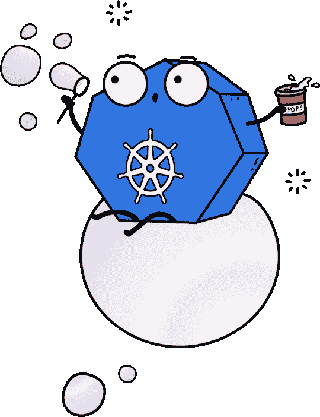

# Azure Kubernetes 服务-初学者指南。

> 原文：<https://dev.to/azure/azure-kubernetes-service-a-beginner-s-guide-mkc>

在这个新视频中，我将为您提供一系列关于如何通过一个非常简单的应用程序使用 [Azure Kubernetes 服务](https://azure.microsoft.com/en-us/services/kubernetes-service/?WT.mc_id=devto-blog-jagord)的新信息。你需要有一个 Azure 账户才能跟进，所以注册你的[免费 Azure 200 美元的信用和 12 个月的服务。](https://azure.microsoft.com/en-us/free/?WT.mc_id=devto-blog-jagord)

我希望你们一定要注意的一些核心概念是:

*   [针对 Azure 云外壳的 Bash 快速入门](https://docs.microsoft.com/en-us/azure/cloud-shell/quickstart?WT.mc_id=devto-blog-jagord)
*   [蓝方库柏服务(AK)](https://docs.microsoft.com/en-us/azure/aks/concepts-clusters-workloads?WT.mc_id=devto-blog-jagord)的库柏核心概念
*   【Azure Kubernetes 服务的服务原则
*   [Azure 容器注册文档](https://docs.microsoft.com/en-us/azure/container-registry/?WT.mc_id=devto-blog-jagord)

# 我会在这个视频里学会做什么？

在这个视频中，我创造了一种方式让你了解如何开始使用 Azure Kubernetes 服务，而不需要大量的经验。我不会为 Kubernetes 创建底层基础设施。在这次体验中，我选择向您展示一个典型的使用案例，它适用于那些希望部署应用程序而不管理所有基础架构的人。

Kubernetes 有助于管理服务发现、整合负载平衡、跟踪资源分配、基于计算利用率进行扩展、检查单个资源的健康状况，并使应用程序能够通过自动重启或复制容器进行自我修复。

如果你想更深入地了解如何自己创建 Kubernetes 集群，AKS SRE 团队的[史云光·格日温斯基](https://twitter.com/xandergrzy)整理了[Kubernetes the Hard Way(On Azure)](https://medium.com/@XanderGrzy/kubernetes-the-hard-way-on-azure-b6b821958f72)

在这个演示视频中，我们的应用程序利用与 Azure Kubernetes 服务相关的工具来简化部署。跟着做一个基本的**“Hello World！”**帮助您开始 Kubernetes 使用之旅的应用程序。你可以在 Github 这里下载[。](https://github.com/jaydestro/demo-app)

[https://www.youtube.com/embed/pY-Qlz548WM](https://www.youtube.com/embed/pY-Qlz548WM)

# 我可能想从视频中复制粘贴的命令！

**创建资源组-只需替换该组，如果您愿意，可以选择不同的位置！**T3`az group create --name YOURGROUPNAME --location eastus`

**创建基于角色的访问控制凭证**
`az ad sp create-for-rbac --skip-assignment`

**使用 RBAC 凭据创建您的 AKS 集群，替换为您的资源组名称和您的 AKS 集群名称**
`az aks create --resource-group YOURRESOURCEGROUP --name YOURCLUSTERNAME \
--enable-addons monitoring,http_application_routing \
--kubernetes-version 1.14.3 --generate-ssh-keys \
--service-principal application-id-from-rbac --client-secret client-secret-from-rbac`

**获取集群凭证`kubectl`**
`az aks get-credentials --resource-group YOURRESOURCEGROUP --n YOURCLUSTERNAME`

**创建 ACR**T3`az acr create --resource-group YOURRESOURCEGROUP --name YOUR_ACR_NAME --sku Standard`

**克隆回购**
`git clone git@github.com:jaydestro/demo-app.git
cd demo-app`

**从存储库**
`az acr build --registry YOUR_ACR_NAME --image demo-app:latest .`构建容器

**应用部署**
`kubectl apply -f ./deployment.yaml`

**应用负载平衡器服务**
`kubectl apply -f ./loadbalancer.yaml`

**获取负载平衡器服务**
`kubectl get service -l demo-app -w`

# 下一步

完成后，您可以轻松删除资源组:

`az group delete --resource-group YOURGROUPNAME`

或者保留您的集群并开始学习如何实现 CI/CD 管道。你可以使用像 [Azure DevOps](https://azure.microsoft.com/en-us/services/devops//?WT.mc_id=devto-blog-jagord) 这样的工具，它可以在任何语言或任何平台上工作！

感谢您关注本视频，欢迎给我留言或联系 Twitter @ jaydestro。我非常喜欢和你们一起学习，并将继续制作这样的新视频来帮助你们学习！