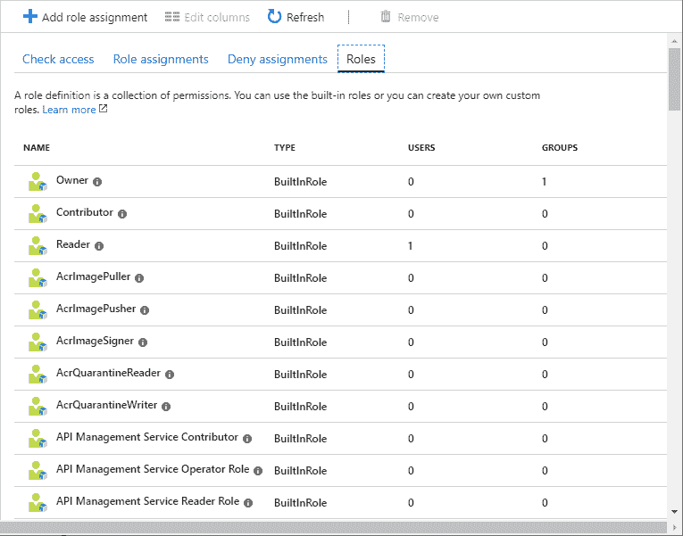

# Azure 角色

> 原文：<https://dev.to/cheahengsoon/azure-roles-2657>

Azure 角色

1.  使用 web 浏览器，打开 Azure 门户。选择所有服务。
2.  选择任何资源，然后再次选择它。
3.  选择访问控制(IAM)。
4.  选择角色。
5.  查看内置角色列表。请注意，您也可以创建自定义角色。

以下是 Azure 中适用于资源类型的四个 RBAC 角色:

*   所有者。拥有对所有资源的完全访问权限，包括将访问权限委托给他人的权利。
*   贡献者。可以创建和管理所有类型的 Azure 资源，但不能授予其他人访问权限。
*   读者。可以查看现有的 Azure 资源。
*   用户访问管理员。可以删除对资源的访问。

Azure 中其余的 RBAC 角色允许管理特定的 Azure 资源。例如，虚拟机参与者角色允许用户创建和管理虚拟机。它不授予对虚拟机连接的虚拟网络或子网的访问权限。

作为部署 Azure RBAC 的最佳实践，考虑为新加入的团队创建新的资源组，而不是新的订阅。

资源组允许您实现 RBAC，以便用户可以贡献服务，但不能拥有服务。

要使用 RBAC 和 Azure PowerShell 管理访问，请查看位于[https://docs . Microsoft . com/en-us/Azure/role-based-access-control/role-assignments-PowerShell](https://docs.microsoft.com/en-us/azure/role-based-access-control/role-assignments-powershell)的文档页面。它举例说明了如何:

*   列出角色
*   列表访问
*   授予访问权限
*   删除访问权限