# Azure 服务总线概述

> 原文：<https://dev.to/suryavenkat_v/azure-service-bus-overview-bm>

## 什么是 Azure 服务总线？

Azure Service Bus 是一种基于云的消息服务，用于将云中运行的任何应用程序、设备和服务连接到任何其他应用程序或服务。因此，它充当了云中或跨任何设备的应用程序的消息传递主干。

## 服务总线概念

在本次网络研讨会期间，Azure Service Bus 中有三个基本概念:

*   中继->在应用程序之间建立安全连接，通过云进行桥接
*   消息传递->用于从队列中推/拉消息
*   事件中心->高性能基于流的事件系统

中继和事件中心被移出作为单独的服务，服务总线将仅指由队列/主题组成的消息传递

## 多租户服务总线环境

在这个环境中，我们可以创建一个名称空间，作为云中服务总线工件的容器。命名空间可以在不同的地区使用。

每个名称空间包含消息实体，如队列、中继或主题。最重要的是，一个名称空间将只专用于一种类型的服务总线。

### 消息处理统计(截至 2015 年)

从事服务总线工作的微软团队生成的统计数据如下:

*   活动中心=每天 300 亿次活动
*   消息=每天 70 亿条消息

它可以以非常可执行的方式处理大量的消息。

## 服务总线继电器

在服务总线中继中，我们将拥有一个托管在云中的端点，但不同之处在于，我们的本地服务将建立一个出站连接，以向服务总线中继端点注册。

在概念层面上，我们将消息发送到云中的一个端点，消息将从这里转发到一个本地服务。因此，它为我们提供了从一个组织连接到另一个组织的优势，而无需设置 VPN。

一些关键特征是，

服务总线中继可用于解决以下情况中的问题:

1.  两个数据中心之间传递的信息。
2.  通过 SAP 构建集成架构，使用服务总线中继将消息转发到微服务架构。

示例场景:

*   许多微软 API 应用程序都是通过内部中继连接到本地系统的
*   丹麦养老金和保险供应商通过 relay 向合作伙伴公开 IBM WebSphere 集成平台
*   诺森比亚大学使用中继来桥接云托管应用程序，以集成内部 WCF 服务

### 演示继电器

该演示解释了使用服务总线中继的混合连接的过程。我们最初将致力于 WCF 服务(现场服务)。使用控制台应用程序在. NET 框架上构建的演示是为了调用后端服务。

在[服务总线浏览器](https://www.serverless360.com/compare-service-bus-explorer)中，我们将在“relay”部分下拥有一个注册的端点。现在，一个虚拟目录(路由器)将链接到用户定义位置下的配置文件“web ”,以建立连接。该文件夹还将包括另外两个文件，

*   Bin 目录
*   WcfRoutingService(SVC 文件)

在 SVC 文件中，会有指向 WCF 路由服务端点的服务。在配置文件中，有一个 WCF 服务，它使用 HTTP 中继绑定和其他凭证来访问服务总线中继。

最后，服务总线中继接受消息，并将其转发给后端服务。当在控制台应用程序上执行时，每条消息都将在 100 毫秒的时间内得到处理。

## 信息发送

在 Azure Service Bus 中，我们可以以 XML、JSON 或 text 等消息格式在服务或应用程序之间传输数据。

在这种消息协议中，微软将处理大部分扩展。我们只需使用 Azure Portal、Service Bus Explorer 或 [Serverless360](https://www.serverless360.com/) 等平台创建一个名称空间。

让我们考虑一些示例场景，

*   建筑公司使用传感器实时监控建筑物，以确保遵守更多安全标准。
*   使用服务总线，“观致”(中国汽车制造商)将汽车连接到互联网以传输消息。
*   Metro Bank 使用服务总线消息来管理 SharePoint 和 Dynamics CRM 之间近乎实时的消息传递。

### 长队

基于先进先出模式的消息传递协议。在这种情况下，发送方将消息发送到一个队列，接收方将在初始或后期阶段从该队列中收集消息。除此之外，队列使我们能够存储消息，直到接收者可以接收和处理它们。用户将根据请求接收消息。

### 主题

主题类似于队列。最重要的是，主题使多个订阅可用。发送者将向主题发送消息，然后路由规则可以确定哪个订阅可以接收消息的分时段副本。

接收者可以从订阅接收消息。多个接收机可以被分配给一个预订。

其他消息传递模式包括，

*   位置遥控(remote position control)
*   分散聚集
*   发布/订阅

### 演示信息

在这个演示中，我们将向一个队列发送一条消息，并将其收集回来。最初，将指定一个队列(testqueue ),并且如下所述，还将在服务总线资源管理器中确定以下属性。

*   小路
*   队列属性
*   锁定持续时间

为了将消息发送到队列并将其收集回来，我们定义了服务总线连接字符串以及对服务总线 NuGet 包的引用。

我们现在将创建一个服务总线消息并发送它。在接收端，我们有一个竞争消费者模式，它允许多个并发消费者处理在消息传递通道上接收的消息。动态消息传递方法采用单线程模式，即先进先出。但是在多线程模式中，对于多个接收者，消息将以更高的吞吐量进行处理。

在接收端，使用“OnMessagingOption ”,我们可以指定所需的并发接收者的数量，

然后，我们将通过事件(OnMessage)访问消息体，并将其写入控制台窗口。

[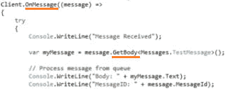](https://res.cloudinary.com/practicaldev/image/fetch/s--il6LPE8F--/c_limit%2Cf_auto%2Cfl_progressive%2Cq_auto%2Cw_880/http://www.serverless360.com/wp-content/uploads/2018/08/Demo-Messaging-Code-02.png)

消息可以从队列中删除，也可以被放弃。服务总线在 SDK 的帮助下处理序列化。

让我们考虑一下，当我们发送一条消息时，它会以循环格式被处理。因此，我们将采取。NET 类型指定为“TestMessage ”,并将它移动到“BrokeredMessage”以处理。NET 类型传递到队列时。

将提取邮件的内容。然后，应该验证发送、接收的消息的格式。

现在，如果我们在两个独立的控制台应用程序上运行我们的演示，一个用于发送，另一个用于接收。相应的消息将从队列中发送和接收。

[T6】](https://res.cloudinary.com/practicaldev/image/fetch/s--M2pRzHM6--/c_limit%2Cf_auto%2Cfl_progressive%2Cq_auto%2Cw_880/http://www.serverless360.com/wp-content/uploads/2018/08/messaging-output-02.png)

## 活动中心:

事件中心将管理大规模事件流处理，类似于服务总线消息传递。这与它支持通过 AMQP(高级消息队列协议)发送消息的情况类似。

事件中心和服务总线消息传递之间的关键区别在于，没有像服务总线中那样删除 peek lock 消息的概念。相反，微软已经使用了一个跨流阅读器，提供了一个高水平的缩放。

让我们考虑一个使用事件中心的 IOT 场景，

上图包含许多子系统，每个子系统都有单独的产品。Event Hub 可以传输来自不同应用程序的大量数据，并存储这些数据。

最重要的是，用户可以处理流式数据，并将其应用于个人目的。

让我们考虑一些示例场景:

*   微软将 Event Hub 作为应用洞察和 API 管理的一部分。
*   一家名为“Autolib”的公司使用 Event Hub 作为微软 IOT 堆栈的一部分，在设备和车辆之间交换信息，作为巴黎汽车共享计划的一部分。

在 Event Hub 中，多个发送者将其遥测数据存储在消息流中。接收方无法从流中移除消息。相反，它们只有在保留期结束时才会被删除。消费者组可以访问来自任何流的消息。

[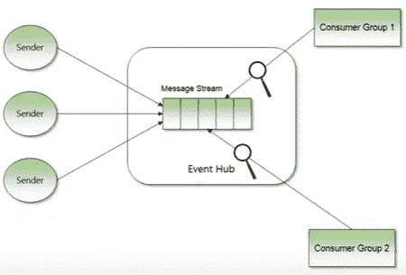](https://res.cloudinary.com/practicaldev/image/fetch/s--UtYuGeK3--/c_limit%2Cf_auto%2Cfl_progressive%2Cq_auto%2Cw_880/http://www.serverless360.com/wp-content/uploads/2018/08/Event-Hub-example.png)

### 应用遥测技术

[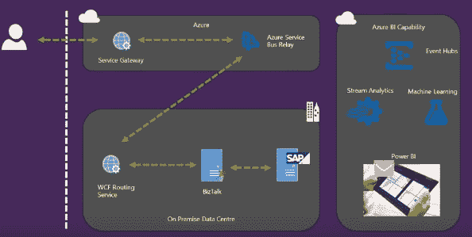](https://res.cloudinary.com/practicaldev/image/fetch/s---jg566Ot--/c_limit%2Cf_auto%2Cfl_progressive%2Cq_auto%2Cw_880/http://www.serverless360.com/wp-content/uploads/2018/08/Application-Telemetry.png)

上图代表了一个系统的典型消息流。这个想法是通过事件中心向 Power BI 提供遥测数据。来自用户的消息将通过各种系统，也将到达事件中心。

在这里，流分析和机器学习过程从事件中心收集数据，并将其发送到 Power BI，用于任何商业分析服务。

### 演示活动中心

这个演示说明了 Event Hub 的用途，类似于 Azure Service Bus 消息传递。

在发送方，

在控制台应用程序中，我们有一个连接字符串，后跟一个事件中心名称(键名)。在代码部分，我们有

*   EventHubClient ->通过连接字符串创建客户端的实例
*   客户。发送->发送对象

[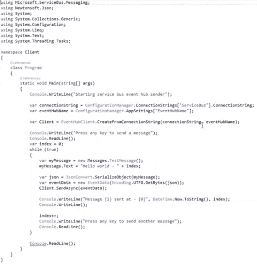](https://res.cloudinary.com/practicaldev/image/fetch/s--8EWl_oZs--/c_limit%2Cf_auto%2Cfl_progressive%2Cq_auto%2Cw_880/http://www.serverless360.com/wp-content/uploads/2018/08/Demo-Code.png)

在接收器端，

在控制台应用程序中，我们有一个“EventHubName”和一个存储帐户，后跟一个 [ServiceBus。EventProcessorHost](https://www.nuget.org/packages/Microsoft.Azure.ServiceBus.EventProcessorHost/) ，用于为事件中心实例中的不同分区创建一个监听器。在 Azure 存储帐户中，该包为每个分区创建一个 blob，以管理其在流中的位置的索引。

当收到一条消息时，它将被触发到下面这段代码中列出的事件，

[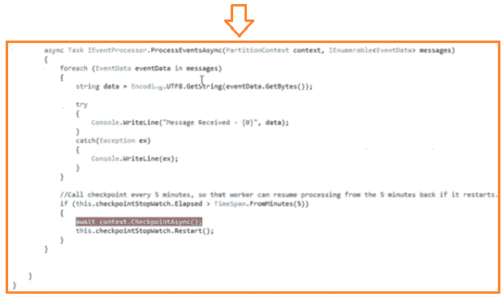](https://res.cloudinary.com/practicaldev/image/fetch/s--jEHgF0aJ--/c_limit%2Cf_auto%2Cfl_progressive%2Cq_auto%2Cw_880/http://www.serverless360.com/wp-content/uploads/2018/08/Demo-code-02.png)

我们在流中的位置也可以被确认，因此如果整个过程失败了，我们可以简单地移动到我们读取的最后一个索引，并继续我们的进程。现在，我们可以看到操作是如何执行的。因此，事件中心可以接收和存储任何类型的数据和事件。

## 事实

服务总线团队为每天处理十亿个事件提供了成本估算分析，这导致，

*   12 个吞吐量单位
*   每秒 12，000 个事件
*   每分钟 72 万个事件
*   每小时 4320 万个事件
*   总成本-> 37.67 美元

## 服务总线成本

### 继电器:

*   10，000 听小时=6.60 磅
*   1 亿条消息=6.20 磅

### **消息:**

*   每月 500 万次操作=6.20 磅
*   1300 万到 1 亿次操作=每百万 50 磅
*   1 亿至 25 亿=百万分之 31

### 活动中心:

*   1 亿个事件= 1.72 磅
*   加工率=产量单位=每月每单位 14 磅

## **服务总线+ BizTalk**

尽管 Service Bus 和 BizTalk 在许多方面提供了无缝体验的连接，但它们在以下方面可以更加一致；

SB 适配器(最新版本不可用)

*   服务总线继电器
*   服务总线消息传递
*   活动中心-它不提供开箱即用的支持

新增功能列表包括:

*   AMQP 适配器-支持非微软服务总线类型的产品
*   事件中心适配器

## **BizTalk+Relay 的用户场景**

### 场景 1:

[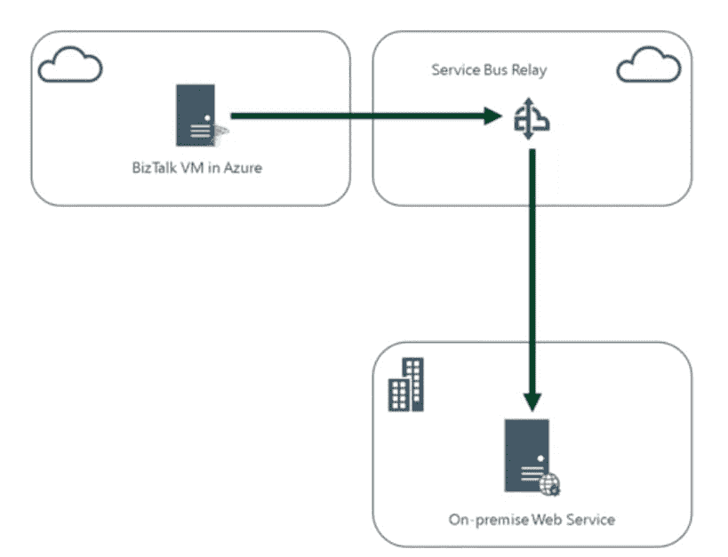](https://res.cloudinary.com/practicaldev/image/fetch/s--QGFbFrhO--/c_limit%2Cf_auto%2Cfl_progressive%2Cq_auto%2Cw_880/http://www.serverless360.com/wp-content/uploads/2018/08/Scenario-1.png)

让我们将 Azure 中托管的 BizTalk server 视为连接到本地 web 服务的虚拟机。最简单的方法是通过 BizTalk 中的 SB 适配器。

在这里，BizTalk Server 将向中继发送一条消息，其余的过程将在 WCF 服务中执行。

### 场景 2:

[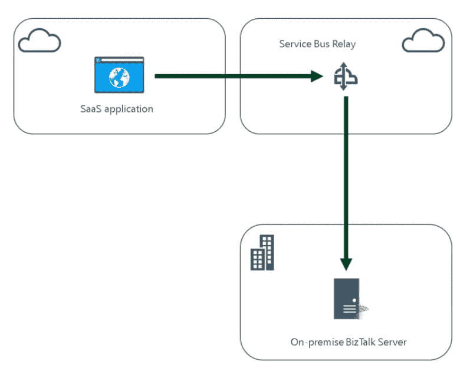](https://res.cloudinary.com/practicaldev/image/fetch/s--L61DhBnk--/c_limit%2Cf_auto%2Cfl_progressive%2Cq_auto%2Cw_880/http://www.serverless360.com/wp-content/uploads/2018/08/Scenario-2.png)

如果我们在内部部署了 BizTalk server，然后在云中部署了 SaaS 应用程序，则可以通过服务总线中继在它们之间建立通信。

这可以通过服务总线中继或者在 SaaS 组件和服务器之间分配一个 REST API 来实现。因此，中继提供了一种从组织公开 BizTalk 端点的简单方法。

### 场景 3:

[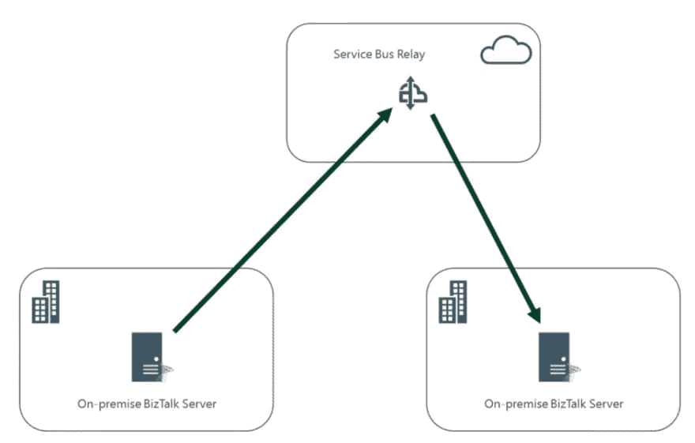](https://res.cloudinary.com/practicaldev/image/fetch/s--lNXozrmk--/c_limit%2Cf_auto%2Cfl_progressive%2Cq_auto%2Cw_880/http://www.serverless360.com/wp-content/uploads/2018/08/Scenario-3.png)

让我们考虑这样一个场景，位于不同公司的两个 BizTalk 服务器需要进行通信。最好的方法是通过公开它们的端点，通过中继发送消息。这个流程不需要任何单独的基础设施支持。

## BizTalk+消息传递的用户场景

### 场景 1:

[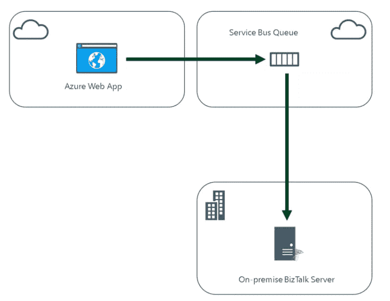](https://res.cloudinary.com/practicaldev/image/fetch/s--5j0eVRdq--/c_limit%2Cf_auto%2Cfl_progressive%2Cq_auto%2Cw_880/http://www.serverless360.com/wp-content/uploads/2018/08/Scenario-4.png)

这个场景更侧重于将大量消息从云中的 web 应用程序传输到本地服务器。在这里，BizTalk Server 以可管理的级别从队列中提取消息。

### 场景 2:

[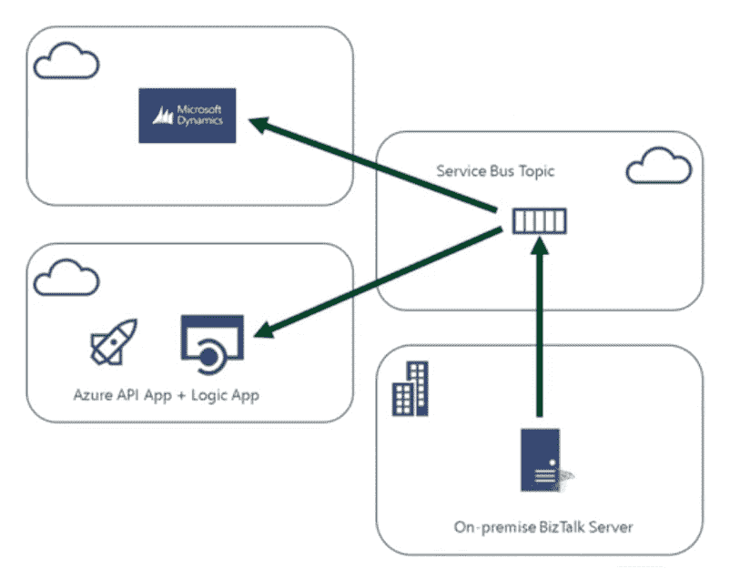](https://res.cloudinary.com/practicaldev/image/fetch/s--T_WUXPPe--/c_limit%2Cf_auto%2Cfl_progressive%2Cq_auto%2Cw_880/http://www.serverless360.com/wp-content/uploads/2018/08/Scenario-5.png)

为了将事件以发布/订阅格式发布给不同的接收者，我们将把消息从本地服务器推送到应用程序可以访问的队列中。您不能将应用程序直接链接到本地的 BizTalk Server。

服务总线和 BizTalk 之间的主要区别在于，

*   BizTalk 不支持轮询模式
*   服务总线不支持推送模式

因此，结合这两种服务将会带来动态的生产力。接收者可以随时访问服务总线主题上可用的消息。

### 场景 3:

[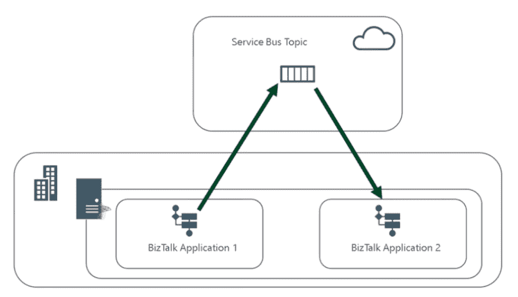](https://res.cloudinary.com/practicaldev/image/fetch/s--k5p7frj0--/c_limit%2Cf_auto%2Cfl_progressive%2Cq_auto%2Cw_880/http://www.serverless360.com/wp-content/uploads/2018/08/Scenario-6.png)

让我们考虑一个场景，其中服务总线主题将在两个 BizTalk 应用程序之间共享资源。但是，如果我们想删除应用程序中的共享资源并修补一个新的资源，BizTalk 中的依赖关系管理会使它变得更加困难。

当必须更新 BizTalk 应用程序时，我们不能取消部署它，因为订阅将被取消。因此，这导致在试图解决它时过于复杂。

### **演示**

该演示解释了 BizTalk 和服务总线的结合，通过这两者，可以在 BizTalk 应用程序之间发送和接收消息。最重要的是，您可以以 JSON 格式执行流程。

假设有三个 BizTalk 应用程序(app1、app2、app3)，每个应用程序都包含“Hello World”模式，后跟一个唯一的名称空间。我们将在每个应用程序中有一个发送器来接收来自文件系统的消息，该消息将通过发送端口被路由到 Service Bus。此外，您可以在使用 JSON encoder 发送消息之前将其转换为 JSON 格式。

最重要的是，当我们在 Service Bus 中收到消息时，它会触及包含两个订阅的主题。每个订阅都会将内容转发到所需的队列。主题可以指定谁可以发送和接收其中的消息，但是如果有多个接收者，就有可能一个接收者获取另一个接收者的消息。因此，这个问题可以通过使用主题中的“转发到”选项来解决，并且还可以指定哪个接收者应该接收适当的消息。

最重要的是，议程是在消息被转发到选定的队列之前，从任何应用程序向主题发送消息。

初始化过程结束后，虚拟机将收到一条消息。使用 JSON decode，我们将改变虚拟机接收管道中的消息格式。最后，相应的 Biztalk 应用程序接收消息。

## **BizTalk+事件中心的用户场景**

### 场景 1:

[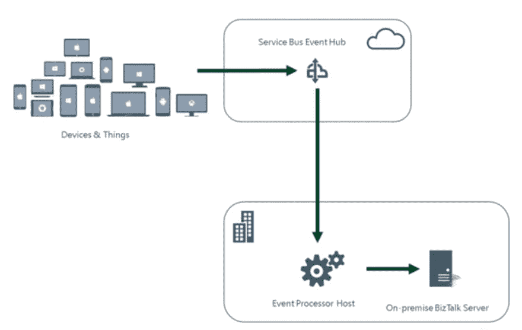](https://res.cloudinary.com/practicaldev/image/fetch/s--2AU2G54K--/c_limit%2Cf_auto%2Cfl_progressive%2Cq_auto%2Cw_880/http://www.serverless360.com/wp-content/uploads/2018/08/Scenario-7.png)

在这里，事件中心将来自事件处理器主机的消息处理后转发给 BizTalk server。如果该方案不涉及大量要转发到 BizTalk server 的消息，则事件处理器主机将充当独立的 BizTalk 主机，不需要任何适配器来实现更平稳的转换。

### 场景 2:

[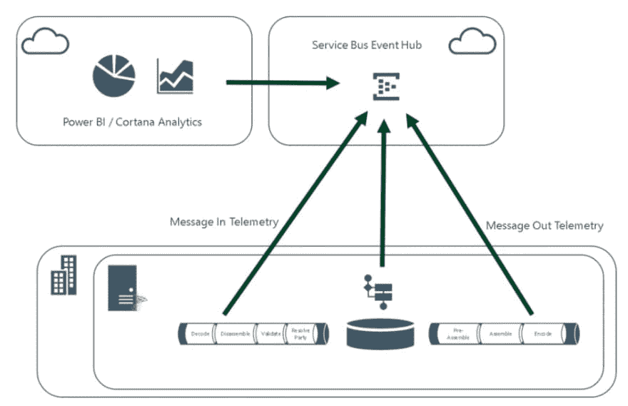](https://res.cloudinary.com/practicaldev/image/fetch/s--ZFpO0p7A--/c_limit%2Cf_auto%2Cfl_progressive%2Cq_auto%2Cw_880/http://www.serverless360.com/wp-content/uploads/2018/08/Scenario-8.png)

在这种情况下，当消息流经 BizTalk server 的管道时，您将与服务总线事件中心共享遥测数据和日志记录信息。最重要的是，Power BI 和 Cortana Analytics 等强大的分析机器利用了来自服务总线的遥测数据。

## 包裹

这篇博客概述了演示场景中可用的各种服务总线组件，以便读者更好地理解。Azure Service Bus 中有很多可用的特性，并且很快会有更多的特性。