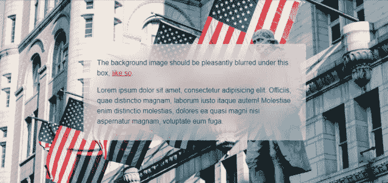
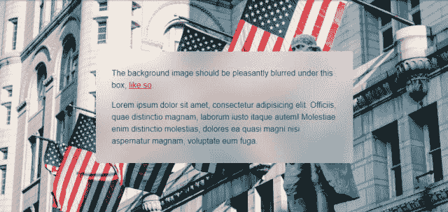

# 背景模糊滤镜-background-filter:blur()已经在运行，但是

> 原文：<https://dev.to/sergio_follean/background-blur-filter-backdrop-filter-blur-is-already-in-operation-but-657>

许多浏览器已经支持背景滤镜的背景效果，它们可以用来创建像苹果一样的模糊效果(见 iOS，MacOS)。

它是如何工作的？

对于要模糊的块，您需要添加一种样式:

background-filter:blur(模糊程度)；

最简单的例子:

 
但是它看起来像苹果吗？在截图中，我们有 10 个像素模糊。再增加一点模糊- 20 个像素，我们得到了什么:

 
我们会得到一些奇怪的东西，在区块的边缘模糊地消失了。

为什么会这样？—一个不精通浏览器的人很难讲。

这个有解决办法吗？—是的，它相当奇怪和简单，但它很有效。

通过在互联网上长时间搜索解决方案，今年不可能偶然发现关于这个过滤器的东西。在对创建一个大小大于一个块的 After 元素、模糊它并给出它的父溢出:隐藏进行了十几次决策之后，注意到了以下情况:

给物体添加阴影，它扩大了模糊区域，于是产生了制作透明阴影的想法，这被证明是一个正确的决定，结果也在意料之中:

 
祝你成功使用。看看解决方案的源代码，在这里玩玩:【https://codepen.io/sergey-popovich/pen/dybepBv