# CSS 网格基础-7

> 原文：<https://dev.to/nabendu82/basics-of-css-grid-7-2j46>

欢迎来到本系列的第 7 部分。

我们将在本教程中学习 **CSS 网格对齐和居中**的重要概念。

我们将在教程中使用这个[代码笔](https://codepen.io/nabendu82/full/GXdowP/)。我们将在本教程中了解以下四个属性。你也应该把[这个](https://css-tricks.com/snippets/css/complete-guide-grid/)来自 CSS 窍门的很棒的快速参考书签来快速检查这些。

```
justify-items:
align-items:

justify-content:
align-content:

justify-self:
align-self: 
```

> CSS 网格没有像 **flexbox** 一样的 **flex-direction** 属性。所以， **justify-*是行轴**，而 **align-*是列轴**

我们的基本 CSS 如下，其中我们有一个包含 40 个项目的网格，10 列，每列 1fr。

```
<body>
  <div class="container">
    <div class="itm itm1">1</div>
    <div class="itm itm2">2</div>
    <div class="itm itm3">3</div>
    <div class="itm itm4">4</div>
    <div class="itm itm5">5</div>
    <div class="itm itm6">6</div>
    <div class="itm itm7">7</div>
    <div class="itm itm8">8</div>
    <div class="itm itm9">9</div>
    <div class="itm itm10">10</div>
    <div class="itm itm11">11</div>
    <div class="itm itm12">12</div>
    <div class="itm itm13">13</div>
    <div class="itm itm14">14</div>
    <div class="itm itm15">15</div>
    <div class="itm itm16">16</div>
    <div class="itm itm17">17</div>
    <div class="itm itm18">18</div>
    <div class="itm itm19">19</div>
    <div class="itm itm20">20</div>
    <div class="itm itm21">21</div>
    <div class="itm itm22">22</div>
    <div class="itm itm23">23</div>
    <div class="itm itm24">24</div>
    <div class="itm itm25">25</div>
    <div class="itm itm26">26</div>
    <div class="itm itm27">27</div>
    <div class="itm itm28">28</div>
    <div class="itm itm29">29</div>
    <div class="itm itm30">30</div>
    <div class="itm itm31">31</div>
    <div class="itm itm32">32</div>
    <div class="itm itm33">33</div>
    <div class="itm itm34">34</div>
    <div class="itm itm35">35</div>
    <div class="itm itm36">36</div>
    <div class="itm itm37">37</div>
    <div class="itm itm38">38</div>
    <div class="itm itm39">39</div>
    <div class="itm itm40">40</div>
  </div>

<style>
    /*
      justify-items:
      align-items:

justify-content:
      align-content:

align-self:
      justify-self:

justify-* is row axis
      align-* is column axis
    */

.container {
      display: grid;
      grid-gap: 20px;
      grid-template-columns: repeat(10, 1fr);
    }
  </style>
</body> 
```

[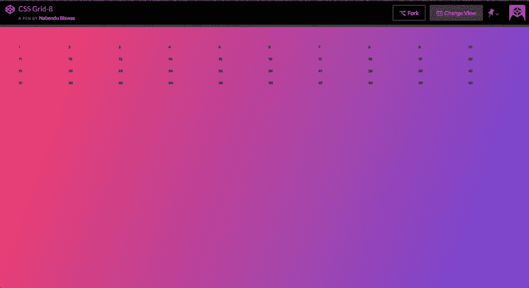](https://res.cloudinary.com/practicaldev/image/fetch/s--UVUznzRh--/c_limit%2Cf_auto%2Cfl_progressive%2Cq_auto%2Cw_880/https://cdn-images-1.medium.com/max/5760/1%2APa_W-7wRAdkYLUF7Vhobgg.png)T3】结果

## **自圆其说-物品**

首先，我们将研究 **justify-items** ，它沿着行轴对齐项目。它可以有 4 个值中的任何一个。

```
justify-items: start | end | center | stretch; 
```

先看**开始**吧。我们会给所有项目一个白色的背景，并通过 Firefox 开发者版显示我们的网格。

```
.container {
      display: grid;
      grid-gap: 20px;
      grid-template-columns: repeat(10, 1fr);
      justify-items: start;
    }

    .itm{
      background: white;
    } 
```

您可以看到，它将项目与单元格的起始边缘对齐。

[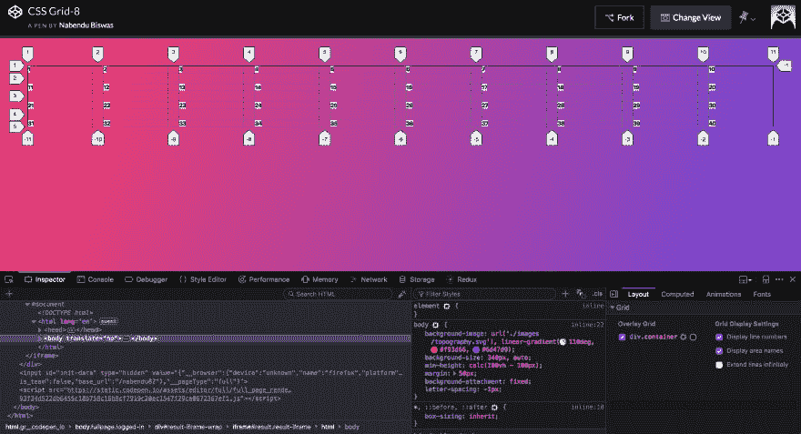 ](https://res.cloudinary.com/practicaldev/image/fetch/s--aVccee0g--/c_limit%2Cf_auto%2Cfl_progressive%2Cq_auto%2Cw_880/https://cdn-images-1.medium.com/max/5760/1%2Aun5rMBkYBgoZ6wVUuLcZEw.png) ** *自圆其说-物品:开始；***

现在，**结束**是开始的反义词。

```
.container {
      display: grid;
      grid-gap: 20px;
      grid-template-columns: repeat(10, 1fr);
      justify-items: end;
    }

    .itm{
      background: white;
    } 
```

它将项目与单元格的末端边缘对齐。

[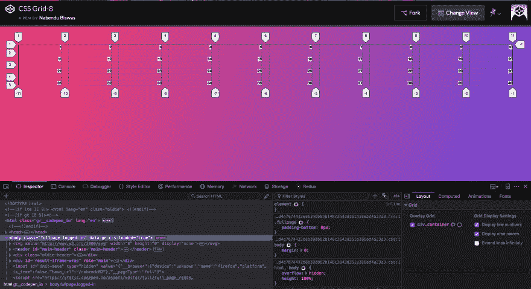](https://res.cloudinary.com/practicaldev/image/fetch/s--hpd3zuru--/c_limit%2Cf_auto%2Cfl_progressive%2Cq_auto%2Cw_880/https://cdn-images-1.medium.com/max/5760/1%2AyN51GdUmmCdAKJ3m5jLkLQ.png)***justify-items:end；***

**居中**值将使项目与单元格中心对齐。

```
.container {
      display: grid;
      grid-gap: 20px;
      grid-template-columns: repeat(10, 1fr);
      justify-items: center;
    }

    .itm{
      background: white;
    } 
```

[](https://res.cloudinary.com/practicaldev/image/fetch/s--AZusVeyk--/c_limit%2Cf_auto%2Cfl_progressive%2Cq_auto%2Cw_880/https://cdn-images-1.medium.com/max/5760/1%2A4Vx9xj9VwZwp6kzjpPh_jw.png)***justify-items:中心；***

最终值**拉伸**，这也是默认的。它将填满单元格的整个宽度。

```
.container {
      display: grid;
      grid-gap: 20px;
      grid-template-columns: repeat(10, 1fr);
      justify-items: stretch;
    }

    .itm{
      background: white;
    } 
```

[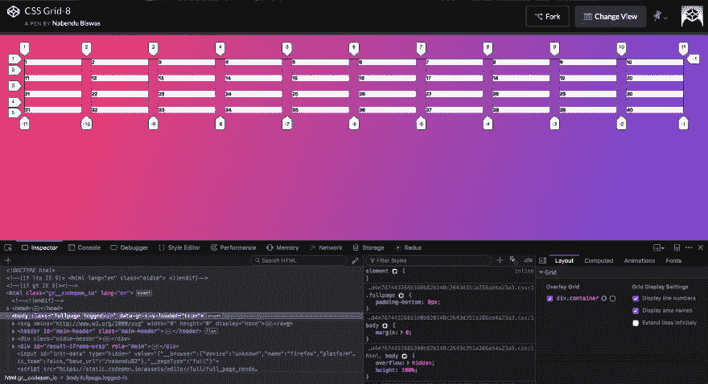](https://res.cloudinary.com/practicaldev/image/fetch/s--EcCe7F-A--/c_limit%2Cf_auto%2Cfl_progressive%2Cq_auto%2Cw_880/https://cdn-images-1.medium.com/max/5760/1%2AmdqZOsye9GfEB5_I8o43MQ.png)***justify-items:stretch；***

## **对齐-项目**

现在，我们将研究 **align-items** 属性。它沿列轴对齐网格项。它可以有 4 个值中的任何一个。

```
align-items: start | end | center | stretch; 
```

我们将在网格中添加一些行，并使用下面的基本代码来看看 **align-items** 是如何工作的。

```
.container {
      display: grid;
      grid-gap: 20px;
      grid-template-columns: repeat(10, 1fr);
      grid-template-rows: repeat(5, 100px);
      justify-items: end;
    }

    .itm{
      background: white;
    } 
```

首先，我们将检查**对齐项目:开始**

```
.container {
      display: grid;
      grid-gap: 20px;
      grid-template-columns: repeat(10, 1fr);
      grid-template-rows: repeat(5, 100px);
      justify-items: end;
      align-items: start;
    }

    .itm{
      background: white;
    } 
```

这将导致网格项位于列的开始。

[ ](https://res.cloudinary.com/practicaldev/image/fetch/s--oWwn9z8s--/c_limit%2Cf_auto%2Cfl_progressive%2Cq_auto%2Cw_880/https://cdn-images-1.medium.com/max/5760/1%2Ayio6q8elLfTz_JkSW97JHw.png) ** *对齐-物品:开始；***

现在，让我们检查 align-items:end；

```
.container {
      display: grid;
      grid-gap: 20px;
      grid-template-columns: repeat(10, 1fr);
      grid-template-rows: repeat(5, 100px);
      justify-items: end;
      align-items: end;
    }

    .itm{
      background: white;
    } 
```

这将导致网格项目位于列的末尾。

[ ](https://res.cloudinary.com/practicaldev/image/fetch/s--ruCywPNz--/c_limit%2Cf_auto%2Cfl_progressive%2Cq_auto%2Cw_880/https://cdn-images-1.medium.com/max/5760/1%2AuMPFBgQD4-Ak_XYR4bYZyA.png) ** *对齐-条目:结束；***

现在， **align-items:居中；**

```
.container {
      display: grid;
      grid-gap: 20px;
      grid-template-columns: repeat(10, 1fr);
      grid-template-rows: repeat(5, 100px);
      justify-items: end;
      align-items: center;
    }

    .itm{
      background: white;
    } 
```

这将导致网格项目位于列的中心。

[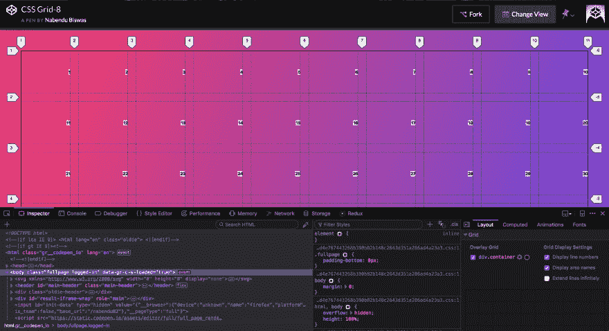 ](https://res.cloudinary.com/practicaldev/image/fetch/s--DTeMnTEX--/c_limit%2Cf_auto%2Cfl_progressive%2Cq_auto%2Cw_880/https://cdn-images-1.medium.com/max/5760/1%2AmM1MzPmotkonJi1ZTwetQw.png) ** *对齐-项目:居中；***

现在，我们来看看**align-items:stretch；**

```
.container {
      display: grid;
      grid-gap: 20px;
      grid-template-columns: repeat(10, 1fr);
      grid-template-rows: repeat(5, 100px);
      justify-items: end;
      align-items: stretch;
    }

    .itm{
      background: white;
    } 
```

这将导致网格项填充单元格的整个高度。

[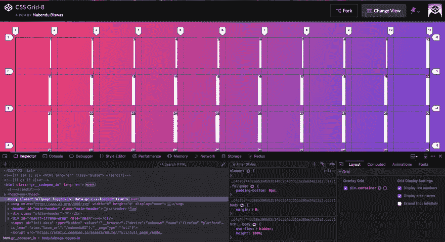 ](https://res.cloudinary.com/practicaldev/image/fetch/s--OnXXY8CA--/c_limit%2Cf_auto%2Cfl_progressive%2Cq_auto%2Cw_880/https://cdn-images-1.medium.com/max/5760/1%2AKe7oPO9w_vtspoPoLJx88A.png) ** *对齐-项目:拉伸；***

> 使**项居中**的一个技巧是让*项居中对齐。*

```
.container {
      display: grid;
      grid-gap: 20px;
      grid-template-columns: repeat(10, 1fr);
      grid-template-rows: repeat(5, 100px);
      justify-items: center;
      align-items: center;
    }

    .itm{
      background: white;
    } 
```

这将使项目居中。

[ ](https://res.cloudinary.com/practicaldev/image/fetch/s--plUoAgea--/c_limit%2Cf_auto%2Cfl_progressive%2Cq_auto%2Cw_880/https://cdn-images-1.medium.com/max/5760/1%2ARYVFLeUOVpi2fhEPU9Pwbw.png) *中锋绝招*

> 现在我们来看看**调整内容**和**对齐内容**。
> 它们通常在你的网格总尺寸小于网格容器尺寸时使用。

我们将首先做 **justify-content** ，为了使网格更小，我们将使用**grid-template-columns:repeat(5，100 px)**；完整的代码如下。

```
.container {
      display: grid;
      grid-gap: 20px;
      border: 10px solid black;
      grid-template-columns: repeat(5, 100px);
      grid-template-rows: repeat(5, 100px);
      justify-items: stretch;
      align-items: stretch;
    }

    .itm{
      background: white;
    } 
```

这将导致下面的结果。

[](https://res.cloudinary.com/practicaldev/image/fetch/s--Fw7ROgPP--/c_limit%2Cf_auto%2Cfl_progressive%2Cq_auto%2Cw_880/https://cdn-images-1.medium.com/max/5760/1%2ANsGNDZ-9tsCuTLuZT9bdew.png)T3】结果

## **自圆其说-内容**

属性 **justify-content** 有如下 7 个值。

```
justify-content: start | end | center | stretch | space-around | space-between | space-evenly; 
```

我们先检查**启动**。

```
.container {
      display: grid;
      grid-gap: 20px;
      border: 10px solid black;
      grid-template-columns: repeat(5, 100px);
      grid-template-rows: repeat(5, 100px);
      justify-items: stretch;
      align-items: stretch;
      justify-content: start
    }

    .itm{
      background: white;
    } 
```

它将网格与网格容器的**开始**边缘对齐。

[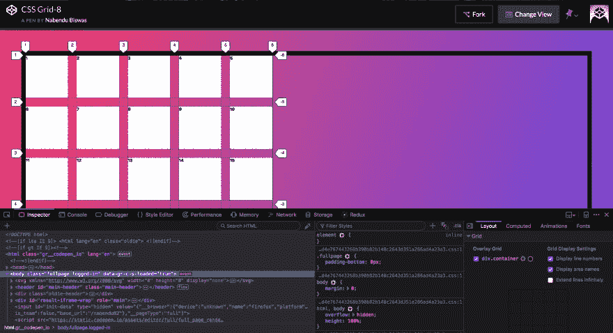 ](https://res.cloudinary.com/practicaldev/image/fetch/s--bLfQtLxD--/c_limit%2Cf_auto%2Cfl_progressive%2Cq_auto%2Cw_880/https://cdn-images-1.medium.com/max/5760/1%2AVfIAN6jaPEpV-wXAK6OEXg.png) ** *自圆其说-内容:开始***

现在，我们将检查**结束**。

```
.container {
      display: grid;
      grid-gap: 20px;
      border: 10px solid black;
      grid-template-columns: repeat(5, 100px);
      grid-template-rows: repeat(5, 100px);
      justify-items: stretch;
      align-items: stretch;
      justify-content: end;
    }

    .itm{
      background: white;
    } 
```

它将网格与网格容器的**端**边缘对齐。

[ ](https://res.cloudinary.com/practicaldev/image/fetch/s--7Sc5jLRB--/c_limit%2Cf_auto%2Cfl_progressive%2Cq_auto%2Cw_880/https://cdn-images-1.medium.com/max/5760/1%2AjYUU0t_xupJ3fmG6nBo5qQ.png) ** *自圆其说——内容:end***

现在，我们将检查**中心**。

```
.container {
      display: grid;
      grid-gap: 20px;
      border: 10px solid black;
      grid-template-columns: repeat(5, 100px);
      grid-template-rows: repeat(5, 100px);
      justify-items: stretch;
      align-items: stretch;
      justify-content: center;
    }

    .itm{
      background: white;
    } 
```

它将网格在网格容器的**中心**对齐。

[ ](https://res.cloudinary.com/practicaldev/image/fetch/s--j35gYxSN--/c_limit%2Cf_auto%2Cfl_progressive%2Cq_auto%2Cw_880/https://cdn-images-1.medium.com/max/5760/1%2AqGLq_yvB3LRO2mBhSK7aMg.png) ** *自圆其说——内容:居中；***

现在，我们将研究一下**周围空间**，这与我们在 flexbox 中的情况非常相似。

```
.container {
      display: grid;
      grid-gap: 20px;
      border: 10px solid black;
      grid-template-columns: repeat(5, 100px);
      grid-template-rows: repeat(5, 100px);
      justify-items: stretch;
      align-items: stretch;
      justify-content: space-around;
    }

    .itm{
      background: white;
    } 
```

它在每个网格项目之间放置相等的空间，在远端有一半大小的空间。

[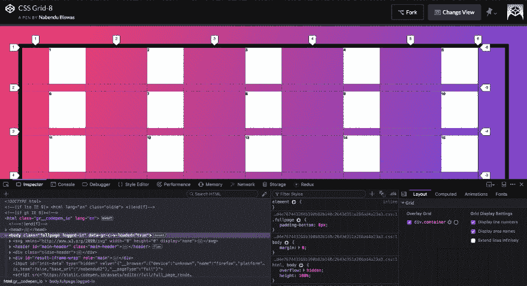](https://res.cloudinary.com/practicaldev/image/fetch/s--8aZ9VhSx--/c_limit%2Cf_auto%2Cfl_progressive%2Cq_auto%2Cw_880/https://cdn-images-1.medium.com/max/5760/1%2AEhylfcI1hEyISkO5HvV9Fw.png)***justify-content:space-round；***

现在，我们来看看**空间。**

```
.container {
      display: grid;
      grid-gap: 20px;
      border: 10px solid black;
      grid-template-columns: repeat(5, 100px);
      grid-template-rows: repeat(5, 100px);
      justify-items: stretch;
      align-items: stretch;
      justify-content: space-between;
    }

    .itm{
      background: white;
    } 
```

它在每个网格项目之间放置了相等的空间，在远端没有空间。

[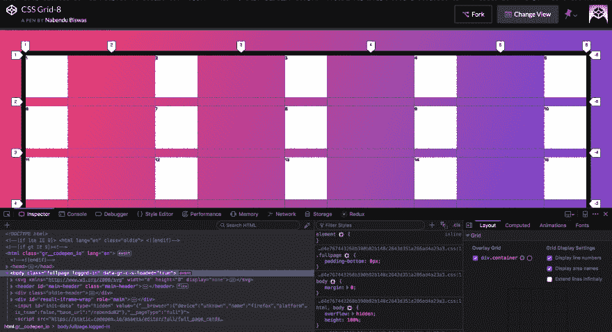](https://res.cloudinary.com/practicaldev/image/fetch/s--Muk9S5Ma--/c_limit%2Cf_auto%2Cfl_progressive%2Cq_auto%2Cw_880/https://cdn-images-1.medium.com/max/5760/1%2AzcveB33XwpbtVZhT8SOVzQ.png)***justify-content:space-between；***

现在，我们将研究**空间均匀。**

```
.container {
      display: grid;
      grid-gap: 20px;
      border: 10px solid black;
      grid-template-columns: repeat(5, 100px);
      grid-template-rows: repeat(5, 100px);
      justify-items: stretch;
      align-items: stretch;
      justify-content: space-evenly;
    }

    .itm{
      background: white;
    } 
```

它在每个网格项目之间放置相等的空间，**包括远端**。

[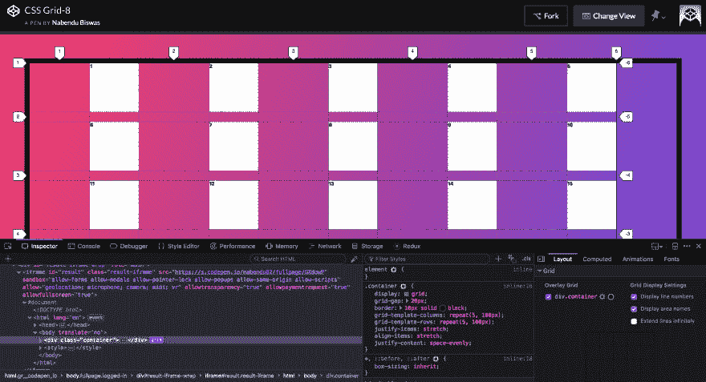](https://res.cloudinary.com/practicaldev/image/fetch/s--TF81kltP--/c_limit%2Cf_auto%2Cfl_progressive%2Cq_auto%2Cw_880/https://cdn-images-1.medium.com/max/5760/1%2A3jGS3bZPUdKFP_a7fOSM8g.png)***justify-content:space-equally；***

## **对齐-内容**

我们现在来看看 **align-content** 。该属性将网格沿列轴对齐。属性 **align-content** 有如下 7 个值。

```
align-content: start | end | center | stretch | space-around | space-between | space-evenly 
```

我们将使用这个基本的 CSS 来**align-content。* *我们减少了物品数量，增加了高度。

```
<body>
  <div class="container">
    <div class="itm itm1">1</div>
    <div class="itm itm2">2</div>
    <div class="itm itm3">3</div>
    <div class="itm itm4">4</div>
    <div class="itm itm5">5</div>
    <div class="itm itm6">6</div>
    <div class="itm itm7">7</div>
    <div class="itm itm8">8</div>
    <div class="itm itm9">9</div>
    <div class="itm itm10">10</div>
  </div>

<style>

.container {
      display: grid;
      grid-gap: 20px;
      height: 500px;
      border: 10px solid black;
      grid-template-columns: repeat(5, 100px);
      justify-items: stretch;
      align-items: stretch;
      justify-content: space-between;
    }

    .itm{
      background: white;
    }
  </style>
</body> 
```

我们先来看**开始**。

```
.container {
      display: grid;
      grid-gap: 20px;
      height: 500px;
      border: 10px solid black;
      grid-template-columns: repeat(5, 100px);
      justify-items: stretch;
      align-items: stretch;
      justify-content: space-between;
      align-content: start;
    }

    .itm{
      background: white;
    } 
```

它将网格与列轴上网格容器的**开始**边缘对齐。

[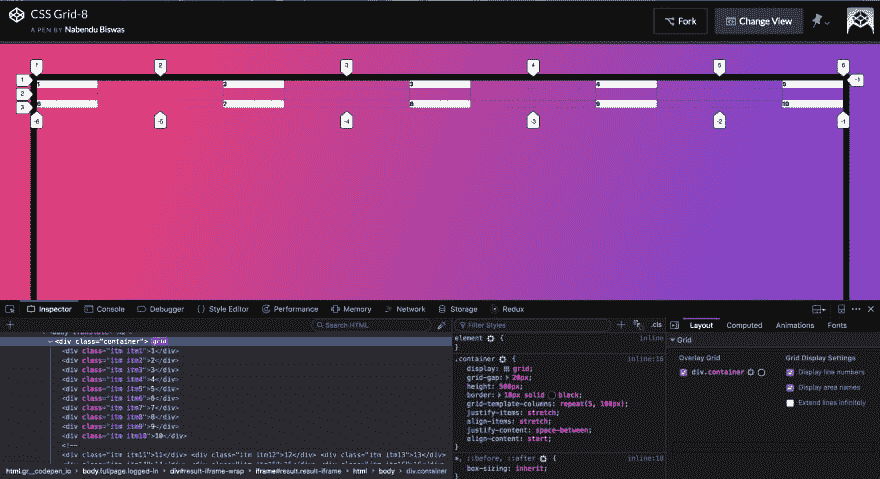 ](https://res.cloudinary.com/practicaldev/image/fetch/s--AYJgX8nt--/c_limit%2Cf_auto%2Cfl_progressive%2Cq_auto%2Cw_880/https://cdn-images-1.medium.com/max/5760/1%2AK93nTKmL1dINq7sG9X-21w.png) ** *对齐-内容:开始；***

现在，我们将看看**结束**。

```
.container {
      display: grid;
      grid-gap: 20px;
      height: 500px;
      border: 10px solid black;
      grid-template-columns: repeat(5, 100px);
      justify-items: stretch;
      align-items: stretch;
      justify-content: space-between;
      align-content: end;
    }

    .itm{
      background: white;
    } 
```

它将网格与列轴上网格容器的**端**边缘对齐。

[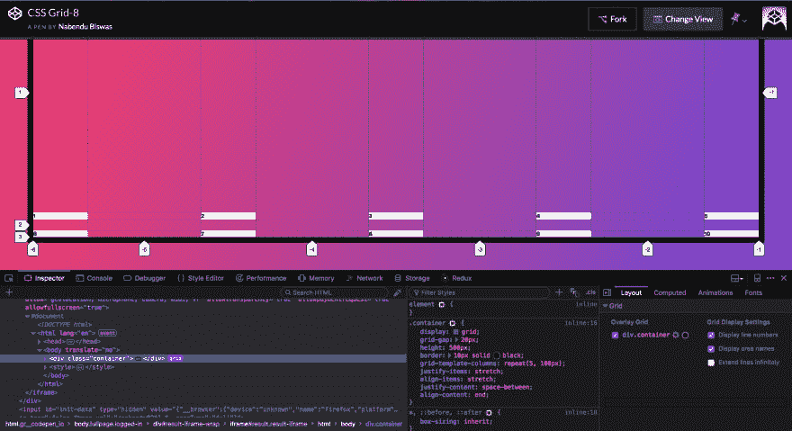 ](https://res.cloudinary.com/practicaldev/image/fetch/s--aYVjPHd9--/c_limit%2Cf_auto%2Cfl_progressive%2Cq_auto%2Cw_880/https://cdn-images-1.medium.com/max/5760/1%2ALwY7OaWgssceHqV4ouIMRg.png) ** *对齐-内容:结束；***

现在，我们来看看**中心**。

```
.container {
      display: grid;
      grid-gap: 20px;
      height: 500px;
      border: 10px solid black;
      grid-template-columns: repeat(5, 100px);
      justify-items: stretch;
      align-items: stretch;
      justify-content: space-between;
      align-content: center;
    }

    .itm{
      background: white;
    } 
```

它将网格在列轴上的网格容器的**中心**对齐。

[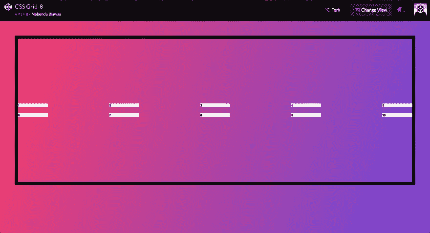 ](https://res.cloudinary.com/practicaldev/image/fetch/s--q2v2qTdn--/c_limit%2Cf_auto%2Cfl_progressive%2Cq_auto%2Cw_880/https://cdn-images-1.medium.com/max/5760/1%2ASDRLtYaAXlQJ89RTqLurBw.png) ** *对齐-内容:居中；***

现在，我们来看看**拉伸**。

```
.container {
      display: grid;
      grid-gap: 20px;
      height: 500px;
      border: 10px solid black;
      grid-template-columns: repeat(5, 100px);
      justify-items: stretch;
      align-items: stretch;
      justify-content: space-between;
      align-content: stretch;
    }

    .itm{
      background: white;
    } 
```

它调整网格项的大小，以允许网格填充网格容器的整个高度。

[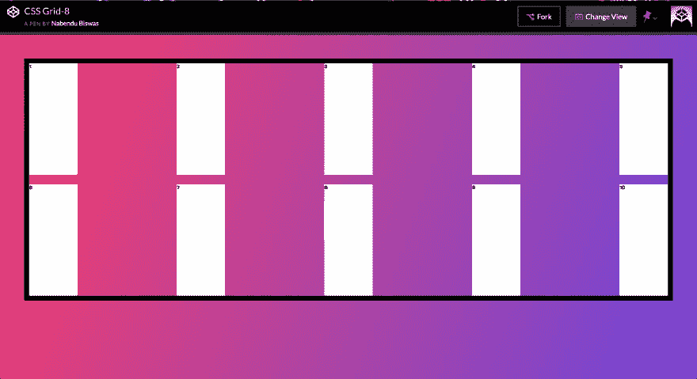 ](https://res.cloudinary.com/practicaldev/image/fetch/s--eBbWFoYZ--/c_limit%2Cf_auto%2Cfl_progressive%2Cq_auto%2Cw_880/https://cdn-images-1.medium.com/max/5760/1%2A8tGaKMJb9U2_bjwySEKWbA.png) ** *对齐-内容:拉伸；***

对于 align-content 的下三个值，我们在 CSS 中有 20 个条目。让我们从**空间环绕**开始。

```
<body>
  <div class="container">
    <div class="itm itm1">1</div>
    <div class="itm itm2">2</div>
    <div class="itm itm3">3</div>
    <div class="itm itm4">4</div>
    <div class="itm itm5">5</div>
    <div class="itm itm6">6</div>
    <div class="itm itm7">7</div>
    <div class="itm itm8">8</div>
    <div class="itm itm9">9</div>
    <div class="itm itm10">10</div>
    <div class="itm itm11">11</div>
    <div class="itm itm12">12</div>
    <div class="itm itm13">13</div>
    <div class="itm itm14">14</div>
    <div class="itm itm15">15</div>
    <div class="itm itm16">16</div>
    <div class="itm itm17">17</div>
    <div class="itm itm18">18</div>
    <div class="itm itm19">19</div>
    <div class="itm itm20">20</div>

  </div>

<style>

.container {
      display: grid;
      grid-gap: 20px;
      height: 500px;
      border: 10px solid black;
      grid-template-columns: repeat(5, 100px);
      justify-items: stretch;
      align-items: stretch;
      justify-content: space-between;
      align-content: space-around;
    }

    .itm{
      background: white;
    }
  </style>
</body> 
```

它在每个网格项之间放置相等的空间，在列轴的远端有一半大小的空间。

[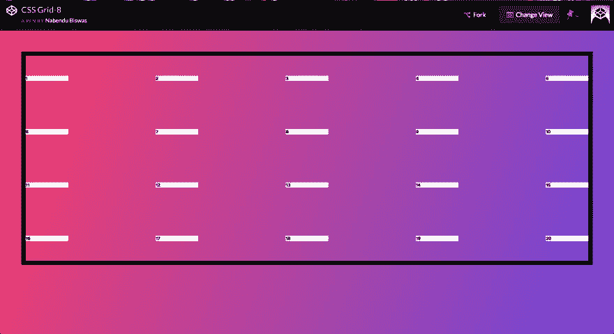](https://res.cloudinary.com/practicaldev/image/fetch/s--6LPBJOKa--/c_limit%2Cf_auto%2Cfl_progressive%2Cq_auto%2Cw_880/https://cdn-images-1.medium.com/max/5760/1%2AOrCHanDnZdHhydKV8EGKWQ.png)***align-content:space-around；***

现在，让我们看看之间的**空间。**

```
.container {
      display: grid;
      grid-gap: 20px;
      height: 500px;
      border: 10px solid black;
      grid-template-columns: repeat(5, 100px);
      justify-items: stretch;
      align-items: stretch;
      justify-content: space-between;
      align-content: space-between;
    }

    .itm{
      background: white;
    } 
```

它在每个网格项之间放置相等的空间，在列轴的远端没有空间。

[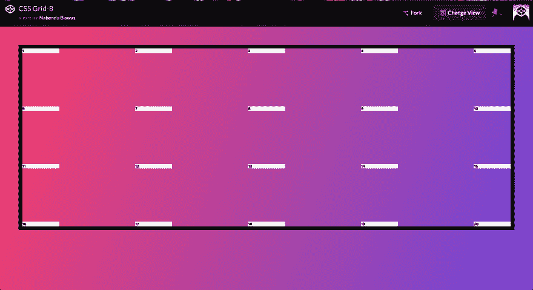](https://res.cloudinary.com/practicaldev/image/fetch/s---0K-WXj_--/c_limit%2Cf_auto%2Cfl_progressive%2Cq_auto%2Cw_880/https://cdn-images-1.medium.com/max/5760/1%2AENskMFdyj24_CocljTMdpA.png)***align-content:space-between；***

现在，让我们看看**空间平均**。

```
.container {
      display: grid;
      grid-gap: 20px;
      height: 500px;
      border: 10px solid black;
      grid-template-columns: repeat(5, 100px);
      justify-items: stretch;
      align-items: stretch;
      justify-content: space-between;
      align-content: space-evenly;
    }

    .itm{
      background: white;
    } 
```

它在每个网格项目之间放置相等的空间，**包括远端**。

[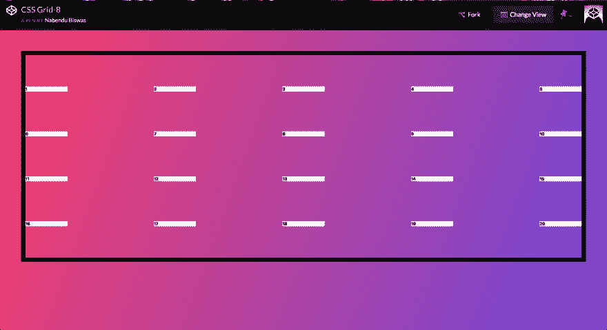 ](https://res.cloudinary.com/practicaldev/image/fetch/s--tiok4QAg--/c_limit%2Cf_auto%2Cfl_progressive%2Cq_auto%2Cw_880/https://cdn-images-1.medium.com/max/5760/1%2A_sEBfuo-9jql1lG0KckkQg.png) ** *对齐-内容:空间-均匀；***

> 我们还可以更新单个项目的属性。这有两个属性，它们是**自调整**和**自调整**。

## **自圆其说**

让我们先来看看**自圆其说**。它类似于 *justify-content* ，并覆盖了 justify-content 的值，但只针对单个项目。它有四个值。

```
justify-self: start | end | center | stretch; 
```

先看**开始**吧。下面也是我们的基本 CSS，我们将用于所有自圆其说的例子。

```
.container {
      display: grid;
      grid-gap: 20px;
      height: 500px;
      border: 10px solid black;
      grid-template-columns: repeat(5, 100px);
      justify-items: stretch;
      align-items: stretch;
      justify-content: space-between;
      align-content: space-between;
    }

    .itm{
      background: white;
    }

    .itm8 {
      background: yellow;
      justify-self: start;
    } 
```

注意 **itm8** ，它与单元格的开头对齐。

[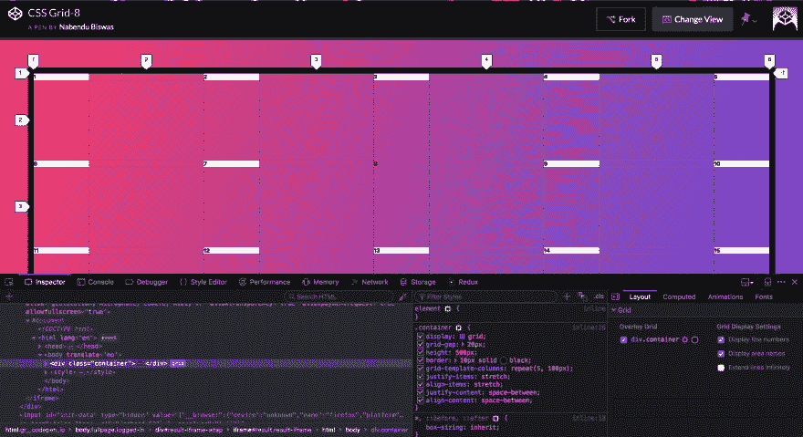 ](https://res.cloudinary.com/practicaldev/image/fetch/s--FUCR9tSt--/c_limit%2Cf_auto%2Cfl_progressive%2Cq_auto%2Cw_880/https://cdn-images-1.medium.com/max/5760/1%2AlPfyaaUNbfI_ACGt_bLlow.png) ** *自圆其说——开始；***

现在，我们来看看**和**的结局。

```
.itm8 {
      background: yellow;
      justify-self: end;
    } 
```

它将 **itm8** 与单元末端对齐。

[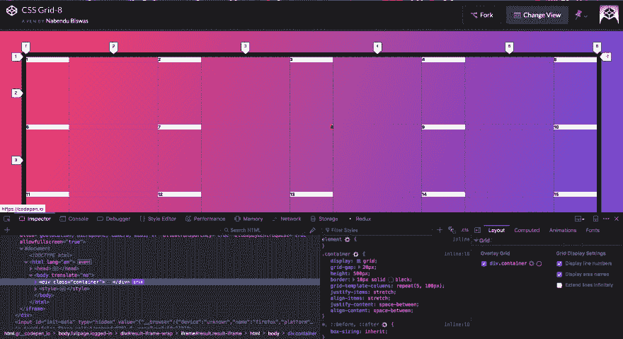 ](https://res.cloudinary.com/practicaldev/image/fetch/s--ER9Nq7GZ--/c_limit%2Cf_auto%2Cfl_progressive%2Cq_auto%2Cw_880/https://cdn-images-1.medium.com/max/5760/1%2AhH_p7W1rQWnLHtu52ic0og.png) ** *自圆其说——结束；***

现在，让我们看看**中心**。

```
.itm8 {
      background: yellow;
      justify-self: center;
    } 
```

它将 **itm8** 对准电池的**中心**。

[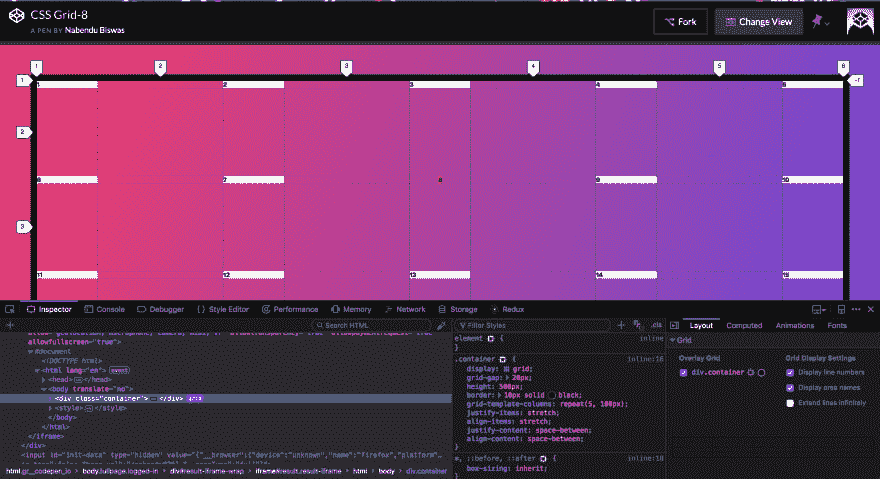 ](https://res.cloudinary.com/practicaldev/image/fetch/s--2bUbt9wE--/c_limit%2Cf_auto%2Cfl_progressive%2Cq_auto%2Cw_880/https://cdn-images-1.medium.com/max/5760/1%2AZL1eJtoOJ8HLBjlWKZWLSQ.png) ** *自圆其说——自我:中心；***

现在，让我们来看看**拉伸**。

```
.itm8 {
      background: yellow;
      justify-self: stretch;
    } 
```

它填充单元格的整个宽度。

[ ](https://res.cloudinary.com/practicaldev/image/fetch/s--EfAv6hd1--/c_limit%2Cf_auto%2Cfl_progressive%2Cq_auto%2Cw_880/https://cdn-images-1.medium.com/max/5760/1%2AoOgmm6BaCQ-x5jP6N6STog.png) ** *自圆其说:舒展；***

## **自对齐**

现在让我们来看看 **align-self** 。它类似于 *align-content* ，并且覆盖了*align*content 的值，但是它是针对单个项目的。它有四个值。

```
align-self: start | end | center | stretch; 
```

先看**开始**吧。下面也是我们的基本 CSS，我们将在所有 align-self 示例中使用它。请注意，我们制作了 300 像素高的第三行，因为它包含了我们在示例中使用的 **itm14** 。

```
<body>
  <div class="container">
    <div class="itm itm1">1</div>
    <div class="itm itm2">2</div>
    <div class="itm itm3">3</div>
    <div class="itm itm4">4</div>
    <div class="itm itm5">5</div>
    <div class="itm itm6">6</div>
    <div class="itm itm7">7</div>
    <div class="itm itm8">8</div>
    <div class="itm itm9">9</div>
    <div class="itm itm10">10</div>
    <div class="itm itm11">11</div>
    <div class="itm itm12">12</div>
    <div class="itm itm13">13</div>
    <div class="itm itm14">14</div>
    <div class="itm itm15">15</div>
    <div class="itm itm16">16</div>
    <div class="itm itm17">17</div>
    <div class="itm itm18">18</div>
    <div class="itm itm19">19</div>
    <div class="itm itm20">20</div>

  </div>

<style>

.container {
      display: grid;
      grid-gap: 20px;
      height: 500px;
      border: 10px solid black;
      grid-template-columns: repeat(5, 100px);
      grid-template-rows: 1fr 1fr 300px 1fr;
      justify-items: stretch;
      align-items: stretch;
      justify-content: space-between;
      align-content: space-between;
    }

    .itm{
      background: white;
    }

    .itm8 {
      background: yellow;
      justify-self: stretch;
    }

     .itm14 {
      background: pink;
      align-self: start;
    }

</style>
</body> 
```

注意 **itm14** ，与列轴上单元格的开始对齐。

[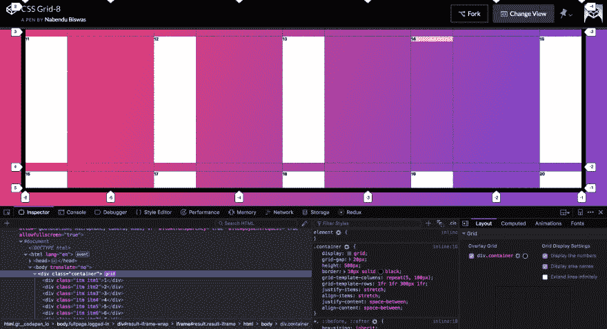 ](https://res.cloudinary.com/practicaldev/image/fetch/s--UvaCUvd6--/c_limit%2Cf_auto%2Cfl_progressive%2Cq_auto%2Cw_880/https://cdn-images-1.medium.com/max/5760/1%2ANDMdEWDPwLasq9sd6yuYIw.png) ** *对齐-自我:开始；***

现在，我们来看看**和**的结局。

```
.itm14 {
      background: pink;
      align-self: end;
    } 
```

它将 **itm14** 与列轴上的单元格末端对齐。

[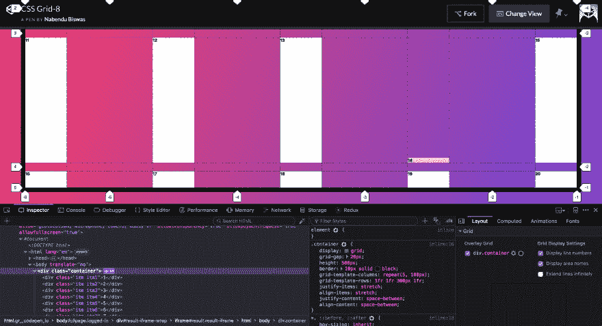 ](https://res.cloudinary.com/practicaldev/image/fetch/s--sKzMReVq--/c_limit%2Cf_auto%2Cfl_progressive%2Cq_auto%2Cw_880/https://cdn-images-1.medium.com/max/5760/1%2A5tHHpuQJs0QKmrCNzN24hQ.png) ** *对齐-自我:结束；***

现在，我们来看看**中心**。

```
.itm14 {
      background: pink;
      align-self: center;
    } 
```

它将 **itm14** 与列轴上的单元格中心对齐。

[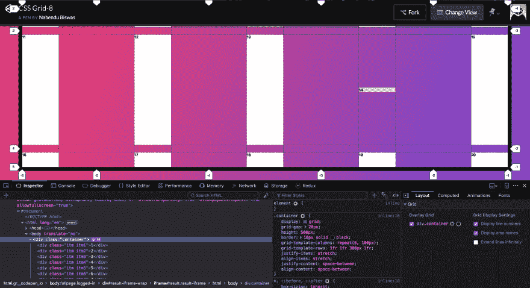](https://res.cloudinary.com/practicaldev/image/fetch/s--AcGD3YzA--/c_limit%2Cf_auto%2Cfl_progressive%2Cq_auto%2Cw_880/https://cdn-images-1.medium.com/max/5760/1%2AhoRP12fgGkG8F0eeUvnERQ.png)***align-self:center；***

现在，我们来看看**拉伸**。

```
.itm14 {
      background: pink;
      align-self: stretch;
    } 
```

它填充单元格的整个**高度**。

[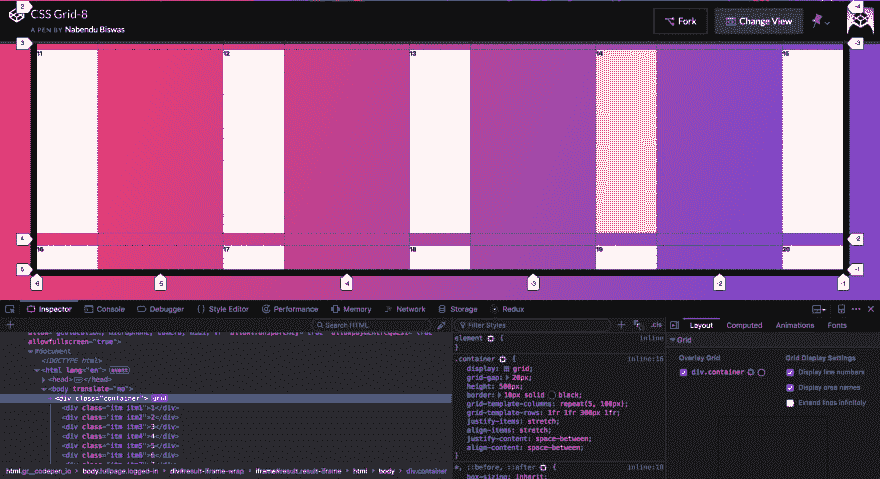 ](https://res.cloudinary.com/practicaldev/image/fetch/s--heek5mXo--/c_limit%2Cf_auto%2Cfl_progressive%2Cq_auto%2Cw_880/https://cdn-images-1.medium.com/max/5760/1%2AAcgRcbNKY0-McMTgHDiN4w.png) ** *对齐-自我:拉伸；***

本教程的第 7 部分到此结束。