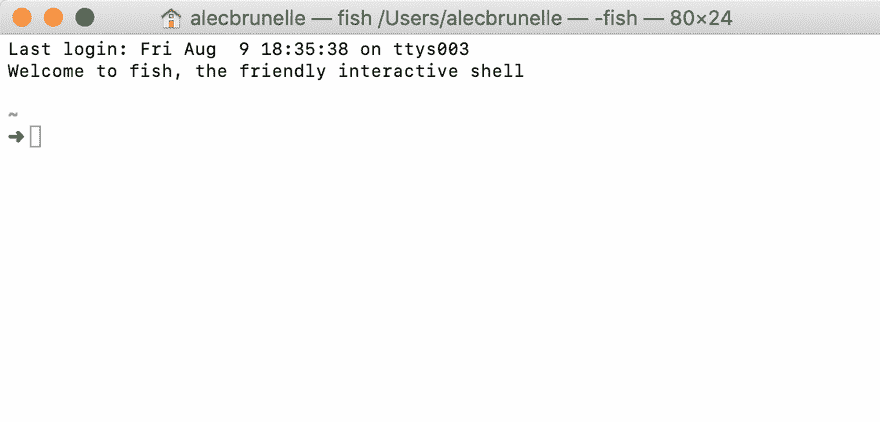
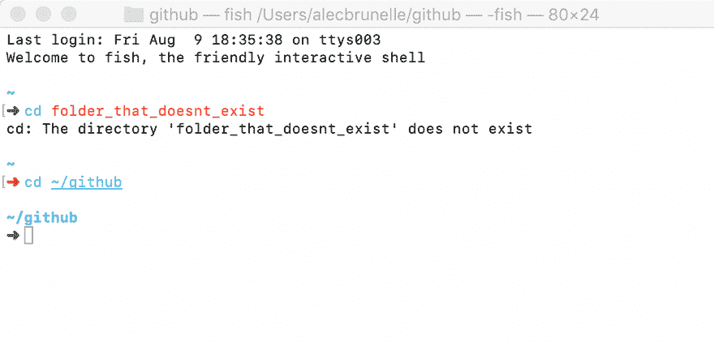
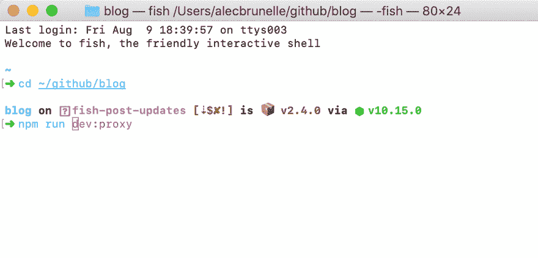

# 为什么我使用鱼壳而不是 Bash 和 Zsh🐟

> 原文：<https://dev.to/aleccool213/beautiful-developer-tools-fish-shell-2hcd>

> 想要更多这样的精彩内容？注册订阅我的时事通讯，请访问:[Alec . coffee/注册](//alec.coffee/newsletter)

苹果的主要吸引力之一是事物“就是工作”。大多数使用他们产品的人都被他们发布的功能所覆盖，而苹果在其他事情上几乎不花时间。他们提供的功能是经过**打磨的**，有**合理的默认值**，还有**有意的**。这就是我相信[鱼壳](https://fishshell.com)变成的样子。不要浪费时间在网上搜索其他人共享的配置文件，最好的插件，或者如何让集成与您的特定设置一起工作。

这个 shell 是为大多数人设计的，Fish 代表友好的交互 Shell，这就是为什么我可以把它推荐给和我一起工作的人。他们有非常详细的[设计文档](https://fishshell.com/docs/current/design.html)。它不适合那些每天不断登录多台服务器的系统管理员。它永远不会成为大多数操作系统上默认安装的 shell。

一旦你安装了它，你就可以开始比赛了。你有一个外壳，在这里你可以变得非常高效，你最喜欢的工具也可以按预期工作。它并不试图在每件事上都做到最好，而是抓住了让用户体验非常愉快的核心特性。

## TLDR

*   语法突出显示
*   基于历史记录的内嵌自动建议
*   使用手册页数据完成选项卡
*   直观的通配符支持
*   基于 Web 的配置

|  |

### 我们来分解一下

#### 语法高亮显示

我对 bash 最糟糕的记忆来自于这个特性的缺失，[语法高亮](https://fishshell.com/docs/current/tutorial.html#tut_syntax_highlighting)。一件简单的事情，让你觉得，“哇，现在我用的是 90 年代的外壳”！你可以在下面的 gif 中注意到，当我试图转到`folder_that_doesnt_exist`时，文本变成红色。当它是一个有效的命令时，文本变成蓝色。

[](https://res.cloudinary.com/practicaldev/image/fetch/s--I2S2WdWr--/c_limit%2Cf_auto%2Cfl_progressive%2Cq_66%2Cw_880/https://res.cloudinary.com/dscgr6mcw/image/upload/v1565390429/fish-post/2019-08-09_18.40.08.gif)

#### 基于历史的内嵌自动建议

智能[自动提示](https://fishshell.com/docs/current/index.html#autosuggestions)很少见到，更别说内置了。除了击败竞争对手，Fish 团队还想摧毁它。使用您的命令历史，它会建议您可以使用`right-arrow key`完成的命令。你也可以像我做这个 gif 一样，用`option + right-arrow key`一次自动完成一个单词或文件夹。

[](https://res.cloudinary.com/practicaldev/image/fetch/s--FDtkr8SZ--/c_limit%2Cf_auto%2Cfl_progressive%2Cq_66%2Cw_880/https://res.cloudinary.com/dscgr6mcw/image/upload/v1565390672/fish-post/2019-08-09_18.44.14.gif)

> 有趣的事实是，如果搜索结果是巨大的，鱼壳将分页！

#### 选项卡使用手册页数据完成

这是因为 [Fish 知道如何解析许多不同格式的 CLI 工具手册页](https://fishshell.com/docs/current/index.html#completion)。Git、Docker CLI、package.json，凡是你能想到的，你尝试的大多数命令都会自动完成。

你可以使用`tab`来获得所有的选项。

All npm scripts for this package, with values of what they actually run, IN THE TERMINAL WUT

|  |

#### 直观的通配符支持

在 bash 中，我从来不喜欢使用不同的标志来选择文件或文件夹的内容。

通常，这将通过
来完成

```
rm -r folder_1 
```

Enter fullscreen mode Exit fullscreen mode

我一直是熟悉度的粉丝，[通配符](https://fishshell.com/docs/current/tutorial.html#tut_wildcards)也不过如此。您可以在任何命令中使用它们，轻松过滤出您需要的确切文件。

例如

```
ls *.jpg 
```

Enter fullscreen mode Exit fullscreen modeHow I feel while using Fish

|  |

#### 基于 Web 的配置

输入:

```
web_config 
```

Enter fullscreen mode Exit fullscreen mode

你会得到一个完整的网站，专门处理你需要接触的任何配置。

[](https://res.cloudinary.com/practicaldev/image/fetch/s--tCMxVSYy--/c_limit%2Cf_auto%2Cfl_progressive%2Cq_auto%2Cw_880/https://res.cloudinary.com/dscgr6mcw/image/upload/v1565391525/fish-post/Screenshot_at_Aug_09_18-58-33.png)

### 需要额外努力的微小定制

鱼不需要很多额外的包装。就我个人而言，我只使用 2，这很疯狂，因为我知道我的 Oh-My-Zsh 插件已经超过 10 个了。

#### 哎呀我的鱼

向伟大的 Oh My Zsh 致敬，`omf`是最受欢迎的 Fish 软件包管理器。我用它来安装两个包，一个是给 [nvm](https://github.com/derekstavis/plugin-nvm) 的，一个是给 [spacefish](https://github.com/matchai/spacefish/) 的。

#### 太空鱼

特别提到[三维鱼乐队](https://github.com/matchai/spacefish/)是我用过的最好的 shell 提示符。支持显示:

*   当前 Git 分支和丰富的回购状态
*   当前 Node.js 版本，通过 nvm
*   包版本，如果当前目录中有包(例如 package.json)

Spacefish example

|  |

#### 配置文件

您还可以访问位于`.config/fish/config.sh`的配置文件。您可以在这里设置别名或设置一些额外的路径扩展。

### 告诫

不符合 POSIX 可能会吓跑一些开发人员。但是真的在我三年的使用中(主要是 Node.js，javascript，ruby，e.t.c .)，没有遇到过任何问题。我从网上得到的一些命令是 Bash 特有的，我只是`exit`然后当我完成时再回来钓鱼。[如果你愿意的话，这篇 Stackoverflow 帖子](https://stackoverflow.com/questions/48732986/why-how-fish-does-not-support-posix)会深入探讨。

#### 但是很容易兼容...

假设您有一个 bash 脚本要运行，使用 Fish 您仍然可以:

```
bash script.sh 
```

Enter fullscreen mode Exit fullscreen mode

另一个提示是，你可以把这个放在文件的顶部:

```
#!/usr/bin/env bash 
```

Enter fullscreen mode Exit fullscreen mode

然后确保它是可执行的:

```
chmod +x script.sh 
```

Enter fullscreen mode Exit fullscreen mode

瞧，你可以把它作为一个普通的脚本来运行:

```
./script.sh 
```

Enter fullscreen mode Exit fullscreen mode

## 资源:

*   [鱼壳网站](https://fishshell.com/)
*   [鱼壳语法高亮显示](https://fishshell.com/docs/current/tutorial.html#tut_syntax_highlighting)
*   [鱼壳自我暗示](https://fishshell.com/docs/current/index.html#autosuggestions)
*   [在线试用鱼壳教程](https://rootnroll.com/d/fish-shell/)
*   [哎呀我的鱼包经理](https://github.com/oh-my-fish/oh-my-fish)
*   [NVM 包装插件](https://github.com/derekstavis/plugin-nvm)
*   [三维鱼乐队鱼贝主题](https://github.com/matchai/spacefish/)
*   [牛逼鱼相关软件列表](https://github.com/jorgebucaran/awesome-fish)
*   [Fisher，另一个具有基于文件的扩展配置的包管理器](https://github.com/jorgebucaran/fisher)
    *   [给费希尔的朋友鱼档](https://github.com/elliottsj/dotfiles/blob/master/common/.config/fish/fishfilehttps://github.com/elliottsj/dotfiles/blob/master/common/.config/fish/fishfile)
*   [支持 Fish 中的 Bash 脚本](https://github.com/edc/bass)

> 喜欢这个帖子？考虑给我买一杯咖啡来支持我写更多的东西。
> 
> 想收到有新帖子的季度邮件吗？[注册我的简讯](https://mailchi.mp/f91826b80eb3/alecbrunelleemailsignup)