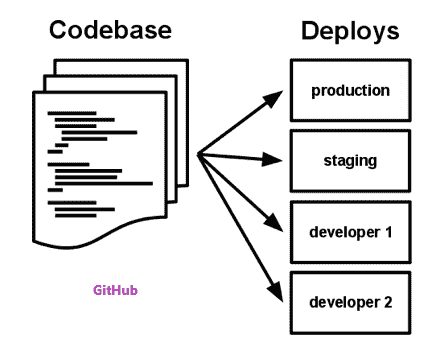
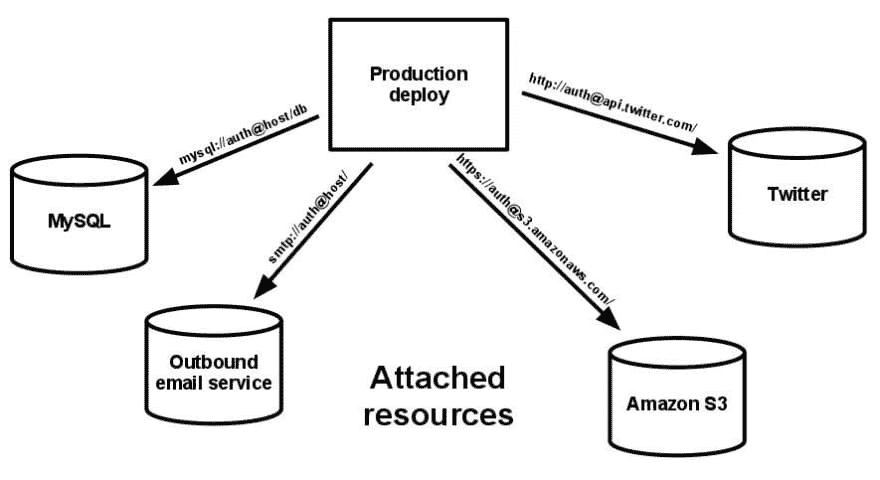

# 构建可部署的软件即服务应用程序的最佳实践

> 原文：<https://dev.to/rajdeepdas/best-practices-for-building-a-deployable-software-as-a-service-app-436f>

#### 十二要素 App，快速总结

在现代，软件通常作为服务交付:称为*网络应用*，或*软件即服务*。十二要素应用程序是一种用于构建软件即服务应用程序的方法，它可以:

*   使用**声明式**格式进行设置自动化，以最小化新开发人员加入项目的时间和成本；
*   与底层操作系统有一个**清晰的契约**，在执行环境之间提供**最大的可移植性**；
*   适合在现代**云平台**上**部署**，消除对服务器和系统管理的需求；
*   **最小化开发和生产之间的差异**，使**连续部署**实现最大的敏捷性；
*   并且可以**纵向扩展**,而无需对工具、架构或开发实践进行重大更改。

十二要素方法可以应用于任何编程语言编写的应用程序，并且使用任何支持服务(数据库、队列、内存缓存等)的组合。

### 十二要素

一、代码库

在修订控制中跟踪一个代码库，部署多个

> 一个十二因素的 app 总是在一个版本控制系统中被追踪，比如 [Git](http://git-scm.com/) 、 [Mercurial](https://www.mercurial-scm.org/) ，或者 [Subversion](http://subversion.apache.org/) 。修订跟踪数据库的副本被称为*代码库*，通常简称为*代码报告*或简称为*报告*。

<figure> 

<figcaption>单码基数</figcaption>

</figure>

代码库和应用程序之间总是存在一对一的关联:

*   如果有多个代码库，它就不是一个应用程序，而是一个分布式系统。分布式系统中的每个组件都是一个应用程序，每个组件都可以单独遵守十二要素。
*   多个应用程序共享相同的代码违反了十二因素法。这里的解决方案是将共享代码分解到库中，这些库可以通过[依赖管理器](https://12factor.net/dependencies)来包含。

**二。依赖性**

显式声明和隔离依赖项

> 大多数编程语言都提供了一个打包系统来分发支持库，比如 Node 的 [NPM](https://www.npmjs.com/) 。Js 或 [Rubygems](http://rubygems.org/) 为 Ruby。通过打包系统安装的库可以安装在系统范围内(称为“站点包”)，也可以安装在包含应用程序的目录中(称为“供应商”或“捆绑”)。

一个十二因素的应用程序从来不依赖于系统范围的软件包的隐含存在。它通过一个*依赖声明*清单完整准确地声明所有依赖。此外，它在执行过程中使用了一个*依赖隔离*工具来确保没有隐含的依赖从周围的系统中“泄漏”出来。完整和明确的依赖规范统一应用于生产和开发。

在 Python 中，这些步骤有两个独立的工具——[Pip](http://www.pip-installer.org/en/latest/)用于声明，而 [Virtualenv](http://www.virtualenv.org/en/latest/) 用于隔离。甚至 **C** 都有 [**Autoconf**](http://www.gnu.org/s/autoconf/) 进行依赖声明，静态链接可以提供依赖隔离

#### 三世。配置

在环境中存储配置

> 一个应用程序的*配置*是在[部署](https://12factor.net/codebase)之间可能发生变化的一切(登台、生产、开发者环境等)。这包括:

*   数据库、Memcached 和其他[后台服务](https://12factor.net/backing-services)的资源句柄
*   亚马逊 S3 或 Twitter 等外部服务的凭证
*   每个部署的值，例如部署的规范主机名

> 应用程序有时会将配置作为**常量**存储在代码中。这违反了要求**将配置与代码**严格分离的十二要素。配置在不同的部署中会有很大的不同，但代码不会。

测试一个应用程序是否正确地将所有配置从代码中分离出来的试金石是，代码库是否可以在任何时候开源，而不损害任何凭证。

> **十二因素应用将配置存储在*环境变量*** (通常简称为*环境变量*或*环境变量*)。

#### 四世。后勤服务

将后台服务视为附属资源

> 一个*后台服务*是应用程序通过网络消费的任何服务，作为其正常操作的一部分。例子包括数据存储(如 [MySQL](http://dev.mysql.com/) 或 [CouchDB](http://couchdb.apache.org/) )、消息传递/排队系统(如 [RabbitMQ](http://www.rabbitmq.com/) 或 [Beanstalkd](https://beanstalkd.github.io) )、出站电子邮件的 SMTP 服务(如 [Postfix](http://www.postfix.org/) )和缓存系统(如 [Memcached](http://memcached.org/) )。

**十二要素应用的代码没有区分本地和第三方服务**

<figure> 

<figcaption>附资源</figcaption>

</figure>

#### V .构建、发布、运行

严格分离构建和运行阶段

一个[代码库](https://12factor.net/codebase)通过三个阶段转化为一个(非开发)部署:

*   *构建阶段*是一个转换，它将代码回购转换成一个可执行的包，称为*构建*。在部署流程指定的提交阶段使用代码版本，构建阶段获取供应商[依赖关系](https://12factor.net/dependencies)并编译二进制文件和资产。
*   *发布阶段*获取构建阶段生成的构建，并将其与部署的当前[配置](https://12factor.net/config)相结合。最终的*版本*包含了构建和配置，并且可以在执行环境中立即执行。
*   *运行阶段*(也称为“运行时”)在执行环境中运行应用程序，针对选定的版本启动应用程序的一些[进程](https://12factor.net/processes)。

十二要素应用程序在构建、发布和运行阶段之间进行了严格的分离。例如，不可能在运行时对代码进行更改，因为没有办法将这些更改传播回构建阶段。

<figure> 

<figcaption>修建管道</figcaption>

</figure>

#### 六。处理

将应用程序作为一个或多个无状态进程执行

> 应用在执行环境中作为一个或多个*进程*执行。

在最简单的情况下，代码是一个独立的脚本，执行环境是开发人员安装了语言运行时的本地笔记本电脑，进程通过命令行启动(例如 python my_script.py)。另一方面，一个复杂应用程序的生产部署可能使用许多[流程类型，实例化为零个或多个正在运行的流程](https://12factor.net/concurrency)。

**十二要素流程无状态** [**无共享**](http://en.wikipedia.org/wiki/Shared_nothing_architecture) **。任何需要持久化的数据都必须存储在有状态的后台服务中，通常是数据库。**

#### 七世。端口绑定

通过端口绑定导出服务

Web 应用程序有时在 web 服务器容器中执行。例如，PHP 应用程序可能作为模块在[阿帕奇 HTTPD](http://httpd.apache.org/) 中运行，或者 Java 应用程序可能在 [Tomcat](http://tomcat.apache.org/) 中运行。

> **十二要素应用程序是完全独立的**，不依赖于在运行时将 web 服务器注入执行环境来创建面向 web 的服务。web 应用程序**通过绑定到端口**将 HTTP 导出为服务，并监听来自该端口的请求。

在本地开发环境中，开发人员访问类似 [http://localhost:5000/](http://localhost:5000/) 的服务 URL 来访问他们的应用程序导出的服务。在部署中，路由层处理从面向公众的主机名到绑定端口的 web 进程的路由请求。

这通常是通过使用[依赖声明](https://12factor.net/dependencies)向应用程序添加 web 服务器库来实现的，例如 Python 的 [Tornado](http://www.tornadoweb.org/) ，Ruby 的 [Thin](http://code.macournoyer.com/thin/) ，或者 Java 和其他基于 JVM 的语言的 [Jetty](http://www.eclipse.org/jetty/) 。这完全发生在*用户空间*，也就是说，在应用程序的代码中。与执行环境的契约被绑定到一个端口以服务请求。

HTTP 不是唯一可以通过端口绑定导出的服务。几乎任何类型的服务器软件都可以通过绑定到端口并等待传入请求的进程来运行。例子包括 [ejabberd](http://www.ejabberd.im/) (讲 [XMPP](http://xmpp.org/) )和 [Redis](http://redis.io/) (讲 [Redis 协议](http://redis.io/topics/protocol))。

还要注意，端口绑定方法意味着一个应用程序可以成为另一个应用程序的[后台服务](https://12factor.net/backing-services)，方法是在消费应用程序的[配置](https://12factor.net/config)中提供后台应用程序的 URL 作为资源句柄。

#### VIII。并发

通过流程模型向外扩展

> 任何计算机程序一旦运行，就由一个或多个进程来表示。Web 应用程序采用了多种流程执行形式。例如，PHP 进程作为 Apache 的子进程运行，根据请求量按需启动。Java 进程采取了相反的方法，JVM 提供了一个巨大的超级进程，它在启动时保留了大量的系统资源(CPU 和内存),通过线程在内部管理并发性。在这两种情况下，应用程序的开发人员只能最低程度地看到正在运行的进程。

在十二因素应用程序中，流程是一等公民。十二因素应用程序中的进程从运行服务守护进程的 Unix 进程模型[中获得了强烈的暗示](https://adam.herokuapp.com/past/2011/5/9/applying_the_unix_process_model_to_web_apps/)。

使用这种模型，开发人员可以通过将每种类型的工作分配给*流程类型*来设计他们的应用程序，以处理不同的工作负载。例如，HTTP 请求可能由 web 进程处理，而长期运行的后台任务由工作进程处理。

#### IX。一次性

快速启动和平稳关闭，最大限度地提高稳定性

> **十二因子 app 的** [**进程**](https://12factor.net/processes) **是*一次性*，也就是说可以随时启动或停止。这有助于快速弹性伸缩、快速部署[代码](https://12factor.net/codebase)或[配置](https://12factor.net/config)变更，以及生产部署的健壮性。**

*   过程应该努力**最小化启动时间**
*   当进程从进程管理器收到一个 [**SIGTERM**](http://en.wikipedia.org/wiki/SIGTERM) 信号时，进程**优雅地关闭。**

#### X .开发/生产平价

让开发、试运行和生产尽可能相似

从历史上看，开发(开发人员对应用程序的本地[部署](https://12factor.net/codebase)进行实时编辑)和生产(最终用户访问的应用程序的运行部署)之间有很大的差距。这些差距表现在三个方面:

*   **时间差距**:开发人员可能需要几天、几周甚至几个月的时间来开发代码。
*   **人员缺口**:开发人员编写代码，运营工程师部署。
*   **工具差距**:开发人员可能使用 Nginx、SQLite 和 OS X 等堆栈，而生产部署人员使用 Apache、MySQL 和 Linux。

**十二因素 app 是为** [**持续部署**](http://avc.com/2011/02/continuous-deployment/) **而设计的，通过保持开发与生产之间的差距较小。**看看上面描述的三个缺口:

*   缩短时间间隔:开发人员可能会在几小时甚至几分钟后编写代码并部署。
*   缩小人员差距:编写代码的开发人员密切参与部署代码并观察其在生产中的行为。
*   缩小工具差距:让开发和生产尽可能相似。

<figure> 

<figcaption>将以上总结成一张表</figcaption>

</figure>

[后台服务](https://12factor.net/backing-services)，如应用的数据库、排队系统或缓存，是开发/生产奇偶校验非常重要的一个领域。许多语言提供了简化后台服务访问的库，包括不同类型服务的*适配器*。下表列出了一些例子。

<figure> 

<figcaption>库</figcaption>

</figure>

**十二因素开发者抵制在开发和生产之间使用不同支持服务的冲动**，即使适配器理论上抽象出支持服务中的任何差异。

#### XI。日志

将日志视为事件流

*日志*提供对正在运行的应用程序行为的可见性。在基于服务器的环境中，它们通常被写入磁盘上的一个文件(“日志文件”)，但这只是一种输出格式。

> 一个 12 因素的应用程序从不关心其输出流的路由或存储。它不应该试图写入或管理日志文件。相反，每个正在运行的进程都将其事件流无缓冲地写入 stdout。在本地开发期间，开发人员将在其终端的前台查看该流，以观察应用程序的行为。

在试运行或生产部署中，每个流程的流将被执行环境捕获，与应用程序中的所有其他流一起整理，并发送到一个或多个最终目的地，以供查看和长期存档。这些归档目的地对应用程序不可见或不可配置，而是完全由执行环境管理。开源日志路由器(如 [Logplex](https://github.com/heroku/logplex) 和 [Fluentd](https://github.com/fluent/fluentd) )可用于此目的。

#### 十二。管理流程

作为一次性流程运行行政/管理任务

[进程构成](https://12factor.net/concurrency)是应用程序运行时用于执行常规业务(如处理 web 请求)的一系列进程。另外，开发人员通常希望为应用程序执行一次性管理或维护任务，例如:

*   运行数据库迁移(例如 Django 中的 manage.py migrate，Rails 中的 rake db:migrate)。
*   运行控制台(也称为 [REPL](http://en.wikipedia.org/wiki/Read-eval-print_loop) 外壳)来运行任意代码或根据实时数据库检查应用程序的模型。大多数语言通过不带任何参数运行解释器来提供 REPL(例如 python 或 perl)，或者在某些情况下有单独的命令(例如 Ruby 的 irb，rails 的 Rails 控制台)。
*   运行提交到应用程序的 repo 中的一次性脚本(例如 php 脚本/fix_bad_records.php)。

> 一次性管理流程应该在与应用程序的常规[长期运行流程](https://12factor.net/processes)相同的环境中运行。他们运行一个[版本](https://12factor.net/build-release-run)，使用与任何运行该版本的流程相同的[代码库](https://12factor.net/codebase)和[配置](https://12factor.net/config)。管理代码必须与应用程序代码一起发布，以避免同步问题。

相同的[依赖隔离](https://12factor.net/dependencies)技术应该用在所有的流程类型上。例如，如果 Ruby web 进程使用命令 bundle exec thin start，那么数据库迁移应该使用 bundle exec rake db:migrate。同样，使用 Virtualenv 的 Python 程序应该使用 vendored bin/python 来运行 Tornado web 服务器和任何 manage.py 管理进程。

#### 结论

以上是 12 因子 app 开发的主要思路。这在现代微服务架构中非常有用。微服务架构应遵循这些 12 因素风格，以实现更好的可扩展性和快速开发，而无需浪费太多时间在生产中推出新功能，并简化开发人员的工作。

你可以从官方 12 因素应用网站[https://12factor.net/](https://12factor.net/)了解更多细节。亚当·威金斯写的。

谢谢，阅读愉快。

* * *