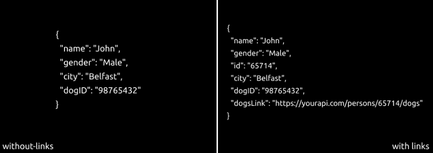

# 设计 REST APIs 的最佳实践(第 1 部分)

> 原文：<https://dev.to/riazosama/best-practices-for-designing-rest-apis-part-1-5b6o>

当我开始后端开发时，我没有注意开发 web APIs 的最佳实践，因此我的前几个项目真是一团糟。端点命名不一致。我不知道如何处理关系，也不知道一个资源的结构良好的表示是什么样子。希望你不会经历这个阶段。

在本文中，我只打算解释一个 API 的**资源表示**。

* * *

# 资源表示

首先，让我们解释一下什么是“代表”。它可以定义为:

> 当客户端从服务器检索某些资源或从客户端发送到服务器时返回的数据。

用户可以查看不同格式的资源表示。我们称这些格式为媒体类型。所有可用的媒体类型应该编码相同的数据，只是格式不同。在所有可用的类型中，使用最广泛的是**JSON(JavaScript Object Notation)**。JSON 很简单，就是这么简单。这就是它被广泛使用的原因。

> JSON 是 WEB API 的事实上的标准。

除此之外，它还有一些限制，比如有限的数据类型。它不支持常用类型，如*日期和时间*和*网址。*但是我们仍然可以使用 ***字符串*** 来表示这些类型。

**JSON 应该很简单**

我刚才不是说 JSON 很简单吗？嗯，如果不符合标准，就更难理解了。JSON 是名称/值对的集合。名称本身是一个字符串，它对应于资源的一个属性。应该记住，JSON 应该是不言自明的。下图说明了一切。

[](https://res.cloudinary.com/practicaldev/image/fetch/s--8c7pisN5--/c_limit%2Cf_auto%2Cfl_progressive%2Cq_auto%2Cw_880/https://miro.medium.com/max/1125/1%2AE1IsMuPdFUg_NAGSYKoKpQ.png)

请注意，在 ***复杂*** 示例中，“user-12348-as13s0-dsdf”出现在冒号左侧的位置，在这里，JSON I 的 ***简单*** 示例显示了一个属性名称。JSON 名称**数据**也不对应于属性名称

**如何处理关系**

几乎在每个项目中，资源都有某种关系，使用简单命名的属性没有多大帮助。因此，在您的响应表示中，您应该考虑添加**链接**。让我们假设**约翰**拥有一只狗。现在，在主人和它的狗之间存在一种关系。

[](https://res.cloudinary.com/practicaldev/image/fetch/s--z-Cy2png--/c_limit%2Cf_auto%2Cfl_progressive%2Cq_auto%2Cw_880/https://miro.medium.com/max/1125/1%2AIvXK_ZkRzXADDY4OuEpWPw.png)

现在两种表述都有效。在左边， *dogID* 清楚地描述了某种关系。但是右边的表示更有表现力，也更方便。为什么？让我们假设您刚刚检索了 John 的响应，现在您想获得他拥有的狗。如果您按照没有链接的*的例子，您将不得不查看文档(希望文档是最新的)来找到一个合适的端点，然后在您的代码中构造它来得到它的狗。但是有了' ***同链接'*** 的例子，你就已经知道从哪里得到响应了。越来越多来自大公司的 API 在数据中包含链接，比如 Google 和 GitHub。*

 *现在可能很想从响应中删除 *dogID* 属性。嗯，这要看情况。链接告诉我们*我们在哪里，我们应该去哪里。*但是在某些情况下，你可能需要 *dogID* 而不是检索狗的响应。

**使用链接的公司**

下面是 Google Drive API 的例子:

```
{
 "kind": "“drive#file",
 "id": "0B8G-Akr_SmtmaEJneEZLYjBBdWxxxxxxxxxxxxxxxx",
 "etag": "btSRMRFBFi3NMGgScYWZpc9YNCI/MTQzNjU2NDk3OTU3Nw",
 "selfLink": "https://www.googleapis.com/drive/v2/files/0B8G-Akr_Smt",
 "webContentLink": "https://docs.google.com/uc?id=0B8G-Akr_SmtmaEJneE",
 "alternateLink": "https://drive.google.com/file/d/0B8G-Akr_SmtmaEJne",
 "title": "Links.pdf",
 "mimeType": "“application/pdf"
} 
```*