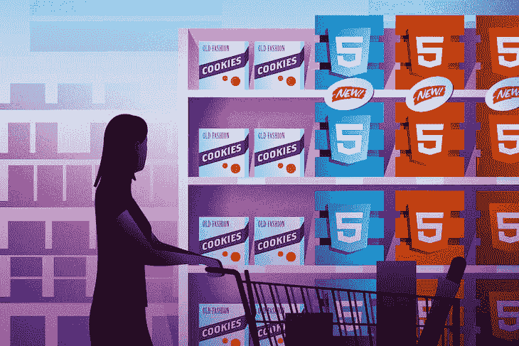

# 超越 cookies:今天客户端数据存储的选择

> 原文：<https://dev.to/bnevilleoneill/beyond-cookies-today-s-options-for-client-side-data-storage-p1n>

[](https://res.cloudinary.com/practicaldev/image/fetch/s--8ZzlNN4E--/c_limit%2Cf_auto%2Cfl_progressive%2Cq_auto%2Cw_880/https://thepracticaldev.s3.amazonaws.com/i/sge16nclrm5k8cids8py.jpg)

当 cookies 第一次被引入时，它是浏览器保存数据的唯一方式。从那以后，增加了新的选项——其中包括 Web 存储 API、IndexedDB 和缓存 API。那么，饼干死了吗？让我们来看看在浏览器中存储数据的每个选项。

## 饼干

Cookies 是由服务器发送或在客户端设置的信息，保存在用户浏览器的本地。它们会自动附加到每个请求。由于 HTTP 是一种无状态协议，cookies 允许将信息存储在客户机上，以便将额外的上下文传递给服务器。

Cookies 有几个标志，对于提高应用程序数据的安全性非常有用。`HttpOnly`标志防止使用 JavaScript 访问 cookie 它们只有在附加到 HTTP 请求上时才可访问。这对于防止通过 XSS(跨站点脚本)攻击暴露您的数据非常有用。

此外，`Secure`标志确保仅当通过 HTTPS 协议发送请求时才发送 cookie。可以设置为`lax`或`strict`的`SameSite`标志(在此了解区别)可用于帮助防止 CSRF(跨站点请求伪造)请求。它告诉浏览器，如果请求是发送到与请求者在同一个域上的 URL，就只发送 cookies。

[](https://logrocket.com/signup/)

### 你什么时候会使用 cookies？

那么，在哪些情况下你可能会想伸手去拿饼干呢？最常见的用例之一是授权令牌。由于`HttpOnly`标志增加了一层额外的保护来抵御 XSS 攻击，`SameSite`可以防范 CSRF，`Secure`可以确保您的 cookie 被加密，您的 auth token 就有了一层额外的保护。

由于 auth 令牌非常小，所以您不需要担心每个请求的大小会变大。此外，由于它们会自动附加到每个请求，使用 cookies 允许您在服务器上确定用户是否经过身份验证。这对于服务器呈现的内容非常有用，或者如果您希望在用户未经身份验证的情况下将他们重定向到登录页面，这也非常有用。

cookies 的另一个好用途是存储用户的语言代码。因为在大多数请求中，您可能希望访问用户的语言，所以您可以利用它是自动附加的这一事实。

### 你会如何使用 cookies？

既然我们已经讨论了为什么你可能想要使用 cookie，让我们来看看*如何*使用 cookie。要从服务器在客户机上设置 cookie，在 HTTP 响应中添加一个`Set-Cookie`头。cookies 应该是`key=value`的格式。例如，如果您从 Node.js 应用程序设置 cookies，您的代码可能如下所示:

```
response.setHeader('Set-Cookie', ['user_lang=en-us', 'user_theme=dark_mode']); 
```

这将设置两个 cookies:它将把`user_lang`设置为`en-us`，把`user_theme`设置为`dark_mode`。

客户端也可以操纵 Cookies。要设置 cookie，可以以`key=value`的格式给`document.cookie`赋值。如果密钥已经存在，它将被覆盖。

```
document.cookie = 'user_lang=es-es'; 
```

如果已经定义了`user_lang`，它现在将等于`es-es`。

您可以通过访问`document.cookie`值来读取所有的 cookies。这将返回一串分号分隔的键/值对。

```
document.cookie = 'user_lang=en-us';
document.cookie = 'user_theme=light_mode';
console.log(document.cookie); // 'user_lang=en-us; user_theme=light_mode;' 
```

为了增加键/值对的可访问性，可以用下面的函数将这个字符串解析成一个对象:

```
const parseCookies = x => x
  .split(';')
  .map(e => e.trim().split('='))
  .reduce((obj, [key, value]) => ({...obj, [key]: value}), {}); 
```

如果您需要在 cookie 上设置一个标志，您可以在分号后添加它们。例如，如果你想在你的 cookie 上设置`Secure`和`SameSite`标志，你可以这样做:

```
document.cookie = 'product_ids=123,321;secure;samesite=lax' 
```

因为`HTTPOnly`被设计成只能在服务器上访问 cookie，所以服务器只能*添加*。

除了这些安全标志，您还可以设置一个`Max-Age`(cookie 应该持续的秒数)或一个`Expires`(cookie 应该过期的日期)。如果两者都没有设置，cookie 将在浏览器会话期间持续存在。如果用户使用匿名，当用户的会话关闭时，cookies 将被删除。

由于处理 cookies 的界面不是最友好的，你可能想使用一个实用程序库，比如`js-cookie`来方便使用。

## Web 存储 API

一个更新的本地存储数据的选择是 Web 存储 API。在 HTML5 中增加了 Web 存储 API，包括`localStorage`和`sessionStorage`。虽然 cookies 通常处理服务器/客户端通信，但 Web 存储 API 最适合用于客户端专用数据。

既然我们已经有了 cookies 作为本地存储数据的选择，为什么还需要网络存储呢？我们已经提到的一个原因是:由于 cookies 会自动添加到每个 HTTP 请求中，请求的大小会变得很大。因此，与使用 cookies 相比，使用 Web 存储 API 可以存储更多的数据。

另一个优势是更直观的 API。对于 cookie，您需要手动解析 cookie 字符串来访问单独的键。网络存储使这变得更容易。如果您想设置或获取一个值，您可以运行`setItem`或`getItem`。

```
localStorage.setItem('selected_tab', 'FAQ');
localSTorage.getItem('selected_tab'); // 'FAQ' 
```

键和值*都必须*是字符串；如果你想保存一个对象或数组，你可以通过在保存时调用`JSON.stringify()`和在读取时调用`JSON.parse()`来完成。

```
const product = {
  id: '123',
  name: 'Coffee Beans',
};

localStorage.setItem('cached_product', JSON.stringify(product));
JSON.parse(localStorage.getItem('cached_product')); 
```

本地存储的另一个用例是在多个选项卡之间同步数据。通过为`'storage'`事件添加一个监听器，您可以在另一个选项卡/窗口中更新数据。

```
window.addEventListener('storage', () => {
  console.log('local storage has been updated');
}); 
```

仅当在另一个文档中修改了本地或会话存储*时，才会触发此事件，也就是说，您无法在当前浏览器选项卡中监听存储更改。不幸的是，在撰写本文时，存储事件监听器[还不能在 Chrome](https://developer.mozilla.org/en-US/docs/Web/API/Window/storage_event#Browser_compatibility) 上工作。*

那么，`localStorage`和`sessionStorage`有什么区别呢？与 cookies 不同，Web 存储 API 没有过期或最大寿命特性。如果使用`localStorage`，数据将无限期保存，除非手动删除。您可以通过运行`localStorage.removeItem('key')`删除单个键的值，或者您可以通过运行`localStorage.clear()`清除*所有*的数据。

如果使用`sessionStorage`，数据将仅持续当前会话。如果您没有设置最大期限或过期时间，它将被视为类似于 cookie 的持久存储方式。在任一情况下，如果用户是匿名的，本地存储将不会在会话之间持续。

## 索引编制

如果 cookies 和`localStorage`都不合适，还有另一个选择:IndexedDB，一个浏览器内数据库系统。

当`localStorage`同步执行它的所有方法时，IndexedDB 异步调用它们。这允许在不阻塞代码其余部分的情况下访问数据。当您处理大量访问成本高昂的代码时，这非常有用。

IndexedDB 在存储数据的类型上也有更大的灵活性。虽然 cookies 和`localStorage`仅限于存储字符串，但 IndexedDB 可以存储任何类型的数据，这些数据可以被“结构化克隆算法”复制。这包括类型为`Object`、`Date`、`File`、`Blob`、`RegEx`、[以及更多](https://developer.mozilla.org/en-US/docs/Web/API/Web_Workers_API/Structured_clone_algorithm#Supported_types)的对象。

性能和灵活性提高的不利方面是 IndexedDB 的 API 更加低级和复杂。幸运的是，有许多实用程序库可以在这方面提供帮助。

`localForage`给出了一个更简单的类似于`localStorage`的 API 来索引 DB。 [PouchDB](https://pouchdb.com/) 给出了一个可以与在线 [CouchDB](http://couchdb.apache.org/) 数据库同步的离线存储 API。idb 是一个很小的库，有一个更简单的基于 promise 的 API。Dexie 在保持良好性能的同时，增加了一个更加健壮的查询 API。根据您的用途，有许多选项可供选择。

## 缓存 API

持久数据的另一个专用工具是缓存 API。虽然它最初是为服务人员创建的，但它可以用来缓存任何网络请求。缓存 API 公开了`Window.caches`，它提供了保存和检索响应的方法。这允许您保存成对的`Requests`和`Responses`，以便以后访问。

例如，如果您想在从 API 请求响应之前检查浏览器的缓存，您可以执行以下操作:

```
const apiRequest = new Request('https://www.example.com/items');
caches.open('exampleCache') // opens the cache
  .then(cache => {
    cache.match(apiRequest) // checks if the request is cached
      .then(cachedResponse => 
        cachedResponse || // return cachedReponse if available
        fetch(apiRequest) // otherwise, make new request
          .then(response => {
            cache.put(apiRequest, response); // cache the response
            return response;
          })
        })
    .then(res => console.log(res)) 
```

第一次运行代码时，它将缓存响应。每次随后，请求都会被缓存，并且不会发出网络请求。

## 总之

在浏览器上存储数据的每种方法都有自己的用途。如果信息很小，很敏感，并且可能会在服务器上使用，那么 cookies 是一个不错的选择。如果您要保存较大且不太敏感的数据，Web 存储 API 可能是更好的选择。

如果您打算存储大量的结构化数据，IndexedDB 非常有用。缓存 API 用于存储 HTTP 请求的响应。根据你的需要，有很多工具可供选择。

## 附加资源和进一步阅读

您可以阅读 MDN web 文档，了解有关上述方法的更多信息:

*   [网络存储 API](https://developer.mozilla.org/en-US/docs/Web/API/Web_Storage_API)
*   [HTTP cookie](https://developer.mozilla.org/en-US/docs/Web/HTTP/Cookies)
*   [索引编制 API](https://developer.mozilla.org/en-US/docs/Web/API/IndexedDB_API)
*   [缓存](https://developer.mozilla.org/en-US/docs/Web/API/Cache)

* * *

## Plug: [LogRocket](https://logrocket.com/signup/) ，一款适用于网络应用的 DVR

[](https://res.cloudinary.com/practicaldev/image/fetch/s--6FG5kvEL--/c_limit%2Cf_auto%2Cfl_progressive%2Cq_auto%2Cw_880/https://i2.wp.com/blog.logrocket.com/wp-content/uploads/2017/03/1d0cd-1s_rmyo6nbrasp-xtvbaxfg.png%3Fresize%3D1200%252C677%26ssl%3D1)

[log rocket](https://logrocket.com/signup/)是一个前端日志工具，让你重放问题，就像它们发生在你自己的浏览器中一样。LogRocket 不需要猜测错误发生的原因，也不需要向用户询问截图和日志转储，而是让您重放会话以快速了解哪里出错了。它可以与任何应用程序完美配合，不管是什么框架，并且有插件可以记录来自 Redux、Vuex 和@ngrx/store 的额外上下文。

除了记录 Redux 动作和状态，LogRocket 还记录控制台日志、JavaScript 错误、stacktraces、带有头+体的网络请求/响应、浏览器元数据、自定义日志。它还使用 DOM 来记录页面上的 HTML 和 CSS，甚至为最复杂的单页面应用程序重新创建像素级完美视频。

[免费试用](https://logrocket.com/signup/)。

* * *

帖子[超越 cookies:今天的客户端数据存储选项](https://blog.logrocket.com/beyond-cookies-todays-options-for-client-side-data-storage/)首先出现在[日志博客](https://blog.logrocket.com)上。