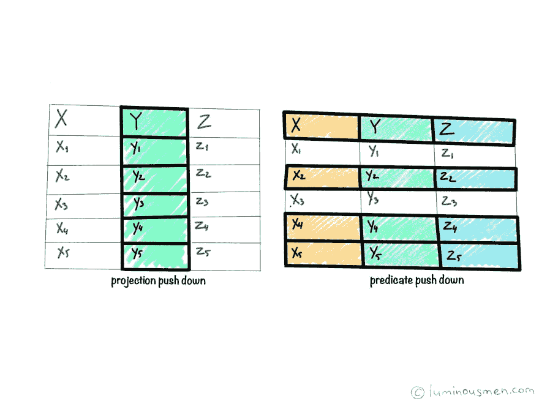

# 大数据文件格式解释

> 原文：<https://dev.to/luminousmen/big-data-file-formats-explained-22fc>

Apache Spark 支持许多不同的数据格式，比如无处不在的 CSV 格式和 web 友好的 JSON 格式。主要用于大数据分析的常见格式是 Apache Parquet 和 Apache Avro。

在这篇文章中，我们将讨论这 4 种格式的特性——CSV、JSON、Parquet 和 Avro 与 Apache Spark。

## CSV

CSV 文件(逗号分隔值)通常用于使用纯文本在系统之间交换表格数据。CSV 是基于行的文件格式，这意味着文件的每一行都是表中的行。基本上，CSV 包含一个标题行，为数据提供列名，否则，文件被认为是部分结构化的。CSV 文件最初不能显示层次结构或关系数据。数据连接通常通过使用多个 CSV 文件来组织。外键存储在一个或多个文件的列中，但是这些文件之间的链接不是由格式本身来表示的。此外，CSV 格式没有完全标准化，文件可以使用逗号以外的分隔符，如制表符或空格。

CSV 文件的另一个属性是，只有当它是原始的、未压缩的文件，或者使用了可拆分的压缩格式，如 [bzip2](https://en.wikipedia.org/wiki/Bzip2) 或 [lzo](https://ru.wikipedia.org/wiki/LZO) 时，它们才是可拆分的(注意:lzo 需要索引才是可拆分的！).

**优点**:

*   CSV 是人类可读的，易于手动编辑；
*   CSV 提供了一个简单的信息模式；
*   几乎所有现有的应用程序都处理 CSV
*   CSV 易于实现和解析；
*   CSV 很紧凑。对于 XML，每行每列都有开始标记和结束标记。在 CSV 中，您只需编写一次列标题。

**缺点**:

*   CSV 允许处理平面数据。除了格式之外，还需要处理复杂的数据结构；
*   不支持列类型。文本列和数字列之间没有区别；
*   没有标准的方法来表示二进制数据；
*   导入 CSV 的问题(不区分 NULL 和引号)；
*   特殊字符支持差；
*   缺乏普遍标准。

尽管有这些限制，CSV 文件仍然是数据共享的流行选择，因为它们受到广泛的商业应用程序、消费者和科学应用程序的支持。类似地，大多数批处理和流数据处理模块(例如 Spark 和 Hadoop)最初支持 CSV 文件的序列化和反序列化，并提供在读取时添加模式的方法。

## JSON

JSON 数据(JavaScript 对象符号)以部分结构化的格式表示为键值对。JSON 经常被比作 XML，因为它可以以分层格式存储数据。子数据由父数据表示。这两种格式都是自描述的，用户可以阅读，但是 JSON 文档通常要小得多。因此，它们更多地用于网络通信，尤其是随着基于 REST 的 web 服务的出现。

由于许多数据传输已经使用 JSON 格式，大多数 web 语言最初支持 JSON 或使用外部库来序列化和反序列化 JSON 数据。由于这种支持，JSON 通过表示数据结构、热数据的交换格式和冷数据存储被用于逻辑格式。

许多批处理和流数据处理模块本身支持 JSON 序列化和反序列化。虽然 JSON 文档中包含的数据最终可以存储为性能更优化的格式，比如 Parquet 或 Avro，但是它们充当原始数据，这对于重新处理数据非常重要(如果需要的话)。

JSON 文件有几个**优点**:

*   JSON 支持层次结构，简化了相关数据在一个文档中的存储和复杂关系的呈现；
*   大多数语言都提供了简化的 JSON 序列化库或对 JSON 序列化/反序列化的内置支持；
*   JSON 支持对象列表，有助于避免列表到关系数据模型的不稳定转换；
*   JSON 是 MongoDB、Couchbase、Azure Cosmos DB 等 NoSQL 数据库广泛使用的文件格式；
*   大多数现代工具的内置支持。

## [检察院](https://parquet.apache.org/)

Parquet 于 2013 年推出，由 Cloudera 和 Twitter 开发，作为基于列的存储格式，针对多列数据集的工作进行了优化。因为数据是按列存储的，所以它可以被高度压缩(压缩算法对通常包含在列中的低信息熵的数据执行得更好)和可拆分。该格式的开发者声称，这种存储格式非常适合大数据问题。

与 CSV 和 JSON 不同，Parquet 文件是包含关于其内容的**元数据**的**二进制**文件。因此，Spark 无需读取/解析文件内容，只需依靠元数据来确定列名、压缩/编码、数据类型甚至一些基本的统计数据。拼花文件的列元数据存储在文件的末尾，这样可以快速地一次性写入。

拼花优化为 *[【一写多读】](https://en.wikipedia.org/wiki/Write_once_read_many)【蠕虫】*范式。写起来很慢，但是读起来非常快，尤其是当您只访问全部列的子集时。对于阅读量大的工作负载来说，拼花地板是一个很好的选择。对于需要对整行数据进行操作的用例，应该使用 CSV 或 AVRO 这样的格式。

Parquet 中数据存储的**优势**:

*   拼花地板是一种*柱状格式*。只有需要的列才会被读取，这*减少了磁盘 I/O* 。这个概念叫做*投影下推*；
*   模式随数据一起移动，因此数据是*自描述的*；
*   尽管它是为 HDFS 创建的，但数据可以存储在其他文件系统中，如 GlusterFs 或 NFS 之上；
*   拼花地板只是文件，这意味着很容易与他们合作，移动，备份和复制；
*   Spark 开箱即用的本机支持提供了简单地将文件保存到您的存储中的能力；
*   即使使用像 [snappy](https://en.wikipedia.org/wiki/Snappy_(compression)) 这样的压缩格式，Parquet 也能提供高达 75%的出色压缩率；
*   实践表明，与其他文件格式相比，这种格式是读取工作流最快的格式；
*   Parquet 非常适合于数据仓库类型的解决方案，在这种解决方案中，需要对大量数据的某一列进行聚合；
*   可以使用 Avro API 和 Avro Schema 读写 Parquet(这给出了以 Avro 格式存储所有原始数据，但在 Parquet 中存储所有处理过的数据的想法)；
*   它还提供了*谓词下推*，从而进一步降低了磁盘 I/O 成本。

### 谓词下推/过滤器下推

谓词下推的基本思想是查询的某些部分(谓词)可以被“推”到数据存储的位置。例如，当我们给定一些过滤标准时，数据存储试图在从磁盘读取时过滤记录。谓词下推的优点是发生的磁盘 I/O 更少，因此性能会更好。否则，整个数据将被带入内存，然后需要进行过滤，这将导致大量的内存需求。

这种优化通过更早而不是更晚地过滤掉数据，可以大大减少查询/处理时间。根据处理框架的不同，谓词下推可以优化您的查询，方法是在数据通过网络传输之前过滤数据，在数据加载到内存之前过滤数据，或者跳过读取整个文件或文件块。

这个概念被大多数 RDBMS 所遵循，并被像 Parquet 和 ORC 这样的大数据存储格式所遵循。

### 投影下推

当从数据存储中读取数据时，只读取查询所需的那些列，而不是所有的字段。一般来说，像 Parquets 和 ORC 这样的列格式遵循这个概念，这导致了更好的 I/O 性能。

## [Avro](https://avro.apache.org/)

Apache Avro 是 Hadoop 工作组在 2009 年发布的。这是一种基于行的格式,具有高度可分割性。它还被描述为一个类似于 Java 序列化的数据序列化系统。模式以 JSON 格式存储，而数据以二进制格式存储，从而最小化文件大小并最大化效率。Avro 通过管理添加的字段、缺失的字段和已更改的字段，为模式进化提供了强大的支持。这允许旧软件读取新数据，新软件读取旧数据，如果您的数据有可能发生变化，这是一个关键特性。

有了 Avro 管理模式演变的能力，就有可能在不同的时间独立地更新组件，而不兼容的风险很低。这使应用程序不必编写 if-else 语句来处理不同的模式版本，也使开发人员不必查看旧代码来理解旧模式。因为模式的所有版本都存储在可读的 JSON 头中，所以很容易理解所有可用的字段。

Avro 可以支持许多不同的编程语言。因为模式存储在 JSON 中，而数据是二进制的，所以对于持久数据存储和有线传输来说，Avro 是一个相对紧凑的选择。Avro 通常是写入密集型工作负载的首选格式，因为它易于追加新行。

**优点**:

*   Avro 是语言中立的数据序列化
*   Avro 将模式存储在文件头中，因此数据是*自描述的*；
*   Avro 格式的文件是*可分割和可压缩的*，因此它是 Hadoop 生态系统中数据存储的一个很好的候选；
*   用于读取 Avro 文件的模式不必与用于写入文件的模式相同。这使得独立添加新字段成为可能。
*   就像序列文件一样，Avro 文件也包含同步标记来分隔块。这使得它非常容易分裂；
*   这些数据块可以使用 snappy 等压缩格式进行压缩。

## 总结

|  | 战斗支援车 | JSON | 镶木地板 | 欧罗欧欧欧罗欧欧欧欧欧欧欧欧欧欧欧欧欧欧欧欧欧欧欧欧欧欧欧欧欧欧欧欧欧欧欧欧欧 |
| --- | --- | --- | --- | --- |
| 圆柱的 | 不 | 不 | 是 | 不 |
| 可压缩的 | 是 | 是 | 是 | 是 |
| 可拆分的 | 是* | 是* | 是 | 是 |
| 人类可读的 | 是 | 是 | 不 | 不 |
| 支持复杂的数据结构 | 不 | 是 | 是 | 是 |
| 图式进化 | 不 | 不 | 是 | 是 |

* JSON 在压缩为 CSV 格式时也有同样的可分割性问题，但有一点不同。当“wholeFile”选项设置为 true (re: [SPARK-18352](http://web.archive.org/web/20190329085319/https://issues.apache.org/jira/browse/SPARK-18352) )时，JSON 不可拆分。

1.  CSV 通常应该是编写速度最快的，JSON 是人类最容易理解的，Parquet 是读取列子集最快的，而 Avro 是一次性读取所有列最快的。
2.  JSON 是网络交流的标准。API 和网站经常使用 JSON 进行通信，因为它们具有可用性属性，比如定义良好的模式。
3.  Parquet 和 Avro 无疑更适合大数据需求——可分割性、压缩支持、对复杂数据结构的强大支持，但可读性和写入速度相当差。

* * *

**感谢您的阅读！**

有什么问题吗？请在下面留下您的评论，开始精彩的讨论！

查看我的博客或来打个招呼👋在[推特](https://twitter.com/luminousmen)或订阅[我的电报频道](https://t.me/iamluminousmen)。
做好你的计划！