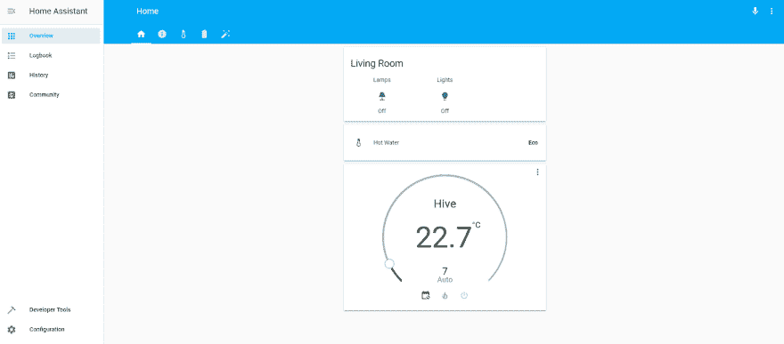
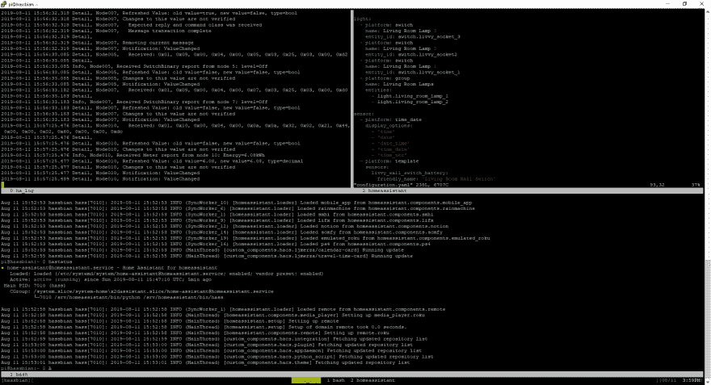

# 在屏幕上绑定箭头键+油灰

> 原文：<https://dev.to/whatang/binding-arrow-keys-in-screen-putty-2i9k>

当我在命令行上工作时，我最近变成了一个 GNU 屏幕终端窗口管理器的转换者。当管理我一直在玩的树莓 Pi 东西时，我对它特别满意，比如我一直在用[家庭助理](https://www.home-assistant.io)处理的家庭自动化东西。

[](https://res.cloudinary.com/practicaldev/image/fetch/s--90ZcQ5vE--/c_limit%2Cf_auto%2Cfl_progressive%2Cq_auto%2Cw_880/https://thepracticaldev.s3.amazonaws.com/i/9v2hn3mlyl32ob01n0xu.png)

我喜欢分离和重新连接会话的能力，所以我可以愉快地做一些事情，比如重新启动我的路由器，同时配置它，而不会丢失我在 Pi 上做的事情。对我来说，另一件大事是能够将一个终端会话分成多个窗格/区域，并在每个窗格/区域中运行不同的终端提示。像这样:

[](https://res.cloudinary.com/practicaldev/image/fetch/s--HbKkMCwo--/c_limit%2Cf_auto%2Cfl_progressive%2Cq_auto%2Cw_880/https://thepracticaldev.s3.amazonaws.com/i/pg1la81ud5wh5vxby0f5.png)

这里我有一个终端在我的 Z-Wave 网络日志上做一个`tail`操作，我的 HA `configuration.yaml`在 vim 的一个终端 sudo 中打开给`homeassistant`用户，还有一个额外的终端在底层使用`pi`用户进行命令行操作。全都坐在油灰会议上。真甜！

但这并不是为了说服你使用 screen(尽管你完全应该这样做)，而是为了记录一些花了一天时间让我抓狂的事情。我希望能够使用“Ctrl-A”+箭头键在该会话的各个区域之间轻松切换。应该很容易，对吧？只要找到配置并在那里放些东西。

好吧，是的，但是到底是什么有点烦人。[文档](https://www.gnu.org/software/screen/manual/html_node/Key-Binding.html#Key-Binding)对如何做到这一点不是很清楚，建议您需要使用`bindkey`命令。最终我勉强找到了工作。我的第一个解决方案看起来是这样的，并且工作得很好:

```
bindkey "^A^[[OA" focus up
bindkey "^A^[[OB" focus down
bindkey "^A^[[OC" focus right
bindkey "^A^[[OD" focus left 
```

不过，我对此并不太满意。问题是，您必须通过 PuTTY 会话准确地计算出箭头键转换成什么，并在开始时显式地添加 Ctrl-A 键绑定。这有点令人不快，有两个原因:

*   这意味着，如果将来我通过一些不同的访问使用 screen(例如，不是 PuTTY，或者伪装成不同终端类型的 ssh 会话)，那么如果它为箭头键发送不同的键码，它将停止工作。你可以使用`-k`选项和`bindkey`来给出一个键的符号表示(例如`-k ku`表示“向上箭头”)，但是我看不到一个简单的方法来坚持屏幕前缀命令键必须首先被按下。

*   它将屏幕前缀键硬编码为 Ctrl-A，这让作为程序员的我很不爽。如果我将来想使用不同的组合键，该怎么办？

不过，我发现了一个更简洁的方法，因为在
`bind`屏幕命令中有一个未记录的`-k`选项。这允许您在进入屏幕命令模式后，通过名称指定要使用的**键。**

因为`bind`只在我们处于屏幕命令模式时对按键起作用，这解决了我们上面的两个问题。所以现在我在我的`~/.screenrc`里有了下面的，这要整洁得多:

```
# Navigating regions with prefix + arrow
bind -k kl focus left
bind -k kr focus right
bind -k ku focus up
bind -k kd focus down 
```

祝放映愉快！