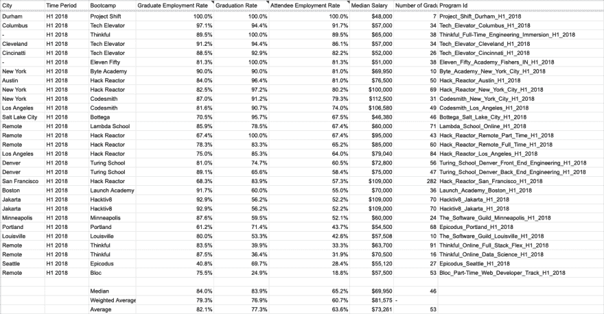

# 数字显示训练营的成果

> 原文：<https://dev.to/peteratticusberg/bootcamp-outcomes-by-the-numbers-3j01>

实际的谷歌表单可以在找到[。](https://docs.google.com/spreadsheets/d/1w55YZHZMamqdFiF3YLJygJlCFvaGaG-Y8xR415ueCPw/edit#gid=0)

这是什么？

有一个训练营小组，每隔一段时间，就以双方同意的格式报告他们的结果。这些是 2018 年上半年训练营报告的结果。

这个小组就是 CIRR(结果报告诚信委员会)，数据可以在这里找到(T2)。

## 关键要点

*   79.3%的毕业生找到了工作
*   76.9%的与会者毕业
*   60.7%的与会者找到了工作

## 牢记在心

#### 1)一些训练营“开除”学生

一些训练营在毕业前与表现不佳的学生分道扬镳，以确保他们的毕业生就业率反映了掌握课程的人的结果。

#### 2)就业是广义的定义

就业包括全职工作，兼职工作，合同工作，以及这里使用的实习。

#### 3)在线课程的毕业率较低

如果你看到一个非常低的毕业率，很可能是一个在线项目。

#### 这些平均值被在线节目压低了

这些数据中在线项目的存在拉低了引用的平均值。

#### 5)毕业后 6 个月报告就业人数

一个项目的就业率反映了完成该项目 6 个月后就业的毕业生人数。这是因为训练营的毕业生通常需要 3-6 个月才能找到工作。

#### 这些结果可能比平均水平要好

总的来说，公司倾向于分享好消息，对坏消息保持沉默。由于他们正在被报道，这些结果很可能比平均水平要好。