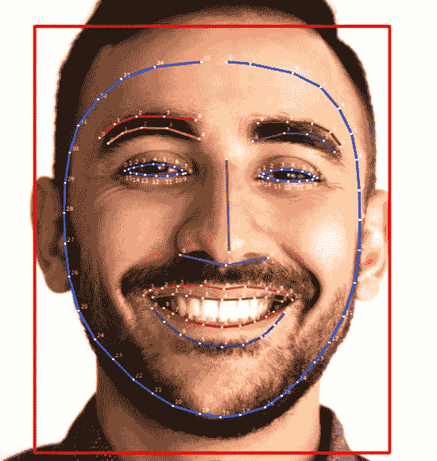

# 浅谈利用视觉框架进行人脸检测

> 原文：<https://dev.to/nexmobility/brief-about-face-detection-using-vision-framework-2nnp>

苹果推出了用于各种用途的新视觉库。最好的特征之一是利用人脸的界标来检测人脸。它可以识别眼睛、眉毛、耳朵、鼻子和嘴巴。使用这个库开发人员可以裁剪检测到的脸，甚至开发人员可以保持不同的条件，只从整个身体裁剪脸。

甚至这个库也可以检测胡子、眼镜和帽子。对于人脸检测，仅有标志是不够的，开发人员可能需要创建一些模型来使用 CoreML 训练模型，使其具有高级功能。如果开发人员需要注册 CoreML 模型，上传和训练人脸检测模型，如果更多的人脸图像上传到云中，那么将更加准确。在愿景中，最重要的是请求、请求处理程序和请求的结果。

人脸检测不是一件容易的事情。市场上只有少数几个库可以检测人脸，但与 iOS 集成对开发者来说是一个巨大的挑战。目前为止，市面上最有用的组件是 OpenCV，但空间有限，很难集成到 [iOS app 开发](https://www.nexmobility.com/ios-app-development.html)中。在 face 期间，crop 开发人员应该一次拍摄至少 20 张图像，以更准确地训练模型，然后将其压缩并上传到云服务器。一旦模型训练完毕，开发人员需要捕获上传的图片，以匹配特定的用户。

对于开发人员来说，面部识别是一个巨大的挑战和更繁琐的任务，以检测面部并获得 90-100%的准确性，但一旦开发出来，它就可以在各种行业、大学、酒店和公司等中发挥作用。这种解决方案效率更高，它将最小化长队列并优化系统。甚至它会使许多地方的生活变得更容易。

## 实现人脸检测:

**步骤 1:**
开发人员需要使用 VNDetectFaceRectanglesRequest 创建检测人脸图像的请求，然后开发人员需要为 VNImageRequestHandler 创建请求，开发人员需要处理图像类型以传递它。

```
 var facehandlerRequest: VNDetectFaceRectanglesRequest = {
 let facedetect = VNDetectFaceRectanglesRequest(completionHandler: self.facehandlerRequest)
 return facedetect
}()
var facehandlerrequest = VNImageRequestHandler(cgImage: cgImage, options: [: ])
do {
 try handler.perform([self.facehandlerRequest])
} catch {
 print("server error.\n\(error.localizedDescription)")
}

func FaceDetectionHandler(request: VNRequest, error: Error ? ) {
 guard
 let observations = request.results as ? [VNFaceObservation]
 else {
  print("unexpected result type from VNFaceObservation")
  return
 }
 DispatchQueue.main.async {
  for face in observations {
   let view = self.createBoxView(withColor: UIColor.red)
   view.frame = self.transformRect(fromRect: face.boundingBox, toViewRect: self.yourImageView)
   self.yourImageView.addSubview(view)
  }
 }
} 

```

**第二步:**
开发人员需要从 VNFaceobservation 获取观察数组，然后需要在面上绘制一个正方形/长方形来裁剪它。

```
 func facelandamrktransformRect(fromRect: CGRect , toViewRect :UIView) -> CGRect {
    var RectDetect = CGRect()
  RectDetect.size.width = fromRect.size.width * toViewRect.frame.size.width
    RectDetect.size.height = fromRect.size.height * toViewRect.frame.size.height
    RectDetect.origin.y =  (toViewRect.frame.height) - (toViewRect.frame.height * fromRect.origin.y )
    RectDetect.origin.y  = toRect.origin.y -  toRect.size.height
    RectDetect.origin.x =  fromRect.origin.x * toViewRect.frame.size.width
    return RectDetect  
}

func createBoxView(withColor: UIColor) - > UIView {
 let view = UIView()
 view.layer.borderColor = withColor.cgColor
 view.layer.borderWidth = 2
 view.backgroundColor = UIColor.clear
 return view
} 

```

**第三步:**
人脸检测后，开发者需要从检测到的人脸中裁剪出人脸，然后只有人脸可见，身体的其他部分使用逻辑从图像中消除，可以使用代码进行处理。

```
 public enum FaceCropResultSet {
  case success([T])
  case notFound
  case failure(Error)
}

public struct FaceDetectCropper {
  let detectable: T
  init(_ detectable: T) {
    self.detectable = detectable
  }
}
public protocol FaceCroppable {}
public extension FaceCroppable {
 var face: FaceDetectCropper < Self > {
  return FaceDetectCropper(self)
 }
}
public extension FaceDetectCropper where T: CGImage {
  func crop(_ completion: @escaping(FaceCropResultSet < CGImage > ) - > Void) {
    guard# available(iOS 11.0, *)
    else {
     return
    }
    let req = VNDetectFaceRectanglesRequest { request, error in
      guard error == nil else {
        completion(.failure(error!))
        return
      }

       let faceImages = request.results?.map({ result -> CGImage? in
        guard let face = result as? VNFaceObservation else { return nil }

        let context = UIGraphicsGetCurrentContext()

        // draw the image
        context?.scaleBy(x: 1.0, y: -1.0)

        let width = face.boundingBox.width * CGFloat(self.detectable.width)
        let height = face.boundingBox.height * CGFloat(self.detectable.height)
        let x = face.boundingBox.origin.x * CGFloat(self.detectable.width)
        let y = (1 - face.boundingBox.origin.y) * CGFloat(self.detectable.height) - height

        let croppingRect = CGRect(x: x, y: y, width: width, height: height)
        let faceImage = self.detectable.cropping(to: croppingRect)

        context?.saveGState()
        context?.setStrokeColor(UIColor.black.cgColor)
        context?.setLineWidth(8.0)
        context?.addRect(croppingRect)
        context?.drawPath(using: .stroke)
        context?.restoreGState()

        return faceImage
      }).flatMap { $0 }

      guard let result = faceImages, result.count > 0 else {
        completion(.notFound)
        return
      }

      completion(.success(result))
    }

    do {
      try VNImageRequestHandler(cgImage: self.detectable, options: [:]).perform([req])
    } catch let error {
      completion(.failure(error))
    }
  }
}

public extension FaceDetectCropper where T: UIImage {
 func crop(_ completion: @escaping(FaceCropResultSet < UIImage > ) - > Void) {
  guard# available(iOS 11.0, *)
  else {
   return
  }
  self.detectable.cgImage!.face.crop {
   result in
    switch result {
     case.success(let cgFaces):
      let faces = cgFaces.map {
       cgFace - > UIImage in
        return UIImage(cgImage: cgFace)
      }
     completion(.success(faces))
     case.notFound:
      completion(.notFound)
     case.failure(let error):
      completion(.failure(error))
    }
  }
 }
}
extension NSObject: FaceCroppable {}
extension CGImage: FaceCroppable {} 

```

第四步:
开发人员需要创建自定义相机，他可以采取最少 20 张照片，裁剪脸和压缩它。一旦裁剪完成，图片就可以上传到云端进行 CoreML 训练。一旦用裁剪人脸图像训练了模型，就可以在下一步中通过调用 CoreML API 并在 CoreML API 中传递图像来进行比较。如果成功，则找到该面，如果没有找到，将出现消息并重试该选项。

```
 func imagePickerController(_ picker: UIImagePickerController, didFinishPickingMediaWithInfo info: [UIImagePickerController.InfoKey: Any]) {
 let image = info[UIImagePickerController.InfoKey.originalImage]
 let image1 = info[UIImagePickerController.InfoKey.originalImage] as!UIImage
 image1.face.crop {
  result in
  switch result {
    case.success(let faces):
     for i in 0.. < faces.count {
      self.capturedImages.append(faces[i])
     }
    print("capturedImages", self.capturedImages)
    print("capturedImages", faces.count)
    let string1: String = TrainModelViewController.userID!
     if self.capturedImages.count == 10 {
     self.cameraTimer.invalidate()
     for i in 0.. < self.capturedImages.count {
      let documentsPath1 = NSURL(fileURLWithPath: NSSearchPathForDirectoriesInDomains(.documentDirectory, .userDomainMask, true)[0])
      print("documentsPath1", documentsPath1)
      let folderPath = NSSearchPathForDirectoriesInDomains(.documentDirectory, .userDomainMask, true).first!+"/" + string1 + "/"
      try ? FileManager.default.createDirectory(at: URL(fileURLWithPath: folderPath), withIntermediateDirectories: false, attributes: nil)
      let filePath = folderPath + "\(String(describing:i))" + ".png"
      print("filepath", filePath)
      let imageData = (image as!UIImage).jpegData(compressionQuality: 0.5)
      FileManager.default.createFile(atPath: filePath, contents: imageData, attributes: nil)

      if try !FileManager.default.contentsOfDirectory(atPath: folderPath).count == self.capturedImages.count {
       do {
        let zipFilePath =
         try Zip.quickZipFiles([URL(fileURLWithPath: folderPath)], fileName: string1)
        print("zip file path", zipFilePath)
        ZipImageViewController.zipfilepath1 = zipFilePath as URL

       } catch {
        print("Something went wrong")
       }
      }
     }
    }
    break
    case.notFound:
     let alert = UIAlertController(title: "Face not detected", message: "Please choose another image", preferredStyle: UIAlertController.Style.alert)
    alert.addAction(UIAlertAction(title: "Ok", style: UIAlertAction.Style.default, handler: nil))
    self.present(alert, animated: true, completion: nil)
    break
    case.failure(let error):
     let alert = UIAlertController(title: "Face not detected", message: "Please choose another image", preferredStyle: UIAlertController.Style.alert)
    alert.addAction(UIAlertAction(title: "Ok", style: UIAlertAction.Style.default, handler: nil))
    self.present(alert, animated: true, completion: nil)
    break
   }
 }
 if !cameraTimer.isValid {
  finishAndUpdate()
 }
} 

```

**第五步:**
样本图像:一旦图像被检测到，红色矩形区域
[](https://res.cloudinary.com/practicaldev/image/fetch/s--uYVoto0F--/c_limit%2Cf_auto%2Cfl_progressive%2Cq_auto%2Cw_880/https://i.ibb.co/CKxsssv/Face-detection-in-i-OS-Apps.png) 将被裁剪