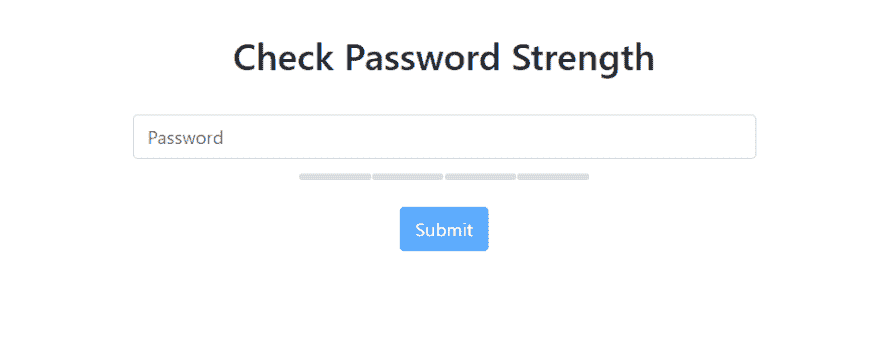

# 用 Angular 构建一个密码强度检查器

> 原文：<https://dev.to/uzochukwueddie/build-a-password-strength-checker-with-angular-479d>

在这篇文章中，我们将创建一个带有密码输入字段的简单表单。然后，我们将添加一个密码强度检查功能。我们将在密码输入表单中添加以下规则。密码

*   长度必须至少为 6 个字符
*   必须包含至少一个大写字母
*   必须包含至少一个小写字母
*   必须包含至少一个数字
*   必须包含至少一个特殊字符

我们将使用 RegExp 验证上面的每个规则，然后显示一些颜色条来指示密码的强度。在文章的最后，我们将看到如何使用

*   反应形式(以简单的方式)
*   使用@Input 和@Output 装饰器的组件交互
*   代表密码强度的颜色和条形

这是最终应用程序的样子:

[](https://res.cloudinary.com/practicaldev/image/fetch/s--i8sLVIEL--/c_limit%2Cf_auto%2Cfl_progressive%2Cq_66%2Cw_880/https://thepracticaldev.s3.amazonaws.com/i/p9o10dc3bsm8utc32ejw.gif)

# 入门

首先，我们将通过运行命令
使用 Angular CLI 创建一个新项目

```
ng new password-strength 
```

在这个应用程序中，没有导航，所以不需要添加路由文件。

为了简单起见，让我们安装 bootstrap 4。

```
npm install bootstrap 
```

添加此

```
@import '~bootstrap/dist/css/bootstrap.min.css'; 
```

到项目的 src 目录中的`styles.scss`或`styles.css`文件。请注意，您可以使用自己选择的任何其他库来设计应用程序的样式。

如果你用的是纱线

```
yarn add bootstrap 
```

## 创建表单

在`app.module.ts`中，添加导入反应式模块

```
import { ReactiveFormsModule } from '@angular/forms'; 
```

然后将 ReactiveFormsModule 添加到导入数组

```
imports: [
    BrowserModule,
    ReactiveFormsModule
] 
```

如果你愿意，你可以使用一个`Template Driven Form`。这里我决定用反应式。

现在，在`app.component.html`文件中，添加 html 模板

```
<div class="container">
  <div class="row">
      <div class="col mt-5 col-xs-6 col-md-6 col-lg-6">
        <h2>Check Password Strength</h2>
        <br>
      <form>
        <div class="form-group">
          <input type="password" class="form-control" autocomplete="off" placeholder="Password">
        </div>
        <button type="submit" class="btn btn-primary">
          Submit
        </button>
      </form>
    </div>
  </div>
</div> 
```

表单包含一个密码输入字段。添加到 div 元素中的类来自 bootstrap 4。

在`app.component.scss`或`app.component.css`中根据您所选择的，添加到文件

```
.col {
  margin: 0 auto;
  text-align: center;
} 
```

[](https://res.cloudinary.com/practicaldev/image/fetch/s--I2kxGHKQ--/c_limit%2Cf_auto%2Cfl_progressive%2Cq_auto%2Cw_880/https://thepracticaldev.s3.amazonaws.com/i/ffrmnl84nk77tu5a0s2v.PNG)

要在 Angular 中使用反应式表单，我们需要向表单添加一个`formGroup`属性，然后向输入字段添加一个`formControlName`。

在表单上，添加

```
[formGroup]="passwordForm" 
```

所以这个表单看起来有点像

```
<form [formGroup]="passwordForm">
    ...
</form> 
```

此外，在密码输入栏上，添加

```
formControlName="password" 
```

接下来，我们需要初始化反应式表单。在`app.component.ts`文件中，添加导入文件

```
import { FormGroup, FormBuilder, Validators } from '@angular/forms'; 
```

`FormGroup`跟踪表单控件元素的状态。`FormBuilder`有助于减少创建表单所需的样板文件。`Validators`提供了一些要使用的内置验证器。我们使用这些类来初始化表单。

创建类型为`FormGroup`的属性。

```
passwordForm: FormGroup; 
```

我们需要构造器和 ngOnInit 方法。首先，我们需要实现`OnInit`接口，然后从`@angular/core`导入。出口类行将变成

```
export class AppComponent implements OnInit 
```

添加两种方法

```
constructor(private fb: FormBuilder) {}

ngOnInit() {
    this.passwordForm = this.fb.group({
        password: ['', Validators.required],
    });
} 
```

在构造函数中，注入了 FormBuilder 类，以便我们可以使用该类中可用的方法。在 ngOnInit 方法中，使用 FormBuilder 初始化 passwordForm，然后验证密码字段。group 方法中对象的键必须与模板中的`formControlName`匹配。所需的验证器被添加到输入字段中。现在我们有了表单和密码字段的设置。我们现在可以创建一个新的组件来显示密码强度。

## 密码强度分量

将作为主组件的子组件添加的密码强度组件将用于显示一些指示用户键入的密码强度的条。当用户在密码字段中键入密码时，条形将自动更新为不同的颜色。

为了创建一个新的组件，我们运行

```
ng generate component password-strength 
```

该组件将自动添加到`app.module.ts`文件中。在`password-strength.component.html`文件中，添加

```
<div class="strength">
  <ul class="strengthBar">
    <li class="point" [style.background-color]="bar0"></li>
    <li class="point" [style.background-color]="bar1"></li>
    <li class="point" [style.background-color]="bar2"></li>
    <li class="point" [style.background-color]="bar3"></li>
  </ul>
  <br>
</div> 
```

将这些属性添加到`password-strength.component.ts`文件

```
bar0: string;
bar1: string;
bar2: string;
bar3: string; 
```

在组件的样式文件中，添加

```
.strengthBar {
  display: inline;
  list-style: none;
  margin: 0;
  padding: 0;
  vertical-align: 2px;
}

.point:last-of-type {
  margin: 0 !important;
}

.point {
  background: #DDD;
  border-radius: 2px;
  display: inline-block;
  height: 5px;
  margin-right: 1px;
  width: 62px;
}

p {
  font-weight: bold;
  font-size: 20px;
} 
```

转到`app.component.html`文件，使用组件选择器名称`<app-password-strength></app-password-strength>`添加密码强度组件作为子组件。该组件应添加在密码输入字段之后。

```
<div class="container">
  <div class="row">
      <div class="col mt-5 col-xs-6 col-md-6 col-lg-6">
        <h2>Check Password Strength</h2>
        <br>
      <form [formGroup]="passwordForm">
        <div class="form-group">
          <input type="password" class="form-control" formControlName="password" autocomplete="off" placeholder="Password">
          <app-password-strength></app-password-strength>
        </div>
        <button type="submit" class="btn btn-primary">
          Submit
        </button>
      </form>
    </div>
  </div>
</div> 
```

[](https://res.cloudinary.com/practicaldev/image/fetch/s--Z497ygvD--/c_limit%2Cf_auto%2Cfl_progressive%2Cq_auto%2Cw_880/https://thepracticaldev.s3.amazonaws.com/i/gqukxleuehqhltdz1mie.PNG)

该组件由一个带有 ul 和 li 标签的 div 组成。li 标签代表页面上的条形。当用户在输入字段中键入内容时，将显示组件类中指定的颜色。一旦密码与所有指定的字符匹配，所有条形的颜色将变为绿色。

## 密码强度功能

父组件和子组件之间的交互将使用`@Input`装饰器来实现。来自密码表单的密码将被绑定到来自密码强度组件的一个`Input`属性。有不同的方法可以截获数据。我们将使用`ngOnChanges`方法截取数据。

让我们创建一个名为`passwordToCheck`
的输入属性

```
@Input() public passwordToCheck: string; 
```

然后创建一个颜色数组显示在条形上。数组中颜色的数量应该与组件中条形的数量相匹配。

```
private colors = ['darkred', 'orangered', 'orange', 'yellowgreen']; 
```

现在，让我们创建一个方法来检查密码的强度。添加以下代码

```
checkStrength(p) {
  // 1
  let force = 0;

  // 2
  const regex = /[$-/:-?{-~!"^_@`\[\]]/g;
  const lowerLetters = /[a-z]+/.test(p);
  const upperLetters = /[A-Z]+/.test(p);
  const numbers = /[0-9]+/.test(p);
  const symbols = regex.test(p);

  // 3
  const flags = [lowerLetters, upperLetters, numbers, symbols];

  // 4
  let passedMatches = 0;
  for (const flag of flags) {
    passedMatches += flag === true ? 1 : 0;
  }

  // 5
  force += 2 * p.length + ((p.length >= 10) ? 1 : 0);
  force += passedMatches * 10;

  // 6
  force = (p.length <= 6) ? Math.min(force, 10) : force;

  // 7
  force = (passedMatches === 1) ? Math.min(force, 10) : force;
  force = (passedMatches === 2) ? Math.min(force, 20) : force;
  force = (passedMatches === 3) ? Math.min(force, 30) : force;
  force = (passedMatches === 4) ? Math.min(force, 40) : force;

  return force;
} 
```

首先，定义一个名为 force 的 number 类型的属性，该属性用作该方法的返回类型。分配给属性的值将用于确定密码的强度。第二部分是正则表达式的定义。特殊字符的正则表达式，小写测试，大写测试，数字测试和正则表达式测试。第三部分是一个数组，包含要使用的正则表达式。在第四部分中，定义了一个名为`passedMatches`的 number 类型的属性，它的值在循环中根据满足的正则表达式递增。因此，如果满足 flags 数组中的第一个标准，那么`passedMatches`的值就增加 1。如果满足第二个标准，当前值也增加 1，直到满足所有标准。否则，添加值 0。第 5 部分检查密码长度是否大于 10，然后将`passedMatches`值乘以 10。第 6 部分是检查密码长度(至少需要 6 个字符)的地方。第 7 部分是根据`passedMatches`的值设置最终的`force`值。然后返回强制值。

接下来，我们需要将`passwordToCheck`输入属性绑定到表单密码。将`[passwordToCheck]="signupForm.value.password"`添加到`app.component.html`中的子组件。

```
<app-password-strength [passwordToCheck]="signupForm.value.password"></app-password-strength> 
```

`passwordToCheck`是在密码强度组件中定义的`@Input`属性。它绑定到来自`formGroup`的密码值。因此，无论密码值字段中存储了什么值，都会在子组件中接收到。

就像我前面说过的，在子组件中有多种方法可以截取密码值。你可以签出这个[文档](https://angular.io/guide/component-interaction#pass-data-from-parent-to-child-with-input-binding)。我们将使用 ngOnChanges 方法来截取更改。

在`PasswordStrengthComponent`类中实现`OnChanges`接口，然后从`@angular/core`导入接口。接下来是添加方法

```
ngOnChanges(changes: { [propName: string]: SimpleChange }): void {
  const password = changes.passwordToCheck.currentValue;
  this.setBarColors(4, '#DDD');
  if (password) {
    const c = this.getColor(this.checkStrength(password));
    this.setBarColors(c.index, c.color);
  }
}

private getColor(s) {
  let index = 0;
  if (s === 10) {
    index = 0;
  } else if (s === 20) {
    index = 1;
  } else if (s === 30) {
    index = 2;
  } else if (s === 40) {
    index = 3;
  } else {
    index = 4;
  }
  return {
    index: index + 1,
    color: this.colors[index]
  };
}

private setBarColors(count, col) {
  for (let n = 0; n < count; n++) {
    this['bar' + n] = col;
  }
} 
```

`ngOnChanges`方法接受类型`SimpleChange`的属性。在 SimpleChange 属性中，我们有包含密码当前值的`passwordToCheck`输入属性。当值改变时，密码被 ngOnChanges 方法截获。在 if 语句之前定义的`setBarColors`用于设置条形的默认颜色。如果密码是可用的，那么`getColor`方法被调用，它接受`checkStrength`的输入，后者又将密码作为一个参数。注意，`checkStrength`返回一个在`getColor`中使用的数字。`setBarColors`用于设置条形上颜色阵列中的颜色。

在`getColor`方法中，如果`checkStrength`的返回值等于 10，那么我们将索引值设置为零，依此类推。然后返回带有索引和颜色的对象。回想一下，条形有一个 style 属性，其名称后面附加了一个数字。例如:`bar0, bar1, bar2, bar3`。`setBarColors`仅用于设置条块上的数组颜色。

[](https://res.cloudinary.com/practicaldev/image/fetch/s--cxFT5uju--/c_limit%2Cf_auto%2Cfl_progressive%2Cq_66%2Cw_880/https://thepracticaldev.s3.amazonaws.com/i/27lvks38xkhyuyjft9xi.gif)

我们可以通过在用户输入时显示一条消息并禁用提交按钮(除非密码有效)来添加更多功能。

### 禁用按钮

为了禁用提交按钮，我们将使用`@Output`装饰器将数据从子节点发送到父节点。在这种情况下是从密码强度组件到主组件。

将这一行添加到密码强度组件类:

```
@Output() passwordStrength = new EventEmitter<boolean>(); 
```

将`Output`接口和`EventEmiiter`添加到`@angular/core`导入中。EventEmitter 将发出一个布尔值。在这种情况下，当密码变得有效时为 true 值，发出的值将用于启用提交按钮。

在`ngOnChanges`方法中，将下面一行添加到 if 语句
中

```
const pwdStrength = this.checkStrength(password);
pwdStrength === 40 ? this.passwordStrength.emit(true) : this.passwordStrength.emit(false); 
```

这里我们将`checkStrength`方法的返回值设置为一个变量。然后使用三元运算符发出一个布尔值。如果 pwdStrength 等于 40，则发出`true`。如果 pwdStrength 小于 40 则发射`false`。线路同

```
if (pwdStrength === 40) {
  this.passwordStrength.emit(true)
} else {
  this.passwordStrength.emit(false)
} 
```

下一步是在主组件中使用这个`@Output` eventemitter。在组件`<app-password-strength></app-password-strength>`中，添加

```
(passwordStrength)="passwordValid($event)" 
```

然后变成

```
<app-password-strength [passwordToCheck]="signupForm.value.password" (passwordStrength)="passwordValid($event)"></app-password-strength> 
```

`passwordStrength`是输出属性，而`passwordValid($event)`是需要在主类组件中定义的方法。作为参数添加的`$event`属性将包含发出的布尔值。

向主组件的类中添加一个新属性。

```
passwordIsValid = false; 
```

并且还添加了`passwordValid`方法

```
passwordValid(event) {
  this.passwordIsValid = event;
} 
```

EventEmitter 发出的值被设置为`passwordIsValid`属性。我们现在可以使用这个属性来禁用按钮。

在提交按钮上，添加`[disabled]="!passwordIsValid"`。

```
<button type="submit" class="btn btn-primary" [disabled]="!passwordIsValid">
  Submit
</button> 
```

因此，如果`passwordIsValid`的值为假，那么按钮将被禁用。当密码有效时，该按钮将在页面上启用。

[](https://res.cloudinary.com/practicaldev/image/fetch/s--74RoBT6a--/c_limit%2Cf_auto%2Cfl_progressive%2Cq_66%2Cw_880/https://thepracticaldev.s3.amazonaws.com/i/hz2lzr3gqq5w8segtgzx.gif)

最后要注意的是在用户输入时添加消息。创建两个新变量

```
msg: string;
msgColor: string; 
```

在密码强度组件类中。然后在带有`msg`变量的模板中的`ul`标签后添加一个`p`标签。

```
<p [style.color]="msgColor">{{msg}}</p> 
```

在`ngOnChanges`方法的 if 语句中，添加这个 switch 语句

```
switch (pwdStrength) {
  case 10:
    this.msg = 'Poor';
    break;
  case 20:
    this.msg = 'Not Good';
    break;
  case 30:
    this.msg = 'Average';
    break;
  case 40:
    this.msg = 'Good';
    break;
} 
```

如果`pwdStrength`是 10，那么 msg 被设置为等于`Poor`等等。因此，当用户在输入字段中键入内容时，msg 变量就会更新。此外，如果用户决定清除输入字段，我们希望能够清除消息。所以在 if 语句中增加一个 else 部分，加上

```
this.msg = ''; 
```

如果输入字段为空，则消息应被清除。在`getColor`方法中，在 return 语句前添加`this.msgColor = this.colors[index]`。这个方法现在变成了

```
private getColor(s) {
  ...
  this.msgColor = this.colors[index];
  ...
} 
```

[](https://res.cloudinary.com/practicaldev/image/fetch/s--i8sLVIEL--/c_limit%2Cf_auto%2Cfl_progressive%2Cq_66%2Cw_880/https://thepracticaldev.s3.amazonaws.com/i/p9o10dc3bsm8utc32ejw.gif)

# 结论

到目前为止，我们已经能够添加密码强度功能。我们看到了如何在 Angular、@Input 和@Output 装饰器中使用反应式表单进行组件交互。您可以向密码添加更多的正则表达式验证。

[点击此处](https://github.com/uzochukwueddie/password-strength)找到示例应用的 github repo。

如果你对更多与角度相关的东西感兴趣，你可以关注我的 [Twitter](https://twitter.com/uzochukwueddie) ，也可以订阅我的 [YouTube 频道](https://www.youtube.com/channel/UCqTEGhqVPcjfhs7_bQjnoRA/videos?view_as=subscriber)。