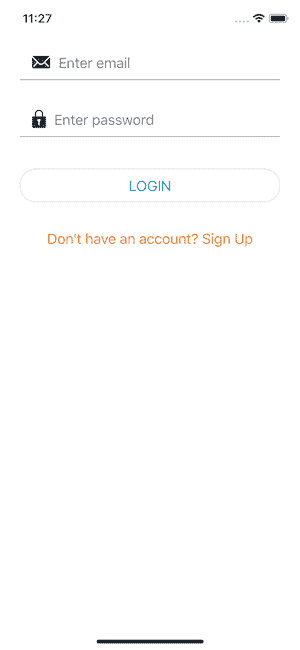
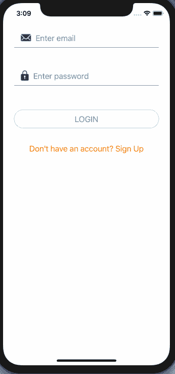
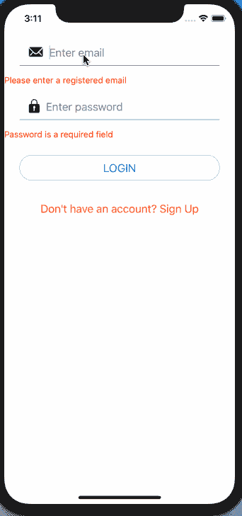
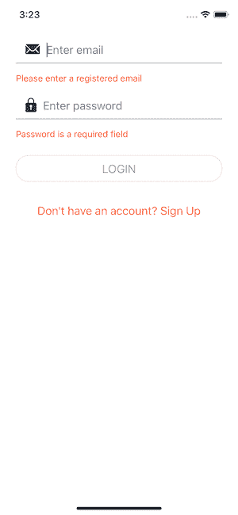
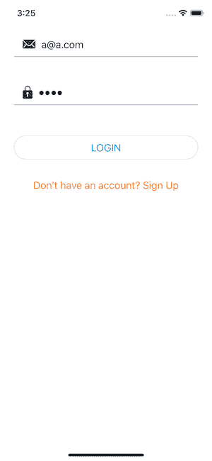
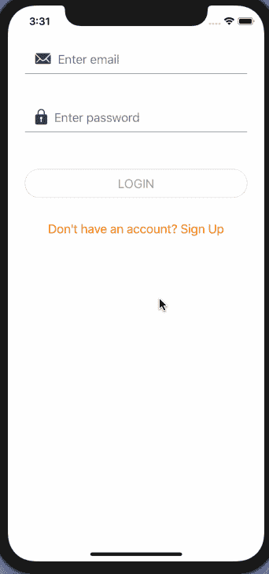
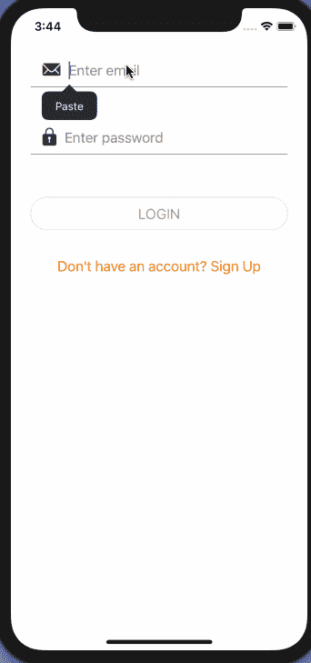
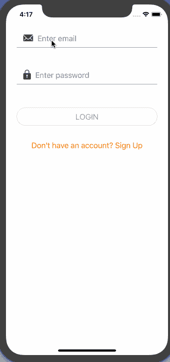
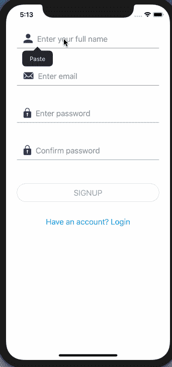

# 使用 Formik 和 Yup 在 React Native 中构建和验证表单

> 原文：<https://dev.to/amanhimself/build-and-validate-forms-in-react-native-using-formik-and-yup-54oc>

[](https://res.cloudinary.com/practicaldev/image/fetch/s--vnC_vW0u--/c_limit%2Cf_auto%2Cfl_progressive%2Cq_auto%2Cw_880/https://i.imgur.com/nmJGbVp.jpg)

Formik 和 yup 是很棒的开发工具，可以根据您的 React 原生应用程序需求构建非常棒的 UI 表单。在本教程结束时，我将带您浏览这篇文章，为登录和注册屏幕构建两个表单，并展示使用 Formik 和 Yup 等库的组合来验证它们是多么容易，您将会了解这种说法的完整上下文。

> 本教程将使用一些已经安装好的源代码，从 [**到**](https://github.com/amandeepmittal/expo-firebase/releases/tag/0.1.0) 的 Github repo release。

请务必下载源代码，以便密切关注这篇文章，并更好地理解 Formik 和 yup 等库。您正在下载的源代码文件包含使用导航模式，如 Stack 和 Switch，以满足在 React 本机应用程序中模拟身份验证流程的要求。它还包含三个屏幕的最少代码:

*   注册
*   签约雇用
*   主页

你将继续在它们的基础上发展。关于我如何设置这个认证流程的完整细节，请关注上一篇文章[认证流程如何在使用 React Navigation 4.x](https://heartbeat.fritz.ai/how-authentication-flow-works-in-react-native-apps-using-react-navigation-4-x-a30bb4d9e5d6) 的 React 原生应用中工作。

## 目录

*   要求
*   安装库
*   创建可重用组件
*   创建登录表单
*   将 Formik 添加到登录表单
*   处理表单提交
*   用“是”验证表单
*   重构错误消息
*   表单无效时禁用按钮
*   仅当触摸指定字段时显示错误
*   提交时在登录按钮上显示加载指示器
*   对你的挑战💪
*   结论

## 要求

如果您打算单独编写代码，请确保您已经安装了以下软件:

*   安装了 npm/yarn 的 Nodejs (>= `10.x.x`)。
*   expo-cli (>= `3.x.x`)，以前称为 create-react-native-app。
*   Mac 用户可以使用 iOS 模拟器。
*   Windows/Linux 用户必须运行 Android 模拟器。

要了解更多关于如何在本地开发环境中设置和运行模拟器或仿真器的信息，请访问 React Native 的官方文档[这里](https://facebook.github.io/react-native/docs/getting-started)。

## 安装库

现在，前一篇文章中的`package.json`文件如下所示。它包含一个基本的 Expo 空白模板和对`react-navigation`库的依赖。

```
"dependencies":  {  "expo":  "^34.0.1",  "react":  "16.8.3",  "react-dom":  "^16.8.6",  "react-native":  "https://github.com/expo/react-native/archive/sdk-34.0.0.tar.gz",  "react-native-gesture-handler":  "~1.3.0",  "react-native-reanimated":  "~1.1.0",  "react-native-screens":  "1.0.0-alpha.22",  "react-native-web":  "^0.11.4",  "react-navigation":  "4.0.0",  "react-navigation-stack":  "1.5.1"  }, 
```

Enter fullscreen mode Exit fullscreen mode

安装将用于创建登录和注册表单的库。打开一个终端窗口并执行以下命令。

```
yarn add formik yup react-native-elements 
```

Enter fullscreen mode Exit fullscreen mode

UI 库`react-native-elements`是一个“跨平台 React 原生 UI 工具包”,它使得在 React 原生应用中构建各种具有附加功能的界面组件变得容易。这将加快这个演示的开发过程。

## 创建可重用组件

在`components/`目录下创建两个名为`FormButton.js`和`FormInput.js`的新文件。这两个组件都是表示性的，可以在屏幕组件中重用。打开`FormButton.js`文件，导入`Button`组件`react-native-elements`库。

它是一个可触摸的元素，允许用户与设备的屏幕进行交互并执行下一个操作。该自定义组件将接收用于样式及其风格的道具。组件库`react-native-elements`有不同的方式[样式一个按钮](https://react-native-training.github.io/react-native-elements/docs/button.html#buttonstyle)。

```
//FormButton.js
import React from 'react'
import { Button } from 'react-native-elements'

const FormButton = ({ title, buttonType, buttonColor, ...rest }) => (
  <Button
    {...rest}
    type={buttonType}
    title={title}
    buttonStyle={{ borderColor: buttonColor, borderRadius: 20 }}
    titleStyle={{ color: buttonColor }}
  /> )

export default FormButton 
```

Enter fullscreen mode Exit fullscreen mode

接下来，打开`FormInput.js`文件。同样，这将是一个文本输入字段的自定义组件。从`react-native-elements`中导入 [`Input`](https://react-native-training.github.io/react-native-elements/docs/input.html#docsNav) 元素。它允许用户在表单 UI 中输入文本。它也接收道具，因为使用 Expo，`vector-icons`可以被导入，而不需要手动安装第三方依赖项。

最后，注意剩余的道具是如何使用 rest 操作符传递给对象的。这也被称为 [rest 参数语法](https://developer.mozilla.org/en-US/docs/Web/JavaScript/Reference/Functions/rest_parameters)。确保道具的顺序和下面一样。也就是说，`...rest`出现在`FormInput`组件的其他属性之前，因为它不能覆盖其他属性。

```
import React from 'react'
import { Input } from 'react-native-elements'
import { StyleSheet, View } from 'react-native'
import { Ionicons } from '@expo/vector-icons'

const FormInput = ({
  iconName,
  iconColor,
  returnKeyType,
  keyboardType,
  name,
  placeholder,
  value,
  ...rest
}) => (
  <View style={styles.inputContainer}>
    <Input
      {...rest}
      leftIcon={<Ionicons name={iconName} size={28} color={iconColor} />}
      leftIconContainerStyle={styles.iconStyle}
      placeholderTextColor="grey"
      name={name}
      value={value}
      placeholder={placeholder}
      style={styles.input}
    />
  </View> )

const styles = StyleSheet.create({
  inputContainer: {
    margin: 15
  },
  iconStyle: {
    marginRight: 10
  }
})

export default FormInput 
```

Enter fullscreen mode Exit fullscreen mode

## 创建登录表单

既然定制组件都已经设置好了，让我们创建一个登录屏幕组件。打开`screens/Login.js`文件，导入所有需要的语句。然后，在不改变您下载的上一个基本 repo 的状态或任何处理函数的情况下，让我们直接进入`Login`组件的 render 方法。

```
import React from 'react'
import { StyleSheet, SafeAreaView, View } from 'react-native'
import { Button } from 'react-native-elements'
import FormInput from '../components/FormInput'
import FormButton from '../components/FormButton'

export default class Login extends React.Component {
  state = {
    email: '',
    password: ''
  }

  handleEmailChange = email => {
    this.setState({ email })
  }

  handlePasswordChange = password => {
    this.setState({ password })
  }

  onLogin = async () => {
    const { email, password } = this.state
    try {
      if (email.length > 0 && password.length > 0) {
        this.props.navigation.navigate('App')
      }
    } catch (error) {
      alert(error)
    }
  }

  goToSignup = () => this.props.navigation.navigate('Signup')
  render() {
    const { email, password } = this.state

    return (
      <SafeAreaView style={styles.container}>
        <FormInput
          name="email"
          value={email}
          placeholder="Enter email"
          autoCapitalize="none"
          onChangeText={this.handleEmailChange}
          iconName="ios-mail"
          iconColor="#2C384A"
        />
        <FormInput
          name="password"
          value={password}
          placeholder="Enter password"
          secureTextEntry
          onChangeText={this.handlePasswordChange}
          iconName="ios-lock"
          iconColor="#2C384A"
        />
        <View style={styles.buttonContainer}>
          <FormButton
            buttonType="outline"
            onPress={this.handleOnLogin}
            title="LOGIN"
            buttonColor="#039BE5"
          />
        </View>
        <Button
          title="Don't have an account? Sign Up"
          onPress={this.goToSignup}
          titleStyle={{
            color: '#F57C00'
          }}
          type="clear"
        />
      </SafeAreaView>
    )
  }
}

const styles = StyleSheet.create({
  container: {
    flex: 1,
    backgroundColor: '#fff'
  },
  buttonContainer: {
    margin: 25
  }
}) 
```

Enter fullscreen mode Exit fullscreen mode

注意，在`SafeAreaView`中有两个`FormInput`字段和两个按钮，其中一个是之前创建的自定义按钮。输入字段上的属性，如`secureTextEntry`和`autoCapitalize`，对于每个输入字段都是唯一的。因此，这就是`rest`参数语法派上用场的地方。另外，请注意这两个按钮的类型将如何在下面的输出中产生 UI 差异。

[](https://res.cloudinary.com/practicaldev/image/fetch/s--DYhNUHNZ--/c_limit%2Cf_auto%2Cfl_progressive%2Cq_auto%2Cw_880/https://cdn-images-1.medium.com/max/800/1%2AK-r4nW6kke_tsxLgp_BvKA.png)

## 将 Formik 添加到登录表单

Formik 是一个小型的库，它帮助表单在 React 和 React Native 中进行组织，包括以下内容:

*   它跟踪表单的状态
*   通过可重用的方法和处理程序(*如`handleChange`、`handleBlur`和`handleSubmit`、*)处理表单提交
*   处理现成的验证和错误消息

有时很难管理和实现以上几点。使用 Formik，您可以理解表单中到底发生了什么，并编写更少的代码行。由[贾里德·帕尔默](https://twitter.com/jaredpalmer)创建的它有一个很棒的 [API](https://jaredpalmer.com/formik/docs/overview) 可以参考。

首先，打开`Login.js`文件并导入库。

```
//Login.js

// ... with other import statements
import { Formik } from 'formik' 
```

Enter fullscreen mode Exit fullscreen mode

接下来，在`SafeAreaView`中使用`Formik`作为包装元素。它带有不同的道具来处理表单，如`initialValues`和`onSubmit`处理程序方法。`initialValues`接受包含表单值的对象。在当前表单的情况下，这些值将是`email`和`password`。`onSubmit`方法接受一个函数，该函数将这些`values`作为第一个参数来处理表单提交。

最后，Formik 中使用的第三种方法是 render 方法本身。它遵循[渲染道具模式](https://reactpatterns.com/#render-prop)。看看下面的登录组件。

```
export default class Login extends React.Component {
  goToSignup = () => this.props.navigation.navigate('Signup')
  render() {
    return (
      <SafeAreaView style={styles.container}>
        <Formik
          initialValues={{ email: '', password: '' }}
          onSubmit={values => {}}
        >
          {formikProps => (
            <Fragment>
              <FormInput
                name="email"
                value={values.email}
                onChangeText={formikProps.handleChange('email')}
                placeholder="Enter email"
                autoCapitalize="none"
                iconName="ios-mail"
                iconColor="#2C384A"
              />
              <FormInput
                name="password"
                value={values.password}
                onChangeText={formikProps.handleChange('password')}
                placeholder="Enter password"
                secureTextEntry
                iconName="ios-lock"
                iconColor="#2C384A"
              />
              <View style={styles.buttonContainer}>
                <FormButton
                  buttonType="outline"
                  onPress={formikProps.handleSubmit}
                  title="LOGIN"
                  buttonColor="#039BE5"
                />
              </View>
            </Fragment>
          )}
        </Formik>
        <Button
          title="Don't have an account? Sign Up"
          onPress={this.goToSignup}
          titleStyle={{
            color: '#F57C00'
          }}
          type="clear"
        />
      </SafeAreaView>
    )
  }
} 
```

Enter fullscreen mode Exit fullscreen mode

上述每个输入字段中的`value`属性被赋予来自`formikProps`的初始值。它通过每个 render 函数传递，该函数提供对表单状态的访问，如`initialValues`。您必须像在类组件的状态中一样定义这些值。除此之外，它还提供了处理每个输入字段的更改(当用户键入电子邮件或密码时)的权限和提交表单的方法:`handleSubmit`。

您可以将当前组件重构为以下内容:

```
{({ handleChange, values, handleSubmit }) => (
    <Fragment>
      <FormInput
        name='email'
        value={values.email}
        onChangeText={handleChange('email')}
        placeholder='Enter email'
        autoCapitalize='none'
        iconName='ios-mail'
        iconColor='#2C384A'
      />
      <FormInput
        name='password'
        value={values.password}
        onChangeText={handleChange('password')}
        placeholder='Enter password'
        secureTextEntry
        iconName='ios-lock'
        iconColor='#2C384A'
      />
      <View style={styles.buttonContainer}>
        <FormButton
          buttonType='outline'
          onPress={handleSubmit}
          title='LOGIN'
          buttonColor='#039BE5'
        />
      </View>
    </Fragment>
  )
} 
```

Enter fullscreen mode Exit fullscreen mode

回头看模拟器，你会注意到登录表单看起来是一样的，但是现在点击登录按钮，什么也没有发生。让我们让它发挥作用。`onSubmit` prop 处理表单提交。现在，为了看到两个输入字段的值都被记录下来，让我们添加一个`alert`方法。

```
onSubmit={values => { alert(JSON.stringify(values))}} 
```

Enter fullscreen mode Exit fullscreen mode

返回登录屏幕，填写两个输入字段，然后单击登录按钮。您将看到一个对话框，显示`email`和`password`的值。

[](https://res.cloudinary.com/practicaldev/image/fetch/s--cK-Bfm1n--/c_limit%2Cf_auto%2Cfl_progressive%2Cq_66%2Cw_880/https://cdn-images-1.medium.com/max/800/1%2Au5tfp9wdSzcC1C_yXVOpXA.gif)

## 处理表单提交

现在，让我们添加每当用户单击登录按钮时进入应用程序的逻辑，而不是在对话框中显示他们输入的值。首先，在`Formik`元素的`onSubmit`属性上添加一个方法。

```
onSubmit={values => {this.handleSubmit(values)}} 
```

Enter fullscreen mode Exit fullscreen mode

接下来，在`render`函数之前定义`handleSubmit`方法。

```
handleSubmit = values => {
  if (values.email.length > 0 && values.password.length > 0) {
    this.props.navigation.navigate('App')
  }
} 
```

Enter fullscreen mode Exit fullscreen mode

逻辑仍然和您开始构建这个登录表单时一样。只有当`email`和`password`字段不为空时，用户才能登录应用程序。唯一不同的是，这两个字段的值都是从组件的初始状态导出的。

[](https://res.cloudinary.com/practicaldev/image/fetch/s--SUq6V1Sc--/c_limit%2Cf_auto%2Cfl_progressive%2Cq_66%2Cw_880/https://cdn-images-1.medium.com/max/800/1%2AV7tcVyD4usE5LHxmBjWYfQ.gif)

自定义输入组件不需要单独传递`value`属性。

```
//FormInput.js
const FormInput = ({
  iconName,
  iconColor,
  returnKeyType,
  keyboardType,
  name,
  placeholder,
  ...rest
}) => (
  <View style={styles.inputContainer}>
    <Input
      {...rest}
      leftIcon={<Ionicons name={iconName} size={28} color={iconColor} />}
      leftIconContainerStyle={styles.iconStyle}
      placeholderTextColor="grey"
      name={name}
      placeholder={placeholder}
      style={styles.input}
    />
  </View> ) 
```

Enter fullscreen mode Exit fullscreen mode

## 用 yup 验证表单

在 React 或 React 本机应用程序中使用 Formik 时， [`yup`](https://github.com/jquense/yup) 库有助于管理复杂的验证。Formik 支持同步和异步表单验证。它支持来自 yup 的基于模式的表单级验证。

用其他导入语句从`yup`库中导入所有内容。

```
import * as yup from 'yup' 
```

Enter fullscreen mode Exit fullscreen mode

如果你熟悉 Nodejs 开发，你会发现`yup`库与另一个名为`joi`的验证库非常相似。接下来，让我们在名为`validationSchema`的`Login`类组件之前定义一个新对象。

因为`initialValues`是一个对象，你必须指定`yup.object()`并定义一个对象的`shape`。注意，在`shape`中定义输入字段时，确保它们的名称与`initialValues`中描述的名称一致。接下来，这个对象中的每个字段都由 [yup API](https://github.com/jquense/yup#api) 提供的一系列验证方法支持。因为方法`onChangeText`返回值是字符串，所以`email`和`password`的类型都是字符串。

```
const validationSchema = Yup.object().shape({
  email: Yup.string()
    .label('Email')
    .email('Enter a valid email')
    .required('Please enter a registered email'),
  password: Yup.string()
    .label('Password')
    .required()
    .min(4, 'Password must have at least 4 characters ')
}) 
```

Enter fullscreen mode Exit fullscreen mode

使用像 Yup 这样的库可以节省大量时间，尤其是当您不需要定义自定义验证方法来检查输入字段时。例如，在上面的代码片段中，使用 [`.email()`](https://github.com/jquense/yup#stringemailmessage-string--function-schema) 自动匹配正则表达式，而不是定义正则表达式来检查电子邮件输入字段的有效性。

此外，对于每一个有效的方法，您可以输入一个自定义的返回消息，在出现错误时显示出来。看看这个。required()再次出现在上述代码片段的电子邮件中。它指出，当没有提供电子邮件时，这条用引号引起来的消息将显示为错误消息。同样，对于密码，当输入字段的长度少于四个字符时，它会显示一条错误消息。添加 validationSchema 的最后一步是在 Formik 元素中添加一个同名的 prop。

```
<Formik
  initialValues={{ email: '', password: '' }}
  onSubmit={values => {
    this.handleSubmit(values)
  }}
  // new line
  validationSchema={validationSchema}>
  {*/ Rest of the code /*}
</Formik> 
```

Enter fullscreen mode Exit fullscreen mode

接下来，`formikProps`还提供了`errors`来访问错误消息。

```
// pass errors below
{({ handleChange, values, handleSubmit, errors }) => ( 
```

Enter fullscreen mode Exit fullscreen mode

在每个输入字段之后，您必须添加一个`Text`元素来显示错误消息。从`react-native`导入，然后在每个输入字段后添加以下内容。

```
<FormInput
  name='email'
  value={values.email}
  onChangeText={handleChange('email')}
  placeholder='Enter email'
  autoCapitalize='none'
  iconName='ios-mail'
  iconColor='#2C384A'
/>
<Text style={{ color: 'red' }}>{errors.email}</Text> <FormInput
  name='password'
  value={values.password}
  onChangeText={handleChange('password')}
  placeholder='Enter password'
  secureTextEntry
  iconName='ios-lock'
  iconColor='#2C384A'
  />
<Text style={{ color: 'red' }}>{errors.password}</Text> 
```

Enter fullscreen mode Exit fullscreen mode

尝试单击登录按钮，而不在任何输入字段中输入详细信息。

[](https://res.cloudinary.com/practicaldev/image/fetch/s--MdmBka_1--/c_limit%2Cf_auto%2Cfl_progressive%2Cq_66%2Cw_880/https://cdn-images-1.medium.com/max/800/1%2Aexpc7TVHGfERe5bAzqRQyg.gif)

请注意，`email`字段的自定义错误消息和`password`的默认消息是如何显示的。现在，尝试在电子邮件中输入一个无效字符串和一个少于四个字符的密码，然后提交登录按钮。

[](https://res.cloudinary.com/practicaldev/image/fetch/s--xGwIRFwH--/c_limit%2Cf_auto%2Cfl_progressive%2Cq_66%2Cw_880/https://cdn-images-1.medium.com/max/800/1%2AZwUTsbRc712QZ5EKAHfJ5A.gif)

请注意，错误消息发生了变化，并且显示了正确的错误消息。

## 重构错误信息

在本节中，让我们创建一个可重用的表示组件来显示错误消息。打开`components/ErrorMessage.js`文件并添加以下内容。

```
import React from 'react'
import { View, Text, StyleSheet } from 'react-native'

const ErrorMessage = ({ errorValue }) => (
  <View style={styles.container}>
    <Text style={styles.errorText}>{errorValue}</Text>
  </View> )

const styles = StyleSheet.create({
  container: {
    marginLeft: 25
  },
  errorText: {
    color: 'red'
  }
})

export default ErrorMessage 
```

Enter fullscreen mode Exit fullscreen mode

接下来，回到`Login.js`文件，导入这个组件。在每个有`Text`元素的输入字段下面，用新创建的自定义`ErrorMessage`替换它。

```
<FormInput
  name='email'
  value={values.email}
  onChangeText={handleChange('email')}
  placeholder='Enter email'
  autoCapitalize='none'
  iconName='ios-mail'
  iconColor='#2C384A'
/>
<ErrorMessage errorValue={errors.email} /> <FormInput
  name='password'
  value={values.password}
  onChangeText={handleChange('password')}
  placeholder='Enter password'
  secureTextEntry
  iconName='ios-lock'
  iconColor='#2C384A'
  />
<ErrorMessage errorValue={errors.password} /> 
```

Enter fullscreen mode Exit fullscreen mode

错误消息现在与输入字段正确对齐。

[](https://res.cloudinary.com/practicaldev/image/fetch/s--QYJ-qD4P--/c_limit%2Cf_auto%2Cfl_progressive%2Cq_auto%2Cw_880/https://cdn-images-1.medium.com/max/800/1%2AKwAE5I4ur3B8qaktUhT40Q.png)

## 表单无效时禁用按钮

Formik 提供了一种更快的方法来禁用 submit 按钮，直到没有任何输入字段显示错误。这是通过`isValid`的属性值完成的，当没有错误时，该属性值返回`true`。`disabled`属性加在`FormButton`上，这就是`react-native-elements`大放异彩的地方。

```
 {({ handleChange, values, handleSubmit, errors, isValid, isSubmitting }) => (
            <Fragment>
              {*/ Res of the code remains same /*}
              <View style={styles.buttonContainer}>
                <FormButton
                  buttonType='outline'
                  onPress={handleSubmit}
                  title='LOGIN'
                  buttonColor='#039BE5'
                  disabled={!isValid}
                />
              </View>
            </Fragment>
          )} 
```

Enter fullscreen mode Exit fullscreen mode

请注意，按钮的颜色变成了灰色，并且根本不可点击。

[](https://res.cloudinary.com/practicaldev/image/fetch/s--jt-_QrkK--/c_limit%2Cf_auto%2Cfl_progressive%2Cq_auto%2Cw_880/https://cdn-images-1.medium.com/max/800/1%2AQy20v8rNAxUXAfTiGuEF3Q.png)

但是在输入字段中输入值，它又活了过来。

[](https://res.cloudinary.com/practicaldev/image/fetch/s--V2R3ResW--/c_limit%2Cf_auto%2Cfl_progressive%2Cq_auto%2Cw_880/https://cdn-images-1.medium.com/max/800/1%2A5dqPrzK-Kt1jEIZC1GE_UA.png)

## 仅在触摸特定字段时显示错误

如果您注意到表单的当前状态显示两个字段都有错误，即使用户正在输入第一个字段，还没有看到第二个字段需要什么。

[](https://res.cloudinary.com/practicaldev/image/fetch/s--MMZ2UGyE--/c_limit%2Cf_auto%2Cfl_progressive%2Cq_66%2Cw_880/https://cdn-images-1.medium.com/max/800/1%2AC0h4mvUsoWFROF2g46g27A.gif)

为了解决这个问题，让我们使用来自`formikProps`的两个`touched`和`handleBlur`。

```
{({
  handleChange,
  values,
  handleSubmit,
  errors,
  isValid,
  isSubmitting
  touched,
  handleBlur,
}) => () 
```

Enter fullscreen mode Exit fullscreen mode

`handleBlur`作为值传递给输入字段上的`onBlur`属性。这个道具用于跟踪用户是否触摸了输入字段——`touched`跟踪用户触摸了哪些字段。使用两者的组合，您可以获得以下行为。

[](https://res.cloudinary.com/practicaldev/image/fetch/s--96tOJnHX--/c_limit%2Cf_auto%2Cfl_progressive%2Cq_66%2Cw_880/https://cdn-images-1.medium.com/max/800/1%2ARFD3xPeXNZrcRmBfgYG6bA.gif)

下面是如何做到这一点的代码片段。在每个输入字段上，添加带有传递给`handleBlur`方法的相应值的`onBlur`属性。

```
// on email
onBlur={handleBlur('email')}

// on password
onBlur={handleBlur('password')} 
```

Enter fullscreen mode Exit fullscreen mode

接下来，当显示错误消息时，对两个字段进行如下修改。

```
// for email
<ErrorMessage errorValue={touched.email && errors.email} /> 
// for password
<ErrorMessage errorValue={touched.password && errors.password} /> 
```

Enter fullscreen mode Exit fullscreen mode

## 提交时在登录按钮上显示加载指示器

接下来，在提交登录凭证时，您不希望用户按两次按钮。`formikProps`对此也有解决方案。使用`isSubmitting`您可以跟踪表单何时处于提交阶段。通常，在实时应用中，这个提交阶段将依赖于对服务器的异步网络调用。在`disabled`道具上，你可以使用一个 OR 条件来解决这个问题。

```
disabled={!isValid || isSubmitting} 
```

Enter fullscreen mode Exit fullscreen mode

为了模拟 API 调用，向`handleSubmit`方法添加一个`setTimeout`函数。

```
handleSubmit = values => {
  if (values.email.length > 0 && values.password.length > 0) {
    setTimeout(() => {
      this.props.navigation.navigate('App')
    }, 3000)
  }
} 
```

Enter fullscreen mode Exit fullscreen mode

现在观察按钮被触摸时是如何被禁用的。

[](https://res.cloudinary.com/practicaldev/image/fetch/s--t7z8BLQm--/c_limit%2Cf_auto%2Cfl_progressive%2Cq_66%2Cw_880/https://cdn-images-1.medium.com/max/800/1%2AkIE7F1iAyhq7UGQGajeDnw.gif)

你可以在按钮上添加一个装载指示器，这要感谢`react-native-elements`中提供的同名道具。

```
loading = { isSubmitting } 
```

Enter fullscreen mode Exit fullscreen mode

[](https://res.cloudinary.com/practicaldev/image/fetch/s--Oc45Xi3s--/c_limit%2Cf_auto%2Cfl_progressive%2Cq_66%2Cw_880/https://cdn-images-1.medium.com/max/800/1%2ABTJ51fiAMYUwO91C3n3xWQ.gif)

## 对你的挑战💪

使用从本教程中获得的知识，让它发挥作用，并为四个输入字段构建一个如下所示的注册表单:

*   用户的姓名
*   电子邮件
*   密码
*   确认密码

这里的挑战是确保两个字段:`password`和`confirmPassword`匹配，如果不匹配，则显示适当的错误消息。要找到解决方案，请关注下一篇文章，在那里您将获得这个问题的答案以及更多的功能，例如当输入字段不是字符串类型时处理错误。

这里有一个问题:

[](https://res.cloudinary.com/practicaldev/image/fetch/s--REq0KGof--/c_limit%2Cf_auto%2Cfl_progressive%2Cq_66%2Cw_880/https://cdn-images-1.medium.com/max/800/1%2ArzA-V867nUz7llMUWP26Yw.gif)

## 结论

祝贺你🎉

您刚刚学习了如何使用 Formik 和 Yup 在 React Native 中创建、处理和验证表单。我希望在你的产品中 React Native apps，本教程中使用的一些小技巧，如处理按钮和使用加载指示器有所帮助。你可以在 [this Github repo release](https://github.com/amandeepmittal/expo-firebase/releases/tag/0.2.0) 找到本教程的代码以及完成的挑战。

**撰写本教程使用的重要资源**:

*   [T2`react-native-elements`](https://react-native-training.github.io/react-native-elements/docs/button)
*   [Formik 官方文档](https://jaredpalmer.com/formik/docs/guides/react-native)
*   [是 API](https://github.com/jquense/yup#api)
*   [Bamlab 提供了带有`react-native-formik`的特设组件，这样你就不必从头开始编写一切](https://github.com/bamlab/react-native-formik)

* * *

> [最初发布于心跳](https://heartbeat.fritz.ai/build-and-validate-forms-in-react-native-using-formik-and-yup-6489e2dff6a2)

我经常在 Nodejs、Reactjs 和 React Native 上写。

你可以访问我在 aman his . dev 上的博客，或者你可以订阅[周刊简讯](https://tinyletter.com/amanhimself)，你会直接在收件箱里收到所有新帖子和内容的更新💌。