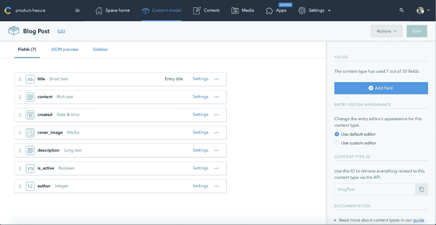
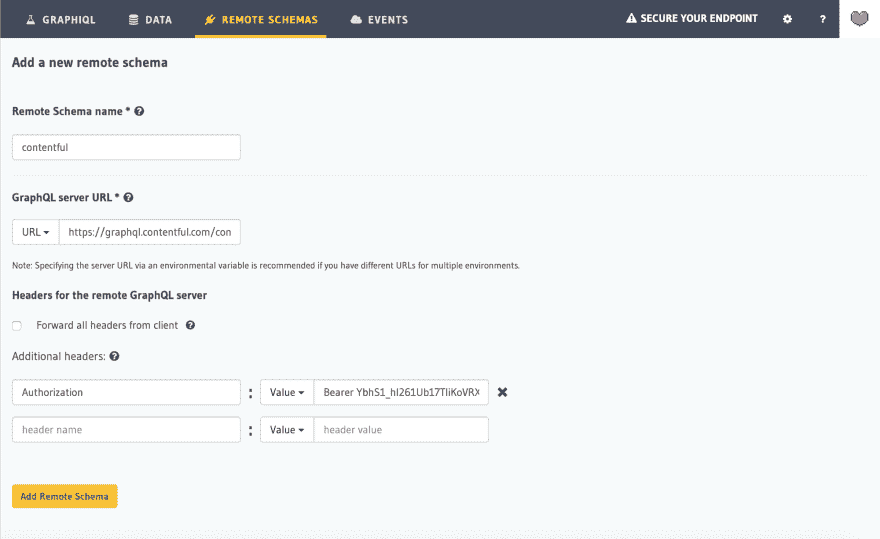
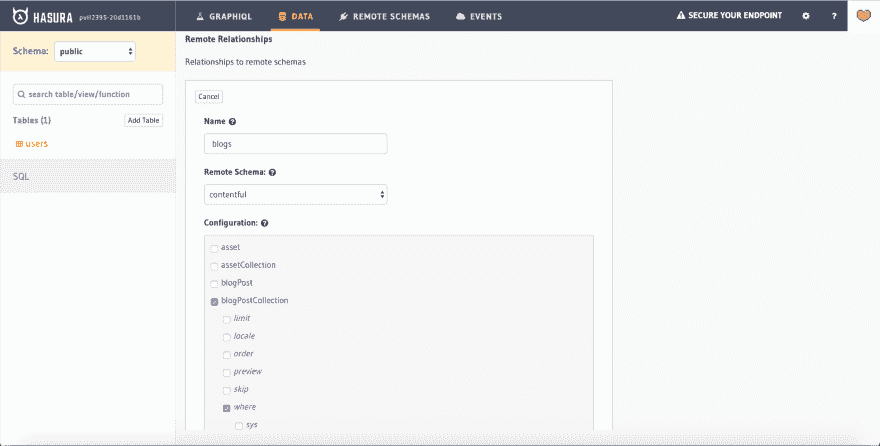

# 使用 Contentful 和 Hasura 远程连接构建内容丰富的应用程序

> 原文：<https://dev.to/hasurahq/build-apps-with-rich-content-using-contentful-and-hasura-remote-joins-17ef>

使用 GraphQL 和 Hasura 远程连接将数据库中的应用程序数据与内容相连接

[Contentful](https://contentful.com) 是 API 首个打造数字产品的 CMS。它提供了一个 [GraphQL API](https://www.contentful.com/developers/docs/references/graphql/#/introduction/basic-api-information) ，可以使用远程模式与 Hasura 连接。

[](https://res.cloudinary.com/practicaldev/image/fetch/s--bpf8NpjC--/c_limit%2Cf_auto%2Cfl_progressive%2Cq_auto%2Cw_880/https://blog.hasura.io/conteimg/2019/07/contentful-hasura.png)

最近，我们推出了[远程连接](https://blog.hasura.io/remote-joins-a-graphql-api-to-join-database-and-other-data-sources/)特性(在预览版中可用)，该特性允许跨表和远程数据源连接数据。

在这个例子中，我们将看看如何将 contentful 中的简单博客 CMS 与 Hasura 中的现有数据结合起来。对于这个例子，Hasura 中现有的数据可能只是来自 Contentful 这样的远程数据源的用户的博客文章数据。来自 contentful 的相同数据模式可以用于构建其他具有丰富内容的应用程序，例如播放列表应用程序，其中视频元数据来自 contentful。

好了，让我们从在 Contentful 中创建必要的内容类型开始。在**内容模型**下，为 Blog Post 创建一个新的内容类型，并添加以下字段- >标题、内容、已创建、封面 _ 图片、描述、活动、作者。我们将使用 author 字段将该数据与 Hasura users 表连接起来。请注意，内容字段是富文本类型，我们将利用它来创建博客文章内容。

[](https://res.cloudinary.com/practicaldev/image/fetch/s---IUbzMIi--/c_limit%2Cf_auto%2Cfl_progressive%2Cq_auto%2Cw_880/https://blog.hasura.io/conteimg/2019/07/contentful-blogpost-type.png)

## 添加内容作为远程模式

为了能够通过 Hasura 查询内容丰富的数据，需要使用 Hasura 控制台将其添加为远程模式。

*   获取以下格式的 GraphQL 内容 API 端点:

```
https://graphql.contentful.com/content/v1/spaces/<space-id> 
```

并替换为适当的空间 id。

*   在内容丰富的仪表板中，点击**设置**。在**空间设置**下点击 **API 键**。复制空间 ID 并粘贴到上述端点中。
*   现在复制内容交付 API -访问令牌，并在授权头中使用它，如下所示:

```
Authorization: Bearer <access_token> 
```

*   在 Hasura 控制台中，转到 Remote Schemas 并输入带有上述 contentful 端点的 GraphQL 服务器 URL。在 Additional Headers 下，输入带有 access_token 的授权头，如上所述。

[](https://res.cloudinary.com/practicaldev/image/fetch/s--RJCtf9KE--/c_limit%2Cf_auto%2Cfl_progressive%2Cq_auto%2Cw_880/https://blog.hasura.io/conteimg/2019/07/add-contentful-remote-schema.png)

创建从用户到内容丰富的 blogPostCollection 类型的远程关系。

[](https://res.cloudinary.com/practicaldev/image/fetch/s--t05Kti3d--/c_limit%2Cf_auto%2Cfl_progressive%2Cq_auto%2Cw_880/https://blog.hasura.io/conteimg/2019/07/remote-relationship.png)

在 blogPostCollection 的配置下，我们声明一个 where 子句来说明:

```
author: From column -> id 
```

这确保了在用户中查询博客时，我们只获得被查询用户所写的相关博客。让我们继续在 **users** 表中创建一行，并在 Contentful 中创建一个简单的博客帖子。

<figure>[](https://res.cloudinary.com/practicaldev/image/fetch/s--tZXGfdcw--/c_limit%2Cf_auto%2Cfl_progressive%2Cq_auto%2Cw_880/https://blog.hasura.io/conteimg/2019/07/insert-user.png) 

<figcaption>插入新用户</figcaption>

</figure>

这将创建一个 id 为 1 的新用户。

<figure>[](https://res.cloudinary.com/practicaldev/image/fetch/s--39blWhVD--/c_limit%2Cf_auto%2Cfl_progressive%2Cq_auto%2Cw_880/https://blog.hasura.io/conteimg/2019/07/contentful-blog-insert.png) 

<figcaption>在 contentful</figcaption>

</figure>

插入新博客

在 author 下，我们给值 1，这样 Hasura 中的数据就链接起来了。

现在，在单个 API 调用中获取这些数据的 GraphQL 查询如下所示:

```
query {
  users {
    id
    name
    blogs {
      items {
        title
        content {
          json
        }
      }
    }
  }
} 
```

注意，嵌套查询`blogs`来自 Contentful，它将应用过滤器 users.id = blogs.items.author，从而只给出用户写的博客文章。