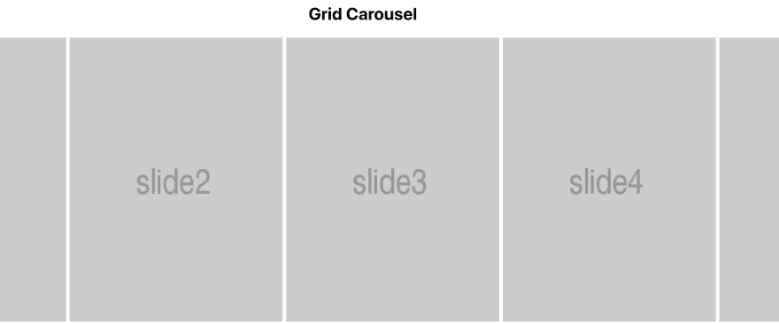
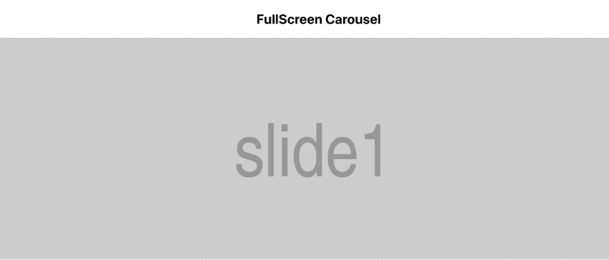

# 建造反应堆转盘-第 1 部分

> 原文：<https://dev.to/nabaraj/build-reactjs-carousel-part1-1gjd>

我的 react 之旅始于一年前。我已经用 HTML，CSS，Javascript 做了 7 年的网络开发。然后完成了 Freecodecamp 前端认证。React 就像前端开发中的这个酷小子一样，这在当时是必须的。于是，我一头扎进去，从斯蒂芬·格里德那里买了《摩登反应与 Redux》，并从中学到了很多。此外，从 Wes Bos 的《React for 初学者》中学到了很多。我强烈推荐这两者，这篇文章是基于我从这两者和我过去 9 个月为我的公司做 React 开发人员中学到的东西。

在 React 中，我们必须将我们的项目划分为更小的组件。然后编写这些组件，并将其粘贴到主应用程序组件中。我们正在 react 中制作一个 Youtube 播放器应用程序。因此，我们设计布局并为不同的部分创建组件。

我们将使用 ReactJS 构建一个旋转木马。
这个旋转木马是我在做 react 项目时开发的。我试图使它简单，也给了多种选择，以便可以根据我们的要求定制
。

我将使用 create react app 来解释本教程，这样我们可以节省环境设置的时间。我们可以在这里找到 create react app 设置。

假设我们成功安装了 create react app，我将在 app.js 中添加我的
carousel。我们可以从 create react app
应用程序中清除预定义的文件。

我们需要添加带有所有属性选项的 Carousel 标签。所有的选项将解释与发展的步骤。这个传送带目前有两个视图选项“全屏”和“网格”。如下图所示。
[T3】](https://res.cloudinary.com/practicaldev/image/fetch/s---i38CRDC--/c_limit%2Cf_auto%2Cfl_progressive%2Cq_auto%2Cw_880/https://thepracticaldev.s3.amazonaws.com/i/4hu85psrzswqhd5a979o.png)

这是旋转木马的最终代码。