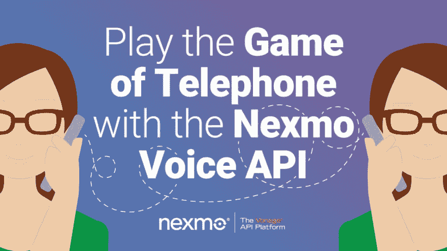
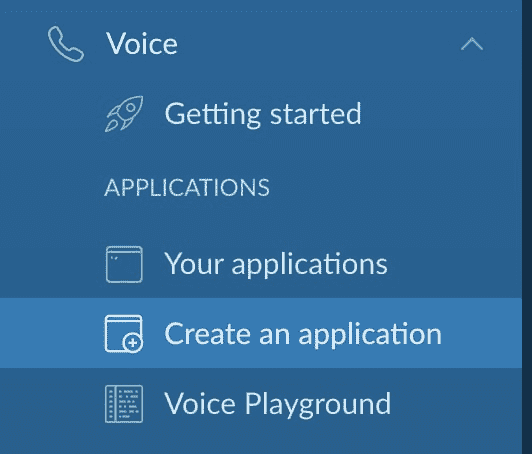
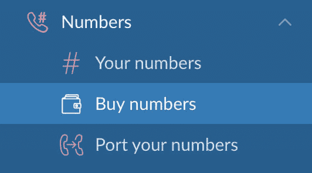
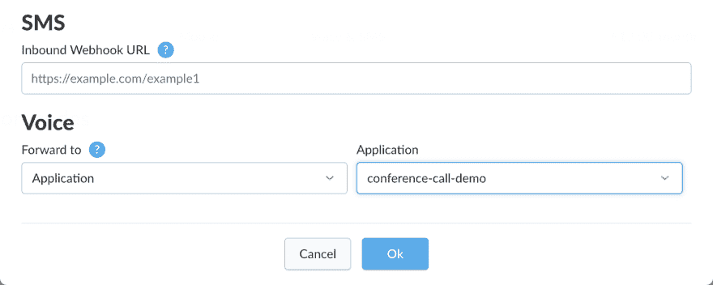

# 构建自己的 Rails 电话游戏

> 原文：<https://dev.to/vonagedev/build-your-own-game-of-telephone-on-rails-46i9>

[](https://res.cloudinary.com/practicaldev/image/fetch/s--MRZKWCgA--/c_limit%2Cf_auto%2Cfl_progressive%2Cq_auto%2Cw_880/https://www.nexmo.com/wp-content/uploads/2019/06/Game-of-Telephones_1200x675.jpg)

你还记得小时候的电话游戏吗？也许你在课间休息时在学校操场上玩过，或者在夏天的野营时玩过？我记得小学的一位老师用这个游戏来说明交流是多么的不可靠。如果你从未玩过，这里是一个快速回顾:

> 当一个人小声给旁边的人发信息时，电话就开始了。第二个人对下一个人耳语了同样的信息，然后下一个人与他们旁边的人分享，如此等等。游戏继续进行，直到消息完成通过所有玩家的路由，并返回到原始发送者。通常，最终的信息与原始信息大相径庭。

现代云通信应用程序可以完成无数基本和关键的任务。但是，有时候休息一下，做点有趣的事情，也只是娱乐而已。因此，在本演练中，我们将利用 Ruby on Rails、Nexmo Voice API 和 Google Cloud Platform Speech to Text 和 Translate APIs 来重现电话游戏。

当我们完成时，我们将有一个语音应用程序，它将接受一个呼入电话，接收原始消息，将其转换为文本，翻译成多种语言，直到最后重新翻译回英语，并向呼叫者播放最终消息。

您也可以从 [GitHub](https://github.com/nexmo-community/nexmo-rails-telephone-game-vapi) 将这个应用程序的工作副本克隆到您的本地机器上。

准备好了吗？我们开始吧！

## 先决条件

要开始，您需要以下内容:

*   [Ruby on Rails](https://rubyonrails.org/)
*   [Nexmo 账户](https://dashboard.nexmo.com/sign-up)
*   [谷歌云平台账号](https://cloud.google.com/free/)
*   [ngrok](https://ngrok.io)

## 设置 ngrok

有几种方法可以让我们的本地开发服务器从外部访问，但是最简单的方法之一是使用 ngrok。你可以阅读[这篇文章](https://www.nexmo.com/blog/2017/07/04/local-development-nexmo-ngrok-tunnel-dr/)来获得关于 ngrok 如何工作的更详细的解释。然而，出于我们的目的，我们只需要让它运行并复制它提供给我们的 URL。

为了启动 ngrok，打开一个新的终端窗口，从命令行执行以下命令:

```
$ ngrok http 3000 
```

Enter fullscreen mode Exit fullscreen mode

现在，您将在终端窗口中看到一个 ngrok 日志记录界面。靠近界面顶部是以`Forwarding`开头的一行，包含两个 URL。第一个是外部可访问的 ngrok URL，以`ngrok.io`结尾，后跟`http://localhost:3000`，这是您的本地开发服务器。现在，当您或 Nexmo 联系到`ngrok.io` URL 时，它会将其转发到您的本地服务器。

确保将`ngrok.io` URL 复制到安全的地方。我们将在下一步设置 Nexmo 帐户、电话号码和语音应用程序时使用它。

## 设置 Nexmo 账户

为了让我们的语音应用程序工作，我们需要一个 Nexmo 帐户，一个 Nexmo 提供的电话号码，一个 Nexmo 应用程序，最后，我们需要将我们的应用程序链接到我们的电话号码。

您可以免费创建一个 Nexmo 帐户，作为额外奖励，您的帐户将获得 2 欧元，以开始使用您的新应用程序。在您的网络浏览器中导航至[https://dashboard.nexmo.com/sign-up](https://dashboard.nexmo.com/sign-up)，并完成注册步骤。完成后，您将进入 Nexmo 控制面板。

从左侧菜单中，点击`Voice menu`项。您将在`APPLICATIONS`下看到以下四个选项:

[](https://res.cloudinary.com/practicaldev/image/fetch/s--RgxCHOxc--/c_limit%2Cf_auto%2Cfl_progressive%2Cq_auto%2Cw_880/https://www.nexmo.com/wp-content/uploads/2019/05/create-voice-app.png)

点击`Create an application`选项，您将被引导到一个页面，在这里您可以设置一个新的 Nexmo 应用程序。

用以下内容完成表格:

*   `Application name`文本字段输入`rails-telephone-game`
*   `Event URL`文本字段输入您的 ngrok URL: `https://[ngrok url here]/event`
*   `Answer URL`文本字段再次输入您的 ngrok URL:`https://[ngrok url here]/webhooks/answer`

完成后，点击蓝色的`Create Application`按钮。

现在，您已经创建了一个 Nexmo 语音应用程序。我们的下一步是购买一个 Nexmo 电话号码，并将其链接到该应用程序。

在 Nexmo 仪表板上，点击左侧菜单上的`Numbers`菜单项。您将看到出现三个选项:

[](https://res.cloudinary.com/practicaldev/image/fetch/s--qvZvNbOK--/c_limit%2Cf_auto%2Cfl_progressive%2Cq_auto%2Cw_880/https://www.nexmo.com/wp-content/uploads/2019/05/numbers.png)

点击`Buy numbers`选项，你将被引导到一个页面，在这里你可以选择一个国家，功能，类型，以及你想要的四位数字。

[](https://res.cloudinary.com/practicaldev/image/fetch/s--Osb4bn2U--/c_limit%2Cf_auto%2Cfl_progressive%2Cq_auto%2Cw_880/https://www.nexmo.com/wp-content/uploads/2019/05/buy-numbers.png)

出于我们的目的:选择您当前所在的国家，以便您可以拨打本地电话；选择`Voice`选择功能，选择手机或座机类型。您不需要为`Number`文本字段输入任何内容。当你点击`Search`，你会看到一个电话号码列表。点击橙色`Buy`按钮选择一个，在确认提示中再次点击橙色`Buy`按钮。

一旦你拥有了这个号码，你现在就可以将它链接到你的`rails-telephone-game`语音应用程序。为此，单击电话号码旁边的齿轮图标，您将看到以下菜单:

[](https://res.cloudinary.com/practicaldev/image/fetch/s--AM3-qyyy--/c_limit%2Cf_auto%2Cfl_progressive%2Cq_auto%2Cw_880/https://www.nexmo.com/wp-content/uploads/2019/05/edit-numbers-conference-call.png)

从下拉列表中选择`voice-proxy-forwarding-demo`应用程序，并点击蓝色`Ok`按钮。您的 Nexmo 电话号码现在已链接到您的语音应用程序，并准备好通过语音代理接受和转发呼入电话。

## 设置谷歌云平台账户

谷歌云平台文档中有很好的关于如何使用新账户的文档。

简而言之，一旦您创建了一个帐户，您需要创建一个新的应用程序。创建新的应用程序后，您需要确保下载您的凭证，该凭证位于包含 JSON 的文件中。将文件保存在你记得的地方，我们很快就会用到它。我们稍后将讨论如何将它和您的 Nexmo API 凭证一起作为环境变量添加进来。

最后，在您的 Google Cloud Platform dashboard 中，确保您已经启用了 Speech API 和 Translate API。我们将在我们的电话游戏中使用这两者。

## 设置 Rails 应用程序

我们现在准备设置 Rails 应用程序来播放电话。我们将做以下工作:

1.  初始化新的应用程序
2.  添加我们的 API 凭证
3.  定义控制器动作和路线

### 初始化新的应用程序

要初始化一个新的应用程序，从命令行执行以下命令:

```
$ rails new rails-telephone-game --database=postgresql 
```

Enter fullscreen mode Exit fullscreen mode

这将创建一个新的 Rails 应用程序，将 PostgreSQL 作为其默认数据库。

一旦该命令完成，继续在您喜欢的代码编辑器中打开应用程序，并在应用程序的根文件夹中编辑`Gemfile`。我们将添加 Nexmo Ruby、dotenv-rails、Google 云平台翻译 API 和 Google 云平台语音 API gems:

```
# Gemfile

gem 'nexmo'
gem 'dotenv-rails'
gem 'google-cloud-translate'
gem 'google-cloud-speech' 
```

Enter fullscreen mode Exit fullscreen mode

在您保存了`Gemfile`之后，您可以通过从命令行运行`bundle install`来安装 gems。

在这个阶段，您还需要运行`rake db:migrate`来初始化数据库模式。出于本演练的目的，我们不持久存储数据，但您可以自己这样做。

### 添加 API 凭证

我们需要在我们的应用程序中提供 Nexmo 和 Google 云平台的 API 凭证。为了安全地管理我们的环境变量，我们将使用我们安装的`dotenv-rails` gem 的功能。首先，在项目的根文件夹中创建一个名为`.env`的新文件，并将该文件的路径添加到您的`.gitignore`文件中。打开`.env`文件，添加以下内容:

```
# .env

GOOGLE_APPLICATION_CREDENTIALS=
GOOGLE_PROJECT_ID=
NEXMO_API_KEY=
NEXMO_API_SECRET=
NEXMO_NUMBER=
NEXMO_APPLICATION_ID=
NEXMO_PRIVATE_KEY=
BASE_URL= 
```

Enter fullscreen mode Exit fullscreen mode

第一个环境变量`GOOGLE_APPLICATION_CREDENTIALS`，指向包含 Google API 凭证的 JSON 文件的路径。继续，将您之前设置帐户时下载的文件移动到您的应用程序的根文件夹中，并将路径添加到`=`符号(即`GOOGLE_APPLICATION_CREDENTIALS=./my-google-cloud-platform-credentials.json`)的右侧。

第二个环境变量`GOOGLE_PROJECT_ID`，是您在注册过程中创建的 Google 云平台项目的 ID(即`GOOGLE_PROJECT_ID=rails-telephone-game`)。

接下来的五个环境变量与您的 Nexmo 帐户相关。你可以在你的 [Nexmo 仪表盘](https://dashboard.nexmo.com)主页上找到你的`NEXMO_API_KEY`和`NEXMO_API_SECRET`。

`NEXMO_NUMBER`变量值是您从 Nexmo 提供的电话号码。

在 Nexmo 仪表盘的应用程序列表中可以找到`NEXMO_APPLICATION_ID`。与 Google 凭证一样,`NEXMO_PRIVATE_KEY`是您帐户的私钥凭证的路径。当您创建 Nexmo 语音应用程序时，您生成了一个公钥/私钥对，它会自动将私钥下载到您的计算机上。将私钥移动到应用程序的根文件夹中，并添加路径作为该变量的值，就像您对`GOOGLE_APPLICATION_CREDENTIALS`所做的一样。

最后一个环境变量，是您的外部 ngrok URL，例如:`http://my-sample-url.ngrok.io`。

既然您的凭证已经全部添加到您的应用程序中，我们现在就可以创建控制器和路由了。

### 定义控制器动作

首先，在`/app/controllers/`中创建一个名为`telephone_controller.rb`的新文件。我们首先要做的是定义 Nexmo 客户端和谷歌云平台客户端的认证实例:

```
# telephone_controller.rb

class TelephoneController < ApplicationController

    Translator = Google::Cloud::Translate.new(project: ENV['GOOGLE_PROJECT_ID'])
    NexmoClient = Nexmo::Client.new(
        application_id: ENV['NEXMO_APPLICATION_ID'],
        private_key: File.read(ENV['NEXMO_PRIVATE_KEY'])
    )
    Converter = Google::Cloud::Speech.new 
```

Enter fullscreen mode Exit fullscreen mode

我们还将花一点时间来定义我们希望谷歌云平台翻译 API 在游戏中运行的语言列表:

```
# telephone_controller.rb

class TelephoneController < ApplicationController

....

LANGUAGES = [
    'ar',
    'he',
    'hi',
    'ku',
    'ru',
    'tr',
    'yi'
] 
```

Enter fullscreen mode Exit fullscreen mode

对于本演练，我选择了阿拉伯语、希伯来语、印地语、库尔德语、俄语、土耳其语和意第绪语。当然，你可以替换或添加任何你喜欢的语言。

我们需要在控制器中定义两个动作:`#answer`和`#event`。`#answer`方法负责接听电话，监听并记录来自用户的消息，并在处理过程中保持通话畅通。`#event`方法负责将录音转录成文本，通过翻译器运行，并将新翻译的消息返回给调用者。

`#answer`方法:

```
def answer
    puts "Starting Call"
    @@uuid = params[:uuid]
    render json: [
        { 
            :action => 'talk', 
            :text => 'Welcome to the Nexmo Telephone Game. To begin say your message at the beep. To end the recording press the pound key.'
        },
        {
            :action => 'record',
            :eventUrl => ["#{ENV['BASE_URL']}/event"],
            :beepStart => true,
            :format => "wav",
            :endOnKey => "#",
            :timeOut => 30
        },
        {
            :action => 'talk',
            :text => 'Please wait a moment as your message runs through our sophisticated top secret linguistic algorithm...'
        },
        {
            :action => 'conversation',
            :name => 'telephone-game-conversation'
        }
    ].to_json
end 
```

Enter fullscreen mode Exit fullscreen mode

`#answer`方法由 JSON 格式的 Nexmo 调用控制对象(NCCO)指令组成。第一条指令向调用者发送欢迎消息，第二条指令记录调用者的响应，并告诉 Nexmo 回调 URL 是应用程序 ngrok URL 上的`/event`。第三条指令让调用者知道消息正在被处理，而第四条指令使用 Nexmo 的`conversation`特性在处理过程中保持呼叫畅通。

`#event`方法被包装在一个条件检查中，以查看是否有音频记录。Nexmo 通过不同的状态更新多次访问`/event`端点，但是我们只关心包含记录的端点:

```
def event
    if params['recording_url']
        # Save Recording
        puts "Saving Audio File"
        NexmoClient.files.save(params['recording_url'], 'recording.wav')

        # Transcribe Recording
        transcribed_text = ''
        file_name = './recording.wav'
        audio_content  = File.binread(file_name)
        bytes_total    = audio_content.size
        bytes_sent     = 0
        chunk_size     = 32000
        streaming_config = {
            config: {
                encoding: :LINEAR16,
                sample_rate_hertz: 16000,
                language_code: "en-US",
                enable_word_time_offsets: true     
            },
            interim_results: true
        }
        puts "Converting Speech to Text with GCP Speech API"
        stream = Converter.streaming_recognize(streaming_config)
        # Simulated streaming from a microphone
        # Stream bytes...
        while bytes_sent < bytes_total do
            stream.send audio_content[bytes_sent, chunk_size]
            bytes_sent += chunk_size
            sleep 1
        end
        puts "Stopped passing audio to be transcribed"
        stream.stop
        # Wait until processing is complete...
        stream.wait_until_complete!
        puts "Transcription processing complete"
        results = stream.results
        results.first.alternatives.each do |alternatives|
            transcribed_text = alternatives.transcript
        end

        # Run Transcription Through Translations
        puts "Translating Message"
        translated_text = transcribed_text
        LANGUAGES.each do |language|
            translated_text = (translated_text == transcribed_text) ? 
            Translator.translate(translated_text, to: language) : Translator.translate(translated_text.text, to: language)
        end
        final_translation = Translator.translate(translated_text.text, to: 'en')

        # Play Final Text Back To Call
        puts "Playing Translated Audio to Call"
        puts "Transcribed Original Message: #{transcribed_text}"
        puts "Final Message: #{final_translation.text}"
        closing_msg = "Your message was translated through Arabic, Hebrew, Hindi, Kurdish, Russian, Turkish and Yiddish and is returned to you as: #{final_translation.text}"
        NexmoClient.calls.talk.start(@@uuid, text: closing_msg, voice_name: "Kimberly") if transcribed_text != ''
    end
end 
```

Enter fullscreen mode Exit fullscreen mode

在`#event`方法中发生了很多事情；我们来分解一下。

最初，一旦带有`recording_url`的参数返回 true，我们就继续在本地保存该记录。然后，我们利用 GCP 语音到文本 API 将录音转换成转录文本。

为此，我们定义了几个包含音频配置的变量。我们选择模拟[将文本流式传输到 GCP API](https://cloud.google.com/speech-to-text/docs/streaming-recognize) 进行转换，而不是直接发送保存的音频文件。

这种方法在性能速度上有明显的积极差异。结果是一个包含可能的转录的数组。我们只想要第一个，这就是我们正在做的:

```
results.first.alternatives.each do |alternatives|
    transcribed_text = alternatives.transcript
end 
```

Enter fullscreen mode Exit fullscreen mode

变量`transcribed_text`现在包含呼叫者音频消息的文本。该方法的下一步是在我们定义的翻译语言中运行它。我们希望每次通过`Translator`时翻译的文本成为翻译消息的下一个迭代。这将使我们的最终信息比原始信息更不同，因此更有趣！

为此，我们创建一个名为`translated_text`的新变量，它最初由`transcribed_text`的内容定义。每次迭代后，`translated_text`的值会更改为当前迭代的翻译，然后在下一次迭代中用作要翻译的文本。最后，通过翻译器最后一次运行最后的翻译，并返回到英语。这是将向调用者播放的内容:

```
# Run Transcription Through Translations
puts "Translating Message"
translated_text = transcribed_text
LANGUAGES.each do |language|
    translated_text = (translated_text == transcribed_text) ? 
    Translator.translate(translated_text, to: language) : Translator.translate(translated_text.text, to: language)
end
final_translation = Translator.translate(translated_text.text, to: 'en') 
```

Enter fullscreen mode Exit fullscreen mode

上面代码中需要注意的一点是，我们使用了一个三元运算符来检查`translated_text`的值是否等于`transcribed_text`。我们这样做是因为我们需要以不同的方式访问文本，不管它是不是谷歌云平台语音转文本对象(即带有点符号)。

方法中的最后一项工作是向调用者回放它。我们通过使用`@@uuid`变量来实现这一点，该变量保存对话 ID，并将文本作为文本到语音注入到当前呼叫中:

```
# Play Final Text Back To Call
puts "Playing Translated Audio to Call"
puts "Transcribed Original Message: #{transcribed_text}"
puts "Final Message: #{final_translation.text}"
closing_msg = "Your message was translated through Arabic, Hebrew, Hindi, Kurdish, Russian, Turkish and Yiddish and is returned to you as: #{final_translation.text}"
NexmoClient.calls.talk.instance_variable_set(:@host, 'api-us-1.nexmo.com')
NexmoClient.calls.talk.start(@@uuid, text: closing_msg, voice_name: "Kimberly") if transcribed_text != '' 
```

Enter fullscreen mode Exit fullscreen mode

一旦我们的控制器动作被定义，在我们准备好之前，我们需要做的最后一步是创建我们的应用程序的路由。

### 定义路线

打开`/config`文件夹中的`routes.rb`文件。我们将增加一个`GET`和一个`POST`请求:

```
# routes.rb

get '/answer', to: 'telephone#answer'
post '/event', to: 'telephone#event' 
```

Enter fullscreen mode Exit fullscreen mode

就是这样！我们已经成功创建了我们的应用程序。我们现在准备运行它。确保 ngrok 在后台运行，然后通过运行:`rails s`从终端启动 Rails 服务器。您现在可以拨打您的 Nexmo 电话号码并播放电话。玩得开心！