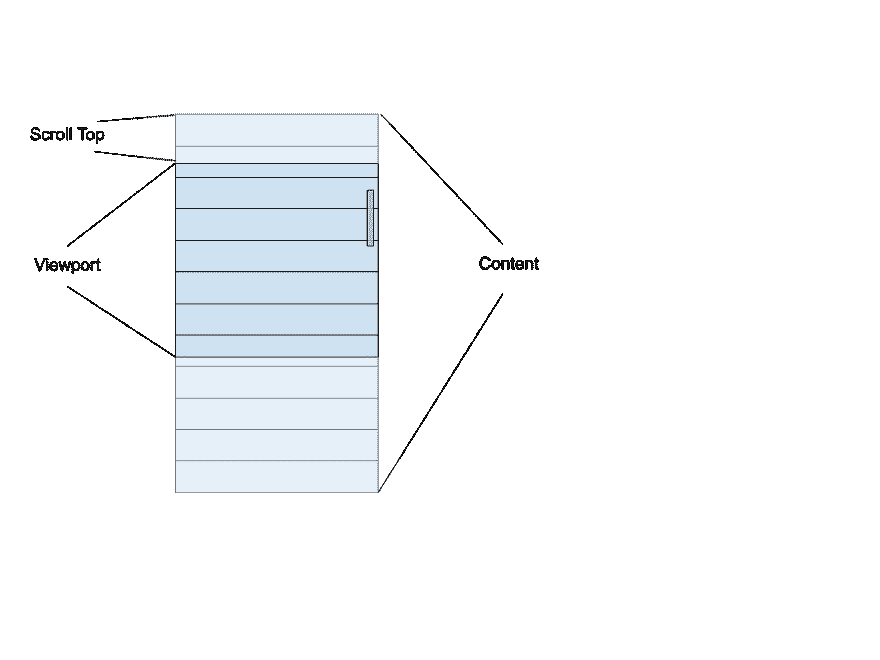
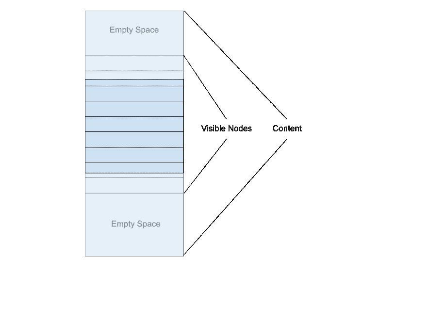
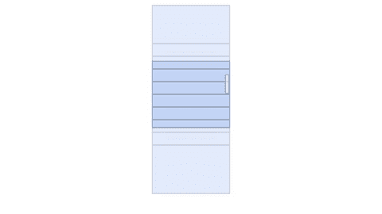

# 建立你自己的虚拟卷轴-第一部分

> 原文：<https://dev.to/adamklein/build-your-own-virtual-scroll-part-i-11ib>

这是一个由两部分组成的系列:

*   [第一部分——概念和数学](https://dev.to/adamklein/build-your-own-virtual-scroll-part-i-11ib)
*   [第二部分-动态高度和性能](https://dev.to/adamklein/build-your-own-virtual-scroll-part-ii-3j86)

# 第一部分

构建自己的虚拟滚动(窗口)并不像听起来那么难。我们将从构建一个简单的每行高度固定的模板开始，然后讨论当高度是动态的时该怎么做。

在我们深入技术细节之前，让我们理解虚拟滚动背后的基本概念

> 重要提示:
> 这不是一篇“你应该构建你自己的虚拟卷轴”的文章，仅仅是一篇解释如何做的文章。我认为即使你自己不去实现，知道事情是如何运作的也是非常有益的。

# 什么是窗口？

在常规滚动中，我们有一个可滚动的容器(或者一个视窗)和内容，比如说一个条目列表。

可滚动容器的高度小于内部内容的高度，因此浏览器显示滚动条，并且根据滚动条的位置仅显示部分内容。

你可以把视口想象成一个窗口，内容在它后面。用户只能看到窗口后面的部分:

滚动容器就像上下移动内容:

## 虚拟滚动

在虚拟滚动中，我们不在屏幕上显示全部内容，以减少 DOM 节点渲染和计算的数量。

我们“愚弄”用户，让他以为整个内容都是通过渲染窗口内的部分来渲染的，并且在顶部和底部多渲染一些以确保平滑过渡。

请注意，我们仍然需要以完整的高度呈现内容(就像所有的列表项都被呈现一样)，否则，滚动条的大小将是错误的，这会在底部和顶部留下一个空白:

当用户滚动时，我们重新计算在屏幕上添加或删除哪些节点:

你也可以想象这就像走在一座桥上，这座桥正在你面前建造，却在你身后被摧毁。从你的角度来看，这感觉就像走在一座完整的桥上，你不会知道区别。

# 让我们做一些简单的数学计算

对于简单的解决方案，我们将假设我们知道列表的长度，并且每行的高度是固定的。

解决方案是:
1)将整个内容呈现为一个空容器
2)呈现当前可见的节点
3)将它们向下移动到它们应该在的地方。

让我们来分析一下数学原理:

我们的意见是:

*   viewport height
*   项目总数
*   行高(目前固定)
*   视口的当前滚动顶部

以下是我们在每一步中进行的计算:

## 渲染整个内容

如前所述，我们需要内容以全高呈现，这样滚动条的高度才是准确的。这仅仅是节点数乘以行高。

## 渲染当前可见的节点

现在我们有了整个容器的高度，我们只需要根据当前的滚动位置呈现可见的节点。

第一个节点来源于**视口的 scrollTop** ，除以**行高**。唯一的例外是我们有一些节点的填充(可配置的)以允许平滑滚动:

**可见节点总数**来源于**视口的高度**，除以**行高**，我们还添加了填充:

## 向下移动节点

当我们在容器内部呈现可见节点时，它们呈现在容器的顶部。我们现在需要做的是将它们向下移动到正确的位置，并留出一个空位。

要下移节点，最好使用 **transform: translateY** 来偏移第一个节点，因为它将在 GPU 上运行。这将确保比绝对定位更快的重画和更好的性能。**偏移量**就是**起始节点**乘以**行高**

# 示例代码

因为实现可能会因框架而异，所以我编写了一个伪实现，使用一个普通函数返回一个 HTML 字符串: