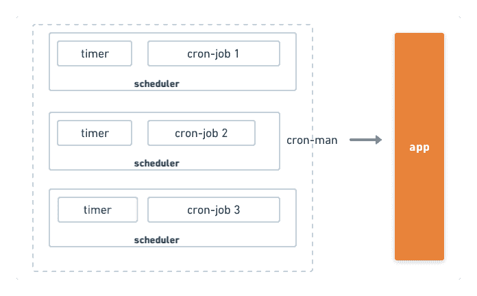

# 在 NodeJs 中构建 CRON-MAN

> 原文：<https://dev.to/phavor/building-a-cron-man-in-nodejs-27ic>

在本文中，我们将学习如何设置一个 NodeJs cron-job，我们的 cron 将查找我们的数据库集合并删除多余的用户。我们将看到一些 NodeJs APIs，它们将帮助我们实现预期的目标。

## 什么是 CRON 工作？

cronjob 是在指定时间定期运行并执行任何指定任务的程序。你可能认为它是一个机器人。您可能想要向今天在您的平台上注册的所有人发送简讯，您可能想要检查您的应用程序用于更新的另一个服务，然后正确地更新您自己的服务。你可以用 cronjob 做任何事。

## 好吧，我听到了，为什么我需要一个 CRONJOB？

您会发现，在使用数据库时，您可能会注意到应用程序的用户经常将他们不需要的文件上传或保存到您的数据库或云存储桶中。您的 cronjob 会偶尔检查您的存储系统，找到这些冗余文件并执行您想要的指令。无论如何，您不局限于数据库，您可以在任何地方实现它，理想情况下，存储系统是一个流行的用例。

这个克隆人或经理将处理我们所有的克隆工作。这意味着我们所有的 cronjobs 都将从同一个文件中管理。

## 准备好了吗？现在让我们开始吧

我假设您已经有了一个功能性的**视图**和**模型**，所以我们可以立即访问 cron 管理器。

我们将 cronjob runner 分为 3 个部分:

*   调度程序
*   行动
*   克隆人

 

<figure>

<figcaption>调度器

<figcaption></figcaption>

</figcaption>

</figure>

调度程序将接受两个参数，以毫秒为单位的时间间隔和要运行的操作。

### 行动

这是一个将被我们的`scheduler`调用的函数，这个函数承载了每次我们的调度程序调用它时需要做的逻辑。重要的是使你的行为纯洁。使用纯函数将有助于防止内存泄漏和副作用。

### 克隆人

cron 管理器将引导我们所有的调度程序，并为我们管理它们。我们只需在这里导入我们的调度函数和动作。这对于调试很重要，更重要的是，它使我们的 cron 模块化。

 

<figure>

<figcaption>【克朗经理】

<figcaption></figcaption>

</figcaption>

</figure>

既然我们已经从概念上描述了我们的 cron 程序，让我们进入代码层。在你的项目中创建一个 cron 目录，它应该有 2 个子文件夹(`cron-jobs` & `scheduler`)和`cronMan.js`文件。

 

<figure>

<figcaption>你的文件夹结构

<figcaption></figcaption>

</figcaption>

</figure>

我们从充实调度程序功能开始。它看起来会是这样: