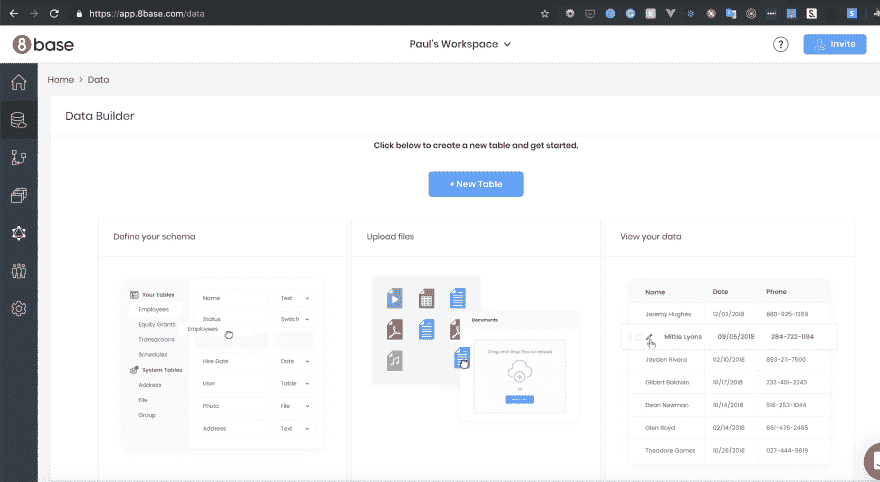
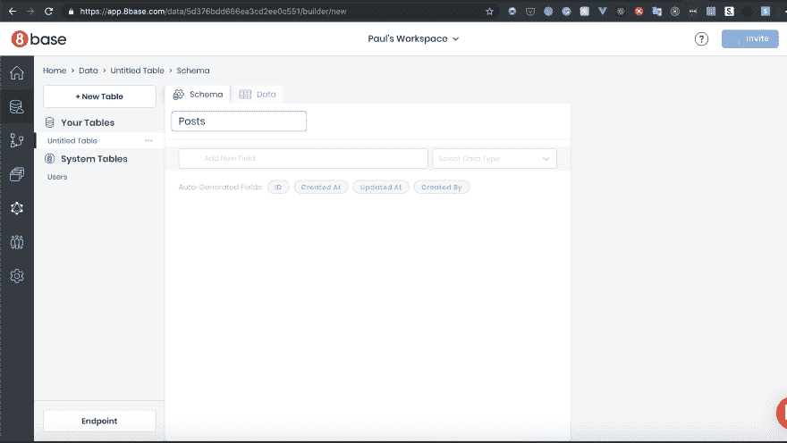
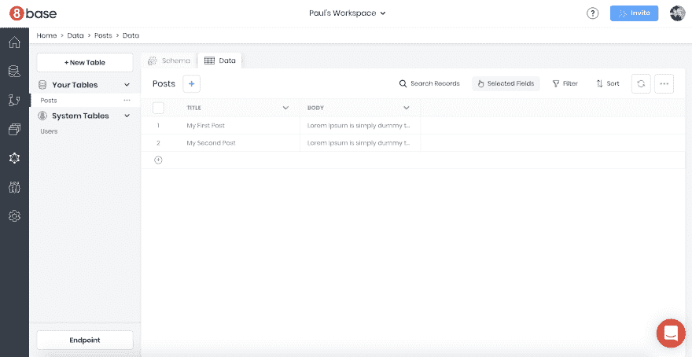
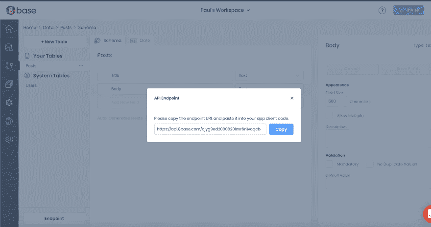
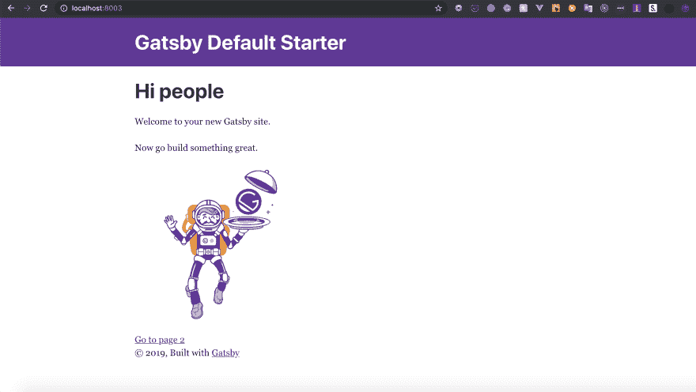

# 用 8base 构建盖茨比博客

> 原文：<https://dev.to/paulayuk/building-a-gatsby-blog-with-8base-1fee>

[](https://res.cloudinary.com/practicaldev/image/fetch/s--Gz5YYZkH--/c_limit%2Cf_auto%2Cfl_progressive%2Cq_auto%2Cw_880/https://res.cloudinary.com/daintu6ky/image/upload/v1564761894/Building_a_Blog_with_Gatsby_and_an_8base_content_API_2x.png)

静态网站包含具有固定内容的网页。每个页面都是一个 HTML 文件，内容固定，每次访问者访问你的网站时都会显示给他们。

因为静态网站不是动态的，不需要任何后端编程或者数据库。这种降低的复杂性使得部署您的网站更加容易，因为一旦部署到托管提供商，就不需要额外的配置。使用静态网站，您可以享受 React.js、Vue.js、Webpack、现代 JavaScript、CSS 等最新 web 技术的强大功能。

其中一个主要优势是，它们确保了流畅的用户体验、极快的网站速度、更高的安全性、无忧的部署、低廉的成本、更少的耗时和维护成本。从技术上来说，由于没有数据库，它不会被黑客攻击，也没有必要为每个请求呈现一个页面，这使得网页浏览速度更快。

随着时间的推移，许多开源静态网站生成器已经可用:Gatsby、Jekyll、Hugo 等...大多数时候，内容是通过静态(最好是降价)文件或内容 API 来管理的。这些技术有助于静态网站和博客的建设，并开始获得像 WordPress、Blogger、Drupal 和 Joomla 这样的旧博客平台一样多的关注。

在本教程中，我们将构建一个博客，前端使用 Gatsby，后端使用 8base。

> 注意:要学习本教程，需要对 React 和 Node.js 有基本的了解。请确保在开始之前安装了 Node 和 npm/yarn。

## 盖茨比是什么？

> Gatsby 是一个基于 React 的免费开源框架，帮助开发人员构建高速网站和应用程序。

有了 Gatsby，您可以通过使用来自一个或多个来源的数据来获得两全其美。您可以使用 GraphQL 和 headless CMSs、SaaS 服务、API、数据库、文件系统等将数据直接放入页面。

每个静态网站都需要一个内容来源。当用 Gatsby 构建网站时，你通过 GraphQL 访问你的数据。GraphQL 允许您以声明的方式表达您的数据需求。在本教程中，我们将通过使用 8base 设置内容 API 来访问我们的内容。

## 什么是 8base？

8base 是一个 GraphQL 后端，允许 javascript 开发人员使用全栈 JavaScript 快速交付企业应用程序。它是前端框架不可知的，因此它使开发人员能够创建面向客户的应用程序，无论他们选择什么。

我们将使用 8base 作为我们应用程序的后端数据库层。这是我们存储和阅读博客文章的地方。

我们还将在项目中使用一些 GraphQL 查询，所以熟悉一些 GraphQL 会有所帮助。

## 入门

8base 提供了大量的特性来帮助开发人员更快、更容易地构建高性能的应用程序。使用 8base 控制台，您可以使用简单的 GUI 构建您的后端，该 GUI 允许您执行以下操作:

*   定义数据模式:创建表/表关系
*   设置权限和授权角色
*   将多个项目组织到*工作空间*
*   使用 API explorer 设计查询(基于 GraphQL)
*   管理文件

要开始使用 8base，请按照下列步骤操作:

*   在 [8base](https://auth.8base.com/login?state=g6Fo2SBrb283dEtrOGU4bndGUTFGQUVyZWNwcFlrNzVFVWw5Z6N0aWTZIHByblBCMU84VWREN1ZXLVJvVFRkclpYUjE0ai01cDJOo2NpZNkgcUdIWlZ1NUN4WTVrbGl2bTI4T1BMam9wdnNZcDBiYUQ&client=qGHZVu5CxY5klivm28OPLjopvsYp0baD&protocol=oauth2&response_type=token%20id_token&redirect_uri=https%3A%2F%2Fapp.8base.com%2Fauth%2Fcallback&scope=openid%20email%20profile&mode=signUp&nonce=x0M6LCwpVoLZ3u1HqwPuY.Qi1.YSBj6M&auth0Client=eyJuYW1lIjoiYXV0aDAuanMiLCJ2ZXJzaW9uIjoiOS4xMS4xIn0%3D) 上创建一个账户。你可以开始免费使用 8base。

[](https://res.cloudinary.com/practicaldev/image/fetch/s--lJHLBspm--/c_limit%2Cf_auto%2Cfl_progressive%2Cq_auto%2Cw_880/https://paper-attachments.dropbox.com/s_5BB0EC7B7AAFF1A955F6F8B32F4388FD3950022B58E5ECA06E42E5FDCC0E6873_1563912863085_Screenshot%2B2019-07-23%2Bat%2B9.13.09%2BPM.png)

*   注册完成后，点击**数据构建器**按钮导航到[数据](https://app.8base.com/data/?source=post_page---------------------------)菜单，然后点击“新表”开始构建你的后端。

[](https://res.cloudinary.com/practicaldev/image/fetch/s--jeL4jrTG--/c_limit%2Cf_auto%2Cfl_progressive%2Cq_auto%2Cw_880/https://paper-attachments.dropbox.com/s_5BB0EC7B7AAFF1A955F6F8B32F4388FD3950022B58E5ECA06E42E5FDCC0E6873_1563913216889_Screenshot%2B2019-07-23%2Bat%2B9.18.31%2BPM.png)

*   加载新表后，您将进入模式，开始定义字段。让我们四处看看，并注意一些事情。在左边，你会看到有`System Tables`和`Your Tables`。每个新的 8base workspace 都自动预装了许多内置表格。这些表用于处理文件、设置和权限等事务，并且都可以通过 8base GraphQL API 进行访问。

*   继续操作，**创建一个包含以下字段的表格** `Posts`:

    标题:
    类型:字段类型为文本。
    描述:这将存储我们博客文章的标题。

    正文:
    类型:字段类型为文本。
    描述:这个字段将保存我们博客文章的正文。

[](https://res.cloudinary.com/practicaldev/image/fetch/s--2CP5vJ7j--/c_limit%2Cf_auto%2Cfl_progressive%2Cq_auto%2Cw_880/https://paper-attachments.dropbox.com/s_5BB0EC7B7AAFF1A955F6F8B32F4388FD3950022B58E5ECA06E42E5FDCC0E6873_1563913230041_Screenshot%2B2019-07-23%2Bat%2B9.19.19%2BPM.png)

*   我们需要一些示例帖子，所以让我们添加一些示例数据。在我们创建模式的模式菜单图标旁边，点击*数据*选项卡，通过设置标题和正文添加一个示例*帖子*记录。

[](https://res.cloudinary.com/practicaldev/image/fetch/s--U4-prtr8--/c_limit%2Cf_auto%2Cfl_progressive%2Cq_auto%2Cw_880/https://paper-attachments.dropbox.com/s_5BB0EC7B7AAFF1A955F6F8B32F4388FD3950022B58E5ECA06E42E5FDCC0E6873_1564332977999_Screenshot%2B2019-07-28%2Bat%2B5.55.38%2BPM.png)

*   接下来，**复制 API 端点 URL** (在左下方可用)——这是用于您的前端和您的 8base 后端之间的通信的单个端点。

[](https://res.cloudinary.com/practicaldev/image/fetch/s--zRWFpJkE--/c_limit%2Cf_auto%2Cfl_progressive%2Cq_auto%2Cw_880/https://paper-attachments.dropbox.com/s_5BB0EC7B7AAFF1A955F6F8B32F4388FD3950022B58E5ECA06E42E5FDCC0E6873_1563913382208_Screenshot%2B2019-07-23%2Bat%2B9.21.58%2BPM.png)

*   最后，出于本教程的目的，我们将默认**允许来宾**开放访问，以便处理身份验证是可选的。要允许客人访问您的新*帖子*表，导航到`Settings > Roles > Guest`并选中*帖子*和*F*T9】文件下的相应框。

默认情况下，所有访问 API 端点的未经身份验证的用户都被分配了 *Guest* 的角色。我们不会在本教程中讨论认证。你可以在这里看到如何更详细地处理认证[。](https://docs.8base.com/docs/authentication?utm_source=scotchio&utm_medium=blog&utm_campaign=codebeast&source=post_page---------------------------)

[](https://res.cloudinary.com/practicaldev/image/fetch/s--zw8nFGx---/c_limit%2Cf_auto%2Cfl_progressive%2Cq_auto%2Cw_880/https://paper-attachments.dropbox.com/s_5BB0EC7B7AAFF1A955F6F8B32F4388FD3950022B58E5ECA06E42E5FDCC0E6873_1563945802925_Screenshot%2B2019-07-24%2Bat%2B6.22.06%2BAM.png)

通过几个简单的步骤，我们已经使用 8base 完成了一个生产就绪的 CMS 后端的设置。让我们从应用程序的前端开始。

## 利用盖茨比

要开始使用 Gatsby，我们必须首先使用 Gatsby CLI 安装它。创建一个新的工作目录，并在终端中运行以下命令:

```
npm install --global gatsby-cli 
```

## 生成一个盖茨比项目

在您之前创建的文件夹中，生成您的全新盖茨比博客:

```
gatsby new blog 
```

这个命令将使用 [gatsby 默认博客开始主题](https://github.com/gatsbyjs/gatsby-starter-default.git)生成一个新的博客。

## 在开发模式下启动

通过在浏览器终端中运行以下命令，进入项目的文件夹并启动服务器:

```
gatsby develop 
```

您的 Gatsby 网站将位于以下地址: [http://localhost:8000](http://localhost:8000/)

[](https://res.cloudinary.com/practicaldev/image/fetch/s--Ov1kzY81--/c_limit%2Cf_auto%2Cfl_progressive%2Cq_auto%2Cw_880/https://paper-attachments.dropbox.com/s_5BB0EC7B7AAFF1A955F6F8B32F4388FD3950022B58E5ECA06E42E5FDCC0E6873_1563914873651_Screenshot%2B2019-07-23%2Bat%2B9.47.25%2BPM.png)

## 连接我们的 8base 后端

要将 Gatsby 连接到一个新的数据源，您可以使用一个现有的源插件或者 T2 开发一个新的源插件。在撰写本文时，8base 没有源代码插件，所以我们将手动编写我们的配置。

为了连接我们的 8base 后端，我们将使用一些 Apollo GraphQL 包。要安装它们，请在终端中运行以下命令:

```
npm install --save apollo-boost react-apollo apollo-link-http apollo-cache-inmemory graphql-tag 
```

接下来，我们将在项目的根目录下创建一个`8base.config.js`文件来保存我们所有的配置。创建文件，并向其中添加以下代码:

```
 // 8base.config.js
    import { ApolloClient } from 'apollo-boost'
    import { ApolloProvider } from "react-apollo";
    import { createHttpLink } from 'apollo-link-http'
    import { InMemoryCache } from 'apollo-cache-inmemory'

    const ENDPOINT = 'YOUR-8BASE-ENDPOINT';

    const httpLink = createHttpLink({uri: ENDPOINT,});

    const client = new ApolloClient({
      link: httpLink,
      cache: new InMemoryCache()
    })

    export { client } 
```

接下来，我们需要用 Apollo provider 包装整个应用程序布局。一旦完成，我们将*能够从我们的组件* *连接并查询 8Base。*

打开 **src** 目录* * * *中的 **layout.js** ，用以下代码更新:

```
 // src/layout.js

    import React from "react"
    import PropTypes from "prop-types"
    import { ApolloProvider } from 'react-apollo'
    import { client } from "../../eightBase-config.js";
    import "./layout.css"

    const Layout = ({ children }) => (
      <ApolloProvider client={client}>
        <main>
          {children}
        </main>
      </ApolloProvider>
    )

    Layout.propTypes = {
      children: PropTypes.node.isRequired,
    }

    export default Layout 
```

现在，我们需要编写从 8base 获取所有帖子的查询。首先，在 **src** 文件夹中创建一个名为 **queries** 的文件夹，然后创建一个**索引文件**，并在其中添加**:T7 ** 

```
 // src/queries/index.js

    import gql from 'graphql-tag';

    const POSTS_QUERY = gql`
      query {
        postsList{
              items{
                id,
                title,
                body,
                createdAt
              }
           }
      }
    `;

    export { POSTS_QUERY } 
```

在这里，我们编写了一个查询来获取我们在 8base 上的所有帖子。

要显示我们所有的帖子，我们需要运行查询。为此，让我们在**src/components 文件夹中创建一个 **posts.js** 文件****组件，代码如下:** 

```
 // src/components/posts.js
    import React, { Component } from 'react'
    import { Query } from 'react-apollo'
    import { POSTS_QUERY } from "../queries/index";
    import { Link } from "gatsby";
    import './posts.css';

    export default class Posts extends Component {

      render() {
        return (
          <Query query={POSTS_QUERY}>
            {({ loading, error, data }) => {
              if (loading) return <h1>Fetching</h1>
              if (error)   return <h1>Error</h1>
              const posts = data.postsList.items
              return (
                    <div>
                      <div className="header">8thBlog</div>
                      {posts.map((post, index) => {
                          return (
                            <div key={index} className="main">
                                  <div className="card-body">
                                    <h2>
                                      <Link to="#" className="links">{post.title}</Link>
                                      <span className="created">Created At: {post.createdAt}</span>
                                    </h2>
                                    <p className="card-text">{post.body}</p>
                                  </div>
                            </div>
                          )
                      })}
                    </div>
                  )
              }}
            </Query>
        )}
    } 
```

这段代码运行查询并在组件中返回它。要在我们的页面上看到它，我们需要更新我们的 **src/pages/index** 文件，这是 Gatsby 启动时显示的主页面。打开页面，添加以下内容:

```
 // src/pages/index.js

    import React from "react"
    import Layout from "../components/layout"
    import Posts from '../components/Posts';

    const IndexPage = () => (
      <Layout>
        <Posts />
      </Layout>
    )

    export default IndexPage 
```

接下来，在 src/components 中创建一个`posts.css`文件，并向其中添加以下代码:

```
 // src/components/posts.css
    .header {
        width: 100%;
        height: 70px;
        background-color: #036ffc;
        padding: 10px;
        text-align: center;
        font-size: 24px;
        margin-bottom: 20px;
        font-weight: bold;
    }

    .main {
        margin: 0 auto;
        width: 600px;
        padding: 15px;
    }

    .created {
      font-size: 12px;
      margin: 5px 0px 0px 5px;
      font-style: italic;
      display: block;
    }

    .links {
      text-decoration: none;
    } 
```

要查看更改，在您的终端中重启您的服务器运行`gatsby develop`，然后在浏览器中访问 [http://localhost:8000](http://localhost:8000) ，您应该会看到以下屏幕:

[](https://res.cloudinary.com/practicaldev/image/fetch/s--WIDYw9OG--/c_limit%2Cf_auto%2Cfl_progressive%2Cq_auto%2Cw_880/https://paper-attachments.dropbox.com/s_5BB0EC7B7AAFF1A955F6F8B32F4388FD3950022B58E5ECA06E42E5FDCC0E6873_1564331983784_Screenshot%2B2019-07-28%2Bat%2B5.37.50%2BPM.png)

## 结论

在我们博客的创建过程中，我们探索了如何使用 8base 在几分钟内获得一个正常运行的后端，我们还看到了如何设置 Gatsby 并编写查询来从 8base GraphQL API 获取数据。8base 作为一个平台相对容易导航，并提供直观的用户界面。你也可以访问他们的官方[文档](https://docs.8base.com/?source=post_page---------------------------)来了解它是如何工作的。

此外，本教程的博客应用程序的源代码可以在[这里](https://github.com/paulayuk/gatsby-8base)找到。