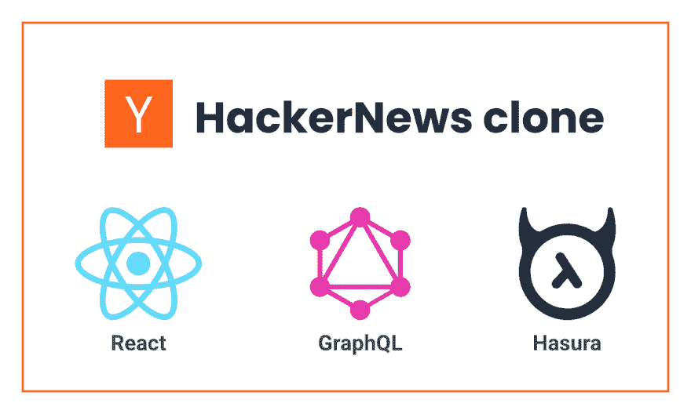

# 用 GraphQL、Hasura 和 React 构建黑客新闻克隆——第 2 部分

> 原文：<https://dev.to/hasurahq/building-a-hacker-news-clone-with-graphql-hasura-and-react-part-2-33ho>

*本教程由* [阿比吉特·辛格](https://github.com/abhi40308) *撰写，并作为 [Hasura 技术作者计划](https://blog.hasura.io/the-hasura-technical-writer-program/)的一部分发布，该计划旨在支持为开源 Hasura GraphQL 引擎编写指南和教程的作者。*

在本系列的 [**第一部分**](https://blog.hasura.io/hackernews-tutorial-using-graphql-react-hasura-part1/) 中，我们设置了后端和 Auth0。在这一部分，我们将设置 React 应用程序并将其连接到我们的后端。

## React App 设置

我们将从用户认证开始。我们将使用 JWT (JSON web 令牌)进行身份验证。让我们首先在 react 应用程序中创建一些基本的标题来显示登录按钮。

替换`styles/index.css`文件的内容，如图所示: