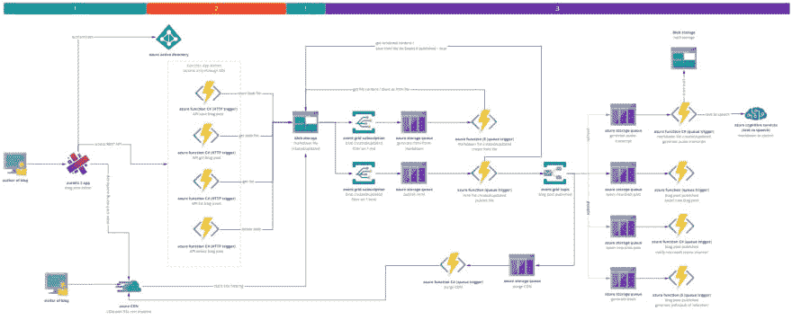
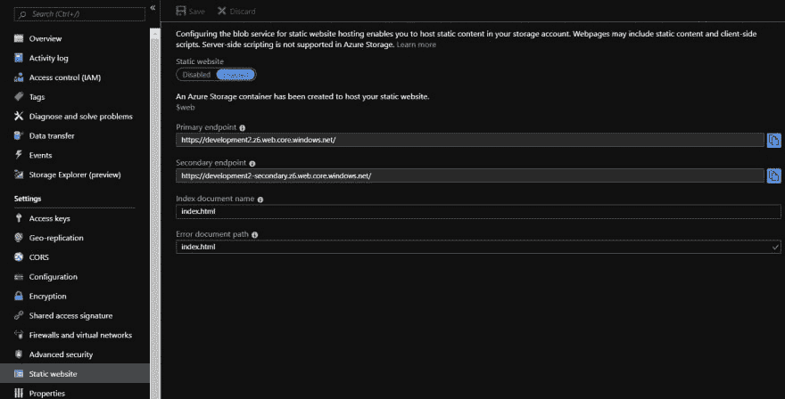
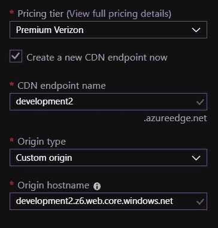
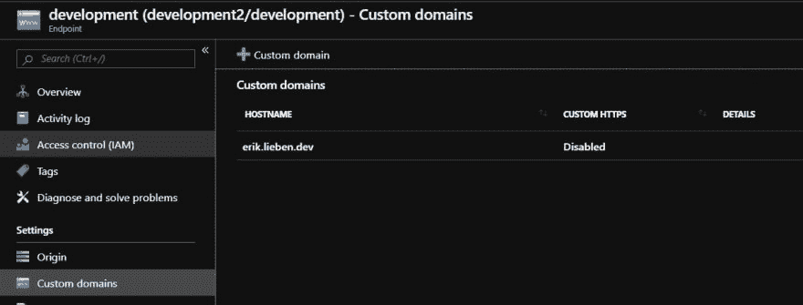
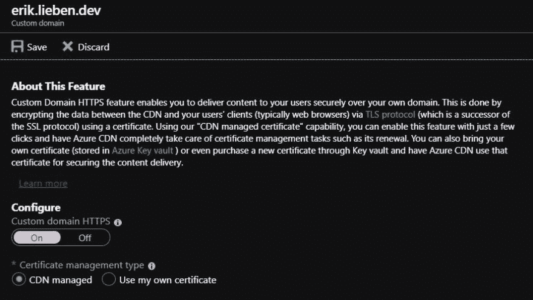
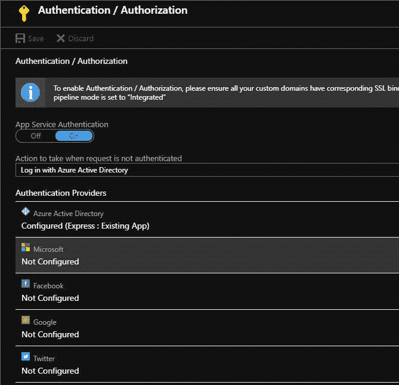

# 在 Azure 上构建一个无服务器的博客网站

> 原文：<https://dev.to/effectory/building-a-serverless-blog-site-on-azure-1phd>

> 本文是 [#ServerlessSeptember](https://dev.to/azure/serverless-september-content-collection-2fhb) 的一部分。在这个无服务器的内容集合中，您可以找到其他有用的文章、详细的教程和视频。9 月份，每天都有来自社区成员和云倡导者的新文章发布，没错，每天都有。
> 
> 在[https://docs.microsoft.com/azure/azure-functions/](https://docs.microsoft.com/azure/azure-functions/?WT.mc_id=servsept_devto-blog-cxa)了解更多关于微软 Azure 如何实现你的无服务器功能。

# 简介

在这篇博客文章中，我想带你了解一个无服务器应用程序的故事，并教你如何构建一个无服务器应用程序，以最低的成本运行，同时保持可伸缩性。我希望能够启发您，尝试、体验无服务器的想法和实现，以获得无服务器场景的知识。

我们将构建一个应用程序，允许我们在 markdown 中发布文章，并将其呈现为静态 HTML 页面，以便于使用，即使您没有启用 JavaScript(搜索引擎),稍后，如果您启用了 JavaScript，我们将寻找增强该站点的方法。

本文将带您了解整个故事，并通过一些代码示例给出该应用程序的总体概述，但这绝不意味着是一个完整应用程序的复制和粘贴示例。我将在后续的博客文章中更深入地探讨具体的主题，分别研究每一部分。

# 建筑/直升机视图

应用程序可以分为几个部分:

1.  静态文件的托管(绿色栏下方)
2.  用于对内容进行修改的 API(红色条下方)
3.  处理/生成部分(紫色条下方)

[](https://res.cloudinary.com/practicaldev/image/fetch/s--f67CYjGx--/c_limit%2Cf_auto%2Cfl_progressive%2Cq_auto%2Cw_880/https://thepracticaldev.s3.amazonaws.com/i/ut742i2z2vnaob1kqwu5.jpg)

在我们的例子中，无服务器的目标是尽可能多地移除空闲的 CPU 处理部分，同时仍然允许我们能够向外扩展以处理流量或进程。

## 静态文件的托管(绿色栏下方)

在第一部分，我们在 Azure 存储上托管博客的文件/内容，并使用 Azure CDN 向客户端提供文件。这允许我们只为文件存储和从 Azure Blob 存储到 Azure CDN 的文件传输付费。我们不需要任何可能浪费 CPU 周期的东西(空闲的虚拟机或应用服务)。CDN 允许我们快速扩展和交付内容给我们的客户，我们再次只为 CDN 的使用付费(如果没有流量，就没有闲置的机器)。

## 对内容进行修改的 API(红色条下方)

第二部分由我们可以作为消费计划的一部分运行的 Azure 函数组成。这使我们不再需要一台正在运转(增加了我们的成本)并等待客户请求的机器。使用消费计划中的 Azure 函数，我们只需为一个函数的启动和它在执行期间使用的 CPU/内存量付费。因此，当没有人写博客文章(检索和存储)时，系统在某种意义上是关闭的，不会产生成本。以这种方式运行代码的一个缺点是，函数需要一点时间来唤醒或冷启动。目前，我们承认在编辑时有时需要等待几秒钟来保存或检索我们的内容。

## 加工/生成零件(下方紫色栏)

应用程序的最后一部分是一组 Azure 函数，用于处理客户端可以使用的静态内容的生成。这允许我们快速地向所有客户端(也包括没有启用 JavaScript 的客户端，如搜索引擎)提供内容，而不需要在每个请求上呈现静态内容。

# 基础设施

应用程序的大多数消费者访问的应用程序的中心部分是静态文件(JavaScript 应用程序/包或生成的静态博客文章)。为了向消费者提供这些服务，我们只需要 Azure 提供的一小部分服务:Azure Blob 存储和 Azure CDN 服务。

## 静态文件托管使用 Azure Blob 静态网站托管

Azure Blob 存储支持静态网站托管。这一功能允许我们只为流量/传输和文件存储付费，这一功能完全符合无服务器的故事。它还允许我们定义索引和错误文档路径，这对于使用推送状态的单页应用程序非常有用。

您可以为 blob 存储设置自定义域名，但它不允许您为域名使用自定义 SSL 证书。所以如果你想通过 HTTPS 提供文件，它会给你一个错误 SSL 证书的警告，因为它提供的是 blob.core.windows.net 的证书，而不是你自定义域需要的证书。这可以通过使用 Azure CDN 服务来解决，该服务可以选择为您的域生成或使用自定义证书。

## Azure 内容交付网络

Azure CDN 是一个由 Azure 管理的分布式服务器网络，允许我们在靠近最终用户的地方缓存我们的内容，以最大限度地减少延迟。CDN 拥有遍布全球的 POP(存在点)位置，能够以最快的速度向世界上任何地方的任何人以任何负载提供内容。

如上所述，它还解决了我们的 SSL 证书问题，因为我们可以上传或拥有 SSL 证书，或者为我们的域免费获得一个证书。

Azure Blob 存储之上的 CDN 为我们提供了完美的可扩展性和性能目标，因为 Azure CDN 服务支持比单个存储帐户高得多的出口限制。

## 费用

如果我们不知道一个网站的确切使用模式，那么计算成本是很困难的，但是我们可以快速地做出一些估计，让我们对月底的账单有一个概念。

### 天蓝色储物

本地冗余存储足以满足我们的使用情形，我们需要的存储每月每 GB 成本为 0.0166 欧元。交易的流程稍微具体一些，但是如果我们对其进行概括，每 10.000 笔交易的成本为 0.0456 欧元。我们每月免费获得 5GB 的出站数据传输。之后，我们每 GB 支付 0.074 欧元。

我们存储的静态文件不是数 GB 的数据，它很可能低于一 GB 的数据，这意味着 0.0166 欧元，假设我们做了 50.000 次操作(这是一个很大的数字，但假设我们的作者经常保存他们的工作)，这是 0.228 欧元，每 GB 数据传输 0.074 欧元。这给了我们总共 32 欧分来托管一个月的所有内容，这几乎是免费的，我们可能会有一个更低的使用模式，因为 Azure CDN 完成了大部分数据传输。

### 天蓝色 CDN

Azure CDN 的成本是我们将开始向客户支付的转移成本，因为他们很可能会触及 CDN 的一个边缘点。我们将使用威瑞森的 Azure Premium，它比标准版稍贵一些(但支持 HTTP 到 HTTPS 重定向规则)。

每个区域都有不同的价格，但如果我们选择最贵的一个，即每 GB 0.3930 欧元，并估计 5 GB 的传输，我们最终的总成本约为 2 欧元。

| 地区 | 区域 | 每 GB/月 |
| --- | --- | --- |
| 一区 | 北美、欧洲、中东和非洲 | €0.1333 |
| 第二区 | 亚太地区(包括日本) | €0.1965 |
| 第三区 | 南美。参见 AMERICA | €0.3930 |
| 第四区 | 澳大利亚 | €0.2202 |
| 第五区 | 印度 | €0.2674 |

## 设置 Azure Blob 存储托管

Azure blob 存储可以很容易地设置为托管静态内容。创建存储帐户后，转到“设置”下的“静态网站”部分，并使用开关启用它。

[](https://res.cloudinary.com/practicaldev/image/fetch/s--RBOt4I7g--/c_limit%2Cf_auto%2Cfl_progressive%2Cq_auto%2Cw_880/https://thepracticaldev.s3.amazonaws.com/i/x8h578l0fjcrt88yrk41.JPG)

有两个选项需要配置，即“索引文档名称”和“错误文档名称”。如果您要托管启用了“pushState”的 SPA 应用程序，请将这两个选项都设置为“index.html”或 SPA 应用程序的根文档，以使 SPA 应用程序能够在比基本路由更深的路由上激活(启用了到 SPA 应用程序/ pushState 的深度链接)。

## 设置 Azure CDN

我们现在可以创建一个新的 Azure CDN 配置文件，并将端点指向我们新创建的 Azure Storage 静态站点 URL。您可以在启用静态网站托管的同一个屏幕中找到静态网站的 URL。这是“主要终点”。创建 Azure CDN 配置文件时，选中“立即创建新的 CDN 端点”前的框，并提供您要使用的名称。从下拉框“来源类型”中选择“自定义来源”，并将“主要端点”URL 粘贴到名为“来源主机名”的文本框中。请确保删除前导“https://”以使其有效。

[](https://res.cloudinary.com/practicaldev/image/fetch/s--8n2cR0vP--/c_limit%2Cf_auto%2Cfl_progressive%2Cq_auto%2Cw_880/https://thepracticaldev.s3.amazonaws.com/i/5i0ll7sbbu9pba5tc45d.JPG)

### 添加自定义域名

如果您拥有自己的域名，您可以将其设置为指向 CDN 端点。
[T3】](https://res.cloudinary.com/practicaldev/image/fetch/s--0UGxPM6---/c_limit%2Cf_auto%2Cfl_progressive%2Cq_auto%2Cw_880/https://thepracticaldev.s3.amazonaws.com/i/lyq5cojdygmq6g5aamy4.JPG)

### 启用 HTTPS

添加自定义域名后，您可以点击它来设置自定义域名的 HTTPS。您可以购买自己的 SSL 证书，也可以使用“CDN 托管”选项从 Microsoft Azure 免费获得一个证书。

[](https://res.cloudinary.com/practicaldev/image/fetch/s--QsCTVPB6--/c_limit%2Cf_auto%2Cfl_progressive%2Cq_auto%2Cw_880/https://thepracticaldev.s3.amazonaws.com/i/q2a0m7hzlwpg6tgeeyic.JPG)

# API

编辑将需要一种方法来访问仍未发布的博客文章，并且需要一种方法来以安全的方式发布/保存博客文章。

## 带 Azure AD 的安全 API(带 HTTP 触发器的 Azure 函数)

因为我们不希望任何人能够修改我们的博客文章，所以我们需要限制对带有 HTTP 端点的 Azure 函数的访问。

Azure Functions 团队创建了一个非常容易使用的选项来完成这个任务。我们只需在“认证/授权”下的“网络”部分的“功能应用程序”的“平台功能”选项卡中添加一个提供程序即可，无需对我们的代码进行任何修改。

有许多不同的身份验证提供者。现在，我将使用“Azure Active Directory”作为身份验证提供者，并在 AD 中创建一个启用了双因素身份验证的用户。这将为我们的总成本增加大约 1 欧元的额外成本(对于启用了双因素身份认证的用户)。

[](https://res.cloudinary.com/practicaldev/image/fetch/s--ilgGNTRd--/c_limit%2Cf_auto%2Cfl_progressive%2Cq_auto%2Cw_880/https://thepracticaldev.s3.amazonaws.com/i/j1t6qk10h06ti6jkjvda.JPG)

## 天蓝色功能 C-sharp

我们的 REST API 由管理界面使用，负责服务和保存我们的博客文章。使用 Azure 函数的输入和输出绑定允许我们构建我们的 REST API，而无需维护/编写大量代码。

### 获取博文

```
 [FunctionName(nameof(Get))]
        public async Task<IActionResult> Get(
            [HttpTrigger(AuthorizationLevel.Anonymous, "get", Route = null)] HttpRequest req,
            [Blob("posts", FileAccess.Read, Connection = "connection")] CloudBlobContainer container)
        {
            string slug = req.Query["slug"];
            var blobRef = container.GetBlockBlobReference(slug + ".md");
            string markdownText = await blobRef.DownloadTextAsync();
            return new OkObjectResult(markdownText);
        } 
```

Enter fullscreen mode Exit fullscreen mode

### 保存博文

```
 [FunctionName(nameof(Save))]
        public async Task<IActionResult> Save(
            [HttpTrigger(AuthorizationLevel.Anonymous, "post", Route = null)] HttpRequest req,
            [Blob("posts", FileAccess.ReadWrite, Connection = "connection")] CloudBlobContainer container,
            [Queue("get-markdown-metadata", Connection = "blogeriklieben")]CloudQueue outputQueue)
        {
            string slug = req.Query["slug"];
            if (string.IsNullOrWhiteSpace(slug))
            {
                return new BadRequestObjectResult("slug cannot be empty");
            }

            var blobRef = container.GetBlockBlobReference(slug + ".md");

            await blobRef.UploadFromStreamAsync(req.Body);
            blobRef.Properties.ContentType = "text/markdown";
            await blobRef.SetPropertiesAsync();

            // request update to the index file
            await outputQueue.AddMessageAsync(new CloudQueueMessage(slug));

            return new OkObjectResult(slug);
        } 
```

Enter fullscreen mode Exit fullscreen mode

### 列出降价文件

```
 [FunctionName(nameof(List))]
        public IActionResult List(
            [HttpTrigger(AuthorizationLevel.Anonymous, "get", Route = null)] HttpRequest req,
            [Blob("posts/index.json", FileAccess.ReadWrite, Connection = "connection")] string index)
        {
            return new JsonResult(index);
        } 
```

Enter fullscreen mode Exit fullscreen mode

# Azure 函数类型脚本

Azure 函数的伟大之处在于，你可以创建处理单一职责的小函数，并将其传递给下一个函数进行进一步处理。那个函数甚至不需要用相同的编程语言编写，你可以使用最适合用例的语言。

在我们的例子中，我们将使用 TypeScript/Java script 通过 markdown-it 呈现 markdown 文件。这是我们将在客户端编辑器中使用的 HTML transformer 的 markdown。Markdown——这是一个 JavaScript 框架，用丰富的插件/扩展集从 markdown 生成 HTML。

这样，我们不需要找到一个 C#框架或 markdown-it 的端口来做完全相同的事情，我们可以在一个小函数中使用相同的逻辑，并将其传递回我们的 C#函数。

因此，即使您觉得自己没有太多的 JavaScript 经验或知识，至少您可以使用一小部分 JavaScript 代码，不需要担心获取知识来将它作为服务托管，也不需要担心在应用程序的生命周期内保持它运行的其他问题。

在这种情况下，我将使用两个 TypeScript 函数；一个用于收集元数据，一个用于使用 Aurelia 生成静态内容。

## 读取降价元数据

在我们的编辑器中，我们可以通过在 markdown 文本的顶部添加以下键/值集来提供博客文章的元数据:

```
---
title: 'amazing  blog  post',
publishDate: 2019-09-09,
state: published,
tags: amazing, awesome, superb
--- 
```

Enter fullscreen mode Exit fullscreen mode

从我们的博客文章中获取这些元数据的唯一方法是处理 markdown 文件本身。我们要做的是监听存储在 blob 存储帐户中的 markdown 文件的修改。

一旦保存了 markdown 文件，我们需要处理 markdown 元数据，以检查博客文章是否处于 published 状态，这意味着我们需要将其排队以供发布，并且我们需要用最新的信息更新我们保存在 blob 存储中的博客文章索引文件。

功能码 index.ts:

```
const MarkdownIt = require('markdown-it');

module.exports = async function (context, markdownFilePath, markdownFile) {

    context.log('Processing metadata for markdown file: ', markdownFilePath);  

    const md = new MarkdownIt();
    md.use(require('markdown-it-meta'));
    const html = md.render(markdownFile);

    const meta = md.meta;
    meta.fileName = markdownFilePath;
    return JSON.stringify(meta);
}; 
```

Enter fullscreen mode Exit fullscreen mode

正如您所看到的，这并没有太多的代码，而且仍然易于理解和维护。

该函数导入 markdown 库并创建它的一个实例。下一行导入 markdown-it-meta 插件来解析元数据，并告诉 markdown-it 使用插件/扩展。它会将 markdown 呈现为 HTML，并将元数据保存在 markdown 实例的一个单独的属性中。这是我们进一步处理所需的数据；我们用 markdownFilePath 文件名扩展它，并返回序列化为 JSON 的对象。

现在，如果您不想使用 SPA 来呈现静态 HTML，您也可以使用上面代码片段中的 HTML 变量，并将其与您的模板 HTML 相结合，并将其作为。HTML 文件。

上述代码示例的神奇之处在于绑定。Azure Functions 运行时注入到我们的函数中。为了让运行时注入这些，我们用绑定定义定义了以下 functions.json 文件:

```
{  "bindings":  [  {  "name":  "markdownFilePath",  "type":  "queueTrigger",  "direction":  "in",  "queueName":  "get-markdown-metadata",  "connection":  "ConnectionString_STORAGE"  },  {  "name":  "markdownFile",  "type":  "blob",  "path":  "{queueTrigger}",  "connection":  "ConnectionString_STORAGE",  "direction":  "in",  "dataType":  "string"  },  {  "name":  "$return",  "type":  "queue",  "direction":  "out",  "queueName":  "markdown-metadata",  "connection":  "ConnectionString_STORAGE"  }  ]  } 
```

Enter fullscreen mode Exit fullscreen mode

第一个绑定是一个触发器，在新消息到达存储队列时激活，名为 get-markdown-metadata。消息内容是修改后的降价文件的文件名。

第二个绑定为我们提供了 markdown 文件的内容。为了获取 markdown 文件的路径，我们使用动态变量{queueTrigger}从激活 Azure 函数的队列中获取消息内容。

最后一个绑定是对函数返回值的绑定，并将返回值写出到另一个名为 markdown-metadata 的存储队列中。

## 生成静态文件

后来，我想改进我的博客，使之更加动态，并使用 SPA(单页应用程序)框架来实现这一点。现在，使用 SPA 框架生成静态文件可能看起来有点奇怪，但它将是有用的，很快就会公布(在未来的博客文章中-:-)。

SPA 的一个缺点是，默认情况下，它是客户端呈现的，这对于依赖静态内容的访问者来说不是最佳选择，并且它还需要一点时间来在第一次加载页面时初始化 SPA 框架。不启动 SPA 应用程序的访问者的一个例子是搜索引擎，它会错过你的大部分内容。幸运的是，有几个选项可以减轻负面影响。

### 增强

使用增强技术，您可以获取站点的静态(或服务器端呈现的)部分(使用另一个框架如 ASP.NET 呈现)，并使用客户端代码逐步增强它。如果页面有静态内容，并且在每次页面加载时不使用任何动态内容来呈现/理解页面，那么这种技术非常有效。内容不需要永远是静态的；内容的读取/查看次数只需紧跟内容的写入/修改次数即可。

例如，一篇博客文章、一个产品页面和新闻部分。

这种技术在无服务器环境中工作得很好，因为我们只需要 CPU 周期来不时地生成静态内容。您需要考虑您拥有的内容数量以及您需要刷新静态内容的时间范围。如果查看次数高于内容重新生成的次数，它就能正确地完成工作。

### 服务器端渲染

使用 SSR(服务端呈现)技术，您可以在服务器端对每个请求运行框架，以动态生成将呈现给客户端的第一个视图。现在，这并没有什么新鲜的，因为我们已经用 ASP.NET 做了很久了。

这种技术的主要区别在于，您使用与客户端相同的 SPA 框架，并使用 Node 运行它。服务器上的 JS。这允许您拥有一个代码库，并让框架从静态内容中处理页面的再水合。

这方面的一个例子可能是讨论板上的(非常活跃的)讨论。您希望在页面加载时呈现最新的讨论，并让客户端呈现处理第一次页面加载后到达的新帖子。或者，如果您的个人资料页面由于内容的变化，每小时都会发生变化，但一周只接待一次访问者，SSR 也可能是一个更好的选择。

您可以以一种无服务器的方式使用这种技术，但是您需要记住，对于每个请求，它都需要 CPU 周期，因为您需要对每个请求进行渲染。如果您有大量的内容，并且更改率高于读取/访问率，或者如果您需要以 1:1 的比率呈现页面以进行写入/修改和读取/访问，这种方法非常有用。

### 实现

我喜欢用的 SPA 框架是 [Aurelia](https://aurelia.io) ，从 2015 年末就有了。该框架由一组不同的库组成，这些库可以作为一个健壮的框架一起使用。由于这种分离和所有不同的用例，库可以用于；从框架开发之初，它就提供了高度的可扩展性。其中一个例子是 PAL(平台抽象库),它在整个库中用来抽象掉对实际浏览器的依赖，这意味着我们可以在 NodeJS 中使用它来实现“虚拟浏览器”。我将在这篇文章中使用的下一个版本的 Aurelia 包含一个类似的实现，它构建在库[@ Aurelia](https://dev.to/aurelia)/runtime-html-JSDOM 中的 JSDOM 之上，可以完美地运行在 on Azure Function 的内部。

一个小小的免责声明:Aurelia 的下一个版本(vNext 或 2)仍在开发中，这意味着在我写这篇博客的时候，它可能不是生产使用的最佳选择，但是对于这篇博客，我承认在 Aurelia 的下一个版本的最终版本中事情可能会有所不同。

> 补充说明:我稍后将创建一个单独的博客帖子，一步一步地介绍 Aurelia 应用程序，在这篇帖子中，我将重点介绍使用 Azure 函数呈现静态文件内容和启动 SPA 应用程序。

在第一次尝试生成静态页面时，我创建了启动 aurelia 的代码，并使用了[@ Aurelia](https://dev.to/aurelia)/runtime-html-jsdom，这对于与 Aurelia 相关的一切都很顺利。webpack 插件风格加载器是不太好用的东西之一，因为我找不到一种方法来提供或注入 DOM 的自定义实现；它似乎对浏览器中的对象有很强的依赖性。解决这个问题最简单的方法是将它加载到“虚拟浏览器”(由 JSDOM 创建)中，在那里它需要的所有对象都存在。

让我们先来看看渲染出静态页面所需的代码:

```
import { AzureFunction, Context } from "@azure/functions";
import * as jsdom from 'jsdom';
import * as fetch from 'node-fetch';

const queueTrigger: AzureFunction = async function (context: Context, slug: string): Promise<void> {

    context.log('Slug to render', slug);

    // Retrieve the SPA application html and javascript bundle
    const mainjs = await getFile('main.js');
    const indexhtml = await getFile('index.html');

    // Create a new JSDOM instance and use the index.html as the open document
    const dom = new jsdom.JSDOM(indexhtml, {
        contentType: "text/html",
        includeNodeLocations: true,
        pretendToBeVisual: true,
        storageQuota: 10000000,
        runScripts: "dangerously",
        resources: "usable"
    });

    // JSDOM has no default support for fetch, let's add it because we use fetch for performing calls to our API in our SPA app
    dom.window.fetch = fetch["default"];

    // Once JSDOM is done loading all the content (our index file)
    dom.window.document.addEventListener("DOMContentLoaded", async function () {

        // Tell JSDOM to load our webpack bundle and execute it
        dom.window.eval(mainjs);

        // Wait for the Aurelia application to start
        await dom.window.au.wait();

        // Change the url to let the aurelia-router open the component blog-post with the specified slug (the component will load the file from our get-post API)
        dom.window.location.hash = `blog-post(${slug})`;

        // Wait a second for the routing to complete
        await new Promise(resolve => setTimeout(resolve, 1000));

        // Serialize the state of the DOM to a string 
        let result = dom.serialize();

        // Replace the bundle, so that the app doesn't directly startup when the page is loaded (we want to keep it static for now)
        result = result.replace('<script type="text/javascript" src="main.js"></script>', '');

        // Store the result and notify Azure Functions we are done
        context.done(await saveFile(slug, result));
    });
};

export default queueTrigger; 
```

Enter fullscreen mode Exit fullscreen mode

正如您在本例中看到的，我们不使用 blob 输入或输出绑定。这是因为在写这篇博文的时候，仍然不支持从$web 容器(Azure Blob Storage static site hosting 将其用作根容器)访问 Blob 的选项，或者我找不到一种方法来转义$字符。

我们目前可以做的是使用 azure blob storage SDK 来自己获取和保存文件。下面代码块中的函数 getFile 和 saveFile 将为我们完成这项工作。这有点不太令人愉快，但它也让我们了解到通过使用 Azure 函数绑定我们可以节省/删除多少代码:-)

```
import {
  Aborter,
  BlockBlobURL,
  ContainerURL,
  ServiceURL,
  SharedKeyCredential,
  StorageURL} from '@azure/storage-blob';

// credentials should not be in code, but just here to make it easier to read
const storageAccount = 'storage-account-name';
const pipeline = StorageURL.newPipeline(new SharedKeyCredential(storageAccount, 'key'));
const serviceURL = new ServiceURL(`https://${storageAccount}.blob.core.windows.net`, pipeline);
const containerURL = ContainerURL.fromServiceURL(serviceURL, '$web');

async function getFile(file) {   
    const blockBlobURL = BlockBlobURL.fromContainerURL(containerURL, file);
    const aborter = Aborter.timeout(30 * 1000);
    const downloadResponse = await blockBlobURL.download(aborter, 0);
    return await streamToString(downloadResponse.readableStreamBody);
}

async function streamToString(readableStream) {
    return new Promise((resolve, reject) => {
      const chunks = [];
      readableStream.on("data", data => {
        chunks.push(data.toString());
      });
      readableStream.on("end", () => {
        resolve(chunks.join(""));
      });
      readableStream.on("error", reject);
  });
}

async function saveFile(slug: string, content: string) {

  const blockBlobURL = BlockBlobURL.fromContainerURL(containerURL, `${slug}\\index.html`);
  const uploadBlobResponse = await blockBlobURL.upload(Aborter.none, content, content.length, {
    blobHTTPHeaders: {
      blobContentType: "text/html",
      blobContentEncoding: "utf-8",
    }
  });

  return uploadBlobResponse.errorCode;
} 
```

Enter fullscreen mode Exit fullscreen mode

为上述函数留下的唯一内容是 function.json 文件，它包含我们的绑定信息。如你所见，当我们在渲染静态页面存储队列中获得一个新项目时，我们会生成一个新的静态页面。
我们推入队列的 [slug](https://en.wikipedia.org/wiki/Slug_(publishing)) 是博客文章本身的一个短标识符，大部分用破折号创建一个可读的 URL。

```
{  "bindings":  [  {  "name":  "slug",  "type":  "queueTrigger",  "direction":  "in",  "queueName":  "render-static-page",  "connection":  "connectionString_STORAGE"  }  ],  "scriptFile":  "../dist/RenderFile/index.js"  } 
```

Enter fullscreen mode Exit fullscreen mode

# 那么我们每月大概的运行成本是多少呢？

*   活动目录用户每月 1.18 欧元
*   约 0.32 欧元用于在 Azure 存储上托管我们的内容
*   约 2 欧元，用于使用 Azure CDN 证明我们的内容

因此，在咖啡馆每月花一杯咖啡或一杯啤酒的价格，我们就能够在全球最佳条件下提供我们的应用。

# 接下来我们能去哪里？

Azure 中有很多不同的服务，你可以附加到你的系统或外部系统，你可以使用 web hooks 与之对话。

几个例子是:

*   使用 Azure 认知服务文本到语音生成音频抄本
*   Tweet 创建了新的博客文章(Azure 函数=> twitter API)
*   通知微软团队频道(Azure 函数= >团队 API)
*   生成 PDF/ EPUB (Azure 函数)

我希望这篇文章能够启发你以不同的方式思考你需要构建的东西，并且你不总是需要一个在闲置时耗费金钱的应用服务或虚拟机。