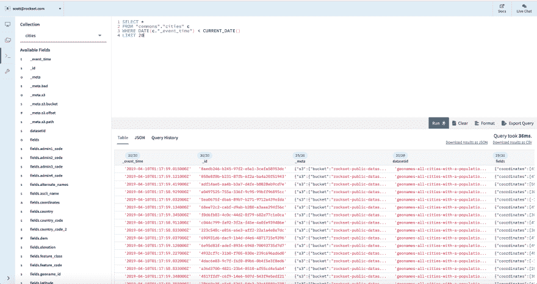
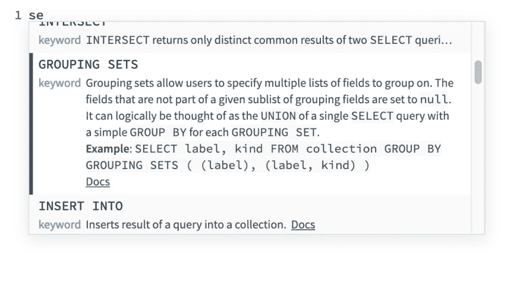
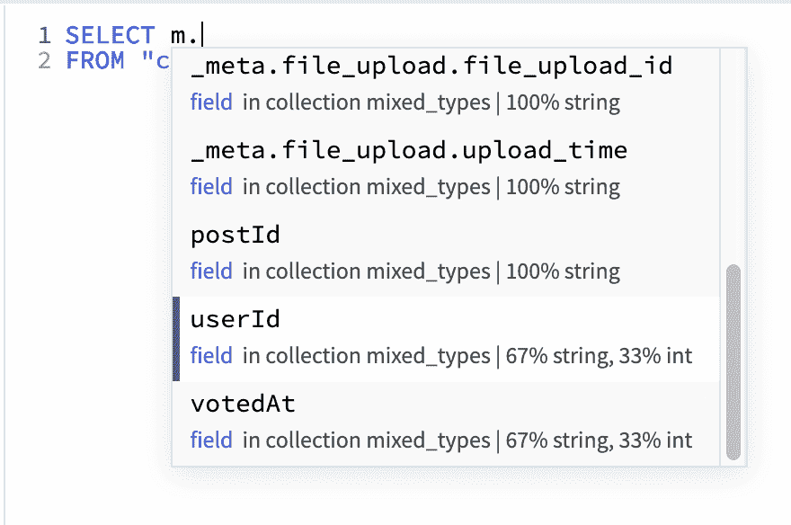
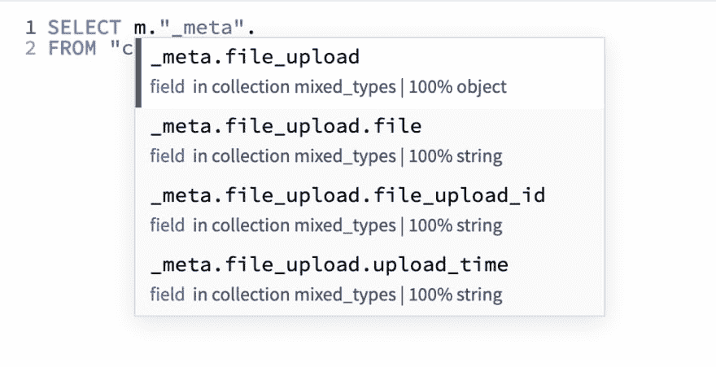

# 为杂乱的半结构化数据构建 SQL 开发环境

> 原文：<https://dev.to/rocksetcloud/building-a-sql-development-environment-for-messy-semi-structured-data-3pc9>

*作者为[斯科特·莫里斯](https://www.linkedin.com/in/scott-morris-b082a6100/)T3】*

**为什么要构建新的 SQL 开发环境？**

我们热爱 SQL——我们的使命是为杂乱、半结构化的现实世界数据带来快速、实时的查询，SQL 是我们努力的核心部分。SQL API 允许我们的产品整齐地放入用户的堆栈中，而无需任何工作流重新架构。我们的用户可以轻松地将 Rockset 与大量现有的 SQL 开发工具(例如 [Datagrip](https://docs.rockset.com/jetbrains-datagrip/) 、 [Jupyter](https://docs.rockset.com/jupyter/) 、 [RStudio](https://docs.rockset.com/rstudio/) )和数据浏览/可视化工具(例如 [Tableau](https://docs.rockset.com/tableau/) 、 [Redash](https://docs.rockset.com/redash/) 、 [Superset](https://docs.rockset.com/apache-superset/) )集成在一起。为什么要“重新发明轮子”并创建我们自己的 SQL 开发环境？

尽管 SQL 社区中提供了大量优质的编辑器和仪表板，但我们意识到对原始数据使用 SQL(例如嵌套的 JSON、Parquet、XML)对我们的用户来说是一个全新的概念。虽然 Rockset 支持标准的 ANSI SQL，但我们确实为数组和对象添加了一些扩展。我们围绕两个核心原则构建了 Rockset:强动态类型和文档对象模型。虽然这些实现了传统上不可行的数据查询，但它们也可以运行在传统的查询开发工作流上。例如:

*   [强动态类型](https://rockset.com/blog/dynamic-typing-in-sql/) (TLDR:许多不同类型的数据可以同时存在于一个 Rockset 字段中):尽管有其优势，但强动态类型可能会导致一些令人费解的查询结果。例如，一个

```
SELECT *
WHERE field > 0 
```

Enter fullscreen mode Exit fullscreen mode

对数据`[{ field: '1'}, { field: '2'}, { field: 3 }]`的查询将只返回一个值(`3`)，或者对数据`[{ field: '1'}, { field: '2'}, { field: '3' }]`不返回任何值。如果查询编辑器无法将字段中的多种字段类型与用户关联起来，就会造成混乱。

*   [文档对象模型/智能模式](https://rockset.com/blog/from-schemaless-ingest-to-smart-schema-enabling-sql-on-raw-data/) (TLDR:与字段列表相比，Rockset“模式”更像 JSON 对象):字段可以嵌套在其他字段中，甚至可以嵌套在数组中。传统的模式查看器很难表现这一点，尤其是当涉及多种类型或嵌套数组时。此外，即使是经验丰富的 SQL 老手也可能不熟悉我们支持的一些数组和对象函数。

考虑到这些挑战，我们决定从头开始构建我们自己的 SQL 开发环境。我们仍然期望(并希望)我们的用户将带着他们的查询在他们选择的第三方工具上进行探索和可视化，但希望我们能够在他们的探索过程中帮助他们在混乱的数据上运行熟悉的 SQL，尽可能少地带来痛苦。为了做到这一点，我们的新编辑器整合了几个我们认为能够提供的关键功能。

**全文编辑**

[](https://res.cloudinary.com/practicaldev/image/fetch/s--iKBhjVyF--/c_limit%2Cf_auto%2Cfl_progressive%2Cq_auto%2Cw_880/https://images.ctfassets.net/1d31s1aajogl/5p9qjrcwJgedvrDKXMfsf0/1beacb668e67f8afb8e9830ccfc5f6fb/Screen_Shot_2019-06-13_at_4.54.26_PM.png)

**自定义功能**

*   内联交互文档:不确定我们支持什么函数或者函数需要什么参数？从现在开始，Rockset 支持的所有函数都将包含在我们的 autocomplete 小部件中，同时还有一个描述和链接，链接到我们文档的相关部分以了解更多细节。

[](https://res.cloudinary.com/practicaldev/image/fetch/s--6sT-0O4G--/c_limit%2Cf_auto%2Cfl_progressive%2Cq_auto%2Cw_880/https://images.ctfassets.net/1d31s1aajogl/21V1IVoo6992AadTJLUhbF/f1a984988fed96125aa9bd66bfc62571/Screen_Shot_2019-06-10_at_2.10.05_PM.png)

*   *内联字段类型分布*:不记得 a 字段是什么类型？在构建时查看它，并确保您正在编写您想要的查询。或者当结果与您的期望不太匹配时，使用它来调试查询。

[](https://res.cloudinary.com/practicaldev/image/fetch/s--RQfFU-9Y--/c_limit%2Cf_auto%2Cfl_progressive%2Cq_auto%2Cw_880/https://images.ctfassets.net/1d31s1aajogl/5XuIQs2mA8oudHf6NaT5wI/26d1d3963a304a2c649446c9f2033342/Screen_Shot_2019-06-10_at_2.11.18_PM.png)

*   *即时反馈*:我们通过我们的 SQL 解析器实时运行每个查询片段，以便在构建过程中尽早发现打字错误、语法错误和其他常见错误。

[](https://res.cloudinary.com/practicaldev/image/fetch/s--HtUgLTg6--/c_limit%2Cf_auto%2Cfl_progressive%2Cq_auto%2Cw_880/https://images.ctfassets.net/1d31s1aajogl/2yhOZjQSO9DMoWYBUdFaip/d7aaa0d9a2010c33a97e44bc8d4ec878/Screen_Shot_2019-06-10_at_2.31.01_PM.png)

*   嵌套字段的完成:我们的字段完成系统是在底层数据的文档模型上建模的。不管嵌套的级别如何，您总是可以得到可用的字段填充。

[](https://res.cloudinary.com/practicaldev/image/fetch/s--oixRzUns--/c_limit%2Cf_auto%2Cfl_progressive%2Cq_auto%2Cw_880/https://images.ctfassets.net/1d31s1aajogl/3o6yE8oHBA4lxUZ0UH5NDS/11f4014441c0170e6fa7a5612970becd/Screen_Shot_2019-06-10_at_2.51.42_PM.png)

这些新特性伴随着 SQL 开发环境中所有常见的东西(模式、查询历史等)。

**技术挑战**

在这个过程中，我们遇到了几个有趣的技术挑战:

*   *标记化嵌套路径和别名处理*:一些好玩的语言处理/标记化黑客。CodeMirror(我们选择的编辑器框架)附带了基本的 SQL [语法突出显示](https://github.com/codemirror/CodeMirror/blob/master/mode/sql/sql.js)和 SQL [关键字/表/列完成](https://codemirror.net/addon/hint/sql-hint.js)，但我们最终构建了自己的解析器和完成生成器，它们更好地考虑了嵌套的字段路径，并可以更好地与我们的模式接口。

*   *引入函数签名和描述*:我们如何避免在前端代码中硬编码这些？这样做会将这些信息留在三个地方(前端代码、文档文件和后端代码)——这种情况很危险，随着时间的推移，几乎肯定会失去一致性。然而，当我们以 XML 格式存储原始文档文件时，我们能够将语义 XML 解析标签直接添加到我们的文档代码库中，然后我们在每个版本的编译时从文档中对其进行预处理并将其添加到我们的产品中。

*   *显示“实时”解析错误*:我们不想每次都实际运行查询，因为那将是昂贵和浪费的。然而，我们深入研究了我们的后端代码过程，发现查询经历了两个阶段——语法解析和执行计划——而没有接触任何数据。我们添加了一个‘out switch ’,以便验证查询可以通过这两个阶段，并报告成功或失败，而无需继续执行过程。只需要在我们的后端做一点黑客工作。

**结论**

我们很高兴引入这些新功能，作为构建查询复杂、嵌套混合类型数据的最终环境的第一步，我们将在未来几个月继续改进它。让我们看看你的想法吧！

您还想在我们的 SQL 开发环境中看到什么？给我发一封电子邮件到斯科特[at] rockset [dot] com

资源:CodeMirror(编辑器和基本的自动完成功能)，算术(小部件设计灵感)