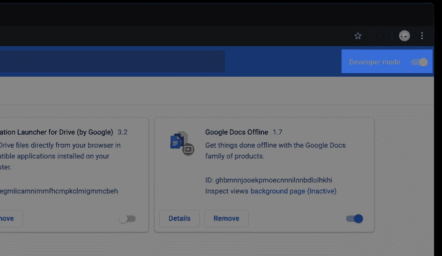
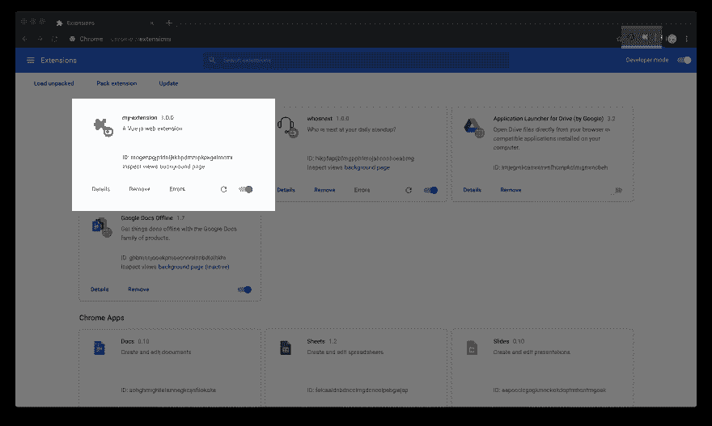
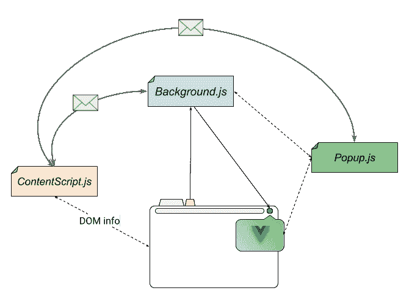
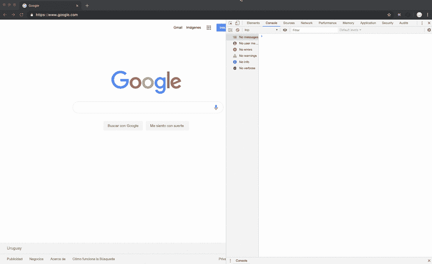

# 用 Vue 以光速构建 web 扩展

> 原文：<https://dev.to/flarra/building-a-web-extension-with-vue-at-speed-of-light-2n13>

*最初发表于[斯特里弗的博客](https://www.streaver.com/blog/posts/create-web-extension-vue.html)。*

使用 [VueJs](https://vuejs.org/) 开始创建 web 扩展。

## 什么是 web 扩展？

> Chrome 的定义
> 
> 扩展是定制浏览体验的小软件程序。它们使用户能够根据个人需求或偏好定制 Chrome 的功能和行为。它们建立在 HTML、JavaScript 和 CSS 等 web 技术之上。

在 Chrome 的官方文档中，你可以看到更多关于它们是什么以及你可以用它们做什么的信息。

## 生成我们的 Web 扩展

我们将使用由 [@HugoAlliaume](https://twitter.com/HugoAlliaume) 开发的伟大工具 [vue-web-extension](https://github.com/Kocal/vue-web-extension) 。我们只需要安装 Vue CLI。如果你一直通过 CDN 发行版使用 Vue，那么你需要通过运行:
来安装它

```
$ npm install -g @vue/cli
# OR
$ yarn global add @vue/cli 
```

请查看 [Vue CLI 安装指南](https://cli.vuejs.org/guide/installation.html)了解更多信息。

成功安装 Vue CLI 后，请执行:

```
$ vue init kocal/vue-web-extension my-extension 
```

前面的命令将引导您完成 web 扩展的创建。在这个过程中，你`will be asked a few questions`比如项目名称、我们要使用的库、许可证等。它们使您的生活更加轻松，并减少 web 扩展初始版本中的样板文件。所以不用担心！

> 保持简单
> 
> 如果您不能 100%确定是否添加依赖项，我建议保持简单。您可以随时选择稍后手动添加它。

为了简单起见，在本教程的上下文中，我设置了以下值:

```
? Project name my-extension
? Project description A Vue.js web extension
? Author Streaver
? License MIT
? Use Mozilla's web-extension polyfill? (https://github.com/mozilla/webextension-polyfill) Yes
? Provide an options page? (https://developer.chrome.com/extensions/options) No
? Install vue-router? No
? Install vuex? No
? Install axios? No
? Install ESLint? No
? Install Prettier? No
? Automatically install dependencies? npm 
```

现在我们有了 web 扩展框架，是时候构建扩展了。简单运行:

```
$ cd my-extension
$ npm run build:dev 
```

此时，您应该已经成功编译了扩展(在终端中应该有许多指示符，如`no errors displayed`或`Built at: MM/DD/YYYY`消息)。如果是这样的话，你应该能够在根路径中看到一个新的文件夹`dist`。它包含了`my-extension`的编译版本。耶！🎊

## 让我们在本地运行我们的扩展

### 谷歌浏览器

首先，我们需要启用`developer mode`。为此，打开 Chrome 浏览器，在搜索栏中输入`chrome://extensions`。在那之后，你将能够看到你之前安装的每个扩展的一些卡。你现在需要做的只是打开开关`Developer mode`。如下图所示，查看右上角以找到它。

[](https://res.cloudinary.com/practicaldev/image/fetch/s--1fWU36wD--/c_limit%2Cf_auto%2Cfl_progressive%2Cq_auto%2Cw_880/https://thepracticaldev.s3.amazonaws.com/i/ag5u7d18yxl306k0dydv.png)

现在，我们需要将我们的扩展`my-extension`添加到 Chrome 中。记住，我们在最近创建的`dist`文件夹下有我们的发行版，所以你需要做的是寻找左上角的按钮`Load unpacked`，并选择在你的扩展的根路径中找到的`dist`文件夹。之后，您应该能够看到它在您的其余扩展中列出。

> 热重装
> 
> 一旦你加载了扩展包，`vue-web-extension`允许你继续观察新的变化并热重新加载扩展。要利用这一点，只需运行`npm run watch:dev`。

[](https://res.cloudinary.com/practicaldev/image/fetch/s--VjE3mazH--/c_limit%2Cf_auto%2Cfl_progressive%2Cq_auto%2Cw_880/https://thepracticaldev.s3.amazonaws.com/i/zem0amwud0cnswzpmxur.png)

瞧🎩 ...我们的分机在那里🎉

继续，点击搜索栏旁边的扩展图标，看看会发生什么...

## 理解扩展结构

让我们先来看看我们的扩展树:

```
.
├── dist
│   └── ...
├── src
│   ├── icons
│   │   └── icon_48.png
│   │   └── ...
│   └── options
│   │   └── ...
│   └── popup
│   │   └── App.vue
│   │   └── popup.html
│   │   └── popup.js
│   └── background.js
│   └── manifest.json
├── package.json
├── webpack.config.js
└── yarn.lock 
```

### 我们有什么？

#### [T1】manifest . JSON](#manifestjson)

[manifest.json](https://developer.chrome.com/extensions/manifest) 文件包含关于您的扩展的重要信息，比如它的名称、权限、图标等。

#### 内容脚本

一个[内容脚本](https://developer.chrome.com/extensions/content_scripts)只不过是一个“在网页环境中运行的 Js 文件”基本上，内容脚本将为您提供与使用浏览器时访问的网页进行交互的可能性。是的，它可以访问您在浏览器中打开的所有页面😱。不错😏

要注入内容脚本，我们需要告诉`manifest.json`哪个是文件，什么时候添加。

```
//  src/manifest.json  "content_scripts":  [  {  "matches":  [  "<all_urls>"  //  can  use  different  matching  patterns  here  ],  "js":  ["content.js"]  }  ] 
```

使用选项`matches`你可以明确地告诉浏览器你访问的页面中的`content.js`应该被注入。更多匹配模式请访问: [match_patterns](https://developer.chrome.com/extensions/match_patterns) 。

> 自定义扩展
> 
> 假设我们想在用户与弹出窗口交互时在当前页面中显示一些内容。我们需要将弹出窗口与实际的网页进行通信。

在我们的内容脚本中，我们希望监听来自弹出窗口的事件，所以我们添加:

```
// src/content.js

// This constant is safe, it's just a string in base 64 that we will use below.
const messageToShow =
  "IyMjIyMjICAjIyMjIyMjIyAjIyMjIyMjIyAgIyMjIyMjIyMgICAgIyMjICAgICMjICAgICAjIyAjIyMjIyMjIyAjIyMjIyMjIyAgICAgIAojIyAgICAjIyAgICAjIyAgICAjIyAgICAgIyMgIyMgICAgICAgICAjIyAjIyAgICMjICAgICAjIyAjIyAgICAgICAjIyAgICAgIyMgICAgIAojIyAgICAgICAgICAjIyAgICAjIyAgICAgIyMgIyMgICAgICAgICMjICAgIyMgICMjICAgICAjIyAjIyAgICAgICAjIyAgICAgIyMgICAgIAogIyMjIyMjICAgICAjIyAgICAjIyMjIyMjIyAgIyMjIyMjICAgIyMgICAgICMjICMjICAgICAjIyAjIyMjIyMgICAjIyMjIyMjIyAgICAgIAogICAgICAjIyAgICAjIyAgICAjIyAgICMjICAgIyMgICAgICAgIyMjIyMjIyMjICAjIyAgICMjICAjIyAgICAgICAjIyAgICMjICAgICAgIAojIyAgICAjIyAgICAjIyAgICAjIyAgICAjIyAgIyMgICAgICAgIyMgICAgICMjICAgIyMgIyMgICAjIyAgICAgICAjIyAgICAjIyAgIyMjIAogIyMjIyMjICAgICAjIyAgICAjIyAgICAgIyMgIyMjIyMjIyMgIyMgICAgICMjICAgICMjIyAgICAjIyMjIyMjIyAjIyAgICAgIyMgIyMj";

chrome.runtime.onMessage.addListener(function(request, sender, sendResponse) {
  // Once we receive a message from the popup
  if (request.msg) {
    // If message has the `action` key `print_in_console`
    if (request.msg.action === "print_in_console") {
      // print awesome text on console
      console.log(`%c ${atob(messageToShow)}`, "color:#38B549;");
    } else if (request.msg.action === "change_body_color") {
      // message contains different `action` key. This time it's a `change_body_color`.
      document.body.style.background = request.msg.value;
    }
  }
}); 
```

#### 图标&浏览器动作

正如你可能已经看到的，默认情况下，`my-extension`有一个拼图块(感谢我们使用的惊人的库)。如果你想改变它，你必须修改`manifest.json`。在那里你会看到分别为`icon_48.png`和`icon_128.png`的两个设置，只需用你的自定义图像替换这些图像。那个图标不是单独出现的，他们也是我们所说的`browser actions`。通过它，你可以显示工具提示，徽章或弹出窗口。🤔例如，在我们的默认设置中，我们定义了图标，还定义了标题(将鼠标放在扩展的图标上几秒钟，自己尝试一下)和弹出页面(单击图标打开它)。我们的清单看起来像这样:

```
//  src/manifest.json  "icons":  {  "48":  "icons/icon_48.png",  "128":  "icons/icon_128.png"  },  "browser_action":  {  "default_icon":  "icons/icon_48.png",  //  optional  "default_title":  "my-extension",  "default_popup":  "popup/popup.html"  }, 
```

还在迷茫？🙄我邀请你看看 Chrome 官方的[浏览器动作](https://developer.chrome.com/extensions/browserAction)文档。

#### 后台脚本

[后台脚本](https://developer.chrome.com/extensions/background_pages)，与`content script`相比，它可以完全访问浏览器 API，但不能像内容脚本那样访问当前页面。所以，如果你想用你的 web 扩展做一些真正有用的事情，你必须依赖这两个脚本。你也需要和他们交流，以便传递信息。我们马上就会看到。后台脚本的一个实际例子是监听点击，例如当有一个新标签打开时。

就像你对[内容脚本](#content-script)所做的一样，你需要明确地告诉浏览器谁是你的背景文件，方法是:

```
//  src/manifest.json  "background":  {  "scripts":  [  "background.js"  ]  }, 
```

在这个例子中，我们不打算对 background.js 做任何事情，但是如果你对它感到好奇，请检查我们过去构建的一个 web 扩展: [whosnext vue web 扩展](https://github.com/streaver/whosnext)。

#### 消息传递

正如我们之前说过的，[内容脚本](#content-script)和[后台脚本](#background-script)在交流或获取数据时会有一些限制。它们运行在不同的环境中，可以访问不同的信息。这迫使我们通过信息交流和传递信息。同样的情况也发生在`popup`和`content`脚本之间。

让我们来看看 web 扩展是如何沟通它的不同部分的:

[](https://res.cloudinary.com/practicaldev/image/fetch/s--0WYwy1o---/c_limit%2Cf_auto%2Cfl_progressive%2Cq_auto%2Cw_880/https://thepracticaldev.s3.amazonaws.com/i/al32kt5a6gmvi09yhsd6.png)

再一次，如果你想了解更多细节，我建议你考虑一下官方消息文档。

在这个 web 扩展的上下文中，每次用户与弹出窗口交互时，我们都需要向我们的内容脚本发送消息。为什么？因为我们想对当前页面进行更改。因此，我们将捕捉来自弹出窗口的消息，并在我们的页面上做一些疯狂的事情。

让我们将下面的代码添加到`popup/App.vue`文件中:

```
<!-- src/popup/App.vue -->

<template>
  <div class="extension">
    <h1>Hi there! 👋 Hope you're doing great!</h1>

    <button v-on:click="writeInConsole">Do the magic!</button>

    <div>
      <h2>Want more magic?</h2>
      <span>Try them:</span>

      <div>
        <input type="radio" v-model="bodyColor" value="#f4eebc">
        <input type="radio" v-model="bodyColor" value="#bfe7c5">
        <input type="radio" v-model="bodyColor" value="#c9daf8">
      </div>

      <h4>even more?</h4>

      <div>
        <input type="radio" v-model="popupBodyColor" value="#bfe7c5">
        <input type="radio" v-model="popupBodyColor" value="#c9daf8">
        <input type="radio" v-model="popupBodyColor" value="#f4eebc">
      </div>
    </div>
  </div>
</template> 
```

```
<!-- src/popup/App.vue -->

<script>
const browser = require("webextension-polyfill");

export default {
  data() {
    return {
      currentColor: "#FFF",
      currentPopupColor: "#FFF"
    };
  },

  computed: {
    bodyColor: {
      get() {
        return this.$data.currentColor;
      },
      set(val) {
        this.$data.currentColor = val;

        // Once `bodyColor` changes it sends a
        // message that content script will be listening
        browser.tabs.query({ active: true, currentWindow: true }).then(tabs => {
          browser.tabs.sendMessage(tabs[0].id, {
            msg: { action: "change_body_color", value: val }
          });
        });
      }
    },

    popupBodyColor: {
      get() {
        return this.$data.currentPopupColor;
      },
      set(val) {
        // Once `popupBodyColor` changes, we change the popup
        // body color to the new value, no need to send message,
        // it's the same context
        this.$data.currentPopupColor = val;
        document.body.style.background = val;
      }
    }
  },

  methods: {
    // method called once popup button is clicked, at that moment sends a
    // message that content script will be listening and will do some action there
    writeInConsole() {
      browser.tabs.query({ active: true, currentWindow: true }).then(tabs => {
        browser.tabs
          .sendMessage(tabs[0].id, { msg: { action: "print_in_console" } })
          .then(() => {
            alert(
              "Open the browser's console to see the magic. Need to have at least one tab in some page."
            );
          });
      });
    }
  }
};
</script> 
```

此时，您的 web 扩展应该如下所示:

[](https://res.cloudinary.com/practicaldev/image/fetch/s--xNncu-Wx--/c_limit%2Cf_auto%2Cfl_progressive%2Cq_66%2Cw_880/https://thepracticaldev.s3.amazonaws.com/i/rqe6sskix26fdpeggcjv.gif)

如果你想检查整个项目的样子，请访问 Github 上的 [web 扩展示例](https://github.com/streaver/vue-web-extension-example)。你也可以在[who next repo](https://github.com/streaver/whosnext)查看我们在 vue 中制作的更完整的网络扩展。

> WebExtension 聚合填充
> 
> 在这篇文章中，我只使用了 Chrome 的文档作为参考，因为通读它真的很舒服，并且为了使教程更简单，然而，请注意扩展是使用 [webextension-polyfill](https://github.com/mozilla/webextension-polyfill) 构建的，这意味着你的扩展在 Chrome，Firefox & Opera 中受支持。

希望你喜欢它。❤️ :: [跟我来](https://twitter.com/flarraa) :: [跟我们来](https://twitter.com/streaver_)